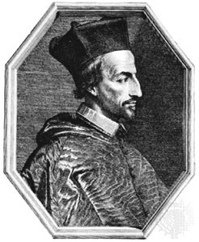

 Cornelius Jansenius, professor aan de KULeuven en bisschop van Ieper

Van dit artikel had ik al een opzetje gemaakt, maar het ging helemaal de verkeerde kant op. Ik mag opnieuw beginnen. Mijn insteek was het jansenisme. Het woord had een paar keer mijn pad gekruist in lezingen en artikels en hoemeer ik erover begon op te zoeken, hoe minder ik de achterliggende mengelmoes van spiritualiteit, theologie, ideologie en politiek kon begrijpen. Een kleine oefening… Vind jij dat de bisschoppen meer beslissingsmacht moeten krijgen, los van Rome? Vind jij dat de biecht een zaak moet zijn van oprecht berouw en niet ingegeven vanuit angst voor een straffende God? Vind jij dat de Kerk zich best niet teveel bemoeit met zaken die de burgerlijke overheid regelt? Lees jij wel eens graag een stukje Augustinus? Vind jij jezuïeten soms nogal rare geestelijken? Zoja, welkom bij het jansenisme, maar weet wel: eigenlijk zijn het verkapte calvinisten!

Het jansenisme heeft natuurlijk andere en meer relevante kenmerken, van meer theologische aard, maar ook daarbij heb ik het moeilijk om me een goed beeld te schetsen van het geloofsleven van jansenist-met-de pet.

## Oeps!

Tot vorige week die dag. 's Morgens zet ik de kinderen af aan school, steek de autosleutel in een van hun boekentassen, zodat mijn vrouw ze 's avonds met de auto naar huis kan doen. Was ik toch wel vergeten het raam dicht te doen en de deuren te sluiten!! Deze onachtzaamheid had de directe aanleiding kunnen zijn tot diverse calamiteiten, zoals: wagen gestolen, rugzakken die op de bank lagen verdwenen, bestuurderszetel helemaal doorweekt van de regen en _last but not least_ verdriet en boosheid op het thuisfront. Ik heb echter geluk gehad: geen dief heeft zich aan de wagen vergrepen, de voorspelde regen viel best mee en de verwachte verontwaardiging… die heeft zich weten te kanaliseren tot een in overleg tussen moeder en kinderen bepaalde strafmaat. Het verdict luidde dat ik bij wijze van genoegdoening een gezinsfilmnamiddagje moet organiseren, waarmee ik best wel opgelucht was.

## Opluchting

Die opluchting is misschien hetgene wat jansenisten missen. Zij gaan er immers van uit dat de mens sinds de zonde van Adam onbekwaam is om het goede te doen en machteloos is overgeleverd aan de genade van God voor zijn heiliging ('gepredestineerd', zoals dat heet). Daarom bouwen ze hun leven op een rigoureuze moraal, strenge ascese en intensieve sacramentaliteit, om toch maar zoveel mogelijk genade te vangen. Nu is er natuurlijk niks mis met een goeie dosis moraal, ascese en sacramenteel leven, maar het knelpunt zit op een meer filosofich niveau: de miskenning van de menselijke vrije wil. We zijn immers niet zomaar machteloos overgeleverd aan Gods wilsbeschikkingen voor onze heiliging. God is inderdaad de oorsprong en het doel van onze heiliging, want Hij heeft ons (allemaal!) voor heiliging op de wereld gezet en we hebben (allemaal!) zijn genade nodig om heilig te worden, maar tussen genade en heiliging zitten de goede werken, en daar hebben wij met onze vrije wil de keuze in handen om die genade al dan niet door goede werken in heiliging om te zetten. Als we die vrije wil gebruiken om zelfs bij manifest falen, dat toch zo menselijk is, de weg te bereiden naar opluchting, is dat een stukje van Gods genade dat in onze handen werkelijk wordt. Bij jansenist-met-de-pet dus geen filmnamiddagjes, want de mens kan toch niks goed doen, dus laat staan dat hij het ene -slechte- oordeel door een ander -goed- oordeel kan corrigeren.

## Door Christus onze Heer

Ik wil nog wat verder doorbomen over genade, met iets wat me is opgevallen in de liturgie.

Onlangs zat ik op zondag in de H. Mis, de gelegenheid bij uitstek om wat genade bij te tanken, wanneer na de communie een bezinnende tekst werd voorgelezen. De lezingen hadden de nogal confronterende beelden gebracht van de onvruchtbare wijngaard en van de pachters van de wijngaard die de zoon van de Heer ombrengen. De slottekst wilde daarom duidelijk maken hoe wij in ons dagelijks leven 'vruchtbaar' kunnen zijn. Nu begrijp ik dat sommige mensen zo'n tekst over hoe-maak-ik-mijn-geloof-concreet noodzakelijk achten als tegengewicht tegen de teksten van het missaal die te ver van het dagelijks leven verwijderd zouden zijn. Persoonlijk vind ik die tekstjes meestal te moraliserend en paternalistisch. Hier volgt een passage uit het tekstje die me meteen mijn oren deed spitsen, omdat ze ook over de genadeleer gaat: _"Het enig belangrijke is wie we als mens zijn. Ons leven is goed voor zover we bijdragen aan het geluk en het welzijn van anderen. Ons leven is waardevol, als we al het mogelijke doen om van onze aarde een paradijs te maken."_

Zo'n tekst is dan weer precies het tegenovergestelde uiterste van waar het jansenisme voor staat. Jansenisten geloven dat ons handelen niet vrij is, dat we onze eigen heiliging niet kunnen verdienen en slechts afhangen van Gods genade. Volgens bovenstaand citaat moeten we onze heiliging ("ons leven is goed") verdienen door ons handelen ("bijdragen aan het geluk van anderen"), en lijkt het alsof we Gods genade daarvoor niet eens nodig hebben ("Het enig belangrijke"). Een doe-het-zelf-heiliging. Dat heet [pelagianisme](https://nl.wikipedia.org/wiki/Pelagianisme), de leer die Augustinus vurig bestreden heeft en die in de moderne theologie gerehabiliteerd wordt. Eerlijk gezegd, vind ik die visie ook een beetje somber, want er lopen genoeg mensen rond die gewoon de kansen niet krijgen om voluit "bij te dragen aan het geluk en welzijn van anderen", om zeer uiteenlopende redenen. Is hun leven dan niet waardevol? Of mogen ze toch nog rekenen op een stukje genade, ook al zijn hun werken niet veel soeps?

Misschien sta je er nooit bij stil, maar het is je wellicht al opgevallen dat alle gebeden die tijdens de liturgie worden uitgesproken eindigen met de formule "...door Christus onze Heer". Dat is een handigheidje, want zo weten de gelovigen wanneer het gebed gedaan is, zodat ze simultaan met het "Amen" kunnen antwoorden. Maar het is meer dan dat! De formule maakt expliciet duidelijk dat al onze gebeden (en al ons handelen dat we erin opdragen of afsmeken) slechts bijdragen tot onze heiliging als ze een antwoord zijn op de genade die we ontvangen vanuit het offer van Christus. Elk gebed en elk werk zou moeten worden afgesloten met de formule "...door Christus onze Heer".  Die wordt bij die bezinnende tekstjes echter weggelaten. Vergeten? Niet begrepen? Te ouderwets? Of toch bewust weggelaten omdat "wat we zelf doen, we beter doen"?

## Secundaire causaliteit van heiliging

Misschien als afsluiter nog een derde bedenking die heel de genadetheorie nog wat kan verduidelijken. Het mag geen verrassing zijn dat ik weer teruggrijp naar mgr. Charles Pope, die onlang op zijn blog antwoordde op de vraag [waarom God de bekoring tot het kwade toelaat](http://blog.adw.org/2014/10/why-does-the-lords-prayer-ask-god-not-to-lead-us-into-temptation-why-would-god-do-such-a-thing/). Hij legt dat uit aan de hand van de primaire en de secundaire causaliteit. De primaire causaliteit is God, want Hij is Schepper van alles. Maar heeft Hij dan ook het kwaad geschapen? Nee. Hij heeft onze vrije wil geschapen, en door de vrije wil van één man, Adam, is het kwaad en de wanorde in de schepping gekomen. De secundaire causaliteit komt voort uit onze natuur waarin we allemaal een stukje Adam meedragen (de 'erfzonde'). Dat klinkt redelijk jansenistisch, maar hetzelfde model zet zich voort in Jezus, één man die ons de genade heeft verschaft om door zijn offer gered te worden. Nu is God opnieuw de primaire causaliteit, niet van het kwaad, maar van het goede. En wij krijgen de kans (de genade) om van dat goede de secundaire causaliteit te worden, als we tenminste willen, dus "door Christus onze Heer".

## Het spel van de goddelijke vrijheid

Weet je wat, ik zal hier toch nog een stukje uit Grossouws _Innerlijk Leven_ toevoegen, en dan hou ik op. Over Grossouw trouwens binnenkort meer op deze blog!

_Wij weten allen dat de heiligheid bestaat in een zo volkomen mogelijke omhelzing van de goddelijke wil, zowel actief als passief, zowel door uit te voeren als door te aanvaarden. Want indien onze liefde zich niet aldus uit, blijft zij onvruchtbaar gevoel, — en de volmaakte liefde is niets anders dan volstrekte vereenzelviging met het goddelijke welbehagen, dat is met God zelf, gevangenschap van de menselijke wil die in het onmetelijke goed wordt bevrijd. En wij weten ook, waar wij de uitdrukking van het goddelijke welbehagen moeten zoeken: in de uitspraken van ons geweten en het evangelie, in de leiding der Kerk, van alle dag, in kruis en lijden. Maar het is onmogelijk een star schema op te stellen waarin wij Gods wil zouden kunnen vangen. De hulpbronnen der liefde zijn onuitputtelijk. God vraagt niet van allen hetzelfde (al zijn er — natuurlijk! — essentiële dingen die van een ieder worden gevraagd). Tussen de ziel, die zich door gebed en overgave de soepelheid der liefde heeft verworven, en Christus' genade voltrekt zich een spel van goddelijke vrijheid vol verrassende wendingen en met immer nieuwe mogelijkheden. Leven is beweging en ook het bovennatuurlijke leven, mits het echt is en waarachtig, is alles eer dan dode eenvormigheid. „Weest daarom niet onverstandig, maar tracht de wil des Heren te verstaan” : wat God van mij vraagt, van mij met mijn persoonlijke aanleg en mijn individuele talenten, in mijn concrete omstandigheden._
