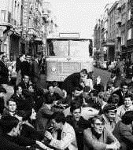

Onlangs viel ik in verbazing. Ik was bijeen met een dertigtal mensen die in de pastorale eenheid (de vroegere parochiefederatie) verantwoordelijkheden opnemen (met onder hen ook een tiental geestelijken van diverse pluimage). We kregen een lezing over de pauselijke exhortatie _Evangelii Gaudium_ en aan het einde stelde de spreker voor samen een gebed te bidden. Ik verwachtte dat in de zaal een geschuifel zou ontstaan van mensen die zich gereedzetten om te bidden, al is het maar door zich recht te hijsen in de stoel en de handen te vouwen, maar er kwam niks. Iedereen bleef uitgezakt zitten, armen hangend over stoelleuningen, en zonder kruisteken of enige indicatie in de lichaamshouding dat een gebed wordt ingezet, lazen we. Het aansluitend onzevader, idem. Slechts een enkeling maakte na het gebed een aarzelend kruisteken…

Niet dat God uiterlijk vertoon nodig heeft om ons te aanhoren ([Lc 11:37-41](http://bijbel.net/wb/?p=page&i=66276,66293 "Aanklacht tegen farizeeën en wetgeleerden")), maar als je met een vriend in gesprek gaat, neem je toch ook een houding aan die de wederzijdse aandacht beklemtoont: je neemt dezelfde positie aan en kijkt mekaar in de ogen. Is het dan niet goed je een houding aan te meten als je met God in gesprek gaat, ook al kan je Hem niet in de ogen kijken en ook al kan je je niet op dezelfde hoogte plaatsen?

\[caption id="attachment\_1166" align="alignright" width="169"\] Leuvense studenten houden een sit-in in de jaren zestig... hebben ze het daar geleerd?\[/caption\]

Eenzelfde fenomeen merk ik elke zondag in de kerk. We hebben een nogal gemengd publiek van gelovigen, waardoor niet iedereen dezelfde geplogendheden gewoon is. De Afrikanen richten zich met opstaan en knielen op het missaalgebed. De Vlamingen volgen de "Vlaamse theaterritus" en zitten dus zoveelmogelijk op hun achterste. Ook de priesters staan niet helemaal op één lijn. De ene zegt al direct na het kruisteken "gaat u nu maar zitten", alsof het hem ergert dat we überhaupt (voor hem?) zijn rechtgestaan bij de intrede, en als het aan hem lag bleven we voor de rest van de mis op onze stoel om flink te luisteren naar de mooie teksten die hij voor ons heeft uitgezocht. Van de andere priester merk je dat hij probeert om tenminste de misdienaars ertoe aan te zetten recht te staan en te knielen op de momenten dat dit voor het gebed van het missaal gepast is.

Eigenlijk heb ik wel eens zin om na de mis een kleine enquete te houden, om te peilen naar de diepere beleving van de gebedshoudingen bij de gelovigen, met volgende meerkeuzevragen (meerdere goede antwoorden mogelijk):

**\[voor de Afrikanen\] U bent tijdens de gebeden opgestaan en hebt tijdens de consecratie geknield, waarom was dat?**

**☐** omdat we het nooit anders gedaan hebben! **☐** omdat onze ouders van jullie nonkel pater goeie manieren hebben geleerd. **☐** omdat wij hopen dat er dan ook nog wat gezongen en gedanst zal worden! **☐** omdat we nog niet even ver ontwikkeld zijn in ons geloof als jullie **☐** _come on, Jezus is there, right in front of us!_

**\[voor de Vlamingen\] U bent tijdens de gebeden blijven neerzitten en slechts voor de consecratie even opgestaan, waarom was dat?**

**☐** omdat ik al veel verder ontwikkeld ben in mijn geloof dan die Afrikanen **☐** omdat ik vijftig jaar geleden het recht heb bevochten om voor niemand meer te knielen! **☐** omdat Jezus mijn vriend is en bij vrienden thuis mag ik ook altijd op een stoel zitten. **☐** omdat ik van de bisschop een indulgentie heb vanwege mijn hoge leeftijd **☐** omdat ik solidair ben met de oude mevrouw die het vorige antwoord aankruiste **☐** ik wilde wel opstaan, maar ik durf niet als ik de enige ben

Alle gekheid op een stokje, en van mij mag iedereen zijn zin doen, maar "je eigen zin doen" is gemakkelijker gezegd dan gedaan. Als je plots bij het "laat ons bidden" rechtveert terwijl de rest blijft zitten, lijkt het wel of je aandacht zoekt om een _statement_ te maken, laat staan dat je een scène zou maken door te gaan knielen. Gelukkig is dat een gêne die onze Afrikaanse christenbroeders vreemd is, zij kunnen nederig zijn zonder hoogmoedig te lijken :). Spijtig genoeg is enig superioriteitsgevoel de westerse kerk niet vreemd in haar verhouding tot Afrika, zie maar de uitlatingen van sommige kardinalen tijdens de Synode.

De mens is een kuddedier, niet alleen in evangelische beeldspraak, en stemt zijn gedrag af op dat van zijn buren om niet op te vallen. Ik heb eens de proef op de som genomen, en ben samen met de enkele Afrikanen die ook in de kerk waren, op de gepaste momenten rechtgestaan, en zowaar: meteen werd ik gevolgd door een handvol van de aanwezige Vlamingen. Dankzij dit kleine experiment ben ik ervan overtuigd dat er nog heel wat gelovigen, misschien onbewust, beseffen hoe zinvol een duidelijke gebedshouding is.

Een tip dus voor priesters die hun Vlaamse publiek op een spontane manier terug willen leren de wekelijkse ontmoeting met Christus ook wat lichamelijker te beleven of in andere woorden "actief deel te nemen aan de liturgie": beraam met twee of drie (vooraanstaande ---zowel letterlijk als figuurlijk indien mogelijk) leden van de gemeenschap een complot om hen het voorbeeld te laten geven. Wedden dat binnen enkele weken de hele kerk volgt?

Of iets drastischer: organiseer een flash mob, een concept dat een beetje op dit filmpje zou kunnen lijken, dat me nog steeds rillingen over de rug doet lopen:

http://www.youtube.com/watch?v=SXh7JR9oKVE

Omdat er heel weinig informatie beschikbaar is over de gebedshoudingen in de latijnse ritus, heb ik een [praktische gids bij gebedshoudingen in de liturgie](/praktische-gids-bij-gebedshoudingen-in-de-liturgie/ "Praktische gids bij gebedshoudingen in de liturgie") samengesteld.
