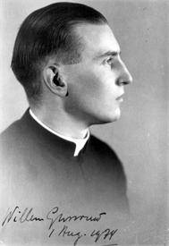

Volgende zondag begint de Advent en dus een nieuw kerkelijk jaar.

Op deze website verschijnt vanaf zondag 30 november 2014 gedurende het ganse liturgische jaar dagelijks een artikel uit het meditatieboek "Innerlijk Leven" van Willem Grossouw. Een overzicht van die artikels vindt u "[onder de categorie "Innerlijk Leven"](/categories/innerlijk-leven/)".

De artikels zijn opnieuw gebundeld en [beschikbaar als eboek](/portfolio/innerlijk-leven/).

Innerlijk Leven

De oplettende lezer van dit blog heeft de voorbije jaren reeds gemerkt dat citaten uit dit boek regelmatig in artikels verschijnen. Digitale uitgaven van de tekst als e-boek (epub) zijn bovendien al geruime tijd te downloaden bij de "[Katholieke e-boeken](/e-boeken/ "Katholieke e-boeken")".

De artikels uit "Innerlijk Leven" verschijnen dagelijks en lopen samen met de kalender van het liturgische jaar. Omdat het oorspronkelijke boek verscheen in de late jaren '40 van vorige eeuw, wordt de kalender gebruikt van wat tegenwoordig de 'buitengewone vorm' van de latijnse ritus heet, de tridentijnse ritus. De meditaties verwijzen regelmatig naar de teksten uit het missaal, maar de inhoud komt ook zonder vertrouwdheid met deze ritus volledig tot zijn recht.

Willem Grossouw

Wie meer wil weten over de persoon van Willem Grossouw, kan terecht bij het Biografisch Woordenboek van Nederland voor een [redelijk uitvoerige levensschets](http://resources.huygens.knaw.nl/bwn/BWN/lemmata/bwn5/grossouw "Willem Grossouw"). Er valt ongetwijfeld veel te zeggen over de positie die de auteur heeft ingenomen als theoloog en in zijn persoonlijke levensloop. Zijn biografie stelt dat "Volgens hem de katholieke spiritualiteit hoognodig toe was aan een herbronning, die haar kracht moest vinden in bijbel en liturgie en die moest uitmonden in een keuze voor de vrijheid en tegen de joodse wet zoals Paulus die zag en beleefd had."

"Innerlijk Leven" is echter niet geschreven is als polemisch werk, maar louter in functie van de ontwikkeling van het innerlijk leven. Hoewel Grossouw allesbehalve traditionalistisch was, zijn de beschouwingen recht in de leer en geworteld in de (liturgische) praktijk van de traditie. De dagelijkse artikels zijn 'hapklaar', concreet en tijdloos voedsel voor de geest van elke gelovige!

* * *

Algemene disclaimer bij de artikels gepubliceerd onder "Innerlijk Leven"

De auteur van dit blog is bij het regelen van de auteursrechten in deze uitgave uiterst zorgvuldig te werk gegaan. Alvorens tot publicatie over te gaan, is getracht de rechthebbende(n) te achterhalen. Degenen die desondanks menen zekere rechten te kunnen doen gelden, kunnen zich alsnog tot de auteur van dit blog wenden.

