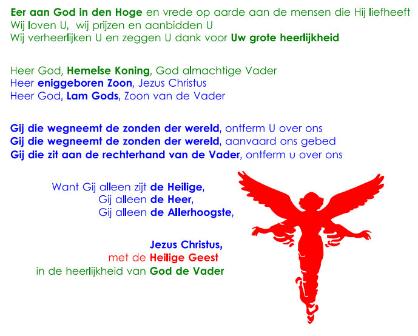

Het Gloria is één van de vaste gebeden van de zondagsmis. Binnenkort is het Advent en dan gaan we het weer een tijdje moeten missen, net als in de Vasten. Het gebed is in de tweede eeuw door de paus geïntroduceerd als onderdeel van de middernachtsmis van Kerstmis en werd zo populair dat het ook aan de gewone zondagsmis is toegevoegd.

Als je het in verzen neerschrijft, valt het gloria mooi uiteen in vijf drieledige blokken. Dat is wellicht geen toeval. Het is de moeite waard om het eens wat dichter te bekijken. Tussen de lijnen van het gebed lees je immers veel over Gods heilswerk.

 Gloria

Centraal in het gebed staan de drie verzen die de kern van ons geloof uitdrukken: Jezus die ons verlost van de zonde. Opvallend in de verwoording is de stijlfiguur van het parallellisme:

1. Gij die wegneemt de zonden der wereld, ontferm U over ons.
2. Gij die wegneemt de zonden der wereld, aanvaard ons gebed.
3. Gij die zit aan de rechterhand van de Vader, ontferm U over ons.

Hiermee komt mooi tot uitdrukking hoe God zich naar ons wendt door ons van de zonde te verlossen (vers 1) en hoe wij ons door ons smeken (_deprecatio_) naar God wenden (vers 2). Een dubbele beweging: van God naar de wereld, en van de wereld naar God. Dat is dan ook wat door het offer van de heilige Mis gebeurt: de gelovigen komen naar God en God komt onder de gelovigen. Aan het altaar raken Hemel en aarde mekaar (vers 3). Was er eerst het smeken of eerst het ontfermen? Het drieledig parallellisme suggereert dat beide in mekaar vervat zijn zonder dat het ene een antwoord is op het ander.

Rond deze centrale verzen ontspinnen zich de aanroepingen van God en Christus. Eerst in afdalende zin, God die zich vernedert tot offerlam: Hemelse Koning > Zoon > Lam Gods. Daarna in stijgende zin, Jezus die wordt verheerlijkt en na zijn verrijzenis plaatsneemt naast God: Heilige > Heer > Allerhoogste.

Aan de uitersten vinden we in het begin van het gebed de enscenering van het singuliere moment in de heilsgeschiedenis waarop God in de wereld wordt geboren, een onooglijk ogenblik in de geschiedenis dat betekenisvol is voor tijd een eeuwigheid. _"Eer aan God in den Hoge en vrede op aarde aan de mensen die Hij liefheeft"_, dat is het gezang dat de engelen zingen in de bijbel om aan de wereld de geboorte van Christus te verkondigen (Lucas 2: 14). Door zelf te zingen wat de engelen eertijds zongen, geven we met dit vers meteen de korte inleiding tot de dubbele beweging die in de verdere verzen tot uiting komt: wij brengen eer aan God, en God brengt ons zijn vrede. Aan het einde zie we diezelfde Jezus, niet langer als kind, maar ingebed in de goddelijke drie-eenheid.

De structuur van het hele gebed geeft weer hoe Gods heilswerk verloopt. Het begint bij God (de groene verzen), die zich openbaart in Christus (de blauwe verzen), wiens heilswerk afgesloten wordt met de zending van de Heilige Geest (het rode vers) om tenslotten terug uit te monden bij Gods heerlijkheid (het afsluitende groene vers).

Je kan zelfs in meer detail gaan en in het gebed een korte inhoud van de ganse bijbel herkennen:

Eer aan God in den hoge **** en vrede op aarde **** aan de mensen **** die Hij liefheeft ****. Wij loven U. Wij  prijzen en aanbidden U. Wij verheerlijken U en zeggen U dank voor uw grote heerlijkheid. **** Heer God, hemelse Koning, God almachtige Vader ****; Heer, eniggeboren Zoon, Jezus Christus ****; Heer God, Lam Gods ****, Zoon van de Vader ****; Gij die wegneemt de zonden der wereld, ontferm U over ons ****; Gij die wegneemt de zonden der wereld, aanvaard ons gebed ****; Gij die zit aan de rechterhand van de Vader, ontferm U over ons ****. Want Gij alleen zijt de Heilige. Gij alleen de Heer. Gij alleen de Allerhoogste: Jezus Christus. Met de Heilige Geest **** in de heerlijkheid van God de Vader ****. Amen.

Merk op dat het Gloria als onderdeel van de mis veel ouder is dan bijvoorbeeld de geloofsbelijdenis! In wezen is het een soort van proto-credo én een geheugensteun voor de gelovigen om kort te resumeren wat hun geloof precies inhoudt en waarom ze bijeenkomen in het sacrament van de eucharistie.

Hoewel het Gloria in zekere zin de chronologie van de bijbel reflecteert, is Jezus' kruisdood niet slechts een historisch ogenblik in de geschiedenis van de wereld, maar een verlossing voor alle tijden. Er is geen voor of na. Op dezelfde manier voltrekt diezelfde verlossing zich telkens opnieuw in elk mensenleven. Zelfs in de loop van een mensenleven is het heilswerk geen louter lineair gebeuren, maar een voortdurende strijd met telkens nieuwe, kleine 'verlossinkjes' (al dan niet werkelijk gemaakt in de sacramenten). Al die individuele bewegingen vallen uiteindelijk tijdloos samen in één grote beweging waarin de mens het grootste heil verwerft deel te hebben aan Gods grote heerlijkheid. Dat niet-lineaire aspect weerspiegelen de parallellismen in de drieledige strofen en het recursief hernemen van de globale beweging binnenin de strofen.

Niet verwonderlijk dat deze uitdrukkingrijke tekst zo snel een vaste plaats heeft verdiend in de zondagsliturgie. En ik wil nu nog wel eens de eerste 'meer begrijpbare eigentijdse hertaling' te zien krijgen die een even mooi en even volledig beeld kan scheppen van de heilige Mis als plaatsgrijpen van Gods heilswerk, van de kernpunten van ons geloof en van de beknopte inhoud van de bijbel!

* * *

Download deze catechese of [andere catecheseartikels](/page/katholieke-printerboekjes/) in PDF-formaat:

