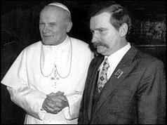

Vandaag heb ik een dag vakantie genomen, want de leerkrachten op de school van de kinderen staken en op het bedrijf waar ik werk zijn acties aangekondigd waardoor voor werkwilligen de toegang tot het bedrijf onmogelijk wordt.

Veel zin heb ik niet om tijd te besteden aan een doorwrocht artikel dat genuanceerd uiting kan geven aan mijn ongenoegen hierover. Wel wil ik mijn sympathie uiten voor de vele vakbondsmilitanten die in hun bedrijven voor hun collega's hulp en toeverlaat zijn in soms heel moeilijke omstandigheden en voor hen door het vuur willen gaan, maar die zich met de recente reeks actiedagen als in een roes voor de kar laten spannen van een beweging die

- partij-politiek gemotiveerd is
- de werking van de democratie ontkent
- het recht op werk ontkent
- de openbare orde op criminele wijze doelgericht verstoort
- de generatie van onze kinderen een torenhoge hypotheek oplegt

Na een totaal ontaarde actie enkele maanden geleden in het bedrijf waar ik werk, had het concept vakbondsactie alle geloofwaardigheid verloren in mijn ogen. Vandaag wordt dit dubbel en dik bevestigd.

Tot zover de uiting van mijn allerpersoonlijkste frustratie.

Ik vraag me af wat de sociale leer van de kerk hierover zou zeggen. Heel erg beslagen in die materie ben ik niet, en veel verder dan het [opzoeken van het woordje 'staking' op RKDocumenten.nl](http://rkdocumenten.nl/rkdocs/index.php?mi=670&zoek=staking) ben ik niet gekomen. De encycliek [_Rerum Novarum_](http://www.rkdocumenten.nl/rkdocs/index.php?mi=600&doc=651&id=3527) van paus Leo XIII (1891) spreekt slechts weinig over staking en dan uitsluitend waar het gaat over een conflict tussen arbeiders en een werkgever. Hetzelfde geldt voor het conciliedocument [_Gaudium et Spes_](http://rkdocumenten.nl/rkdocs/index.php?mi=600&doc=575&id=3088&highlight=staking#al68) (1965) en het [_Compendium van de Catechismus van de Katholieke Kerk_](http://rkdocumenten.nl/rkdocs/index.php?mi=600&doc=663&id=3691&highlight=staking#al517) (2005)_._

 De Paus moest de vakbond wel een politieke dimensie gunnen, om zijn Poolse bondgenoot Lech Walesa de nodige support te geven om vanuit de vakbond Solidariteit het Communistische regime omver te werpen.

Duidelijke taal spreekt echter de heilige paus Johannes-Paulus II in zijn encycliek [_Laborem Excercens_](http://rkdocumenten.nl/rkdocs/index.php?mi=600&doc=712&id=4325&highlight=staking#al20) (1981)_._ Merkwaardig is dat deze tekst de eerste is die staking erkent als actie tegen de overheid (in zijn geval het communistisch regime, in ons geval een democratisch verkozen regering).

> De vakverenigingen gebruiken bij hun strijd om de rechten van hun leden ook het middel van de staking of werkonderbreking als een soort laatste voorwaarde, die zij “ultimatum” noemen, **tegen de wettige autoriteiten** en vooral de werkgevers. Deze methode wordt in de katholieke sociale leer onder de nodige voorwaarden en binnen bepaalde grenzen als wettig erkend. Wat dit betreft dient aan de arbeiders het recht tot staking toegekend te worden, met dien verstande dat zij niet gestraft mogen worden om hun deelname aan stakingen. Toegegeven dus dat staking een rechtvaardig en wettig middel is, moet men toch de nadruk erop leggen dat ze in zekere zin een extreem middel is. Men mag er geen misbruik van maken; men mag er vooral **geen misbruik van maken om “politiek te bedrijven.”** Bovendien mag men, als het gaat om **dienstverleningen die voor de burgergemeenschap noodzakelijk zijn**, nooit vergeten dat deze in ieder geval gesauveerd en gegeven worden, ook, zo nodig, door openbare wetten.

Ook in het [_Compendium van de Sociale Leer van de Kerk_](http://rkdocumenten.nl/rkdocs/index.php?mi=600&doc=769&id=4902&highlight=staking#al304) (uit 2004) leest men bedenkingen bij het gebruik van het stakingsmiddel. Hier wordt zelfs de staking erkend als actie om de publieke opinie te beïnvloeden, maar niet aanvaard indien gepaard gaand met gewelddadigheid (zo ervaar ik alvast het mij ontzegde toegangsrecht tot mijn werkplek) of indien gebruikt voor doelstellingen die niet direct met de arbeidsvoorwaarden te maken hebben (zoals bijvoorbeeld het bevechten van een 'verkeerde' politieke meerderheid):

> De sociale leer van de Kerk erkent de legitimiteit van stakingen "voor zover ze beschouwd kunnen worden als onvermijdelijke, zoniet noodzakelijke middelen om een evenredig voordeel te bereiken", nadat alle andere middelen ter oplossing van het conflict ondoeltreffend zijn gebleken. De staking, één van de meest bevochten verworvenheden van de vakbondsorganisaties, kan men omschrijven als de gezamenlijke en eensgezinde weigering van de arbeiders om hun werk te leveren, om zo, dankzij de druk die op die manier wordt uitgeoefend op de werkgevers, **de staat en de publieke opinie**, betere arbeidsvoorwaarden en een beter sociaal statuut te bekomen. Staken "als een soort ultimatum" moet steeds een vredevolle methode zijn om eisen te formuleren en om op te komen voor zijn rechten; staking wordt **"moreel onaanvaardbaar, wanneer ze gepaard gaan met gewelddadigheden of wanneer men ze gebruikt voor doelstellingen, die niet direct met de arbeidsvoorwaarden** te maken hebben of die strijdig zijn met het algemeen welzijn".

Loopt er misschien nog ergens in dit land een bisschop rond die haar op zijn tanden heeft en het aandurft de wolfsvacht van lieveling-van-links af te werpen door de actualiteit te toetsen aan de hand van de sociale leer van de Kerk?

* * *

Overigens, ik weet niet wat onze bisschoppen in het mandje storten om een prachtige website als rkdocumenten.nl overeind te houden, maar als ik u was, zou ik het zekere voor het onzekere nemen, en het [heft in eigen handen nemen](http://rkdocumenten.nl/rkdocs/index.php?page=3)! Ik heb nu voor het schrijven van dit artikel honderden documenten mogen doorzoeken in een fractie van een seconde en heb uit vijf documenten redelijk uitvoerige uittreksels doorgenomen en ook stukken geciteerd. Dat kostte me niks, maar bespaart me toch al gouw ettelijke uren opzoekingswerk, in de vooronderstelling dat bovenvermelde stukken al in mijn bezit zouden zijn. Een donatie van enkele euro's acht ik slechts een schijntje voor de waarde van deze service. Mocht u ooit gebruik maken van rkdocumenten.nl, vergeet niet dezelfde overweging te maken!
