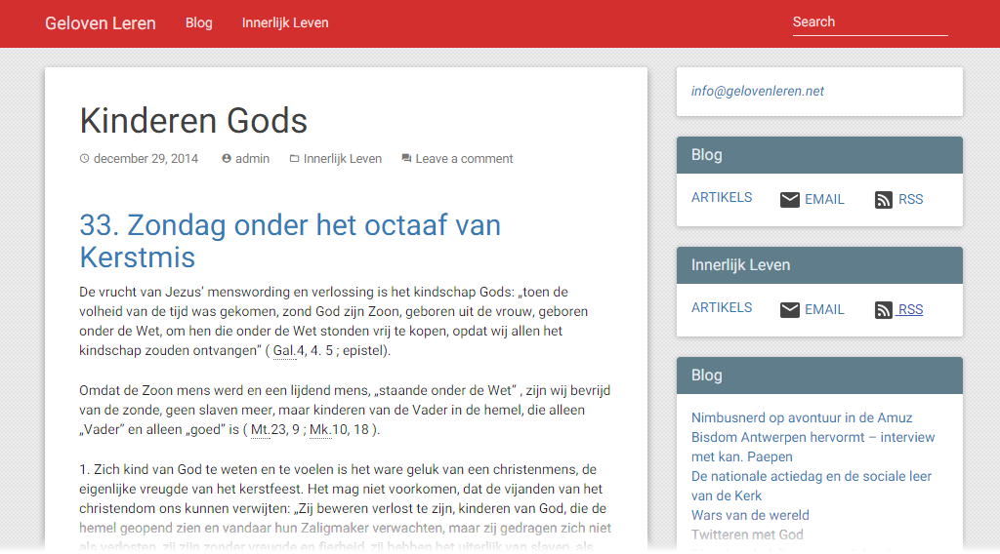

De website van Geloven Leren, de blog met "opinie en tools voor de katholieke gelovige", ondergaat tijdens het kerstoctaaf enkele grondige veranderingen! Graag even uw aandacht, dan houden we het kort zodat u snel verder kan met de voorbereidingen van de feestelijkheden:

- [gelovenleren.net](http://gelovenleren.net/) is het nieuwe adres waarop de blog bereikt kan worden. Het oude adres bij wordpress.com blijft vooralsnog actief, maar er zullen geen nieuwe berichten verschijnen. Alle oude artikels zijn ook op het nieuwe adres te vinden.
- gebruikers van RSS moeten een nieuw adres instellen in hun nieuwslezer:
    - [http://gelovenleren.net/categories/blog/index.xml](http://gelovenleren.net/categories/blog/index.xml) voor de artikelen op de blog
    - [http://gelovenleren.net/categories/innerlijk-leven/index.xml](http://gelovenleren.net/categories/innerlijk-leven/index.xml) voor de bezinning
- lezers die ingeschreven zijn op de blog via wordpress.com, kunnen nieuwe artikels ontvangen via RSS of via e-mail; zie [gelovenleren.net](http://gelovenleren.net/) voor de nodige links
- lezers die ingeschreven zijn op de blog via de verzendlijst op mailchimp, hoeven niets te ondernemen om de blog te blijven volgen

De layout van de blog was dit jaar al eens gewijzigd. De overstap naar een eigen wordpressserver geeft echter veel meer vrijheid, en daarom is er nu weer een nieuwe layout, geïnspireerd op [Google's nieuwe layoutstandaard 'material design'](http://www.google.com/design/). Ik zweer bij Google, want dit bedrijf focust op wat essentieel is in hun producten. Voor een blog over geloof is dat geen gemakkelijke opdracht: focussen op wat essentieel is.

\[caption id="attachment\_538" align="alignnone" width="640"\] Material Design\[/caption\]

Jarenlang heb ik dankbaar gebruik gemaakt van [wordpress.com](http://store.wordpress.com/) als een heel toegankelijk blogplatform, tot een lezer me erop attent maakte dat sommige van de advertenties die wordpress.com op de blog zet aanstootgevende inhoud bevatten. Die advertenties zijn nodig, omdat bloggen op wordpress.com gratis is. "Gratis", zolang je netjes binnen de lijntjes kleurt! Voor de minste aanpassing moet je langs de kassa passeren: een eigen domeinnaam (zelfs als je die elders registreert!), een aanpassing van de layout, het afkopen dat de advertenties worden verwijderd,... Het zijn allemaal geen grote bedragen, maar je zit al snel aan 30 tot 40 euro per jaar.

Dezelfde lezer verwees me naar [versio.nl](http://www.versio.nl/webhosting), waar heel goedkope hosting wordt aangeboden, en nu host ik voor minder dan 25 euro per jaar twee wordpress-sites tegelijk, zonder advertenties, en ben ik bovendien veel flexibeler om eigen aanpassingen aan te brengen. Het vergt wel enige know-how en tijd om het allemaal op te zetten, maar voor de gemiddelde techneut is de som snel gemaakt!

Nog veel leesplezier op de nieuwe blog. Mochten er nog kinderziektes te merken zijn, geef een reactie in, of stuur een mailtje!
