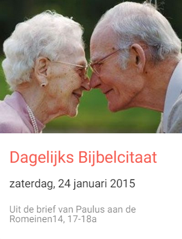
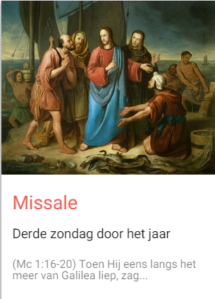
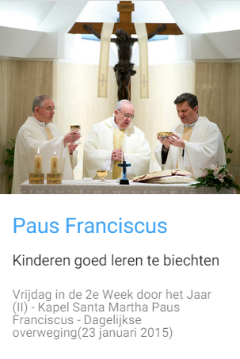
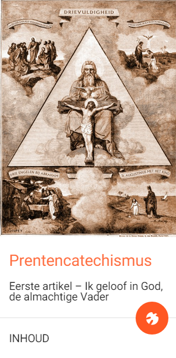

Geloven leren biedt gelovigen die hun geloof willen verdiepen een nieuwe website aan: [Alledaags Geloven](http://alledaags.gelovenleren.net/). Daar vind je dagelijks nieuwe inspiratie om even tijd te besteden aan bezinning, gebed of studie.

Sinds augustus 2018 is Alledaags Geloven ook beschikbaar als een [app op Android](https://play.google.com/store/apps/details?id=net.gelovenleren.alledaags):



Sinds maart 2022 kan je je [via email abonneren](https://nieuws.gelovenleren.net/?p=subscribe&id=1) om dagelijks een willekeurige kaart te trekken uit het actuele aanbod. Ook via [facebook](https://www.facebook.com/alledaagsgeloven) of [twitter](https://twitter.com/AlledaagsG) kan je Alledaags Geloven volgen.

**Wie kan Alledaags Geloven gebruiken?** Gelovigen die dagelijks individueel, samen met kinderen, in de klas of in groep een beetje tijd vrijmaken om het geloof te verdiepen. Ga naar de website om een helder overzicht te vinden van de topics die vandaag voor jou worden aangeboden, en kies er enkele uit die je wil bekijken.

**Wat vind je op Alledaags Geloven?** Eigen content is er niet. De website bevat links en _teasers_ voor content op andere websites en presenteert die op een overzichtelijke en bruikbare interface.

**Wat voor soort websites worden op Alledaags Geloven gekoppeld?** Alle katholieke, nederlandstalige websites komen in aanmerking, die hapklare stukjes aanbieden die bronnen zijn van geloof. Nu vind je er al volgende twaalf sites: [heiligen.net](http://heiligen.net/) - [tweetingwithgod.com](http://www.tweetingwithgod.com/nl) - [gewijderuimte.org](http://www.gewijderuimte.org/) - [dagelijksbijbelcitaat.blogspot.be](http://dagelijksbijbelcitaat.blogspot.be/) - [missale.net](http://www.missale.net/) (gewone en buitengewone vorm) - [rkdocumenten](http://rkdocumenten.nl/) (compendium, homilieën van paus Franciscus) - [prentencatechismus.org](http://prentencatechismus.org/) - [beeldmeditaties.nl](http://www.beeldmeditaties.nl/) - [eerstecommunie.gelovenleren.net](http://eerstecommunie.gelovenleren.net/) - [gelovenleren.net](http://gelovenleren.net/) (Innerlijk Leven)

**Kan ik Alledaags Geloven mobiel gebruiken?** Ja, dat kan, zolang je _online_ bent. De meeste gekoppelde websites werken ook mobiel. Alleen de websites die werken op jouw schermgrootte worden getoond.

**Hoe stelt Alledaags Geloven mijn persoonlijk aanbod samen?** Je kan (nog) niet kiezen welke websites je te zien krijgt, maar Alledaags Geloven zorgt wel dat je je op je eigen tempo kan verdiepen. Als de content is gekoppeld aan de kalender, zoals bijvoorbeeld de heiligenkalender of de liturgische evangelielezingen, krijg je de actuele content te zien. Andere content, zoals een reeks artikelen uit de catechismus, werk je stap voor stap af. Alledaags Geloven onthoudt welk artikel je laatst aanklikte, en gaat vanaf dat punt verder.

**Wat betekent die ronde knop met de Heilige Geest?** Als je op die knop klikt, doorbreek je een reeks artikelen en kom je uit op een willekeurig artikel in de reeks. Het toeval kan een hulpmiddel zijn om een denkspoor waarin je bent vastgelopen te verlaten en om verbanden te zien die je voorheen niet zag. Dat de Heilige Geest daarbij werkzaam is, is vast geen bijgeloof!

**Bewaart Alledaags Geloven mijn persoonlijke gegevens?** Nee, je leesstatus wordt bewaard in een cookie op je eigen computer.

**Kan ik een website toevoegen aan Alledaags Geloven?** We ontvangen graag suggesties van websites die geschikt zijn voor een koppeling op Alledaags Geloven! Zelf een website toevoegen is niet mogelijk, want er moet een beetje worden geprogrammeerd om de gegevens van de websites op te halen en in een mooi formaat te gieten.

**Waarom bestaat Alledaags Geloven?** Omdat ik het beu was om elke dag opnieuw materiaal bijeen te sprokkelen door websites te checken uit berichten in mij RSS-lezer en mailbox. Omdat er zoveel mooi materiaal _online_ en gratis beschikbaar is dat wat meer aandacht verdient. Omdat het een leuke technische uitdaging was om deze website te maken.

**Waarom heet de website "Alledaags Geloven"?** Omdat het noodzakelijk is voor het geloof om dagelijks te worden gevoed. Herbronning mag voor een gelovige geen 'buitengewone' activiteit zijn. Voor een 'gewone' gelovige is bezinning, gebed en studie een alledaagse bezigheid.
