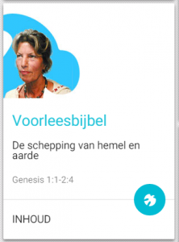

 Voorleesbijbel

[Alledaags Geloven](http://alledaags.gelovenleren.net/ "Alledaags geloven"), het dashboard voor dagelijks gebed, studie of bezinning, heeft een nieuwe kaart: de voorleesbijbel. De website [voorleesbijbel.nl](http://voorleesbijbel.nl/ "Voorleesbijbel") bevat de volledige bijbel, voorgelezen door gewone Nederlanders. De kaart op Alledaags Geloven voert je van begin tot einde door de ganse bijbel. Ook op deze kaart is de Heilige Geest beschikbaar, die je naar een willekeurige bijbelpassage voert.

Voorleesbijbel is meteen de eerste kaart in een nieuwe categorie "Heilige Schrift". Hier volgt een overzicht van de geloofsbronnen die Alledaags Geloven aanbiedt:

**Lectionarium** Schriftlezingen die in de heilige mis gelezen worden, volgens de liturgische kalender.

**Heilige Schrift** Lezingen uit de bijbel volgens een eigen schema; de voorleesbijbel krijgt je van begin tot einde voorgeschoteld, maar er zijn tal van bijbelleesschema's in omloop die in de toekomst ook een plaatsje kunnen krijgen op Alledaags Geloven.

**Catechismus** De leer van de Kerk, vaak opgesteld in de vorm van vraag-en-antwoord.

**Martyrologium** De heiligen en martelaren  van de Kerk, volgens de heiligenkalender.

**Gebed** Dagelijks gebed, waar ook het Getijdengebed bij hoort.

**Contemplatie** Bezinningen of beschouwingen over het geloofsleven.

* * *

Update: de website voorleesbijbel.nl is door het  Nederlands Bijbelgenootschap van internet weggehaald. Daarmee verdwijnt ook de kaart op Alledaags Geloven. Je kan de voorleesbijbel nog steeds [downloaden als luisterboek](/page/luisterboeken/).
