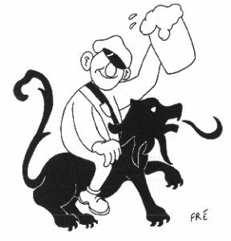
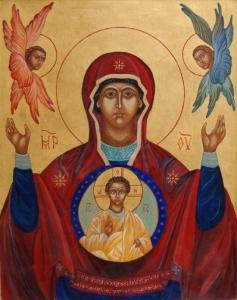

Te weinig tijd vind ik om nieuwe artikeltjes voor mijn blog te schrijven. Nochtans had ik al enkele notities gereedliggen. Twee artikels moesten het worden... en een derde... nu dus één --- met een rode draad!

**Katholiekst Vlaams Hoogstudentenverbond**

 Katholiek student zit op zijn paard na uitlating van bisschop

Een eerste artikel zou er komen naar aanleiding van de fameuze [persmededeling van het KVHV](http://newsmonkey.be/article/27700 "KVHV Antwerpen: ‘Monseigneur Bonny, wat u voorstelt is niet katholiek!’"), die intussen ook weeral oud nieuws is geworden, maar ik had al een lijstje opgesteld met redenen waarom ik die stok in het hoenderhok wel kon waarderen.

Ten eerste omdat er dan tenminste één tegenstem in het debat gehoord wordt (anders is het ook geen debat, maar een monoloog), zij het mede dankzij de gratis extra belangstelling voor de politieke arm van deze vereniging waarin de media graat de N-VA herkennen.

Ten tweede omdat ik de titel die _De Morgen_ aan het interview gaf heel sterk vond weerklinken in de repliek: _"De kerk heeft niets te winnen met dubbelzinnigheid"_. Dat was een antwoord van de bisschop op een vraag over de behandeling van kindermisbruik, maar perfect van toepassing op de discussie over het huwelijk… Als mgr. Bonny een 'diversiteit aan vormgevingen'' wil als uitbreiding op het katholieke huwelijk, laat ons dan eerlijk genoeg zijn om toe te geven dat zijn antwoord geen finaliteit inhoudt. Burgerlijk hebben we ook de notariële tontine gekend en vervolgens het samenlevingscontract, een perfecte 'diversiteit aan vormgevingen', maar de roep om het huwelijk te herdefiniëren is er nooit door gestild, integendeel! De verzuchtingen van mgr. Bonny, hoe oprecht ook, missen ondubbelzinnigheid, en als het KVHV ons iets wil duidelijk maken, is het juist de bevestiging van mgr. Bonny's quote: "De kerk heeft niets te winnen met dubbelzinnigheid".

Bovendien ging ik er nog een artikeltje of twee van mgr. Charles Pope tegenaan gooien: [Focused on the Dysfunctional? A Consideration of the Need for the Synod on the Family to Refocus ON the Family](http://blog.adw.org/2014/12/focused-on-the-dysfunctional-a-consideration-of-the-need-for-the-synod-on-the-family-to-refocus-on-the-family/) en [Focused on a Functional Family: A Homily for the Feast of the Holy Family](http://blog.adw.org/2014/12/focused-on-a-functional-family-a-homily-for-the-feast-of-the-holy-family/) en als ik het KVHV nog mag vergoelijken voor de misschien ietwat onbehouwen en uitdagende stijl (maar dat viel eigenlijk nog best mee): we zijn toch allemaal eens jong geweest --- dat moet genoeg zijn?

Goed, dat was dus het eerste artikel.

**Zwijgen**

 Maria bewaarde dit alles in haar hart en dacht erover na

Het tweede artikel had moeten gaan over het concept 'zwijgen' in het geloof. Het toeval wil dat ik op enkele dagen tijd meermaals iets over 'zwijgen' las… en dan begin je verbanden te zien (waar ze niet zijn).

Het begon met het feest dat de kerk viert op 1 januari, en dat is niet 'nieuwjaar', maar wel 'Maria, moeder van God'. De lezing van dat feest beschrijft Maria wanneer zij hoort welke boodschap de herders van de Engelen kregen: _"Maria bewaarde dit alles in haar hart en dacht erover na"_. Maria is in de bijbel de persoon die het meeste zwijgt. De enige gelegenheid, voor zover ik me voor de geest kan halen, waarop ze kordaat het woord neemt, is bij de bruiloft van Kana, waarmee ze de aanzet geeft tot Jezus' eerste wonderteken en meteen een voorafspiegeling van zijn verlossingswerk aan het Kruis.

Daags nadien kwam de uitnodiging voor de lezingen aan het UCSIA, waar ik me ingeschreven heb voor "[Zwijgen over God](http://www.ucsia.org/main.aspx?c=*UCSIA2&n=121011&ct=121011)", een lezing over ‘negatieve theologie’ en _‘wovon man nicht sprechen kann, darüber muss man schweigen’_. Precies wat Maria ook deed! Is Onze-Lieve-Vrouw dan de pionier van de 'negatieve theologie'? Dat zal ik op 19 februari misschien te weten komen…

Enkele dagen later, op de vooravond van driekoningen, schrijft Grossouw in zijn bezinning voor _Innerlijk Leven_ over het [Goddelijke Zwijgen](/blog/het-goddelijke-zwijgen/): _"Slechts in diepe ingetogenheid en in het eerbiedig zwijgen van onze geest waartoe de liturgie ons wil leiden, zullen wij deel hebben aan het mysterie van Gods komst.  O, niet enkel de vertedering om het Kindje dat koude lijdt, niet enkel bekering der harten tot verzoening en goedheid betekent kerstmis, — maar allereerst: verschijning van het Woord die onze geest verlicht met een hemels licht en onze ogen verblindt met bovenaardse luister en onze onrust vangt in het eeuwige zwijgen van het goddelijk geheim."_ Een subtiele manier om te zeggen dat bezig zijn met moraal wel goed is, maar dat dit het geloof niet mag overschaduwen, of als ik daarop voortbouw: dat het geen zin heeft om ons bij gebrek aan geloof slechts met moraal bezig te houden om onze religie vorm te geven.

****Zekerheden****

En met dat inzicht gingen mijn voelsprieten weer rechtstaan als ik op het blog Thuiskerk.be een kort artikeltje las over Zekerheden. Het is intussen een grijsgedraaid liedje: als je echt wil geloven, moet je je zekerheden in twijfel trekken. Daarin kan ik een eind meegaan, zolang het over zekerheden gaan die voortkomen uit onze eigen rationaliteit. Als Grossouw mediteert over het Goddelijk Zwijgen, of over het kinderlijk geloof, dan bedoelt die ermee dat je je rationaliteit niet nodig hebt om te geloven. De zekerheden van het geloof hoeven dan ook niet te strijden met je rationele zekerheden. Die laatste kan je best wel relativeren, want nieuwe inzichten in mens en wereld kunnen oude zekerheden omverwerpen, soms zelfs [ten gunste van het geloof in God!](http://blog.adw.org/2014/12/a-recent-article-ponders-how-rare-earth-is-and-how-astronomical-the-possibility-of-complex-life-in-the-universe-is/) Niet zo echter met de zekerheden van het geloof, die zijn ---net al God--- onveranderlijk. Enkel de manier waarop wij ze trachten te begrijpen en toepassen, die is aan verandering onderhevig, maar juist daar past het af toe te zwijgen...

Dat zwijgen ontbreekt dan weer op de website van Mars voor het Gezin, waar ook kritiek op mgr. Bonny wordt gebracht, echter niet met de nodige nuance die de tekst van het KVHV nog rijk was. Er wordt een citaat aangehaald van de heilige Catharina van Siena die schreef: _"We hebben genoeg aansporingen om te zwijgen gehad! Schreeuw het uit met honderdduizend tongen. Ik zie dat de wereld verrot is door stilte."_ Ook zij ageerde tegen de clerus van haar tijd in een verwereldlijkte kerk die het gelaat van Christus afwendt en de stem van het geloof het zwijgen oplegt.

Tot zover het tweede, onafgewerkte artikel.

****Ideologie****

Maar Catharina van Siena voert me als patrones van Europa naadloos naar het vervolg: de gruwelijke moordpartij in Parijs, geïnspireerd vanuit een religie die gelooft in een God die in beginsel wellicht dezelfde is als onze God, maar die van in de wortel een wereldlijk en heerszuchtig karakter heeft. De moorden van Parijs zijn echter slechts een schijntje van wat er zich in het Midden-Oosten en in Afrika [wekelijks afspeelt](http://shoebat.com/). Je moet al heel naïef zijn om te geloven dat dit de laatste van dit soort van aanslagen was of dat een vredesmanifestatie met staatshoofden veel zoden aan de dijk zal zetten. Niemand in Europa lijkt goed te weten hoe te reageren, laat staan gelovigen en hun kerk(en). Een voorbeeld: kerkklokken luidden als eerbetoon voor de vermoorde redacteurs van _Charlie Hebdo_ en nog maar enkele dagen voordien doofden kerken hun lichten om zich af te keren van de _Pegida_\-optochten. _"Nous sommes Charlie"_, maar _"wir sind nicht Pegida"_... Charlie Hebdo hekelt elke vorm van religiositeit, zij het christelijk of islamitisch, zonder enige vorm van respect. Pegidaverdedigt de joods-christelijke wortels van de Europese cultuur en wil geen islamitische overheersing. Ik ga niet beweren dat de Kerk onvoorwaardelijk de kant van Pegida moet kiezen en Charlie Hebdo verwerpen, maar het tegenovergestelde  komt me toch voor als een verregaande vorm van zelfverloochening.

**Eerherstel**

Ik vraag me af of ze niet allemaal in hetzelfde bedje ziek zijn, van de islamterroristen tot de stijlloze provocateurs van Charlie Hebdo: ze hebbenhet over geloof, maar het gaat over ideologie. Niet verwonderlijk dat ook zowat alle nabeschouwingen eigenlijk over ideologie gaan, of vaak zelfs platte politiek, en niet over geloof. De enige waarachtige, spirituele en [geloofsvolle nabeschouwing op de hele kwestie](http://www.arsacal.nl/?p=contentitem&id=780) die ik tot nu toe las, vond ik op de blog van mgr. Hendriks, hulpbisschop van het bisdom Haarlem-Amsterdam. Hij verhaalt het gebeuren op het feest dat vandaag werd gevierd in de kerk, de doop van Jezus. In de kerk waar ik naar de mis ging, vroeg de priester zich in de homilie ook af waarom Jezus de doop van bekering wilde ondergaan, die Hij immers niet nodig had. Dat was volgens de interpretatie een erkenning van de schuld van zijn volk, waaraan Hijzelf geen deel had, maar Hij wilde zich ook niet boven zijn volk plaatsen. Ook wij kunnen in dezelfde geest deelnemen aan het eerherstel van God. Door de ideologie te laten zwijgen en gewoon te geloven.

 

* * *

 

Hoewel Pegida slechts terzijde in dit artikel werd aangeraakt, wil ik ---ter informatie--- een vertaling van hun doelstellingen opnemen. DIT IS GEEN STANDPUNT VAN DEZE BLOG, maar wel een intrigerende mengelmoes van politieke, ideologische, culturelen, morele en religieuze stellingnames, waaraan ik eerlijk gezegd kop noch staart kan krijgen, maar waarvan we ongetwijfeld in de toekomt meer zullen horen!

PATRIOTTISCHE EUROPÄER GEGEN ISLAMISIERUNG DES ABENDLANDES

1. PEGIDA is voor de opname van oorlogsvluchtelingen, en politieke of religieuze vervolgden.  Dat is een mensenplicht.
2. PEGIDA is voor de opname in en de plicht tot integratie in de Belgische grondwet.
3. PEGIDA is voor een gedecentraliseerd onderbrengen van oorlogsvluchtelingen en vervolgden in plaats van deze een mensonwaardig onderkomen te gunnen.
4. PEGIDA is voor een gezamenlijk afsluiten van de verdeelsleutel voor opname van vluchtelingen en een eerlijke verdeling op de schouders van alle Europese lidstaten.
5. PEGIDA is voor de verlaging van de begeleidingssleutel voor asielzoekers (Het aantal vluchtelingen per maatschappelijk werker/begeleider van destijds met ca. 200:1 geeft praktisch geen begeleiding aan de deels getraumatiseerde mensen.)
6. PEGIDA is voor een asielaanvraagprocedure, die aanleunt aan het Nederlands of Zwitsers model.  In afwachting van de invoering van deze procedures zullen de middelen voor de ‘Administratie voor Migratie en Vluchtelingen’moeten verhoogd worden teneinde de proceduretijdsduur vanaf de aanvraagstelling en verwerking massief in te korten en zo een snellere integratie mogelijk te maken.
7. PEGIDA is voor de verhoging der middelen voor de politiediensten en natuurlijk tegen elke afbouw ervan.
8. PEGIDA is voor het uitputten en uitvoeren van de voorhanden wetgeving over asiel en uitwijzing.
9. PEGIDA is voor een ZERO-tolerantie politiek tov asielaanvragers en migranten.
10. PEGIDA is voor een weerstand tegen elke vrouwvijandige daad en elke op geweld gebaseerde politieke ideologie, maar niet tegen de geïntegreerde hier wonende moslims.
11. PEGIDA is voor een immigratiepolitiek naar Zwitsers, Australisch, Canadees of Zuid-Afrikaans voorbeeld.
12. PEGIDA is voor seksuele zelfbestemming.
13. PEGIDA is voor het behoud en bescherming van ons Avondland, gebaserd op onze Christelijk-Joodse kultuur.
14. PEGIDA is voor de invoering van de burgerbeslissingen Zwitsers voorbeeld.
15. PEGIDA is tegen wapenleveringen aan grondwetvijandige en verboden organisaties (zoals bvb de PKK, Jihadisten, Al Quaida, IS…enz)
16. PEGIDA is tegen het toelaten van elke parallelvereniging of parallelrechtspraak in ons milieu, zoals Sharia-rechtspraak en Sharia-politie enz.
17. PEGIDA is tegen deze waanzinnige “gender mainstream”, ook dikwijls “genderisiering” genoemd. Of ook nagenoeg omschreven in onze taal als naar het gedwongen, politiek-correcte neutraliseren van het geslacht.
18. PEGIDA is tegen radicalisme, zowel religieus als politiek gemotivierd.
19. PEGIDA is tegen haatpredikers in naam van welke religie ook.
