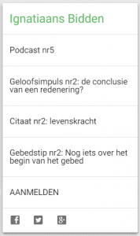
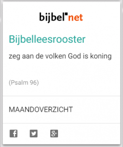

Ken je nog de bidprentjes die je ouders verzamelden in hun zondagsmissaal? Op papier worden ze niet meer gedrukt, maar online zijn ze nog altijd te krijgen! [Alledaags Geloven](http://alledaags.gelovenleren.net/ "Alledaags Geloven") geeft elke dag een nieuw setje kaarten vrij, waarmee je aan de slag kan gaan voor je dagelijks gebed, studie of bezinning. En je kan ze met je vriendjes nog steeds uitwisselen, via het sociaal netwerk!

Alledaags Geloven is geen website die eigen content levert. De toegevoegde waarde van Alledaags Geloven zit hem in de _verbetering van jouw workflow_. De luttele minuten die je dagelijks kan of wil vrijmaken voor gebed moeten efficiënt besteed worden. Als je elke dag meer tijd verspilt om je gebedsmateriaal bijeen te zoeken dan dat je tijd kan besteden aan je eigenlijke gebed, ben je verkeerd bezig, dus dat doet Alledaags Geloven voor jou! Je hebt maar je tablet te pakken, de pagina te openen en met een enkele klik bereik je al je gebeden, bijbelteksten, catechese en bezinningen, opengeslagen op de pagina van vandaag, of waar je laatst gebleven was.

Alledaags Geloven heeft weer twee nieuwe bidprentjes:

### Ignatiaans bidden

De [dagelijkse virtuele retraite voor de 40-dagentijd](http://www.ignatiaansbidden.org/ "Virtuele retraite voor de 40-dagentijd"). Om de retraite volledig te volgen via email, moet je je aanmelden, maar op Alledaags Geloven vind je alvast de link naar de dagelijkse podcast (= geluidsopname van de bezinningstekst).

 

### Willibrordbijbel leesrooster

Bijbel.net, de website waar de willibrordbijbel online (en gratis!) beschikbaar is, heeft een eigen [leesrooster](https://rkbijbel.nl/kbs/home "Leesrooster") om een gans jaar lang de bijbel te doorkruisen. Overweeg eens dit rooster in je gebed te integreren door dagelijks een kijkje te nemen op Alledaags Geloven!

 

 

 

In totaal zijn dit de negentien dagelijkse bronnen van geloof op [Alledaags Geloven](http://alledaags.gelovenleren.net/ "Alledaags Geloven") (_in order of appearance… and counting)_:

- Heiligen
- Tweeten met God
- Ignatiaans bidden
- Dagelijks gebed
- Missale (beide vormen)
- Dagelijks bijbelcitaat
- Dagelijks evangelie
- Willibrordbijbel leesrooster
- Compendium
- Paus Franciscus
- Prentencatechismus
- Voorleesbijbel
- Beeldmeditaties
- Eerste communie
- Innerlijk Leven
- Spreken met God
- Tijd met Jezus
- Getijdengebed
