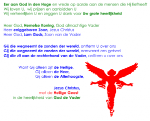
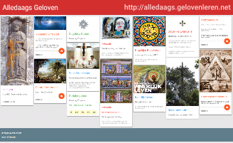

Volgende zondag klinkt in de katholieke kerken voor een laatste keer het Gloria. Tot de paaswake wordt dit mooi stukje liturgische gebed gebannen uit de ordo. Gelegenheid om nog eens aandacht te vragen voor het [stukje dat ik enkele maanden geleden over dit proto-credo schreef](/blog/eer-aan-god-in-den-hoge/ "Eer aan God in den Hoge")...

Kijk eens bij de [katholieke missaals en gebedenboekjes om zelf af te drukken](/page/katholieke-printerboekjes/) of het niet interessant zou zijn om voor jezelf of voor de kinderen een missaaltje te printen voor de Paastijd, met voor alle zon- en feestdagen een stukje uit het evangelie en een bijhorende prent.Hou zeker ook [alledaags geloven](http://alledaags.gelovenleren.net/) in de gaten, waar je alles zal vinden voor een dagelijkse stonde vastengebed, -studie of -bezinning!

