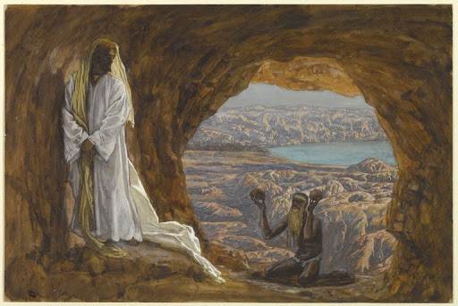

## [111\. Eerste Zondag van de vasten](http://ift.tt/1DFnsbD)

\[caption id="attachment\_2109" align="alignnone" width="512"\] Jésus tenté dans le désert (James Tissot, between 1886 and 1894, Brooklyn Museum, New York)\[/caption\]

De mis van de eerste Zondag van de vasten munt uit door een prachtige, geserreerde opbouw van haar formulier. Het evangelie van de bekoring van Christus in de woestijn vormt er het hartstuk van. Het is gekozen, omdat er sprake is van Jezus' veertigdaagse vasten, die ons in het begin van Quadragesima troostrijk en leerzaam wordt voorgehouden. Daaromheen zijn de gezangen gegroepeerd, die alle ontleend zijn aan psalm 90 (die prachtige van de completen van de Zondag), welke in de tractus bijna in zijn geheel wordt gegeven. De Satan had een woord van deze psalm aangehaald om Jezus te verleiden tot het verzoeken van God: „Als gij Gods zoon zijt, werp u neder, want er staat geschreven: „Hij heeft zijn engelen aangaande u bevolen u op handen te dragen, dat gij uw voeten niet stoot aan een steen” ” . De Heer had deze bekoring afgewezen, maar niettemin is het waar, dat de engelen Hem en de zijnen dienen: „toen verliet Hem de duivel en zie, engelen kwamen naderbij om Hem te dienen” . En nu wordt deze psalm van de bescherming Gods voor zijn uitverkorenen door de Kerk haar goddelijke Bruidegom toegezonden in alle delen van de mis, als een eerherstel voor het satanswoord, als een lied ook van triomf en vertrouwen: haar kinderen delen door Jezus in de volheid van Gods beschuttende zegen. Ook de gebeden van de mis munten uit door kracht en zinrijkheid.

1\. Het is duidelijk welke bedoeling de Satan had met de bekoring van Christus. Hij wil de Heer afbrengen van de weg Gods, die Hem was gesteld en die een geestelijke verlossing betekende door de vernedering van het lijden. Hij wil Christus de koninkrijken van de wereld en hun glorie geven in ruil voor het koninkrijk Gods. Hij wil dat Jezus zijn wondermacht aanwendt voor zijn eigen gerief en zijn eigen eer. Hij wil Hem leiden op de weg van het Joodse nationalisme: begeerlijkheid der ogen en hovaardij des levens, — een weg die breed en gemakkelijk was en die Hem in korte tijd de aanhankelijkheid van het gehele volk zou hebben bezorgd, maar die het verraad van zijn zending had betekend. Jezus koos voor de woestijn, het vasten en de eenzaamheid, en de strijd met het Boze, vóór Hij zijn werk aanving. Het was een botsing van de hoogste geestelijke machten op een niveau, waarvan wij ons nauwelijks een voorstelling kunnen maken. Het ging om de zuiverheid van Gods heerschappij, nog vóór de Heer haar had gepredikt. Misschien geeft Markus ons het pakkendste beeld van deze kosmische strijd, ver van de mensen en hun beschaving: „En aanstonds dreef de Geest Hem naar de wildernis en Hij werd in de wildernis veertig dagen bekoord door de Satan en Hij was met de wilde beesten en de engelen dienden Hem” ( Mk. 1, 13 ).

2\. Het is zo goed, dat wij in het begin van de vasten de geestelijke achtergrond beseffen van onze onthouding en versterving. „Want niet tegen het vlees en bloed gaat onze strijd, maar tegen heerschappijen en machten, tegen de wereldbeheersers dezer duisternis, tegen de boze geesten in de lucht” ( Eph. 6, 12 ). Gods bescherming, waarvan de psalm spreekt, en zijn engelen staan ons bij. Door Christus' zege op de Satan zijn ook wij in staat het boze in ons en in de wereld te overwinnen, maar dan toch alleen als ledematen van ons Hoofd, als kinderen van God in Christus. Wij moeten ons er van bewust worden om welke uiteindelijke realiteiten deze strijd gaat. God en de Satan strijden ook om uw ziel, en in uw ziel om de wereld en de zin van haar geschiedenis.

_Willem Grossouw_

[Over Innerlijk Leven](http://ift.tt/1y6X5mY) - [Abonneren per email (dagelijks van 30/11/2014 tot 29/11/2015)](http://eepurl.com/9P3DT)
