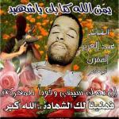
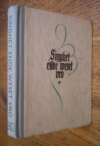
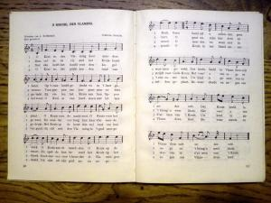

\[caption id="attachment\_726" align="alignright" width="150"\] Gedachtenisprentje van martelaarschap\[/caption\]

Moslimstrijders worden vereerd als martelaren voor het geloof. Daarmee lijken ze sterk op de talrijke christelijke martelaren die onze heiligenkalender bevolken. Of zijn ze toch net een tikje anders?

Gisteren liet Marion van San tijdens een lezing over radikalisering van moslimjongeren enkele bijzondere prentjes zien die ze van sociale media plukte. Wanneer een Syriestrijder omkomt, maken de nabestaanden, vaak echtgenotes en moeders, een kleine [collage](http://www.vice.com/en_uk/read/syrian-jihadist-selfies-tell-us-a-lot-about-their-war) van foto's van de gesneuvelde, die worden verspreid als hulde voor zijn martelaarschap. De gelaatsuitdrukking van het dode lichaam van de jihadstrijder straalt gelukzaligheid uit en bij de foto's wordt soms vermeld dat het lichaam een heerlijke geur verspreidt, ten bewijze dat het martelaarschap geslaagd is en de strijder het paradijs is binnengetreden. In één zo'n collage zat ook een foto van de moeder, symbolisch gekleed in een witte boerka, die daarmee fier kennis geeft van het martelaarschap van haar zoon (op die moeder kom ik straks nog even terug). Daarmee toont Van San aan dat de 'geradikaliseerde jongeren' die naar Syrië trekken niet te herleiden zijn tot geïsoleerde individuën, maar wel degelijk in een cultuur leven waarin hun roeping volledig aanvaard is.

De manier waarop de islam haar martelaars vereert heeft veel gelijkenissen met de katholieke heiligenverering. Katholieke zowel als islamitische martelaars aanvaarden de dood als gevolg van de standvastige keuze voor hun geloof. De martelaren treden de Hemel binnen, het lijk van de martelaar verspreidt "een geur van heiligheid", beeltenissen worden verspreid om het martelaarschap te gedenken en als voorbeeld te stellen voor navolging.

Groter dan deze overeenkomsten is echter het verschil in de manier waarop iemand de marteldood vindt. De [christelijke martelaar](http://en.wikipedia.org/wiki/Christian_martyrs) _ondergaat_ geweld vanwege de vijanden van zijn geloof. De [islamitische martelaar](http://en.wikipedia.org/wiki/Shahid) daarentegen _gebruikt_ geweld tegen anders-gelovigen, die hem vaak niet eens vijandig gezind zijn. Bevestigt dit patroon het verschil tussen het christelijk en het islamitisch geloof? Tussen geweldloosheid en gewelddadige heerszucht? Of is dat wat kort door de bocht?

Het christendom heeft [ook zijn gewelddadige hoofdstukken](http://www.nieuwwij.nl/interview/karen-armstrong-niets-in-islam-gewelddadiger-christendom/) in de geschiedenis gekend. De wreedheden van de Islamitische Staat lijken op het eerste zicht hun gelijke in het christelijke geschiedenisboekje niet te kennen, maar er kan best heel wat [geweld dat gepleegd is vanwege het geloof en dat gerechtvaardigd werd door de kerk](http://www.doorbraak.be/nl/nieuws/de-interne-vijand), uit de geschiedenisboeken zijn weggefilterd.

\[caption id="attachment\_728" align="alignleft" width="205"\] Singhet ende weset vro +\[/caption\]

Ideologisch staat één en ander niet zo ver van ons af als we wel zouden denken. Ik ken een heel mooi lied dat, als je de tekst leest, precies hetzelfde verhaal weergeeft als dat van de moeder van de gesneuvelde syriëstrijder die in witte boerka daarvan kennis geeft. De titel is "O Kruise den Vlaming" en de tekst vind je op de [website van de Chiro](http://chiro.leefdaal.com/php-form/liedjes_detail2.php?recnr=610). Het beknopte verhaal: de Kerk wordt bedreigd (in case: door de Franse bezetter); jonge Vlamingen (geradikaliseerd?) nemen het geweer op en trekken met de zegen van hun moeder ten strijde; allen sneuvelen en de eenzame moeder is getroost dat haar zoons de marteldood stierven.

\[caption id="attachment\_727" align="alignright" width="300"\] O Kruise den Vlaming\[/caption\]

De [boerenkrijg](http://historiek.net/de-boerenkrijg/8675/) mag dan al wel meer dan 200 jaar in het verleden liggen, geromantiseerd leeft hij voort in het hart van elke rechtgeaarde katholiek die dit lied [niet zonder emotie](http://theater.uantwerpen.be/etc/page.py?f=2007-04_jg25_nr106_72-75.xml) zal zingen, al is het maar in het besef dat we van uitzonderlijk geluk mogen spreken nooit een soortgelijke situatie te hebben ervaren.

In de eerste helft van de twintigste eeuw, waarin dit lied geschreven werd, kende de kerk een periode van uitgesproken militantisme, getrokken door een voorhoede van jonge vernieuwers, geïnspireerd door (of gespiegeld aan?) ideologieën als het Italiaanse fascisme en het Spaanse falangisme, maar tegelijk hoogst geromantiseerd en vergeestelijkt. Als je het eerste het beste zangbundeltje met katholieke Vlaamse strijdliederen uit die tijd zou transponeren op de islam en het kalifaat, zul je nochtans menen daarin de jihad in zijn zuiverste vorm te herkennen. Maar hebben onze grootouders terroristische aanslagen gepleegd in naam van de Kerk en hebben ze de ongelovigen in hun land systematisch vermoord of verjaagd?

Als christen is het niet gemakkelijk (politieke) positie te kiezen. Enerzijds is het moeilijk de ogen te sluiten voor de [gruwelijke misdaden](http://www.thereligionofpeace.com/) die ver en nabij in naam van de Islam gepleegd worden, waarvan ook heel wat [christenen het slachtoffer](https://www.opendoors.org.au/persecuted-christians/christian-persecution/) worden. Anderzijds sluimert het gevaar van de tegenreactie waarmee je jezelf aan je vijand gaat spiegelen, en daarmee [precies doet wat hij verwacht](http://soufangroup.com/tsg-intelbrief-the-islamic-state-and-savagery/). Maar een echte oplossing om van het probleem af te raken, heb ik nog niet vernomen.

Dan maar over naar het laatste redmiddel: het gebed! Jaarlijks zijn er [minstens 8000 christenen die sterven als martelaar](http://en.wikipedia.org/wiki/Christian_martyrs#Christian_martyrs_today), dus expliciet omwille van hun geloof en niet als 'toevallig' christelijk oorlogsslachtoffer, want dat zijn er minstens honderdduizend per jaar. Dat zijn jaarlijks 8000 nieuwe heiligen op wiens voorspraak in de Hemel we kunnen rekenen om niet te belanden op het pad van de islamitische martelaar, maar het pad van de christelijke martelaar te volgen (zonder ons evenwel met de driestheid van de [heilige Apollonia](http://heiligen.net/heiligen/02/09/02-09-0249-apollonia-alexandrie.php) in het vuur te storten). Samen met [Onze-Lieve-Vrouw van de Rozenkrans](https://cultuurmariakerke.wordpress.com/2012/06/17/merkwaardig-mariakerke-43/) is dat een machtig leger om ons geloof te verdedigen, zoals zij reeds in [oktober 1571](http://nl.wikipedia.org/wiki/Slag_bij_Lepanto) bewees! Beter dan Pegida is een goeie [processie van Onze-Lieve-Vrouw](http://www.lecavzw.be/tradities/feesten/processie-met-scheldewijding-antwerpen)! En dan maar zingen...

 

_O Kruise den Vlaming door moeders hand,_

_Op ’t voorhoofd gedrukt en in ’t harte geplant!_

_O Kruis voor de nachtrust! O Kruis voor het werk!_

_O Kruis op de haardstêe! O Kruis op de Kerk!_

_Geen hand zal u schenden. Geen stormengeweld_

_Dat ’t Kruisbeeld in Vlaanderen ooit nedervelt. (bis)_

_Eens velde de vijand het Kruisbeeld hier neer:_

_Toen grepen ons jongens naar vaders geweer,_

_En moeder verborg hun haar vliemende smart,_

_En spelde hun bevend het Kruis op het hart._

_O gaat nu, mijn kindren, en strijdt voor Gods Kruis._

_Het voer’ u ter zege, en ’t breng’ u weer thuis. (bis)_

_Niet één heeft het hoofd voor den kogel gebukt;_

_Zij vielen, het Kruis aan hun lippen gedrukt;_

_Het Kruis op hun borst was wel rood van hun bloed,_

_Doch sterven voor ’t Kruis dat is Vlamingenmoed._

_O Moeder, en ween niet in ’t eenzame huis._

_Uw kind is gestorven in d’armen van ’t Kruis. (bis)_

_O Kruise dat rijst aan de rand van het woud,_

_O Kruise van hardsteen met letters van goud,_

_Gij zijt met de Vlaming in 't graf neergedaald,_

_Gij rijst uit zijn graf nu, en zegepraalt._

_O Kruis in het bloed onze helden geplant,_

_Bewaar steeds, en zegen ons Vlaanderland". (bis)_
