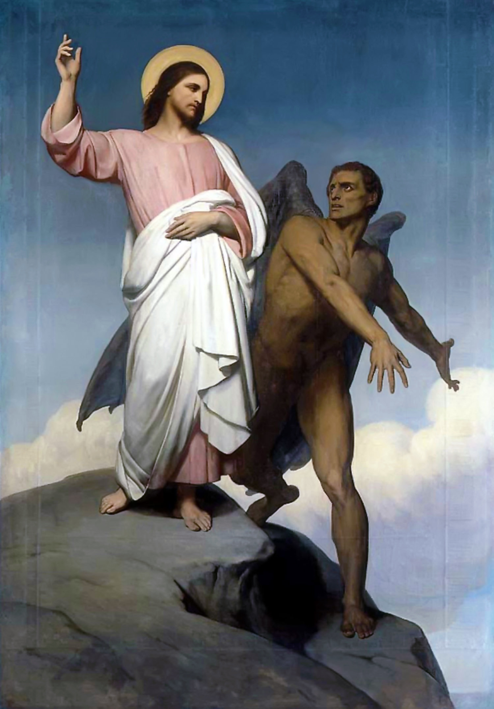

<table class="MsoNormalTable" style="width: 470.0pt; border-collapse: collapse;" border="0" width="627" cellspacing="0" cellpadding="0"><tbody><tr><td style="width: 100.0pt; padding: 0cm 5.4pt 12.0pt 5.4pt;" valign="top" width="133">
3&nbsp; 
</td><td style="width: 270.0pt; padding: 0cm 5.4pt 12.0pt 5.4pt;" valign="top" width="360">
Verteller, Duivel, Jezus
</td><td style="width: 100.0pt; padding: 0cm 5.4pt 12.0pt 5.4pt;" valign="bottom" width="133">
&nbsp;
</td></tr><tr><td style="width: 370.0pt; padding: 0cm 5.4pt 12.0pt 5.4pt;" colspan="2" valign="top" width="493"></td><td style="width: 100.0pt; padding: 0cm 5.4pt 12.0pt 5.4pt;" valign="bottom" width="133"></td></tr><tr><td style="width: 100.0pt; padding: 0cm 5.4pt 12.0pt 5.4pt;" valign="top" width="133">
&nbsp;
</td><td style="width: 270.0pt; padding: 0cm 5.4pt 12.0pt 5.4pt;" valign="top" width="360">
Woestijn met stenen op de grond
</td><td style="width: 100.0pt; padding: 0cm 5.4pt 12.0pt 5.4pt;" valign="bottom" width="133">
&nbsp;
</td></tr><tr><td style="width: 100.0pt; padding: 0cm 5.4pt 12.0pt 5.4pt;" valign="top" width="133">
Verteller
</td><td style="width: 270.0pt; padding: 0cm 5.4pt 12.0pt 5.4pt;" valign="top" width="360">
Toen werd Jesus door den Geest naar de woestijn geleid, om door den duivel te worden bekoord.

En nadat Hij veertig dagen en veertig nachten had gevast, kreeg Hij honger.
</td><td style="width: 100.0pt; padding: 0cm 5.4pt 12.0pt 5.4pt;" valign="bottom" width="133">
Mt 4:1-2
</td></tr><tr><td style="width: 100.0pt; padding: 0cm 5.4pt 12.0pt 5.4pt;" valign="top" width="133">
Duivel
</td><td style="width: 270.0pt; padding: 0cm 5.4pt 12.0pt 5.4pt;" valign="top" width="360">
Indien Gij Gods Zoon zijt, zeg tot die steen, dat hij brood moet worden.
</td><td style="width: 100.0pt; padding: 0cm 5.4pt 12.0pt 5.4pt;" valign="bottom" width="133">
Lc 4:3
</td></tr><tr><td style="width: 100.0pt; padding: 0cm 5.4pt 12.0pt 5.4pt;" valign="top" width="133">
Jezus
</td><td style="width: 270.0pt; padding: 0cm 5.4pt 12.0pt 5.4pt;" valign="top" width="360">
Er staat geschreven: "De mens zal niet leven van brood alleen".
</td><td style="width: 100.0pt; padding: 0cm 5.4pt 12.0pt 5.4pt;" valign="bottom" width="133">
Lc 4:4 (Deut 8:3)
</td></tr><tr><td style="width: 100.0pt; padding: 0cm 5.4pt 12.0pt 5.4pt;" valign="top" width="133">
&nbsp;
</td><td style="width: 270.0pt; padding: 0cm 5.4pt 12.0pt 5.4pt;" valign="top" width="360">
Op het dak van de tempel
</td><td style="width: 100.0pt; padding: 0cm 5.4pt 12.0pt 5.4pt;" valign="bottom" width="133">
&nbsp;
</td></tr><tr><td style="width: 100.0pt; padding: 0cm 5.4pt 12.0pt 5.4pt;" valign="top" width="133">
Verteller
</td><td style="width: 270.0pt; padding: 0cm 5.4pt 12.0pt 5.4pt;" valign="top" width="360">
Toen voerde de duivel Hem naar de heilige stad, plaatste Hem op het dakterras van de tempel.
</td><td style="width: 100.0pt; padding: 0cm 5.4pt 12.0pt 5.4pt;" valign="bottom" width="133">
Mt 4:5
</td></tr><tr><td style="width: 100.0pt; padding: 0cm 5.4pt 12.0pt 5.4pt;" valign="top" width="133">
Duivel
</td><td style="width: 270.0pt; padding: 0cm 5.4pt 12.0pt 5.4pt;" valign="top" width="360">
Indien Gij Gods Zoon zijt, werp U dan naar beneden. Want er staat geschreven: "Zijn engelen zal Hij over u bevelen, en zij zullen u op de handen dragen, opdat ge aan geen steen uw voet zoudt stoten".
</td><td style="width: 100.0pt; padding: 0cm 5.4pt 12.0pt 5.4pt;" valign="bottom" width="133">
Mt 4:6&nbsp;(Ps 91:11-12)
</td></tr><tr><td style="width: 100.0pt; padding: 0cm 5.4pt 12.0pt 5.4pt;" valign="top" width="133">
Jezus
</td><td style="width: 270.0pt; padding: 0cm 5.4pt 12.0pt 5.4pt;" valign="top" width="360">
Er staat ook geschreven: "Gij zult den Heer uw God niet beproeven".
</td><td style="width: 100.0pt; padding: 0cm 5.4pt 12.0pt 5.4pt;" valign="bottom" width="133">
Mt 4:7 (Deut 6:16)
</td></tr><tr><td style="width: 370.0pt; padding: 0cm 5.4pt 12.0pt 5.4pt;" colspan="2" valign="top" width="493">

</td><td style="width: 100.0pt; padding: 0cm 5.4pt 12.0pt 5.4pt;" valign="bottom" width="133">
The Temptation of Christ (Ary Scheffer, 1854, Walker Art Gallery, Liverpool, UK)
</td></tr><tr><td style="width: 100.0pt; padding: 0cm 5.4pt 12.0pt 5.4pt;" valign="top" width="133">
&nbsp;
</td><td style="width: 270.0pt; padding: 0cm 5.4pt 12.0pt 5.4pt;" valign="top" width="360">
Op een hoge berg
</td><td style="width: 100.0pt; padding: 0cm 5.4pt 12.0pt 5.4pt;" valign="bottom" width="133">
&nbsp;
</td></tr><tr><td style="width: 100.0pt; padding: 0cm 5.4pt 12.0pt 5.4pt;" valign="top" width="133">
Verteller
</td><td style="width: 270.0pt; padding: 0cm 5.4pt 12.0pt 5.4pt;" valign="top" width="360">
Weer nam de duivel Hem mee naar een zeer hoge berg, en toonde Hem alle koninkrijken der wereld en hun heerlijkheid.
</td><td style="width: 100.0pt; padding: 0cm 5.4pt 12.0pt 5.4pt;" valign="bottom" width="133">
Mt 4:8
</td></tr><tr><td style="width: 100.0pt; padding: 0cm 5.4pt 12.0pt 5.4pt;" valign="top" width="133">
Duivel
</td><td style="width: 270.0pt; padding: 0cm 5.4pt 12.0pt 5.4pt;" valign="top" width="360">
Ik zal U al die macht en de heerlijkheid daarvan geven; want mij zijn ze geschonken, en ik geef ze, wien ik wil. Wanneer Gij mij aanbidt, zal dit alles het uwe zijn.
</td><td style="width: 100.0pt; padding: 0cm 5.4pt 12.0pt 5.4pt;" valign="bottom" width="133">
Lc 4:6-7
</td></tr><tr><td style="width: 100.0pt; padding: 0cm 5.4pt 12.0pt 5.4pt;" valign="top" width="133">
Jezus
</td><td style="width: 270.0pt; padding: 0cm 5.4pt 12.0pt 5.4pt;" valign="top" width="360">
Ga heen, satan; want er staat geschreven: "Gij zult den Heer uw God aanbidden, en Hem alleen dienen".
</td><td style="width: 100.0pt; padding: 0cm 5.4pt 12.0pt 5.4pt;" valign="bottom" width="133">
Mt 4:10 (Deut 6:13-14)
</td></tr><tr><td style="width: 370.0pt; padding: 0cm 5.4pt 12.0pt 5.4pt;" colspan="2" valign="top" width="493"></td><td style="width: 100.0pt; padding: 0cm 5.4pt 12.0pt 5.4pt;" valign="bottom" width="133"></td></tr><tr><td style="width: 100.0pt; padding: 0cm 5.4pt 12.0pt 5.4pt;" valign="top" width="133">
Verteller
</td><td style="width: 270.0pt; padding: 0cm 5.4pt 12.0pt 5.4pt;" valign="top" width="360">
Nadat de duivel al zijn bekoringen had uitgeput, verliet hij Hem voor een tijd. Hij vertoefde onder de wilde dieren, en zie, de engelen naderden, en dienden hem.
</td><td style="width: 100.0pt; padding: 0cm 5.4pt 12.0pt 5.4pt;" valign="bottom" width="133">
Lc 4:13

Mc 1:13

Mt 4:11
</td></tr></tbody></table>

# [MEER BIJBELTONEEL](/bijbeltoneel/ "Bijbeltoneel")

A.M.D.G.
