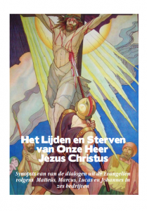
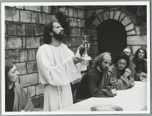

 Het lijdensverhaal in toneelvorm

Voor de passieweek heeft Geloven Leren een [reeks bijzondere publicaties](/page/bijbeltoneel/) in petto: het lijdensverhaal gepresenteerd als toneelstuk. De basis is de synopsis van de vier Evangelies volgens Mattheus, Markus, Lukas en Johannes. In de synopsis worden de verhaallijnen van de Evangelies samengesmolten tot een enkele verhaallijn die alle elementen bevat uit de afzonderlijke Evangelies en die uit overlappende verhaallijnen degene kiest die het meest geschikt is voor dramatisering. Zowat alle dialogen zijn reeds uitgeschreven door de evangelisten, dus de omzetting naar toneel is rechttoe-rechtaan en het resultaat is een toneelscript dat haast helemaal is samengesteld uit letterlijke bijbelfragmenten. De publicatie geeft bij elk element van de dialoog en bij elke regieaanwijzing de referentie naar de brontekst.

 Reclame voor een echt passiespel

De toneelbewerking van het Evangelie is niet bedoeld om als passiedrama uit te voeren voor groot publiek, maar aarzel niet om bij gelegenheid samen met de kinderen thuis, in de catechesegroep of in de klas een of meerdere bedrijven uit te voeren om het bijbelverhaal wat leven in te blazen. Of neem het stuk zelf bij de hand als alternatieve bijbellezing!

Slechts op een plaats is noodgedwongen een element aan de dialoog toegevoegd dat niet alsdusdanig in het evangelie is opgenomen in de passage waar Jezus de eucharistie instelt! Er staat geschreven, bijvoorbeeld in Marcus 14:22, _"Terwijl ze aten, nam hij een brood,_ _sprak het zegengebed uit__, brak het brood, deelde het uit en zei: ‘Neem hiervan, dit is mijn lichaam.’"_ Alle elementen van het verhaal staan in de bijbel neergeschreven als dialoog en zijn dus letterlijk over te nemen, maar het zegengebed dat Jezus uitsprak niet. Erg veel moeite vergt het echter niet om te achterhalen welk gebed Jezus uitsprak, want [joden bidden nog steeds hetzelfde psalmgebed voor de maaltijd](http://www.joodsleven.nl/Encyclopedie/Kasjroet/Kasjroet-18.htm):

 Passiespel in Tegelen... klik op de foto voor de betere verkleedpartijtjes

_"Gezegend bent U, Eeuwige onze God, Koning van de wereld, die brood voortbrengt uit de aarde."_ (voor het eten van brood)

_"Gezegend bent U, Eeuwige onze God, Koning van de wereld, die de vrucht van de wijnstok geschapen heeft." (_voor het drinken van wijn)

Niet alleen joden bidden het, ook de priester spreekt het uit tijdens het offertorium, vlak voor de aanvang van het groot dankgebed (tenminste, als u goed luistert, want de priester bidt dit gebed met gedempte stem, en indien uw priester uberhaupt nog de moeite neemt dit te bidden). In de liturgie klinken de joodse gebeden lichtjes gewijzigd als volgt:

_Sacerdos, stans ad altare, accipit patenam cum pane, eamque ambabus manibus aliquantulum elevatam super altare tenet, submissa voce dicens:_

_Benedíctus es, Dómine, Deus univérsi, quia de tua largitáte accépimus panem, quem tibi offérimus, fructum terræ et óperis mánuum hóminum: ex quo nobis fiet panis vitæ._

_Gezegend zijt Gij God, Heer van al wat leeft. Uit uw milde hand hebben wij het brood ontvangen. Aan U dragen wij op de vrucht van de aarde, het werk van onze handen. Maak het voor ons tot brood van eeuwig leven._

_Postea sacerdos accipit calicem, eumque ambabus manibus aliquantulum elevatum super altare tenet, submissa voce dicens:_

_Benedíctus es, Dómine, Deus univérsi, quia de tua largitáte accépimus vinum, quod tibi offérimus, fructum vitis et óperis mánuum hóminum, ex quo nobis fiet potus spiritális._

_Gezegend zijt Gij God, Heer van al wat leeft. Uit uw milde hand hebben wij de beker ontvangen. Aan U dragen wij op de vrucht van de wijngaard, het werk van onze handen. Maak het voor ons tot bron van eeuwig leven._

Het toneelstuk gebruikt dit liturgische gebed over de offergaven als zegengebed. Interessant om weten is overigens dat dit gebed nieuw is in de liturgie sinds de herwerking van het missaal door paus Paulus VI, hoewel de joodse oorsprong de indruk zou kunnen wekken dat het van oudsher tot de liturgie behoort... een lichtjes geforceerde poging om 'terug te keren naar de bron'? In de buitengewone vorm van de liturgie (de 'tridentijnse mis') spreekt de priester een ander gebed uit, dat meer het offerkarakter van de mis benadrukt (zo leert me een [artikel op de blog van de onvolprezen mgr. Charles Pope](http://blog.adw.org/2009/07/the-mass-in-slow-motion-the-offertory/)), maar zowiezo is het offertoriumgebed liturgisch pas toegevoegd in Trente en dus niet ouder dan 500 jaar.

Om het Laatste Avondmaal te besluiten, zo schrijft Marcus verder in vers 26, werden "de psalmen gezongen". Volgens de notities op [www.bijbel.net](http://www.bijbel.net) worden daarmee psalmen 115-118 bedoeld, waarmee de joodse paasmaaltijd traditioneel wordt afgesloten. Dat is nogal veel om helemaal in het toneel te verwerken, dus is gekozen voor een fragment uit psalm 136, dat ook terugkeert in het joodse [Birkat Hamazon](http://www.hebrew4christians.com/Blessings/Daily_Blessings/Food_Blessings/Grace_After_Meals/grace_after_meals.html), het gebed na het eten:

_Gezegend zijt Gij God, Heer van al wat leeft, die in zijn goedheid de hele wereld voedt met genade, liefde en barmhartigheid. Hij geeft voedsel aan alles wat leeft - zijn liefde kent geen grenzen_ (Ps 136:25)

Veel succes op de planken!
