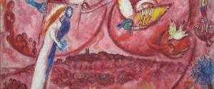
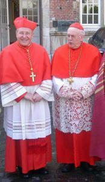
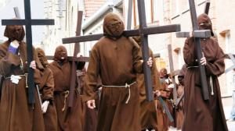

 Synode 2014-2015

Het jaar is nog maar net begonnen, en het is weeral maart. Nog maar even en de zomervakantie begint en ---hop--- het zal zo weer oktober zijn. De tijd is kort, zal de Geest wel zijn werk kunnen doen? In oktober zal immers de échte gezinssynode plaatsvinden! Tijd dus om nog eens één en ander op een rijtje te zetten.

### Slechte punten op het rapport

Voorafgaand aan de voorbereidende synode van oktober 2014 schreef ik [enkele verwachtingen](/blog/acht-van-de-bisschop-en-drie-van-mezelf/) neer:

1. **Een duidelijk onderscheid te maken tussen analyse en beschouwing enerzijds en concrete besluiten anderzijds, of anders gezegd: liever erkennen** **_geen antwoord_** **te kunnen geven op verwachtingen die gesteld worden, dan een vage ruimte te creëren voor experimenten.** De voorbereidende synode heeft geblunderd bij de publicatie van een tussentijds rapport dat een wel heel tendentieuze lezing van de debatten bevatte, maar gelukkig is dat in de finale [Relatio Synodi](http://rkdocumenten.nl/rkdocs/index.php?mi=600&doc=5675) rechtgezet. Laat ons hopen dat de synode van 2015 niet dezelfde fout maakt! Hoe dan ook zal het aan Paus Franciscus zijn om de uitkomst van de synode in ondubbelzinnig leergezag om te zetten.
2. **Het gezin te erkennen als de belangrijkste bron van geloofsopvoeding, in een wereld waarin geseculariseerde scholen die taak niet langer mogen vervullen en waarin de krimpende geloofsgemeenschappen de kracht niet hebben om volwaardige catechese aan te bieden.** Deze rol van het het gezin in de evangelisering is hier en daar misschien [zijdelings aangeraakt](http://rkdocumenten.nl/rkdocs/index.php?mi=600&doc=5675&id=9992), maar niet ingevuld of bekrachtigd. Hopelijk vindt in 2015 een focusverschuiving plaats van [het dysfunctionele naar het functionele](http://blog.adw.org/2014/12/focused-on-the-dysfunctional-a-consideration-of-the-need-for-the-synod-on-the-family-to-refocus-on-the-family/).
3. **Het doopsel en de biecht aan het gezin aan te reiken als wegen naar ontmoeting met Christus en als voortdurende opdracht voor de ouders (of opvoeders) om kinderen op te voeden in het geloof en** **_niet_** **de eucharistie in te vullen als een soort van initiatie- of verzoeningssacrament.** De rol van de sacramenten als voedingsbodem voor het (functionele) gezinsleven is nauwelijks aangeraakt. Enkel in de [context van het 'hete hangijzer'](http://rkdocumenten.nl/rkdocs/index.php?mi=600&doc=5675&id=9989&highlight=verzoening#al52) van de hertrouwde echtgescheidenen is er blijkbaar concreet over de noodzaak van een sacramenteel leven nagedacht, waarover verderop meer. Ook hier dus een gemiste kans...

Hoewel de tekst van de Relatio Synodi heel waardevolle elementen bevat, heeft hij niet voldaan aan mijn persoonlijke verwachtingen. Slecht rapport voor de bisschoppen, dus laat de Geest er nu maar werk van maken!

### Weggestemde artikels...

Alle verwachtingen ten spijt en een wonder van de Heilige Geest even buiten beschouwing gelaten, hoeven we ons echter geen illusies te maken, en zal de aandacht in oktober uitgaan naar de thema's van de hertrouwde echtgescheidenen en de homosexuelen en hun toegang tot de sacramenten. Op verzoek van paus Franciscus bevat de Relatio Synodi van 2014 de drie artikels die in stemming verworpen werden, maar niettemin nog een grote meerderheid achter zich kregen. Het behouden van deze artikels in het verslag is zijn meest significante bijdrage geweest aan de synode van 2014. Het zijn de artikels [#52 en 53](http://rkdocumenten.nl/rkdocs/index.php?mi=600&doc=5675&id=9989) over communie voor hertrouwde echtgescheidenen en [#55](http://rkdocumenten.nl/rkdocs/index.php?mi=600&doc=5675&id=9990) over homoseksualiteit. Daarnaast zijn er ook de artikels [#48 en 49](http://rkdocumenten.nl/rkdocs/index.php?mi=600&doc=5675&id=9989#al48) over de versoepeling van de procedure voor nietigverklaring van een huwelijk, die weliswaar zijn aangenomen maar nog verdere uitwerking nodig hebben. Dít zullen de thema's zijn in oktober 2015.

### ... en losse ideeën

Wat me opvalt is dat de Relatio Synodi ---gelukkig--- de onontbindbaarheid van het huwelijk niet in vraag stelt en op verschillende plaatsen zelfs bevestigt. Toch merk je hoe tal van denkpistes in het publieke debat verkend worden, om die onontbindbaarheid af te zwakken en zo een antwoord te geven op de kwestie van de hertrouwde echtgescheidenen. Enkele voorbeelden:

- de orthodoxe kerk kent modaliteiten om echtgescheidenen tot een tweede kerkelijk huwelijk toe te laten. Zal dit ---met een sausje van oecumene---- het witte konijn zijn om ook in onze kerk toe te passen?
- het huwelijk is tegelijk een sacrament en een kerk- en burgerrechterlijke verbintenis, maar wat is daarin essentieel en wat is de rol van het geloof van de huwelijkspartners op het moment van de huwelijkssluiting? Enkele vragen die mgr. Hendriks zich nog zeer onlangs [op zijn blog stelde](http://www.arsacal.nl/?p=contentitem&id=821).
- zijn de bijbelse grondvesten van het huwelijkssacrament wel rotsvast? Zegt Jezus niet zelf in Mt 19:9 dat _"wie zijn vrouw verstoot,_ _behalve in het geval van ontucht__, en met een ander trouwt, echtbreuk pleegt"_? Of is dat gewoon een [slordige vertaling](http://christianity.stackexchange.com/questions/32166/how-does-the-catholic-church-explain-matthew-199-which-seems-to-allow-divorce-i)? Gelukkig is er mgr. Pope om het [gezag van de heilige Schrift](http://blog.adw.org/2015/01/a-lowly-pastor-comments-on-troubling-developments-in-the-marriage-debate/) nog eens op scherp te stellen.
- moeten regels universeel worden toegepast? Is dat dan "gehoorzaam" aan paus Franciscus, die in Evangelium Gaudium reeds uiteenzette dat de Kerk nood heeft aan een meer regionale aanpak van problemen? De Duitse bisschoppenconferentie zet in op het toverwoord ['subsidiariteit'](https://incaelo.wordpress.com/2015/02/22/from-a-hildesheim-pub-dresdens-bishop-koch-on-marriage-divorce-and-sacraments/) om op eigen houtje de grenzen tussen doctrine en pastoraal te verkennen.

### Het voorstel-Kasper

 Kardinaal Kasper in gezelschap van kardinaal Danneels, die voor het betere lobbywerk instaat

Zullen deze ideeën in oktober gebruikt worden om de impasse los te wrikken waarin de discussie rond het [fel](https://catholicismpure.wordpress.com/2014/04/03/dr-john-rist-cardinal-kaspers-new-approach-to-the-remarried-has-shaky-historical-foundations/) [betwiste](http://www.ncregister.com/daily-news/cardinals-collaborate-on-book-to-defend-church-doctrine-on-divorce-remarria) [standpunt van kardinaal Kasper](https://www.commonwealmagazine.org/interview-cardinal-walter-kasper) zich bevindt? Zijn voorstel is beknopt weergegeven in het verworpen artikel 52: _"Een niet algemeen toelaten tot de tafel van de eucharistie in bepaalde bijzondere omstandigheden en op zeer precieze voorwaarden, . Een eventueel naderen tot de sacramenten zou voorafgegaan dienen te worden door **een weg van penitentie** onder verantwoordelijkheid van de diocesane bisschop."_ Blijkbaar is het dus iets genuanceerder dan het simplistische "iedereen heeft recht ter communie te gaan", waarover iedereen het heeft en waarmee verwachtingen worden gewekt die nooit zullen worden ingevuld.

Er is wel iets te zeggen voor Kaspers voorstel!

### De "weg van de penitentie"

Kasper zegt dus _niet_ dat vanaf morgen alle hertrouwde echtgescheidenen plots ter communie mogen gaan. Er zijn _checks and balances_ nodig om de sacramenten van misbruik te vrijwaren. Wie zijn ongeregelde situatie wil regulariseren, moet _"een weg van penitentie"_ doorlopen. Denk je niet dat wie die stap wil zetten, reeds getuigt van een groot en oprecht verlangen naar een sacramenteel leven en van liefde voor Christus én een bewustzijn van de ongeregeldheid die een volwaardig sacramenteel leven verhindert? Anders begin je er niet aan! Theologie en sacramentenleer zijn niet vakgebied, maar het lijkt me sterk dat Christus iemand met die gesteldheid niet barmhartig zou kunnen aanvaarden als waardig lid van zijn Lichaam!

### Geen vooruitgang?

 Een beproefde weg van penitentie, maar misschien niet wat kardinaal Kasper bedoelt... wat bedoelt hij dan wel?

Twee nieuwe vragen werpen zich evenwel op: wat mag zo'n "weg van penitentie" wel inhouden? en hoe zal dit worden gepercipieerd? Ik kan me alvast voorstellen dat dit "progressieve" voorstel niet aanzien zal worden als een _vooruitgang_ in tal van Westeuropese bisdommen, waar in de praktijk voor het sacrament van de eucharistie al lang geen vragen meer worden gesteld bij ongeregelde huwelijken en waar de biecht is uitgestorven... Tenzij de verantwoordelijke bisschop die "weg van penitentie" herleidt tot een nietsbetekenende soort van algemene absolutie, maar dat was de bedoeling niet, toch?

Dat ik nog nergens concrete aanwijzingen heb gevonden wat die "weg van penitentie" zou kunnen inhouden, maakt me wat achterdochtig. Als het een paard van Troje blijkt, vallen _checks and balances_ weg en [devalueert](http://blog.adw.org/2015/01/for-many-have-reduced-love-to-kindness-and-kindness-to-mere-affirmation-a-further-reflection-on-the-moral-troubles-of-our-time/) het voorstel liefde (barmhartigheid jegens de zondaar) tot 'lief zijn' (aanvaarding van de zonde) en is het dus een impliciete herdefiniëring van het huwelijk.

### Onze Moeder de heilige Kerk

Ondanks mijn achterdocht heb ik nog een tweede bedenking die kan pleiten voor Kaspers voorstel. In de katholieke Kerk geloven we dat God werkzaam is in de wereld _door_ de Kerk en meerbepaald _door_ haar sacramenten. Meer nog: we zijn van de Kerk afhankelijk om door de sacramenten toegang te vinden tot Gods heil. De Kerk echter, is mensenwerk en kent daarom fouten en gebreken. Toch is het God die op het einde rechter zal zijn over ons leven, en niet de Kerk. Hoe zal God de ziel oordelen die zich niet met grote snelheid haast naar de biechtstoel om bekering te verkrijgen, indien de Kerk die ziel daartoe niet aanmaant en zo de ziel doet geloven "dat het allemaal niet nodig is"?

In het voorstel van kardinaal Kasper herken je terug het traditionele instituut van het geloof, dat zich als een goede moeder bezorgd toont over het welzijn van haar kinderen. Net nu veel gelovigen die moeder aan de deur hebben gezet omdat ze vinden dat ze zich met alles bemoeit, vind ik het een opluchting te  horen dat zelfs een progressieve kardinaal nog durft opkomen voor een Kerk die actief haar gelovigen op hun pad van bekering op moederlijke wijze bij de hand neemt, met liefde én terechtwijzing.

### De doorslag

Benieuwd dus of er in de aanloop naar de synode nog nieuwe creatieve ideeën gespuid zullen worden, maar vooral of het voorstel van kardinaal Kasper mits de nodige nuance, correcte communicatie, solide _checks and balances_ en tenslotte ook doorslaggevende theologische motivatie aan geloofwaardigheid kan winnen.

Het voorstel moet ook nog worden verzoend met het nog vrij jonge magesterium van een heilige Paus, Johannes-Paulus II, die in zijn [homilie bij de sluiting van de gezinssynode](http://rkdocumenten.nl/rkdocs/index.php?mi=600&doc=1788&id=0&highlight=#al8) van 1980 waarschuwt: _"de zogenaamde 'wet van de geleidelijkheid' of van de geleidelijke vooruitgang kan niet gelijkgesteld worden met 'geleidelijkheid van de wet', alsof er in de goddelijke wet verschillende graden of vormen van gebod zijn voor verschillende mensen en situaties"_ (§8). Jimmy Akin legt dat heel goed uit in zijn ['secret information club'](http://www.ncregister.com/blog/jimmy-akin/the-law-of-gradualness-12-things-to-know-and-share) en meer achtergrond over de plaats van 'graduality' in het magisterium vond ik in dit beknopt artikel van prof. Grabowski aan de Catholic University of America.

Als het voorstel die geloofwaardigheid niet wint, blijft oktober een maand voor niets en kan paus Franciscus zich ertoe beperken een doorslagje te maken van [_Familiaris Consortio_](http://rkdocumenten.nl/rkdocs/index.php?mi=600&doc=267&id=647), de pauselijke exhortatie van paus Johannes-Paulus II, die de neerslag was van de vorige synode over het gezin.
