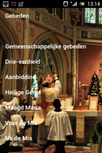
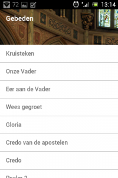
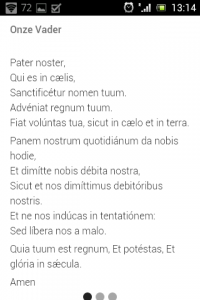
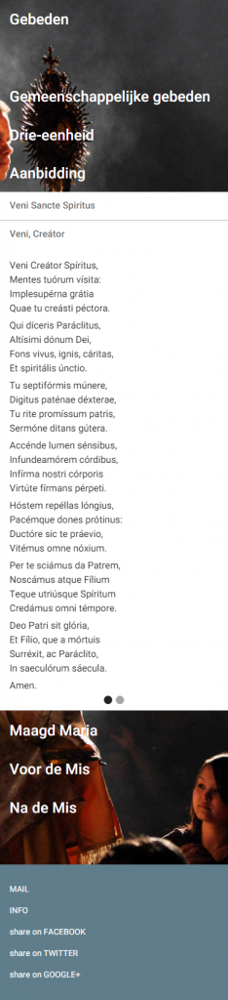

Geloven Leren heeft er weer een nieuwe spin-off bij. Een ruime selectie [katholieke gebeden](http://gebeden.gelovenleren.net/ "Katholieke Gebeden") is verzameld in een handige app. Natuurlijk zijn er de de vertrouwde gebeden, zoals het onzevader, weesgegroet, gloria, credo en de aktes van geloof, hoop, liefde en berouw. In verschillende categorieën gaan nog een paar dozijn parels van gebeden schuil, voor de heilige Drie-eenheid, de Heilige Geest, de maagd Maria, en gebeden die je kan bidden als voorbereiding van de eucharistie of als bezinning na de heilige Mis, maar ook tijdens de Mis kan je de app gebruiken om de vaste gebeden te volgen, voor de gewone vorm of de buitengewone vorm (tridentijnse ritus), telkens zowel in het Nederlands als in het Latijn.

De app is toegankelijk als website op dit adres: [gebeden.gelovenleren.net](http://gebeden.gelovenleren.net) en als [Android-app op de Play Store](https://play.google.com/store/apps/details?id=net.gelovenleren.gebeden "Katholieke Gebeden"). Dat laatste is gemakkelijk als je de app ook offline wil gebruiken (= zonder internetverbinding).

  

### Navigatie

De navigatie van de app is heel eenvoudig. Er is eigenlijk maar één pagina die alle gebeden bevat. Als je op een hoofding klikt, vouwt die open om de inhoud te tonen. Je hoeft alleen maar naar boven en naar beneden te scrollen om verder te navigeren. Als je een gebed hebt geopend, wordt het schermvullend getoond, zo word je niet afgeleid. Als je een breed scherm hebt, toont de app het gebed in het Nederlands en in het Latijn in twee kolommen. Op een smal scherm, bijvoorbeeld een smartphone, moet je even 'vegen' naar links of naar rechts (of op PC kort klikken aan de zijkant van het scherm) om de andere taal te tonen.

Ik vraag me af of je met dit navigatieconcept geen handige missaal zou kunnen maken, die je van begin tot einde door de mis loodst, en natuurlijk dynamisch zodat je de teksten krijgt die bij een specifieke mis horen en je niet meer heen en weer hoeft te bladeren om dingen te zoeken..., en..., en..., en dat kan niet eens zo moeilijk zijn ;)

### Responsorium

\[caption id="attachment\_3306" align="alignleft" width="100"\] Katholieke Gebeden\[/caption\]

Het ikoontje van de app is het symbool dat gebruikt wordt om in een gebed aan te duiden welk stuk gebeden wordt door het volk, dat is het 'responsorium' (℟). De tegenhanger van dit symbool is het 'versiculum' (℣), wat aangeeft welk stuk gebeden wordt door de priester. Voor wie zelf gebeden opmaakt, kan het interessant te vernemen dat beide symbolen beschikbaar zijn in een apart font '[liturgy.ttf](http://www.romanliturgy.org/?p=41)' onder de karakters 'R' en 'V', maar dat de unicode-standaard beide symbolen ook opneemt: '[versicle](http://www.fileformat.info/info/unicode/char/2123/index.htm)' en '[response](http://www.fileformat.info/info/unicode/char/211F/index.htm)', inclusief referenties naar fonts die deze karakters ondersteunen.

Dit is de volledige lijst van de beschikbare gebeden:

**Gregoriaanse liederen (met zangpartituren!)**

- Alma Redemptoris Mater
- Sub Tuum Præsidium
- Ave Regina Cælorum
- Regina Cæli
- Salve Regina
- Pange Lingua (Tantum Ergo)
- Adoro te devote
- Veni Creator Spiritus
- Te Ioseph celebrent
- Ave Maria
- Pater Noster

### Kyriale

- Mis I Lux et origo (Paastijd)
- Mis II Kyrie fons bonitatis
- Mis III Kyrie Deus sempiterne (hoogfeesten)
- Mis IV Cunctipotens Genitor Deus (Apostelfeesten)
- Mis V Kyrie magnæ Deus potentiæ
- Mis VI Kyrie Rex Genitor
- Mis VII Kyrie Rex splendens
- Mis VIII De Angelis
- Mis IX Cum jubilo (hoogdagen en mariafeesten)
- Mis X Alme Pater (mariafeesten)
- Mis XI Orbis factor (zondagen doorheen het jaar)
- Mis XII Pater cuncta
- Mis XIII Stelliferi Conditor orbis
- Mis XIV Jesu redemptor
- Mis XV Dominator Deus
- Mis XVI (weekdagen in de tijd doorheen het jaar)
- Mis XVII (zondagen in Advent en Vasten)
- Mis XVIII Deus Genitor alme (weekdagen in Advent en Vasten, Requiemmis)

**Liturgische gebeden**

- Asperges me
- Vidi aquam
- Ostende nobis
- Kruisteken
- Introibo
- Confiteor
- Misericordiam
- Kyrie
- Gloria
- Schriftlezingen
- Credo van de apostelen
- Credo
- Offertorium
- Sursum corda
- Sanctus
- Mysterium fidei
- Per Ipsum
- Onze Vader
- Agnus Dei
- Ite missa est
- Ultimam Evangelium

**Drie-eenheid**

- Sýmbolum Athanasiánum \[Quicumque\]
- Te Deum
- Triságium angélicum
- Akte van berouw
- Akte van liefde
- Akte van hoop
- Akte van geloof

**Aanbidding**

- Geestelijke communie
- Adóro te devóte
- Pange, língua
- Psalm 150

**Heilige Geest**

- Veni, Sancte Spíritus
- Veni, Creátor

**Maagd Maria**

- De Engel des Heren
- Gedenkgebed of Memorare
- Eer aan de Vader
- Wees gegroet
- Rozenhoedje
- Stabat mater
- Litanie van Loreto

**Voor en na de mis**

- Gebed tot Sint Jozef
- Gebed van Sint Ambrosius
- Gebed van Thomas van Aquino
- Loflied van de gehele schepping (Trium puerórum)
- Gebed tot de heilige Michaël
- Gebed van Thomas van Aquino
- Orátio universális (Clemens XI)
- Absoute
