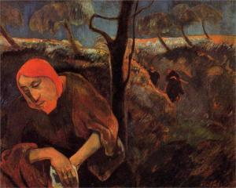
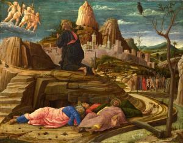
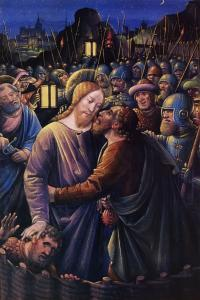

# SYNOPSIS VAN HET LIJDENSVERHAAL IN TONEELVORM

# DERDE BEDRIJF

<table class="MsoNormalTable" style="width: 470.0pt; border-collapse: collapse;" border="0" width="627" cellspacing="0" cellpadding="0"><tbody><tr style="page-break-inside: avoid;"><td style="width: 100.0pt; padding: 0pt 5.4pt 12.0pt 5.4pt;" valign="top" width="133"></td><td style="width: 270.0pt; padding: 0pt 5.4pt 12.0pt 5.4pt;" valign="top" width="360"></td><td style="width: 100.0pt; padding: 0pt 5.4pt 12.0pt 5.4pt;" valign="bottom" width="133"></td></tr><tr><td style="width: 100.0pt; padding: 0pt 5.4pt 12.0pt 5.4pt;" valign="top" width="133">
3 &nbsp;rollen met tekst
</td><td style="width: 270.0pt; padding: 0pt 5.4pt 12.0pt 5.4pt;" valign="top" width="360">
Jezus - Petrus - Judas
</td><td style="width: 100.0pt; padding: 0pt 5.4pt 12.0pt 5.4pt;" valign="bottom" width="133">
&nbsp;
</td></tr><tr><td style="width: 100.0pt; padding: 0pt 5.4pt 12.0pt 5.4pt;" valign="top" width="133">
&nbsp;figuranten
</td><td style="width: 270.0pt; padding: 0pt 5.4pt 12.0pt 5.4pt;" valign="top" width="360">
Jakobus - Johannes - andere leerlingen - de bende van de&nbsp;hogepriesters - Malchus
</td><td style="width: 100.0pt; padding: 0pt 5.4pt 12.0pt 5.4pt;" valign="bottom" width="133">
&nbsp;
</td></tr><tr><td style="width: 100.0pt; padding: 0pt 5.4pt 12.0pt 5.4pt;" valign="top" width="133">
&nbsp;locatie
</td><td style="width: 270.0pt; padding: 0pt 5.4pt 12.0pt 5.4pt;" valign="top" width="360">
Onderweg naar de Olijfberg
</td><td style="width: 100.0pt; padding: 0pt 5.4pt 12.0pt 5.4pt;" valign="bottom" width="133">
&nbsp;
</td></tr><tr style="page-break-inside: avoid;"><td style="width: 100.0pt; padding: 0pt 5.4pt 12.0pt 5.4pt;" valign="top" width="133">
Jezus
</td><td style="width: 270.0pt; padding: 0pt 5.4pt 12.0pt 5.4pt;" valign="top" width="360">
Jullie zullen mij deze nacht allemaal afvallen, want er&nbsp;staat geschreven: “Ik zal de herder doden, en de schapen van zijn kudde&nbsp;zullen uiteengedreven worden.” Maar nadat ik uit de dood ben opgewekt, zal ik&nbsp;jullie voorgaan naar Galilea.
</td><td style="width: 100.0pt; padding: 0pt 5.4pt 12.0pt 5.4pt;" valign="bottom" width="133">
Mt 26:31-32
</td></tr><tr style="page-break-inside: avoid;"><td style="width: 100.0pt; padding: 0pt 5.4pt 12.0pt 5.4pt;" valign="top" width="133">
Petrus
</td><td style="width: 270.0pt; padding: 0pt 5.4pt 12.0pt 5.4pt;" valign="top" width="360">
Misschien zal iedereen u afvallen, ik nooit!
</td><td style="width: 100.0pt; padding: 0pt 5.4pt 12.0pt 5.4pt;" valign="bottom" width="133">
Mt 26:33
</td></tr><tr style="page-break-inside: avoid;"><td style="width: 100.0pt; padding: 0pt 5.4pt 12.0pt 5.4pt;" valign="top" width="133">
Jezus
</td><td style="width: 270.0pt; padding: 0pt 5.4pt 12.0pt 5.4pt;" valign="top" width="360">
Ik verzeker je: juist jij zult me vannacht, nog voor de&nbsp;haan tweemaal gekraaid heeft, driemaal verloochenen.
</td><td style="width: 100.0pt; padding: 0pt 5.4pt 12.0pt 5.4pt;" valign="bottom" width="133">
Mc 14:30
</td></tr><tr style="page-break-inside: avoid;"><td style="width: 100.0pt; padding: 0pt 5.4pt 12.0pt 5.4pt;" valign="top" width="133">
Petrus
</td><td style="width: 270.0pt; padding: 0pt 5.4pt 12.0pt 5.4pt;" valign="top" width="360">
Heer, ik ben zelfs bereid om met u de gevangenis in te&nbsp;gaan en te sterven.
</td><td style="width: 100.0pt; padding: 0pt 5.4pt 12.0pt 5.4pt;" valign="bottom" width="133">
Lc 22:33
</td></tr><tr style="page-break-inside: avoid;"><td style="width: 100.0pt; padding: 0pt 5.4pt 12.0pt 5.4pt;" valign="top" width="133">
Jezus
</td><td style="width: 270.0pt; padding: 0pt 5.4pt 12.0pt 5.4pt;" valign="top" width="360">
Toen ik jullie uitzond zonder geldbuidel, reistas en&nbsp;sandalen, kwamen jullie toen iets tekort?
</td><td style="width: 100.0pt; padding: 0pt 5.4pt 12.0pt 5.4pt;" valign="bottom" width="133">
Lc 22:35
</td></tr><tr style="page-break-inside: avoid;"><td style="width: 100.0pt; padding: 0pt 5.4pt 12.0pt 5.4pt;" valign="top" width="133">
Leerlingen
</td><td style="width: 270.0pt; padding: 0pt 5.4pt 12.0pt 5.4pt;" valign="top" width="360">
Niets
</td><td style="width: 100.0pt; padding: 0pt 5.4pt 12.0pt 5.4pt;" valign="bottom" width="133">
Lc 22:35
</td></tr><tr style="page-break-inside: avoid;"><td style="width: 100.0pt; padding: 0pt 5.4pt 12.0pt 5.4pt;" valign="top" width="133">
Jezus
</td><td style="width: 270.0pt; padding: 0pt 5.4pt 12.0pt 5.4pt;" valign="top" width="360">
Maar wie nu een geldbuidel heeft, moet die meenemen,&nbsp;evenals zijn reistas, en wie er geen heeft moet zijn mantel verkopen en zich&nbsp;een zwaard aanschaffen. Want ik zeg jullie: wat geschreven staat, moet in mij&nbsp;tot vervulling komen, namelijk: “Hij werd gerekend tot de wettelozen.” Inderdaad, nu wordt voltrokken wat over mij gezegd is.
</td><td style="width: 100.0pt; padding: 0pt 5.4pt 12.0pt 5.4pt;" valign="bottom" width="133">
Lc 22:36-37
</td></tr><tr style="page-break-inside: avoid;"><td style="width: 100.0pt; padding: 0pt 5.4pt 12.0pt 5.4pt;" valign="top" width="133">
Leerlingen
</td><td style="width: 270.0pt; padding: 0pt 5.4pt 12.0pt 5.4pt;" valign="top" width="360">
Kijk Heer, hier zijn twee zwaarden.
</td><td style="width: 100.0pt; padding: 0pt 5.4pt 12.0pt 5.4pt;" valign="bottom" width="133">
Lc 22:38
</td></tr><tr style="page-break-inside: avoid;"><td style="width: 100.0pt; padding: 0pt 5.4pt 12.0pt 5.4pt;" valign="top" width="133">
Jezus
</td><td style="width: 270.0pt; padding: 0pt 5.4pt 12.0pt 5.4pt;" valign="top" width="360">
Genoeg hierover!
</td><td style="width: 100.0pt; padding: 0pt 5.4pt 12.0pt 5.4pt;" valign="bottom" width="133">
Lc 22:38
</td></tr><tr style="page-break-inside: avoid;"><td style="width: 100.0pt; padding: 0pt 5.4pt 12.0pt 5.4pt;" valign="top" width="133">
Jezus
</td><td style="width: 270.0pt; padding: 0pt 5.4pt 12.0pt 5.4pt;" valign="top" width="360">
Blijven jullie hier zitten, ik ga daar bidden. Bid dat&nbsp;jullie niet in beproeving komen.
</td><td style="width: 100.0pt; padding: 0pt 5.4pt 12.0pt 5.4pt;" valign="bottom" width="133">
Mt 26:36, Lc 22:4
</td></tr><tr style="page-break-inside: avoid;"><td style="width: 100.0pt; padding: 0pt 5.4pt 12.0pt 5.4pt;" valign="top" width="133"></td><td style="width: 270.0pt; padding: 0pt 5.4pt 12.0pt 5.4pt;" valign="top" width="360">
<em>Jezus neemt Petrus en Jakobus en Johannes met zich&nbsp;mee.</em>
</td><td style="width: 100.0pt; padding: 0pt 5.4pt 12.0pt 5.4pt;" valign="bottom" width="133">
Mc 14:33
</td></tr><tr style="page-break-inside: avoid;"><td style="width: 370.0pt; padding: 0pt 5.4pt 12.0pt 5.4pt;" colspan="2" valign="top" width="493">

</td><td style="width: 100.0pt; padding: 0pt 5.4pt 12.0pt 5.4pt;" valign="bottom" width="133">
The Agony in the Garden (Paul Gauguin, 1889, Norton Gallery, Palm Beach, Florida, USA)
</td></tr><tr><td style="width: 100.0pt; padding: 0pt 5.4pt 12.0pt 5.4pt;" valign="top" width="133">
&nbsp;
</td><td style="width: 270.0pt; padding: 0pt 5.4pt 12.0pt 5.4pt;" valign="top" width="360">
Verderop in de hof van Olijven
</td><td style="width: 100.0pt; padding: 0pt 5.4pt 12.0pt 5.4pt;" valign="bottom" width="133">
&nbsp;
</td></tr><tr style="page-break-inside: avoid;"><td style="width: 100.0pt; padding: 0pt 5.4pt 12.0pt 5.4pt;" valign="top" width="133">
Jezus
</td><td style="width: 270.0pt; padding: 0pt 5.4pt 12.0pt 5.4pt;" valign="top" width="360">
Ik voel me dodelijk bedroefd; blijf hier met mij waken.
</td><td style="width: 100.0pt; padding: 0pt 5.4pt 12.0pt 5.4pt;" valign="bottom" width="133">
Mt 26:38
</td></tr><tr style="page-break-inside: avoid;"><td style="width: 100.0pt; padding: 0pt 5.4pt 12.0pt 5.4pt;" valign="top" width="133"></td><td style="width: 270.0pt; padding: 0pt 5.4pt 12.0pt 5.4pt;" valign="top" width="360">
<em>Hij loopt nog een stukje verder, knielt en bidt diep&nbsp;voorovergebogen.</em>
</td><td style="width: 100.0pt; padding: 0pt 5.4pt 12.0pt 5.4pt;" valign="bottom" width="133">
Mt 26:39
</td></tr><tr style="page-break-inside: avoid;"><td style="width: 100.0pt; padding: 0pt 5.4pt 12.0pt 5.4pt;" valign="top" width="133">
Jezus
</td><td style="width: 270.0pt; padding: 0pt 5.4pt 12.0pt 5.4pt;" valign="top" width="360">
Abba, Vader, voor u is alles mogelijk, neem deze beker van&nbsp;mij weg. Maar laat niet gebeuren wat ik wil, maar wat u wilt.
</td><td style="width: 100.0pt; padding: 0pt 5.4pt 12.0pt 5.4pt;" valign="bottom" width="133">
Mc 14:36
</td></tr><tr style="page-break-inside: avoid;"><td style="width: 100.0pt; padding: 0pt 5.4pt 12.0pt 5.4pt;" valign="top" width="133"></td><td style="width: 270.0pt; padding: 0pt 5.4pt 12.0pt 5.4pt;" valign="top" width="360">
<em>Jezus loopt terug en ziet dat zijn leerlingen liggen&nbsp;te slapen.</em>
</td><td style="width: 100.0pt; padding: 0pt 5.4pt 12.0pt 5.4pt;" valign="bottom" width="133">
Mc 14:37
</td></tr><tr style="page-break-inside: avoid;"><td style="width: 100.0pt; padding: 0pt 5.4pt 12.0pt 5.4pt;" valign="top" width="133">
Jezus
</td><td style="width: 270.0pt; padding: 0pt 5.4pt 12.0pt 5.4pt;" valign="top" width="360">
Simon, slaap je? Kon je niet één uur waken? Blijf wakker&nbsp;en bid dat jullie niet in beproeving komen; de geest is wel gewillig, maar&nbsp;het lichaam is zwak.
</td><td style="width: 100.0pt; padding: 0pt 5.4pt 12.0pt 5.4pt;" valign="bottom" width="133">
Mc 14:37-38
</td></tr><tr style="page-break-inside: avoid;"><td style="width: 100.0pt; padding: 0pt 5.4pt 12.0pt 5.4pt;" valign="top" width="133"></td><td style="width: 270.0pt; padding: 0pt 5.4pt 12.0pt 5.4pt;" valign="top" width="360">
<em>Weer gaat Jezus weg om te bidden.</em>
</td><td style="width: 100.0pt; padding: 0pt 5.4pt 12.0pt 5.4pt;" valign="bottom" width="133">
Mc 14:39
</td></tr><tr style="page-break-inside: avoid;"><td style="width: 100.0pt; padding: 0pt 5.4pt 12.0pt 5.4pt;" valign="top" width="133">
Jezus
</td><td style="width: 270.0pt; padding: 0pt 5.4pt 12.0pt 5.4pt;" valign="top" width="360">
Nu ben ik doodsbang. Wat moet ik zeggen? Vader, laat dit&nbsp;ogenblik aan mij voorbijgaan? Maar hiervoor ben ik juist gekomen.
</td><td style="width: 100.0pt; padding: 0pt 5.4pt 12.0pt 5.4pt;" valign="bottom" width="133">
Joh 12:27
</td></tr><tr style="page-break-inside: avoid;"><td style="width: 100.0pt; padding: 0pt 5.4pt 12.0pt 5.4pt;" valign="top" width="133"></td><td style="width: 270.0pt; padding: 0pt 5.4pt 12.0pt 5.4pt;" valign="top" width="360">
<em>Jezus komt terug en ziet dat ze weer slapen, want ze&nbsp;zijn door vermoeidheid overmand. Hij laat hen achter en loopt opnieuw wat&nbsp;verder.</em>
</td><td style="width: 100.0pt; padding: 0pt 5.4pt 12.0pt 5.4pt;" valign="bottom" width="133">
Mt 26:43-44
</td></tr><tr style="page-break-inside: avoid;"><td style="width: 370.0pt; padding: 0pt 5.4pt 12.0pt 5.4pt;" colspan="2" valign="top" width="493">

</td><td style="width: 100.0pt; padding: 0pt 5.4pt 12.0pt 5.4pt;" valign="bottom" width="133">
The Agony in the Garden (Andrea Mantegna, c. 1455 , National Gallery, London)
</td></tr><tr style="page-break-inside: avoid;"><td style="width: 100.0pt; padding: 0pt 5.4pt 12.0pt 5.4pt;" valign="top" width="133">
Jezus
</td><td style="width: 270.0pt; padding: 0pt 5.4pt 12.0pt 5.4pt;" valign="top" width="360">
Vader, als het niet mogelijk is dat deze beker aan mij&nbsp;voorbijgaat zonder dat ik eruit drink, laat het dan gebeuren zoals u het&nbsp;wilt.
</td><td style="width: 100.0pt; padding: 0pt 5.4pt 12.0pt 5.4pt;" valign="bottom" width="133">
Mt 25:42
</td></tr><tr style="page-break-inside: avoid;"><td style="width: 100.0pt; padding: 0pt 5.4pt 12.0pt 5.4pt;" valign="top" width="133"></td><td style="width: 270.0pt; padding: 0pt 5.4pt 12.0pt 5.4pt;" valign="top" width="360">
<em>Jezus voegt zich weer bij de leerlingen.</em>
</td><td style="width: 100.0pt; padding: 0pt 5.4pt 12.0pt 5.4pt;" valign="bottom" width="133">
Mt 26:45
</td></tr><tr style="page-break-inside: avoid;"><td style="width: 100.0pt; padding: 0pt 5.4pt 12.0pt 5.4pt;" valign="top" width="133">
Jezus
</td><td style="width: 270.0pt; padding: 0pt 5.4pt 12.0pt 5.4pt;" valign="top" width="360">
Liggen jullie daar nog steeds te slapen en te rusten? En&nbsp;dat terwijl het ogenblik nabij is waarop de Mensenzoon wordt uitgeleverd aan&nbsp;zondaars. Sta op, laten we gaan; kijk, hij die mij uitlevert, is al vlakbij.
</td><td style="width: 100.0pt; padding: 0pt 5.4pt 12.0pt 5.4pt;" valign="bottom" width="133">
Mt 26:45-46
</td></tr><tr style="page-break-inside: avoid;"><td style="width: 100.0pt; padding: 0pt 5.4pt 12.0pt 5.4pt;" valign="top" width="133"></td><td style="width: 270.0pt; padding: 0pt 5.4pt 12.0pt 5.4pt;" valign="top" width="360">
<em>Judas komt eraan in gezelschap van een met zwaarden en&nbsp;knuppels bewapende bende, die door de hogepriesters, schriftgeleerden en&nbsp;oudsten was gestuurd.</em>
</td><td style="width: 100.0pt; padding: 0pt 5.4pt 12.0pt 5.4pt;" valign="bottom" width="133">
Mc 14:43
</td></tr><tr style="page-break-inside: avoid;"><td style="width: 100.0pt; padding: 0pt 5.4pt 12.0pt 5.4pt;" valign="top" width="133">
Judas
</td><td style="width: 270.0pt; padding: 0pt 5.4pt 12.0pt 5.4pt;" valign="top" width="360">
Degene die ik kus, die is het. Neem hem gevangen en voer&nbsp;hem weg onder strenge bewaking.
</td><td style="width: 100.0pt; padding: 0pt 5.4pt 12.0pt 5.4pt;" valign="bottom" width="133">
Mc 14:44
</td></tr><tr style="page-break-inside: avoid;"><td style="width: 370.0pt; padding: 0pt 5.4pt 12.0pt 5.4pt;" colspan="2" valign="top" width="493">

</td><td style="width: 100.0pt; padding: 0pt 5.4pt 12.0pt 5.4pt;" valign="bottom" width="133">
Betrayed with a kiss (Jean Bourdichon, 1500)
</td></tr><tr style="page-break-inside: avoid;"><td style="width: 100.0pt; padding: 0pt 5.4pt 12.0pt 5.4pt;" valign="top" width="133">
Judas
</td><td style="width: 270.0pt; padding: 0pt 5.4pt 12.0pt 5.4pt;" valign="top" width="360">
Gegroet, rabbi!
</td><td style="width: 100.0pt; padding: 0pt 5.4pt 12.0pt 5.4pt;" valign="bottom" width="133">
Mt 26:49
</td></tr><tr style="page-break-inside: avoid;"><td style="width: 100.0pt; padding: 0pt 5.4pt 12.0pt 5.4pt;" valign="top" width="133">
Jezus
</td><td style="width: 270.0pt; padding: 0pt 5.4pt 12.0pt 5.4pt;" valign="top" width="360">
Judas, lever je de Mensenzoon uit met een kus?
</td><td style="width: 100.0pt; padding: 0pt 5.4pt 12.0pt 5.4pt;" valign="bottom" width="133">
Lc 22:48
</td></tr><tr style="page-break-inside: avoid;"><td style="width: 100.0pt; padding: 0pt 5.4pt 12.0pt 5.4pt;" valign="top" width="133">
&nbsp;
</td><td style="width: 270.0pt; padding: 0pt 5.4pt 12.0pt 5.4pt;" valign="top" width="360">
<em>Ze grijpen hem vast en nemen hem gevangen.</em>
</td><td style="width: 100.0pt; padding: 0pt 5.4pt 12.0pt 5.4pt;" valign="bottom" width="133">
Mc 14:46
</td></tr><tr style="page-break-inside: avoid;"><td style="width: 100.0pt; padding: 0pt 5.4pt 12.0pt 5.4pt;" valign="top" width="133">
Petrus
</td><td style="width: 270.0pt; padding: 0pt 5.4pt 12.0pt 5.4pt;" valign="top" width="360">
Heer, zullen we er met het zwaard op los slaan?
</td><td style="width: 100.0pt; padding: 0pt 5.4pt 12.0pt 5.4pt;" valign="bottom" width="133">
Lc 22:49
</td></tr><tr style="page-break-inside: avoid;"><td style="width: 100.0pt; padding: 0pt 5.4pt 12.0pt 5.4pt;" valign="top" width="133"></td><td style="width: 270.0pt; padding: 0pt 5.4pt 12.0pt 5.4pt;" valign="top" width="360">
<em>Daarop trekt Simon Petrus het zwaard dat hij bij zich&nbsp;had, haalt uit naar de slaaf van de hogepriester en slaagt hem zijn&nbsp;rechteroor af; Malchus heet die slaaf.</em>
</td><td style="width: 100.0pt; padding: 0pt 5.4pt 12.0pt 5.4pt;" valign="bottom" width="133">
Joh 18:10
</td></tr><tr style="page-break-inside: avoid;"><td style="width: 100.0pt; padding: 0pt 5.4pt 12.0pt 5.4pt;" valign="top" width="133">
Jezus
</td><td style="width: 270.0pt; padding: 0pt 5.4pt 12.0pt 5.4pt;" valign="top" width="360">
Houd daarmee op. Zo is het genoeg!
</td><td style="width: 100.0pt; padding: 0pt 5.4pt 12.0pt 5.4pt;" valign="bottom" width="133">
Lc 22:51
</td></tr><tr style="page-break-inside: avoid;"><td style="width: 100.0pt; padding: 0pt 5.4pt 12.0pt 5.4pt;" valign="top" width="133"></td><td style="width: 270.0pt; padding: 0pt 5.4pt 12.0pt 5.4pt;" valign="top" width="360">
<em>Jezus raakt het oor aan en geneest de man.</em>
</td><td style="width: 100.0pt; padding: 0pt 5.4pt 12.0pt 5.4pt;" valign="bottom" width="133">
Lc 22:51
</td></tr><tr style="page-break-inside: avoid;"><td style="width: 100.0pt; padding: 0pt 5.4pt 12.0pt 5.4pt;" valign="top" width="133">
Jezus
</td><td style="width: 270.0pt; padding: 0pt 5.4pt 12.0pt 5.4pt;" valign="top" width="360">
Steek je zwaard terug op zijn plaats. Want wie naar het&nbsp;zwaard grijpt, zal door het zwaard omkomen. Weet je niet dat ik mijn Vader&nbsp;maar te hulp hoef te roepen en dat hij mij dan onmiddellijk meer dan twaalf&nbsp;legioenen engelen ter beschikking zou stellen? Maar hoe zouden dan de&nbsp;Schriften in vervulling gaan, waar staat dat het zo moet gebeuren?
</td><td style="width: 100.0pt; padding: 0pt 5.4pt 12.0pt 5.4pt;" valign="bottom" width="133">
Mt 26:52-54
</td></tr><tr style="page-break-inside: avoid;"><td style="width: 100.0pt; padding: 0pt 5.4pt 12.0pt 5.4pt;" valign="top" width="133">
Jezus
</td><td style="width: 270.0pt; padding: 0pt 5.4pt 12.0pt 5.4pt;" valign="top" width="360">
Als tegen een misdadiger bent u uitgetrokken met zwaarden&nbsp;en knuppels? Dagelijks was ik bij u in de tempel, en toen hebt u geen vinger&nbsp;naar me uitgestoken, maar dit is uw uur, het uur van de macht van de&nbsp;duisternis.
</td><td style="width: 100.0pt; padding: 0pt 5.4pt 12.0pt 5.4pt;" valign="bottom" width="133">
Lc 22:52-53
</td></tr><tr style="page-break-inside: avoid;"><td style="width: 100.0pt; padding: 0pt 5.4pt 12.0pt 5.4pt;" valign="top" width="133">
<i>&nbsp;</i>
</td><td style="width: 270.0pt; padding: 0pt 5.4pt 12.0pt 5.4pt;" valign="top" width="360">
<em>Allen laten hem in de steek en vluchten weg. De&nbsp;soldaten met hun tribuun en de Joodse gerechtsdienaars grijpen Jezus en&nbsp;boeien hem.</em>
</td><td style="width: 100.0pt; padding: 0pt 5.4pt 12.0pt 5.4pt;" valign="bottom" width="133">
Mc 14:50, Joh 18:12
</td></tr></tbody></table>

# [MEER BIJBELTONEEL](/bijbeltoneel/ "Bijbeltoneel")

A.M.D.G .
