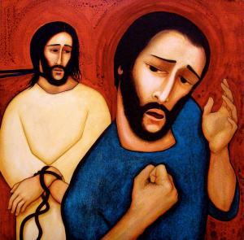
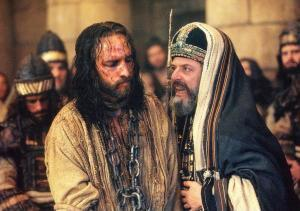

# SYNOPSIS VAN HET LIJDENSVERHAAL IN TONEELVORM

# VIERDE BEDRIJF

<table class="MsoNormalTable" style="width: 470.0pt; border-collapse: collapse;" border="0" width="627" cellspacing="0" cellpadding="0"><tbody><tr><td style="width: 100.0pt; padding: 0pt 5.4pt 12.0pt 5.4pt;" valign="top" width="133">
7 &nbsp;personages met tekst
</td><td style="width: 270.0pt; padding: 0pt 5.4pt 12.0pt 5.4pt;" valign="top" width="360">
Dienstmeisje - Petrus - Slaaf - Omstaander - Valse getuige -&nbsp;Annas - Jezus
</td><td style="width: 100.0pt; padding: 0pt 5.4pt 12.0pt 5.4pt;" valign="bottom" width="133">
&nbsp;
</td></tr><tr><td style="width: 100.0pt; padding: 0pt 5.4pt 12.0pt 5.4pt;" valign="top" width="133">
&nbsp;figuranten
</td><td style="width: 270.0pt; padding: 0pt 5.4pt 12.0pt 5.4pt;" valign="top" width="360">
Meer omstaanders
</td><td style="width: 100.0pt; padding: 0pt 5.4pt 12.0pt 5.4pt;" valign="bottom" width="133">
&nbsp;
</td></tr><tr><td style="width: 100.0pt; padding: 0pt 5.4pt 12.0pt 5.4pt;" valign="top" width="133">
&nbsp;locatie
</td><td style="width: 270.0pt; padding: 0pt 5.4pt 12.0pt 5.4pt;" valign="top" width="360">
Op de binnenplaats van het huis van de hogepriester Annas
</td><td style="width: 100.0pt; padding: 0pt 5.4pt 12.0pt 5.4pt;" valign="bottom" width="133">
&nbsp;
</td></tr><tr><td style="width: 100.0pt; padding: 0pt 5.4pt 12.0pt 5.4pt;" valign="top" width="133"></td><td style="width: 270.0pt; padding: 0pt 5.4pt 12.0pt 5.4pt;" valign="top" width="360">
<em>Het is nog nacht. Petrus volgt hen op een afstand. Op&nbsp;de binnenplaats van het huis van de hogepriester steken een vuur aan en gaan&nbsp;eromheen zitten; Petrus voegt zich bij hen.</em>
</td><td style="width: 100.0pt; padding: 0pt 5.4pt 12.0pt 5.4pt;" valign="bottom" width="133">
Lc 22:54-55
</td></tr><tr><td style="width: 370.0pt; padding: 0pt 5.4pt 12.0pt 5.4pt;" colspan="2" valign="top" width="493">

</td><td style="width: 100.0pt; padding: 0pt 5.4pt 12.0pt 5.4pt;" valign="bottom" width="133">
Peter’s Denial ( Michael D. O’Brien, 2005, Private collection, © Michael D. O’Brien)
</td></tr><tr><td style="width: 100.0pt; padding: 0pt 5.4pt 12.0pt 5.4pt;" valign="top" width="133">
Een dienstmeisje
</td><td style="width: 270.0pt; padding: 0pt 5.4pt 12.0pt 5.4pt;" valign="top" width="360">
Jij was ook bij die Jezus van Nazaret!
</td><td style="width: 100.0pt; padding: 0pt 5.4pt 12.0pt 5.4pt;" valign="bottom" width="133">
Mc 14:67
</td></tr><tr><td style="width: 100.0pt; padding: 0pt 5.4pt 12.0pt 5.4pt;" valign="top" width="133">
Petrus
</td><td style="width: 270.0pt; padding: 0pt 5.4pt 12.0pt 5.4pt;" valign="top" width="360">
Ik weet niet waar je het over hebt, ik begrijp echt niet&nbsp;wat je bedoelt
</td><td style="width: 100.0pt; padding: 0pt 5.4pt 12.0pt 5.4pt;" valign="bottom" width="133">
Mc 14:68
</td></tr><tr><td style="width: 100.0pt; padding: 0pt 5.4pt 12.0pt 5.4pt;" valign="top" width="133"></td><td style="width: 270.0pt; padding: 0pt 5.4pt 12.0pt 5.4pt;" valign="top" width="360">
<em>Er kraait een haan.</em>
</td><td style="width: 100.0pt; padding: 0pt 5.4pt 12.0pt 5.4pt;" valign="bottom" width="133">
Mc 14:68
</td></tr><tr><td style="width: 100.0pt; padding: 0pt 5.4pt 12.0pt 5.4pt;" valign="top" width="133">
Een slaaf
</td><td style="width: 270.0pt; padding: 0pt 5.4pt 12.0pt 5.4pt;" valign="top" width="360">
Maar ik heb toch gezien dat je bij hem was in de olijfgaard?
</td><td style="width: 100.0pt; padding: 0pt 5.4pt 12.0pt 5.4pt;" valign="bottom" width="133">
Joh 18:26
</td></tr><tr><td style="width: 100.0pt; padding: 0pt 5.4pt 12.0pt 5.4pt;" valign="top" width="133">
Petrus
</td><td style="width: 270.0pt; padding: 0pt 5.4pt 12.0pt 5.4pt;" valign="top" width="360">
Ik ken hem niet eens!’
</td><td style="width: 100.0pt; padding: 0pt 5.4pt 12.0pt 5.4pt;" valign="bottom" width="133">
Lc 22:57
</td></tr><tr><td style="width: 100.0pt; padding: 0pt 5.4pt 12.0pt 5.4pt;" valign="top" width="133">
Omstaanders
</td><td style="width: 270.0pt; padding: 0pt 5.4pt 12.0pt 5.4pt;" valign="top" width="360">
Jij bent wel degelijk een van hen, trouwens, je accent&nbsp;verraadt je.
</td><td style="width: 100.0pt; padding: 0pt 5.4pt 12.0pt 5.4pt;" valign="bottom" width="133">
Mt 26:73
</td></tr><tr><td style="width: 100.0pt; padding: 0pt 5.4pt 12.0pt 5.4pt;" valign="top" width="133">
Petrus
</td><td style="width: 270.0pt; padding: 0pt 5.4pt 12.0pt 5.4pt;" valign="top" width="360">
Ik ken die man over wie jullie het hebben niet!
</td><td style="width: 100.0pt; padding: 0pt 5.4pt 12.0pt 5.4pt;" valign="bottom" width="133">
Mc 14:71
</td></tr><tr><td style="width: 100.0pt; padding: 0pt 5.4pt 12.0pt 5.4pt;" valign="top" width="133"></td><td style="width: 270.0pt; padding: 0pt 5.4pt 12.0pt 5.4pt;" valign="top" width="360">
<em>Meteen kraait de haan een tweede keer. Jezus draait&nbsp;zich om en kijkt Petrus aan. Petrus gaat naar buiten en huilt bitter.</em>
</td><td style="width: 100.0pt; padding: 0pt 5.4pt 12.0pt 5.4pt;" valign="bottom" width="133">
Mc 14:72, Lc 22:61-62
</td></tr><tr><td style="width: 100.0pt; padding: 0pt 5.4pt 12.0pt 5.4pt;" valign="top" width="133">
&nbsp;
</td><td style="width: 270.0pt; padding: 0pt 5.4pt 12.0pt 5.4pt;" valign="top" width="360">
In het huis van de hogepriester Annas
</td><td style="width: 100.0pt; padding: 0pt 5.4pt 12.0pt 5.4pt;" valign="bottom" width="133">
&nbsp;
</td></tr><tr style="page-break-inside: avoid;"><td style="width: 100.0pt; padding: 0pt 5.4pt 12.0pt 5.4pt;" valign="top" width="133"></td><td style="width: 270.0pt; padding: 0pt 5.4pt 12.0pt 5.4pt;" valign="top" width="360">
<em>De hogepriesters en het hele Sanhedrin proberen iemand&nbsp;een getuigenverklaring tegen Jezus te laten afleggen op grond waarvan ze hem&nbsp;ter dood kunnen veroordelen.</em>
</td><td style="width: 100.0pt; padding: 0pt 5.4pt 12.0pt 5.4pt;" valign="bottom" width="133">
Mc 14:55
</td></tr><tr><td style="width: 100.0pt; padding: 0pt 5.4pt 12.0pt 5.4pt;" valign="top" width="133">
Getuige
</td><td style="width: 270.0pt; padding: 0pt 5.4pt 12.0pt 5.4pt;" valign="top" width="360">
We hebben hem horen zeggen: “Ik zal die door mensenhanden&nbsp;gemaakte tempel afbreken en in drie dagen een andere opbouwen die niet door&nbsp;mensenhanden gemaakt is.”
</td><td style="width: 100.0pt; padding: 0pt 5.4pt 12.0pt 5.4pt;" valign="bottom" width="133">
Mc 14:58
</td></tr><tr><td style="width: 100.0pt; padding: 0pt 5.4pt 12.0pt 5.4pt;" valign="top" width="133">
Annas
</td><td style="width: 270.0pt; padding: 0pt 5.4pt 12.0pt 5.4pt;" valign="top" width="360">
Waarom antwoordt u niet? U hoort toch wat deze getuigen&nbsp;zeggen?
</td><td style="width: 100.0pt; padding: 0pt 5.4pt 12.0pt 5.4pt;" valign="bottom" width="133">
Mc 14:60
</td></tr><tr><td style="width: 100.0pt; padding: 0pt 5.4pt 12.0pt 5.4pt;" valign="top" width="133">
Jezus
</td><td style="width: 270.0pt; padding: 0pt 5.4pt 12.0pt 5.4pt;" valign="top" width="360">
Ik heb in het openbaar tot de wereld gesproken. Ik heb&nbsp;steeds onderricht gegeven op plaatsen waar de Joden bij elkaar komen, in&nbsp;synagogen en in de tempel, en nooit heb ik iets in het geheim gezegd. Waarom&nbsp;ondervraagt u mij? Vraag het toch aan de mensen die mij gehoord hebben, zij&nbsp;weten wat ik gezegd heb.
</td><td style="width: 100.0pt; padding: 0pt 5.4pt 12.0pt 5.4pt;" valign="bottom" width="133">
Joh 18:20-21
</td></tr><tr style="page-break-inside: avoid;"><td style="width: 100.0pt; padding: 0pt 5.4pt 12.0pt 5.4pt;" valign="top" width="133">
Annas
</td><td style="width: 270.0pt; padding: 0pt 5.4pt 12.0pt 5.4pt;" valign="top" width="360">
Ik bezweer u bij de levende God, zeg ons of u de messias&nbsp;bent, de Zoon van God.
</td><td style="width: 100.0pt; padding: 0pt 5.4pt 12.0pt 5.4pt;" valign="bottom" width="133">
Mt 26:63
</td></tr><tr><td style="width: 100.0pt; padding: 0pt 5.4pt 12.0pt 5.4pt;" valign="top" width="133">
Jezus
</td><td style="width: 270.0pt; padding: 0pt 5.4pt 12.0pt 5.4pt;" valign="top" width="360">
Als ik het u zeg, gelooft u mij toch niet. En als ik een&nbsp;vraag stel, antwoordt u toch niet. Maar vanaf nu zal de Mensenzoon gezeten&nbsp;zijn aan de rechterhand van de Almachtige.
</td><td style="width: 100.0pt; padding: 0pt 5.4pt 12.0pt 5.4pt;" valign="bottom" width="133">
Lc 22:67-69
</td></tr><tr><td style="width: 100.0pt; padding: 0pt 5.4pt 12.0pt 5.4pt;" valign="top" width="133">
Allen
</td><td style="width: 270.0pt; padding: 0pt 5.4pt 12.0pt 5.4pt;" valign="top" width="360">
U bent dus de Zoon van God?
</td><td style="width: 100.0pt; padding: 0pt 5.4pt 12.0pt 5.4pt;" valign="bottom" width="133">
Lc 22:70
</td></tr><tr><td style="width: 100.0pt; padding: 0pt 5.4pt 12.0pt 5.4pt;" valign="top" width="133">
Jezus
</td><td style="width: 270.0pt; padding: 0pt 5.4pt 12.0pt 5.4pt;" valign="top" width="360">
U zegt dat ik het ben.
</td><td style="width: 100.0pt; padding: 0pt 5.4pt 12.0pt 5.4pt;" valign="bottom" width="133">
Lc 22:70
</td></tr><tr><td style="width: 100.0pt; padding: 0pt 5.4pt 12.0pt 5.4pt;" valign="top" width="133"></td><td style="width: 270.0pt; padding: 0pt 5.4pt 12.0pt 5.4pt;" valign="top" width="360">
<em>Annas scheurt zijn kleren.</em>
</td><td style="width: 100.0pt; padding: 0pt 5.4pt 12.0pt 5.4pt;" valign="bottom" width="133">
Mt 26:65
</td></tr><tr><td style="width: 100.0pt; padding: 0pt 5.4pt 12.0pt 5.4pt;" valign="top" width="133">
Annas
</td><td style="width: 270.0pt; padding: 0pt 5.4pt 12.0pt 5.4pt;" valign="top" width="360">
Hij heeft God gelasterd! Waarvoor hebben we nog getuigen&nbsp;nodig? Nu hebt u met eigen oren gehoord hoe hij God lastert. Wat denkt u?
</td><td style="width: 100.0pt; padding: 0pt 5.4pt 12.0pt 5.4pt;" valign="bottom" width="133">
Mt 26:65-66
</td></tr><tr><td style="width: 100.0pt; padding: 0pt 5.4pt 12.0pt 5.4pt;" valign="top" width="133">
Omstaanders
</td><td style="width: 270.0pt; padding: 0pt 5.4pt 12.0pt 5.4pt;" valign="top" width="360">
Hij is schuldig en verdient de doodstraf!
</td><td style="width: 100.0pt; padding: 0pt 5.4pt 12.0pt 5.4pt;" valign="bottom" width="133">
Mt 26:66
</td></tr><tr><td style="width: 100.0pt; padding: 0pt 5.4pt 12.0pt 5.4pt;" valign="top" width="133"></td><td style="width: 270.0pt; padding: 0pt 5.4pt 12.0pt 5.4pt;" valign="top" width="360">
<em>Ze blinddoeken Jezus en slaan hem in het gezicht.</em>
</td><td style="width: 100.0pt; padding: 0pt 5.4pt 12.0pt 5.4pt;" valign="bottom" width="133">
Mc 14:65
</td></tr><tr><td style="width: 100.0pt; padding: 0pt 5.4pt 12.0pt 5.4pt;" valign="top" width="133">
Omstaanders
</td><td style="width: 270.0pt; padding: 0pt 5.4pt 12.0pt 5.4pt;" valign="top" width="360">
Profeteer dan maar eens voor ons, messias, wie is het die&nbsp;je geslagen heeft?
</td><td style="width: 100.0pt; padding: 0pt 5.4pt 12.0pt 5.4pt;" valign="bottom" width="133">
Mt 26:68
</td></tr><tr><td style="width: 370.0pt; padding: 0pt 5.4pt 12.0pt 5.4pt;" colspan="2" valign="top" width="493">

</td><td style="width: 100.0pt; padding: 0pt 5.4pt 12.0pt 5.4pt;" valign="bottom" width="133">
Jesus in the house of the High Priest (Ken Duncan and Philippe Antonello, 2004, The Passion of the Christ, © Icon Distribution, INC)
</td></tr></tbody></table>

  

# [MEER BIJBELTONEEL](/bijbeltoneel/ "Bijbeltoneel")

 

A.M.D.G.
