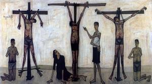

# Synopsis van het lijdensverhaal in toneelvorm

# VIJFDE BEDRIJF

<table class="MsoNormalTable" style="width: 470.0pt; border-collapse: collapse;" border="0" width="627" cellspacing="0" cellpadding="0"><tbody><tr><td style="width: 100.0pt; padding: 0pt 5.4pt 12.0pt 5.4pt;" valign="top" width="133">
6 &nbsp;rollen met tekst
</td><td style="width: 270.0pt; padding: 0pt 5.4pt 12.0pt 5.4pt;" valign="top" width="360">
Pilatus - Hogepriesters - Jezus - Joden -&nbsp;Soldaten - Pilatus' vrouw
</td><td style="width: 100.0pt; padding: 0pt 5.4pt 12.0pt 5.4pt;" valign="bottom" width="133">
&nbsp;
</td></tr><tr><td style="width: 100.0pt; padding: 0pt 5.4pt 12.0pt 5.4pt;" valign="top" width="133">
&nbsp;figuranten
</td><td style="width: 270.0pt; padding: 0pt 5.4pt 12.0pt 5.4pt;" valign="top" width="360">
Meer Joden en soldaten - Simon van Cyrene
</td><td style="width: 100.0pt; padding: 0pt 5.4pt 12.0pt 5.4pt;" valign="bottom" width="133">
&nbsp;
</td></tr><tr><td style="width: 100.0pt; padding: 0pt 5.4pt 12.0pt 5.4pt;" valign="top" width="133">
&nbsp;locatie
</td><td style="width: 270.0pt; padding: 0pt 5.4pt 12.0pt 5.4pt;" valign="top" width="360">
Voor het pretorium
</td><td style="width: 100.0pt; padding: 0pt 5.4pt 12.0pt 5.4pt;" valign="bottom" width="133">
&nbsp;
</td></tr><tr><td style="width: 100.0pt; padding: 0pt 5.4pt 12.0pt 5.4pt;" valign="top" width="133"></td><td style="width: 270.0pt; padding: 0pt 5.4pt 12.0pt 5.4pt;" valign="top" width="360">
<em>De volgende ochtend vroeg nemen alle hogepriesters met&nbsp;de oudsten van het volk het besluit Jezus ter dood te brengen. Ze staan allen&nbsp;op en leiden hem voor aan Pilatus.</em>
</td><td style="width: 100.0pt; padding: 0pt 5.4pt 12.0pt 5.4pt;" valign="bottom" width="133">
Mt 27:1, Lc 23:1
</td></tr><tr><td style="width: 100.0pt; padding: 0pt 5.4pt 12.0pt 5.4pt;" valign="top" width="133">
Pilatus
</td><td style="width: 270.0pt; padding: 0pt 5.4pt 12.0pt 5.4pt;" valign="top" width="360">
Waarvan beschuldigt u deze man?
</td><td style="width: 100.0pt; padding: 0pt 5.4pt 12.0pt 5.4pt;" valign="bottom" width="133">
Joh 18:29
</td></tr><tr><td style="width: 100.0pt; padding: 0pt 5.4pt 12.0pt 5.4pt;" valign="top" width="133">
Hogepriesters
</td><td style="width: 270.0pt; padding: 0pt 5.4pt 12.0pt 5.4pt;" valign="top" width="360">
We hebben vastgesteld dat deze man ons volk van het rechte&nbsp;pad afbrengt en de mensen ervan weerhoudt belastingen aan de keizer te&nbsp;betalen en dat hij van zichzelf zegt de messiaanse koning te zijn.
</td><td style="width: 100.0pt; padding: 0pt 5.4pt 12.0pt 5.4pt;" valign="bottom" width="133">
Lc 23:2
</td></tr><tr><td style="width: 100.0pt; padding: 0pt 5.4pt 12.0pt 5.4pt;" valign="top" width="133">
Pilatus
</td><td style="width: 270.0pt; padding: 0pt 5.4pt 12.0pt 5.4pt;" valign="top" width="360">
Waarom antwoordt u niet? U hoort toch waar ze u allemaal&nbsp;van beschuldigen?
</td><td style="width: 100.0pt; padding: 0pt 5.4pt 12.0pt 5.4pt;" valign="bottom" width="133">
Mc 15:4
</td></tr><tr><td style="width: 100.0pt; padding: 0pt 5.4pt 12.0pt 5.4pt;" valign="top" width="133"></td><td style="width: 270.0pt; padding: 0pt 5.4pt 12.0pt 5.4pt;" valign="top" width="360">
<em>Jezus zegt niets, tot verwondering van Pilatus.</em>
</td><td style="width: 100.0pt; padding: 0pt 5.4pt 12.0pt 5.4pt;" valign="bottom" width="133">
Mc 15:5
</td></tr><tr><td style="width: 100.0pt; padding: 0pt 5.4pt 12.0pt 5.4pt;" valign="top" width="133">
Pilatus
</td><td style="width: 270.0pt; padding: 0pt 5.4pt 12.0pt 5.4pt;" valign="top" width="360">
Neem hem dan mee, en veroordeel hem volgens uw eigen wet.
</td><td style="width: 100.0pt; padding: 0pt 5.4pt 12.0pt 5.4pt;" valign="bottom" width="133">
Joh 18:31
</td></tr><tr><td style="width: 100.0pt; padding: 0pt 5.4pt 12.0pt 5.4pt;" valign="top" width="133">
Hogepriesters
</td><td style="width: 270.0pt; padding: 0pt 5.4pt 12.0pt 5.4pt;" valign="top" width="360">
Wij hebben het recht niet om iemand ter dood te brengen.
</td><td style="width: 100.0pt; padding: 0pt 5.4pt 12.0pt 5.4pt;" valign="bottom" width="133">
Joh 18:31
</td></tr><tr><td style="width: 100.0pt; padding: 0pt 5.4pt 12.0pt 5.4pt;" valign="top" width="133"></td><td style="width: 270.0pt; padding: 0pt 5.4pt 12.0pt 5.4pt;" valign="top" width="360">
<em>Pilatus gaat het pretorium weer in. Hij laat Jezus bij&nbsp;zicht komen.</em>
</td><td style="width: 100.0pt; padding: 0pt 5.4pt 12.0pt 5.4pt;" valign="bottom" width="133">
Joh 18:33
</td></tr><tr><td style="width: 100.0pt; padding: 0pt 5.4pt 12.0pt 5.4pt;" valign="top" width="133">
&nbsp;locatie
</td><td style="width: 270.0pt; padding: 0pt 5.4pt 12.0pt 5.4pt;" valign="top" width="360">
In het pretorium
</td><td style="width: 100.0pt; padding: 0pt 5.4pt 12.0pt 5.4pt;" valign="bottom" width="133">
&nbsp;
</td></tr><tr><td style="width: 100.0pt; padding: 0pt 5.4pt 12.0pt 5.4pt;" valign="top" width="133">
Pilatus
</td><td style="width: 270.0pt; padding: 0pt 5.4pt 12.0pt 5.4pt;" valign="top" width="360">
Bent u de koning van de Joden?
</td><td style="width: 100.0pt; padding: 0pt 5.4pt 12.0pt 5.4pt;" valign="bottom" width="133">
Lc 23:3
</td></tr><tr><td style="width: 100.0pt; padding: 0pt 5.4pt 12.0pt 5.4pt;" valign="top" width="133">
Jezus
</td><td style="width: 270.0pt; padding: 0pt 5.4pt 12.0pt 5.4pt;" valign="top" width="360">
Vraagt u dit uit uzelf of hebben anderen dit over mij&nbsp;gezegd?
</td><td style="width: 100.0pt; padding: 0pt 5.4pt 12.0pt 5.4pt;" valign="bottom" width="133">
Joh 18:34
</td></tr><tr style="page-break-inside: avoid;"><td style="width: 100.0pt; padding: 0pt 5.4pt 12.0pt 5.4pt;" valign="top" width="133">
Pilatus
</td><td style="width: 270.0pt; padding: 0pt 5.4pt 12.0pt 5.4pt;" valign="top" width="360">
Ik ben toch geen Jood. Uw volk en uw hogepriesters hebben&nbsp;u aan mij uitgeleverd – wat hebt u gedaan?
</td><td style="width: 100.0pt; padding: 0pt 5.4pt 12.0pt 5.4pt;" valign="bottom" width="133">
Joh 18:35
</td></tr><tr><td style="width: 100.0pt; padding: 0pt 5.4pt 12.0pt 5.4pt;" valign="top" width="133">
Jezus
</td><td style="width: 270.0pt; padding: 0pt 5.4pt 12.0pt 5.4pt;" valign="top" width="360">
Mijn koningschap hoort niet bij deze wereld. Als mijn&nbsp;koningschap bij deze wereld hoorde, zouden mijn dienaren wel gevochten hebben&nbsp;om te voorkomen dat ik aan de Joden werd uitgeleverd. Maar mijn koninkrijk is&nbsp;niet van hier.
</td><td style="width: 100.0pt; padding: 0pt 5.4pt 12.0pt 5.4pt;" valign="bottom" width="133">
Joh 18:36
</td></tr><tr><td style="width: 100.0pt; padding: 0pt 5.4pt 12.0pt 5.4pt;" valign="top" width="133">
Pilatus
</td><td style="width: 270.0pt; padding: 0pt 5.4pt 12.0pt 5.4pt;" valign="top" width="360">
U bent dus koning?
</td><td style="width: 100.0pt; padding: 0pt 5.4pt 12.0pt 5.4pt;" valign="bottom" width="133">
Joh 18:37
</td></tr><tr><td style="width: 370.0pt; padding: 0pt 5.4pt 12.0pt 5.4pt;" colspan="2" valign="top" width="493">

</td><td style="width: 100.0pt; padding: 0pt 5.4pt 12.0pt 5.4pt;" valign="bottom" width="133">
Kruiswegstatie 2 (Carel Bruens, 2004, Kerk te 's Gravensande, © Carel Bruens)
</td></tr><tr><td style="width: 100.0pt; padding: 0pt 5.4pt 12.0pt 5.4pt;" valign="top" width="133">
Jezus
</td><td style="width: 270.0pt; padding: 0pt 5.4pt 12.0pt 5.4pt;" valign="top" width="360">
U zegt dat ik koning ben. Ik ben geboren en naar de wereld&nbsp;gekomen om van de waarheid te getuigen, en ieder die de waarheid is&nbsp;toegedaan, luistert naar wat ik zeg.
</td><td style="width: 100.0pt; padding: 0pt 5.4pt 12.0pt 5.4pt;" valign="bottom" width="133">
Joh 18:37
</td></tr><tr><td style="width: 100.0pt; padding: 0pt 5.4pt 12.0pt 5.4pt;" valign="top" width="133">
Pilatus
</td><td style="width: 270.0pt; padding: 0pt 5.4pt 12.0pt 5.4pt;" valign="top" width="360">
Maar wat is waarheid?
</td><td style="width: 100.0pt; padding: 0pt 5.4pt 12.0pt 5.4pt;" valign="bottom" width="133">
Joh 18:38
</td></tr><tr><td style="width: 100.0pt; padding: 0pt 5.4pt 12.0pt 5.4pt;" valign="top" width="133"></td><td style="width: 270.0pt; padding: 0pt 5.4pt 12.0pt 5.4pt;" valign="top" width="360">
<em>Pilatus gaat weer naar de Joden buiten.</em>
</td><td style="width: 100.0pt; padding: 0pt 5.4pt 12.0pt 5.4pt;" valign="bottom" width="133">
Joh 18:38
</td></tr><tr><td style="width: 100.0pt; padding: 0pt 5.4pt 12.0pt 5.4pt;" valign="top" width="133">
&nbsp;
</td><td style="width: 270.0pt; padding: 0pt 5.4pt 12.0pt 5.4pt;" valign="top" width="360">
Voor het pretorium
</td><td style="width: 100.0pt; padding: 0pt 5.4pt 12.0pt 5.4pt;" valign="bottom" width="133">
&nbsp;
</td></tr><tr><td style="width: 100.0pt; padding: 0pt 5.4pt 12.0pt 5.4pt;" valign="top" width="133">
Pilatus
</td><td style="width: 270.0pt; padding: 0pt 5.4pt 12.0pt 5.4pt;" valign="top" width="360">
Ik vind niets waaraan deze man schuldig is.
</td><td style="width: 100.0pt; padding: 0pt 5.4pt 12.0pt 5.4pt;" valign="bottom" width="133">
Lc 23:4
</td></tr><tr><td style="width: 100.0pt; padding: 0pt 5.4pt 12.0pt 5.4pt;" valign="top" width="133">
Hogepriesters
</td><td style="width: 270.0pt; padding: 0pt 5.4pt 12.0pt 5.4pt;" valign="top" width="360">
In heel Judea ruit hij met zijn onderricht het volk op,&nbsp;van Galilea tot hier!
</td><td style="width: 100.0pt; padding: 0pt 5.4pt 12.0pt 5.4pt;" valign="bottom" width="133">
Lc 23:5
</td></tr><tr><td style="width: 100.0pt; padding: 0pt 5.4pt 12.0pt 5.4pt;" valign="top" width="133">
Pilatus
</td><td style="width: 270.0pt; padding: 0pt 5.4pt 12.0pt 5.4pt;" valign="top" width="360">
U komt uit Galilea? Dan valt u onder de bevoegdheid van&nbsp;landvoogd Herodes!
</td><td style="width: 100.0pt; padding: 0pt 5.4pt 12.0pt 5.4pt;" valign="bottom" width="133">
Lc 23:6
</td></tr><tr><td style="width: 100.0pt; padding: 0pt 5.4pt 12.0pt 5.4pt;" valign="top" width="133">
&nbsp;
</td><td style="width: 270.0pt; padding: 0pt 5.4pt 12.0pt 5.4pt;" valign="top" width="360">
In het paleis van Herodes
</td><td style="width: 100.0pt; padding: 0pt 5.4pt 12.0pt 5.4pt;" valign="bottom" width="133">
&nbsp;
</td></tr><tr><td style="width: 100.0pt; padding: 0pt 5.4pt 12.0pt 5.4pt;" valign="top" width="133"></td><td style="width: 270.0pt; padding: 0pt 5.4pt 12.0pt 5.4pt;" valign="top" width="360">
<em>Herodes is blij Jezus te zien omdat hij al veel over&nbsp;hem heeft horen vertellen. Hij ondervraagt Jezus en hoopt dat Hij een wonder&nbsp;zou doen. Omdat Jezus zwijgt en de hogepriesters en schriftgeleerden Hem&nbsp;blijven beschuldigen, beginnen Herodes' soldaten Hem te bespotten en met een&nbsp;pronkgewaad om sturen ze Hem terug naar Pilatus.</em>
</td><td style="width: 100.0pt; padding: 0pt 5.4pt 12.0pt 5.4pt;" valign="bottom" width="133">
Lc 23:8-11
</td></tr><tr><td style="width: 100.0pt; padding: 0pt 5.4pt 12.0pt 5.4pt;" valign="top" width="133">
&nbsp;
</td><td style="width: 270.0pt; padding: 0pt 5.4pt 12.0pt 5.4pt;" valign="top" width="360">
Voor het pretorium
</td><td style="width: 100.0pt; padding: 0pt 5.4pt 12.0pt 5.4pt;" valign="bottom" width="133">
&nbsp;
</td></tr><tr><td style="width: 100.0pt; padding: 0pt 5.4pt 12.0pt 5.4pt;" valign="top" width="133">
Pilatus
</td><td style="width: 270.0pt; padding: 0pt 5.4pt 12.0pt 5.4pt;" valign="top" width="360">
U hebt die man voor mij gebracht als iemand die het volk&nbsp;van het rechte pad afbrengt, maar u weet dat ik hem, toen ik hem in uw&nbsp;bijzijn verhoorde, aan geen van de zaken waarvan u hem beticht schuldig heb&nbsp;bevonden. En Herodes evenmin, hij heeft hem immers naar ons teruggestuurd;&nbsp;hij heeft niets gedaan waarop de doodstraf staat. Dus zal ik hem vrijlaten,&nbsp;nadat ik hem heb laten geselen. Het is bij u gebruikelijk dat ik met Pesach&nbsp;iemand vrijlaat. Wie wilt u dat ik vrijlaat, Jezus Barabbas of Jezus die de&nbsp;messias wordt genoemd?
</td><td style="width: 100.0pt; padding: 0pt 5.4pt 12.0pt 5.4pt;" valign="bottom" width="133">
Lc 23:14-16, Joh 18:39, Mt 27:17
</td></tr><tr><td style="width: 100.0pt; padding: 0pt 5.4pt 12.0pt 5.4pt;" valign="top" width="133">
Joden
</td><td style="width: 270.0pt; padding: 0pt 5.4pt 12.0pt 5.4pt;" valign="top" width="360">
Hem niet, maar Barabbas!
</td><td style="width: 100.0pt; padding: 0pt 5.4pt 12.0pt 5.4pt;" valign="bottom" width="133">
Joh 18:40
</td></tr><tr><td style="width: 100.0pt; padding: 0pt 5.4pt 12.0pt 5.4pt;" valign="top" width="133">
Pilatus
</td><td style="width: 270.0pt; padding: 0pt 5.4pt 12.0pt 5.4pt;" valign="top" width="360">
Wat wilt u dan dat ik doe met die man die u de koning van&nbsp;de Joden noemt?
</td><td style="width: 100.0pt; padding: 0pt 5.4pt 12.0pt 5.4pt;" valign="bottom" width="133">
Mc 15:12
</td></tr><tr><td style="width: 100.0pt; padding: 0pt 5.4pt 12.0pt 5.4pt;" valign="top" width="133">
Joden
</td><td style="width: 270.0pt; padding: 0pt 5.4pt 12.0pt 5.4pt;" valign="top" width="360">
Kruisig hem!
</td><td style="width: 100.0pt; padding: 0pt 5.4pt 12.0pt 5.4pt;" valign="bottom" width="133">
Mc 15:13
</td></tr><tr><td style="width: 100.0pt; padding: 0pt 5.4pt 12.0pt 5.4pt;" valign="top" width="133">
Pilatus
</td><td style="width: 270.0pt; padding: 0pt 5.4pt 12.0pt 5.4pt;" valign="top" width="360">
Wat voor kwaad heeft die man dan gedaan? Ik heb niets&nbsp;gevonden waarvoor hij de doodstraf verdient. Dus zal ik hem vrijlaten, nadat&nbsp;ik hem heb laten geselen.
</td><td style="width: 100.0pt; padding: 0pt 5.4pt 12.0pt 5.4pt;" valign="bottom" width="133">
Lc 23:22
</td></tr><tr><td style="width: 100.0pt; padding: 0pt 5.4pt 12.0pt 5.4pt;" valign="top" width="133">
Joden
</td><td style="width: 270.0pt; padding: 0pt 5.4pt 12.0pt 5.4pt;" valign="top" width="360">
Aan het kruis met hem!
</td><td style="width: 100.0pt; padding: 0pt 5.4pt 12.0pt 5.4pt;" valign="bottom" width="133">
Mt 27:23
</td></tr><tr><td style="width: 100.0pt; padding: 0pt 5.4pt 12.0pt 5.4pt;" valign="top" width="133">
&nbsp;
</td><td style="width: 270.0pt; padding: 0pt 5.4pt 12.0pt 5.4pt;" valign="top" width="360">
In het pretorium
</td><td style="width: 100.0pt; padding: 0pt 5.4pt 12.0pt 5.4pt;" valign="bottom" width="133">
&nbsp;
</td></tr><tr><td style="width: 100.0pt; padding: 0pt 5.4pt 12.0pt 5.4pt;" valign="top" width="133"></td><td style="width: 270.0pt; padding: 0pt 5.4pt 12.0pt 5.4pt;" valign="top" width="360">
<em>Pilatus' soldaten geselen Jezus. Ze vlechten een kroon&nbsp;van doorntakken, zetten die op zijn hoofd en doen hem een purperen mantel&nbsp;aan.</em>
</td><td style="width: 100.0pt; padding: 0pt 5.4pt 12.0pt 5.4pt;" valign="bottom" width="133">
Joh 19:1
</td></tr><tr><td style="width: 100.0pt; padding: 0pt 5.4pt 12.0pt 5.4pt;" valign="top" width="133">
Soldaten
</td><td style="width: 270.0pt; padding: 0pt 5.4pt 12.0pt 5.4pt;" valign="top" width="360">
Leve de koning van de Joden!
</td><td style="width: 100.0pt; padding: 0pt 5.4pt 12.0pt 5.4pt;" valign="bottom" width="133">
Joh 19:3
</td></tr><tr><td style="width: 370.0pt; padding: 0pt 5.4pt 12.0pt 5.4pt;" colspan="2" valign="top" width="493">

</td><td style="width: 100.0pt; padding: 0pt 5.4pt 12.0pt 5.4pt;" valign="bottom" width="133">
Jesus Mocked by Soldiers (Edouard Manet, 1865, Art Institute, Chicago)
</td></tr><tr><td style="width: 100.0pt; padding: 0pt 5.4pt 12.0pt 5.4pt;" valign="top" width="133">
&nbsp;
</td><td style="width: 270.0pt; padding: 0pt 5.4pt 12.0pt 5.4pt;" valign="top" width="360">
Voor het pretorium
</td><td style="width: 100.0pt; padding: 0pt 5.4pt 12.0pt 5.4pt;" valign="bottom" width="133">
&nbsp;
</td></tr><tr style="page-break-inside: avoid;"><td style="width: 100.0pt; padding: 0pt 5.4pt 12.0pt 5.4pt;" valign="top" width="133">
Pilatus
</td><td style="width: 270.0pt; padding: 0pt 5.4pt 12.0pt 5.4pt;" valign="top" width="360">
Ik zal hem hier buiten aan u tonen om u duidelijk te maken&nbsp;dat ik geen enkel bewijs van zijn schuld heb gevonden.
</td><td style="width: 100.0pt; padding: 0pt 5.4pt 12.0pt 5.4pt;" valign="bottom" width="133">
Joh 19:4
</td></tr><tr><td style="width: 100.0pt; padding: 0pt 5.4pt 12.0pt 5.4pt;" valign="top" width="133"></td><td style="width: 270.0pt; padding: 0pt 5.4pt 12.0pt 5.4pt;" valign="top" width="360">
<em>Jezus komt naar buiten, met de doornenkroon op en de&nbsp;purperen mantel aan.</em>
</td><td style="width: 100.0pt; padding: 0pt 5.4pt 12.0pt 5.4pt;" valign="bottom" width="133">
Joh 19:5
</td></tr><tr><td style="width: 100.0pt; padding: 0pt 5.4pt 12.0pt 5.4pt;" valign="top" width="133">
Pilatus
</td><td style="width: 270.0pt; padding: 0pt 5.4pt 12.0pt 5.4pt;" valign="top" width="360">
Hier is hij, de mens.
</td><td style="width: 100.0pt; padding: 0pt 5.4pt 12.0pt 5.4pt;" valign="bottom" width="133">
Joh 19:5
</td></tr><tr><td style="width: 100.0pt; padding: 0pt 5.4pt 12.0pt 5.4pt;" valign="top" width="133">
Hogepriesters
</td><td style="width: 270.0pt; padding: 0pt 5.4pt 12.0pt 5.4pt;" valign="top" width="360">
Kruisig hem, kruisig hem!
</td><td style="width: 100.0pt; padding: 0pt 5.4pt 12.0pt 5.4pt;" valign="bottom" width="133">
Joh 19:6
</td></tr><tr><td style="width: 100.0pt; padding: 0pt 5.4pt 12.0pt 5.4pt;" valign="top" width="133">
Pilatus
</td><td style="width: 270.0pt; padding: 0pt 5.4pt 12.0pt 5.4pt;" valign="top" width="360">
Neem hem dan maar mee en kruisig hem zelf, want ik zie&nbsp;niet waaraan hij schuldig is.
</td><td style="width: 100.0pt; padding: 0pt 5.4pt 12.0pt 5.4pt;" valign="bottom" width="133">
Joh 19:6
</td></tr><tr><td style="width: 100.0pt; padding: 0pt 5.4pt 12.0pt 5.4pt;" valign="top" width="133">
Hogepriesters
</td><td style="width: 270.0pt; padding: 0pt 5.4pt 12.0pt 5.4pt;" valign="top" width="360">
Wij hebben een wet die zegt dat hij moet sterven, omdat&nbsp;hij zich de Zoon van God heeft genoemd.
</td><td style="width: 100.0pt; padding: 0pt 5.4pt 12.0pt 5.4pt;" valign="bottom" width="133">
Joh 19:7
</td></tr><tr><td style="width: 100.0pt; padding: 0pt 5.4pt 12.0pt 5.4pt;" valign="top" width="133"></td><td style="width: 270.0pt; padding: 0pt 5.4pt 12.0pt 5.4pt;" valign="top" width="360">
<em>Pilatus gaat het pretorium weer binnen, met Jezus.</em>
</td><td style="width: 100.0pt; padding: 0pt 5.4pt 12.0pt 5.4pt;" valign="bottom" width="133">
Joh 19:9
</td></tr><tr><td style="width: 100.0pt; padding: 0pt 5.4pt 12.0pt 5.4pt;" valign="top" width="133">
&nbsp;
</td><td style="width: 270.0pt; padding: 0pt 5.4pt 12.0pt 5.4pt;" valign="top" width="360">
In het pretorium
</td><td style="width: 100.0pt; padding: 0pt 5.4pt 12.0pt 5.4pt;" valign="bottom" width="133">
&nbsp;
</td></tr><tr><td style="width: 100.0pt; padding: 0pt 5.4pt 12.0pt 5.4pt;" valign="top" width="133">
Pilatus
</td><td style="width: 270.0pt; padding: 0pt 5.4pt 12.0pt 5.4pt;" valign="top" width="360">
Waar komt u vandaan?
</td><td style="width: 100.0pt; padding: 0pt 5.4pt 12.0pt 5.4pt;" valign="bottom" width="133">
Joh 19:9
</td></tr><tr><td style="width: 100.0pt; padding: 0pt 5.4pt 12.0pt 5.4pt;" valign="top" width="133"></td><td style="width: 270.0pt; padding: 0pt 5.4pt 12.0pt 5.4pt;" valign="top" width="360">
<em>Jezus geeft geen antwoord</em>
</td><td style="width: 100.0pt; padding: 0pt 5.4pt 12.0pt 5.4pt;" valign="bottom" width="133">
Joh 19:9
</td></tr><tr><td style="width: 100.0pt; padding: 0pt 5.4pt 12.0pt 5.4pt;" valign="top" width="133">
Pilatus
</td><td style="width: 270.0pt; padding: 0pt 5.4pt 12.0pt 5.4pt;" valign="top" width="360">
Waarom zegt u niets tegen mij? Weet u dan niet dat ik de&nbsp;macht heb om u vrij te laten of u te kruisigen?
</td><td style="width: 100.0pt; padding: 0pt 5.4pt 12.0pt 5.4pt;" valign="bottom" width="133">
Joh 19:10
</td></tr><tr><td style="width: 100.0pt; padding: 0pt 5.4pt 12.0pt 5.4pt;" valign="top" width="133">
Jezus
</td><td style="width: 270.0pt; padding: 0pt 5.4pt 12.0pt 5.4pt;" valign="top" width="360">
De enige macht die u over mij hebt, is u van boven&nbsp;gegeven. Daarom draagt degene die mij aan u uitgeleverd heeft de meeste&nbsp;schuld.
</td><td style="width: 100.0pt; padding: 0pt 5.4pt 12.0pt 5.4pt;" valign="bottom" width="133">
Joh 19:11
</td></tr><tr><td style="width: 100.0pt; padding: 0pt 5.4pt 12.0pt 5.4pt;" valign="top" width="133">
Pilatus' vrouw
</td><td style="width: 270.0pt; padding: 0pt 5.4pt 12.0pt 5.4pt;" valign="top" width="360">
Laat je niet in met die rechtvaardige! Om hem heb ik&nbsp;namelijk vannacht in een droom veel moeten doorstaan.
</td><td style="width: 100.0pt; padding: 0pt 5.4pt 12.0pt 5.4pt;" valign="bottom" width="133">
Mt 27:19
</td></tr><tr><td style="width: 100.0pt; padding: 0pt 5.4pt 12.0pt 5.4pt;" valign="top" width="133">
&nbsp;
</td><td style="width: 270.0pt; padding: 0pt 5.4pt 12.0pt 5.4pt;" valign="top" width="360">
Voor het pretorium
</td><td style="width: 100.0pt; padding: 0pt 5.4pt 12.0pt 5.4pt;" valign="bottom" width="133">
&nbsp;
</td></tr><tr><td style="width: 100.0pt; padding: 0pt 5.4pt 12.0pt 5.4pt;" valign="top" width="133"></td><td style="width: 270.0pt; padding: 0pt 5.4pt 12.0pt 5.4pt;" valign="top" width="360">
<em>Pilatus laat water brengen en wast ten overstaan van&nbsp;de menigte zijn handen.</em>
</td><td style="width: 100.0pt; padding: 0pt 5.4pt 12.0pt 5.4pt;" valign="bottom" width="133">
Mt 27:24
</td></tr><tr><td style="width: 100.0pt; padding: 0pt 5.4pt 12.0pt 5.4pt;" valign="top" width="133">
Pilatus
</td><td style="width: 270.0pt; padding: 0pt 5.4pt 12.0pt 5.4pt;" valign="top" width="360">
Ik ben onschuldig aan de dood van deze man. Zie het zelf&nbsp;maar op te lossen.
</td><td style="width: 100.0pt; padding: 0pt 5.4pt 12.0pt 5.4pt;" valign="bottom" width="133">
Mt 27:24
</td></tr><tr><td style="width: 100.0pt; padding: 0pt 5.4pt 12.0pt 5.4pt;" valign="top" width="133">
Hogepriesters
</td><td style="width: 270.0pt; padding: 0pt 5.4pt 12.0pt 5.4pt;" valign="top" width="360">
Laat zijn bloed óns dan maar worden aangerekend, en onze&nbsp;kinderen! Als u die man vrijlaat bent u geen vriend van de keizer, want&nbsp;iedereen die zichzelf tot koning uitroept pleegt verzet tegen de keizer.
</td><td style="width: 100.0pt; padding: 0pt 5.4pt 12.0pt 5.4pt;" valign="bottom" width="133">
Mt 27:25, Joh 19:12
</td></tr><tr><td style="width: 100.0pt; padding: 0pt 5.4pt 12.0pt 5.4pt;" valign="top" width="133"></td><td style="width: 270.0pt; padding: 0pt 5.4pt 12.0pt 5.4pt;" valign="top" width="360">
<em>Pilatus laat Jezus naar buiten brengen en neemt plaats&nbsp;op de rechterstoel.</em>
</td><td style="width: 100.0pt; padding: 0pt 5.4pt 12.0pt 5.4pt;" valign="bottom" width="133">
Joh 19:13
</td></tr><tr><td style="width: 100.0pt; padding: 0pt 5.4pt 12.0pt 5.4pt;" valign="top" width="133">
Pilatus
</td><td style="width: 270.0pt; padding: 0pt 5.4pt 12.0pt 5.4pt;" valign="top" width="360">
Hier is hij, uw koning.
</td><td style="width: 100.0pt; padding: 0pt 5.4pt 12.0pt 5.4pt;" valign="bottom" width="133">
Joh 19:14
</td></tr><tr><td style="width: 100.0pt; padding: 0pt 5.4pt 12.0pt 5.4pt;" valign="top" width="133">
Joden
</td><td style="width: 270.0pt; padding: 0pt 5.4pt 12.0pt 5.4pt;" valign="top" width="360">
Weg met hem, weg met hem, aan het kruis met hem!
</td><td style="width: 100.0pt; padding: 0pt 5.4pt 12.0pt 5.4pt;" valign="bottom" width="133">
Joh 19:15
</td></tr><tr><td style="width: 100.0pt; padding: 0pt 5.4pt 12.0pt 5.4pt;" valign="top" width="133">
Pilatus
</td><td style="width: 270.0pt; padding: 0pt 5.4pt 12.0pt 5.4pt;" valign="top" width="360">
Moet ik uw koning kruisigen?
</td><td style="width: 100.0pt; padding: 0pt 5.4pt 12.0pt 5.4pt;" valign="bottom" width="133">
Joh 19:15
</td></tr><tr><td style="width: 100.0pt; padding: 0pt 5.4pt 12.0pt 5.4pt;" valign="top" width="133">
Hogepriesters
</td><td style="width: 270.0pt; padding: 0pt 5.4pt 12.0pt 5.4pt;" valign="top" width="360">
Wij hebben geen andere koning dan de keizer!
</td><td style="width: 100.0pt; padding: 0pt 5.4pt 12.0pt 5.4pt;" valign="bottom" width="133">
Joh 19:15
</td></tr><tr><td style="width: 100.0pt; padding: 0pt 5.4pt 12.0pt 5.4pt;" valign="top" width="133">
Pilatus
</td><td style="width: 270.0pt; padding: 0pt 5.4pt 12.0pt 5.4pt;" valign="top" width="360">
Kruisig hem en laat Barrabas vrij...
</td><td style="width: 100.0pt; padding: 0pt 5.4pt 12.0pt 5.4pt;" valign="bottom" width="133">
Joh 19:16, Mc 15:15
</td></tr><tr><td style="width: 100.0pt; padding: 0pt 5.4pt 12.0pt 5.4pt;" valign="top" width="133">
&nbsp;
</td><td style="width: 270.0pt; padding: 0pt 5.4pt 12.0pt 5.4pt;" valign="top" width="360">
Onderweg naar Golgotha
</td><td style="width: 100.0pt; padding: 0pt 5.4pt 12.0pt 5.4pt;" valign="bottom" width="133">
&nbsp;
</td></tr><tr><td style="width: 100.0pt; padding: 0pt 5.4pt 12.0pt 5.4pt;" valign="top" width="133"></td><td style="width: 270.0pt; padding: 0pt 5.4pt 12.0pt 5.4pt;" valign="top" width="360">
<em>Jezus wordt weggeleid en de soldaten houden een zekere&nbsp;Simon van Cyrene aan, die net de stad binnenkwam. Ze leggen het kruis op zijn&nbsp;rug en laten het hem achter Jezus aan dragen. Een grote volksmenigte volgt&nbsp;Jezus, evenals enkele vrouwen die zich op de borst slagen en over hem&nbsp;weeklagen.</em>
</td><td style="width: 100.0pt; padding: 0pt 5.4pt 12.0pt 5.4pt;" valign="bottom" width="133">
Lc 23:26-27
</td></tr><tr><td style="width: 100.0pt; padding: 0pt 5.4pt 12.0pt 5.4pt;" valign="top" width="133">
Jezus
</td><td style="width: 270.0pt; padding: 0pt 5.4pt 12.0pt 5.4pt;" valign="top" width="360">
Dochters van Jeruzalem, huil niet om mij. Huil liever om&nbsp;jezelf en je kinderen, want weet, de tijd zal aanbreken dat men zal zeggen: “Gelukkig wie onvruchtbaar is, gelukkig de moederschoot die niet gebaard&nbsp;heeft en de borst die geen kind heeft gezoogd.” Dan zullen de mensen tegen de&nbsp;bergen zeggen: “Val op ons neer!” en tegen de heuvels: “Bedek ons!” Want als&nbsp;dit gebeurt met het jonge hout, wat zal het verdorde hout dan niet te wachten&nbsp;staan?
</td><td style="width: 100.0pt; padding: 0pt 5.4pt 12.0pt 5.4pt;" valign="bottom" width="133">
Lc 23:28-31
</td></tr><tr><td style="width: 100.0pt; padding: 0pt 5.4pt 12.0pt 5.4pt;" valign="top" width="133">
&nbsp;
</td><td style="width: 270.0pt; padding: 0pt 5.4pt 12.0pt 5.4pt;" valign="top" width="360">
Op Golgotha
</td><td style="width: 100.0pt; padding: 0pt 5.4pt 12.0pt 5.4pt;" valign="bottom" width="133">
&nbsp;
</td></tr><tr style="page-break-inside: avoid;"><td style="width: 100.0pt; padding: 0pt 5.4pt 12.0pt 5.4pt;" valign="top" width="133"></td><td style="width: 270.0pt; padding: 0pt 5.4pt 12.0pt 5.4pt;" valign="top" width="360">
<em>Ze brengen Jezus naar Golgota, wat in onze taal&nbsp;‘schedelplaats’ betekent. Ze willen hem met mirre vermengde wijn geven, maar&nbsp;hij neemt die niet aan. Ze kruisigen hem en verdelen zijn kleren onder&nbsp;elkaar; ze dobbelen erom wie wat zal krijgen. Het is in het derde uur na&nbsp;zonsopgang wanneer ze hem kruisigen.</em>
</td><td style="width: 100.0pt; padding: 0pt 5.4pt 12.0pt 5.4pt;" valign="bottom" width="133">
Mc 15:22-25
</td></tr><tr><td style="width: 100.0pt; padding: 0pt 5.4pt 12.0pt 5.4pt;" valign="top" width="133">
Jezus
</td><td style="width: 270.0pt; padding: 0pt 5.4pt 12.0pt 5.4pt;" valign="top" width="360">
Vader, vergeef hun, want ze weten niet wat ze doen.
</td><td style="width: 100.0pt; padding: 0pt 5.4pt 12.0pt 5.4pt;" valign="bottom" width="133">
Lc 23:34
</td></tr><tr><td style="width: 100.0pt; padding: 0pt 5.4pt 12.0pt 5.4pt;" valign="top" width="133"></td><td style="width: 270.0pt; padding: 0pt 5.4pt 12.0pt 5.4pt;" valign="top" width="360">
<em>Pilatus had een inscriptie laten maken die op het&nbsp;kruis bevestigd wordt. Er staat op ‘Jezus uit Nazaret, koning van de Joden’.</em>
</td><td style="width: 100.0pt; padding: 0pt 5.4pt 12.0pt 5.4pt;" valign="bottom" width="133">
Joh 19:19
</td></tr><tr><td style="width: 100.0pt; padding: 0pt 5.4pt 12.0pt 5.4pt;" valign="top" width="133">
Hogepriesters
</td><td style="width: 270.0pt; padding: 0pt 5.4pt 12.0pt 5.4pt;" valign="top" width="360">
U moet niet “koning van de Joden” schrijven, maar “Deze&nbsp;man heeft beweerd: Ik ben de koning van de Joden”.
</td><td style="width: 100.0pt; padding: 0pt 5.4pt 12.0pt 5.4pt;" valign="bottom" width="133">
Joh 19:21-22
</td></tr><tr><td style="width: 100.0pt; padding: 0pt 5.4pt 12.0pt 5.4pt;" valign="top" width="133">
Pilatus
</td><td style="width: 270.0pt; padding: 0pt 5.4pt 12.0pt 5.4pt;" valign="top" width="360">
Wat ik geschreven heb, dat heb ik geschreven.
</td><td style="width: 100.0pt; padding: 0pt 5.4pt 12.0pt 5.4pt;" valign="bottom" width="133">
Joh 19:22
</td></tr><tr><td style="width: 370.0pt; padding: 0pt 5.4pt 12.0pt 5.4pt;" colspan="2" valign="top" width="493">

</td><td style="width: 100.0pt; padding: 0pt 5.4pt 12.0pt 5.4pt;" valign="bottom" width="133">
La Passion du Christ: Cruxifixion (Bernard Buffet, 1951, Vatican Museum)
</td></tr></tbody></table>

# [MEER BIJBELTONEEL](/bijbeltoneel/ "Bijbeltoneel")

A.M.D.G.
