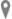

# Synopsis van het lijdensverhaal in toneelvorm

# ZESDE BEDRIJF

<table class="MsoNormalTable" style="width: 470.0pt; border-collapse: collapse;" border="0" width="627" cellspacing="0" cellpadding="0"><tbody><tr><td style="width: 100.0pt; padding: 0pt 5.4pt 12.0pt 5.4pt;" valign="top" width="133">
8 &nbsp;rollen met tekst
</td><td style="width: 270.0pt; padding: 0pt 5.4pt 12.0pt 5.4pt;" valign="top" width="360">
Omstaander - Hogepriesters - Goede moordenaar - Slechte&nbsp;moordenaar - Jezus - Centurio - Jozef van Arimatea - Pilatus
</td><td style="width: 100.0pt; padding: 0pt 5.4pt 12.0pt 5.4pt;" valign="bottom" width="133">
&nbsp;
</td></tr><tr><td style="width: 100.0pt; padding: 0pt 5.4pt 12.0pt 5.4pt;" valign="top" width="133">
&nbsp;figuranten
</td><td style="width: 270.0pt; padding: 0pt 5.4pt 12.0pt 5.4pt;" valign="top" width="360">
Maria - Johannes - Wachters
</td><td style="width: 100.0pt; padding: 0pt 5.4pt 12.0pt 5.4pt;" valign="bottom" width="133">
&nbsp;
</td></tr><tr><td style="width: 100.0pt; padding: 0pt 5.4pt 12.0pt 5.4pt;" valign="top" width="133">
&nbsp;locatie
</td><td style="width: 270.0pt; padding: 0pt 5.4pt 12.0pt 5.4pt;" valign="top" width="360">
Op Golgotha
</td><td style="width: 100.0pt; padding: 0pt 5.4pt 12.0pt 5.4pt;" valign="bottom" width="133">
&nbsp;
</td></tr><tr><td style="width: 100.0pt; padding: 0pt 5.4pt 12.0pt 5.4pt;" valign="top" width="133">
Omstaander
</td><td style="width: 270.0pt; padding: 0pt 5.4pt 12.0pt 5.4pt;" valign="top" width="360">
Jij was toch de man die de tempel kon afbreken en in drie&nbsp;dagen weer opbouwen? Als je de Zoon van God bent, red jezelf dan maar en kom&nbsp;van dat kruis af!
</td><td style="width: 100.0pt; padding: 0pt 5.4pt 12.0pt 5.4pt;" valign="bottom" width="133">
Mt 27:40
</td></tr><tr><td style="width: 100.0pt; padding: 0pt 5.4pt 12.0pt 5.4pt;" valign="top" width="133">
Hogepriesters
</td><td style="width: 270.0pt; padding: 0pt 5.4pt 12.0pt 5.4pt;" valign="top" width="360">
Anderen heeft hij gered, maar zichzelf redden kan hij&nbsp;niet; laat die messias, die koning van Israël, nu van het kruis afkomen. Als&nbsp;we dat zien, zullen we geloven! Hij heeft zijn vertrouwen in God gesteld,&nbsp;laat die hem nu dan redden, als hij hem tenminste goedgezind is. Hij heeft&nbsp;immers gezegd: “Ik ben de Zoon van God.”
</td><td style="width: 100.0pt; padding: 0pt 5.4pt 12.0pt 5.4pt;" valign="bottom" width="133">
Mc 15:31-32, Mt 27:43
</td></tr><tr><td style="width: 100.0pt; padding: 0pt 5.4pt 12.0pt 5.4pt;" valign="top" width="133">
Goede moordenaar
</td><td style="width: 270.0pt; padding: 0pt 5.4pt 12.0pt 5.4pt;" valign="top" width="360">
Jij bent toch de messias? Red jezelf dan en ons erbij!
</td><td style="width: 100.0pt; padding: 0pt 5.4pt 12.0pt 5.4pt;" valign="bottom" width="133">
Lc 23:39
</td></tr><tr><td style="width: 100.0pt; padding: 0pt 5.4pt 12.0pt 5.4pt;" valign="top" width="133">
Slechte moordenaar
</td><td style="width: 270.0pt; padding: 0pt 5.4pt 12.0pt 5.4pt;" valign="top" width="360">
Heb jij dan zelfs geen ontzag voor God nu je dezelfde&nbsp;straf ondergaat? Wij hebben onze straf verdiend en worden beloond naar onze&nbsp;daden. Maar die man heeft niets onwettigs gedaan.

Jezus, denk aan mij wanneer u in uw koninkrijk komt.
</td><td style="width: 100.0pt; padding: 0pt 5.4pt 12.0pt 5.4pt;" valign="bottom" width="133">
Lc 23:40-42
</td></tr><tr><td style="width: 100.0pt; padding: 0pt 5.4pt 12.0pt 5.4pt;" valign="top" width="133">
Jezus
</td><td style="width: 270.0pt; padding: 0pt 5.4pt 12.0pt 5.4pt;" valign="top" width="360">
Ik verzeker je: nog vandaag zul je met mij in het paradijs&nbsp;zijn.
</td><td style="width: 100.0pt; padding: 0pt 5.4pt 12.0pt 5.4pt;" valign="bottom" width="133">
Lc 23:43
</td></tr><tr><td style="width: 100.0pt; padding: 0pt 5.4pt 12.0pt 5.4pt;" valign="top" width="133"></td><td style="width: 270.0pt; padding: 0pt 5.4pt 12.0pt 5.4pt;" valign="top" width="360">
<em>Jezus ziet zijn moeder staan, en bij haar de leerling&nbsp;van wie hij veel houdt.</em>
</td><td style="width: 100.0pt; padding: 0pt 5.4pt 12.0pt 5.4pt;" valign="bottom" width="133">
Joh 19:25
</td></tr><tr style="page-break-inside: avoid;"><td style="width: 100.0pt; padding: 0pt 5.4pt 12.0pt 5.4pt;" valign="top" width="133">
Jezus
</td><td style="width: 270.0pt; padding: 0pt 5.4pt 12.0pt 5.4pt;" valign="top" width="360">
Dat is uw zoon.

Dat is je moeder.
</td><td style="width: 100.0pt; padding: 0pt 5.4pt 12.0pt 5.4pt;" valign="bottom" width="133">
Joh 19:26-27
</td></tr><tr><td style="width: 370.0pt; padding: 0pt 5.4pt 12.0pt 5.4pt;" colspan="2" valign="top" width="493">

</td><td style="width: 100.0pt; padding: 0pt 5.4pt 12.0pt 5.4pt;" valign="bottom" width="133">
Crucifixion (Daniel Mitsui, © Daniel Mitsui)
</td></tr><tr><td style="width: 100.0pt; padding: 0pt 5.4pt 12.0pt 5.4pt;" valign="top" width="133">
&nbsp;
</td><td style="width: 270.0pt; padding: 0pt 5.4pt 12.0pt 5.4pt;" valign="top" width="360">
<em>Op het middaguur viel er een duisternis over het hele&nbsp;land, die drie uur aanhield.</em>
</td><td style="width: 100.0pt; padding: 0pt 5.4pt 12.0pt 5.4pt;" valign="bottom" width="133">
Mc 15:33
</td></tr><tr><td style="width: 100.0pt; padding: 0pt 5.4pt 12.0pt 5.4pt;" valign="top" width="133">
Jezus
</td><td style="width: 270.0pt; padding: 0pt 5.4pt 12.0pt 5.4pt;" valign="top" width="360">
Eloï, Eloï, lema sabachtani?
</td><td style="width: 100.0pt; padding: 0pt 5.4pt 12.0pt 5.4pt;" valign="bottom" width="133">
Mc 15:34
</td></tr><tr><td style="width: 100.0pt; padding: 0pt 5.4pt 12.0pt 5.4pt;" valign="top" width="133">
Omstaander
</td><td style="width: 270.0pt; padding: 0pt 5.4pt 12.0pt 5.4pt;" valign="top" width="360">
Hoor, hij roept Elia!
</td><td style="width: 100.0pt; padding: 0pt 5.4pt 12.0pt 5.4pt;" valign="bottom" width="133">
Mc 15:35
</td></tr><tr><td style="width: 100.0pt; padding: 0pt 5.4pt 12.0pt 5.4pt;" valign="top" width="133">
Jezus
</td><td style="width: 270.0pt; padding: 0pt 5.4pt 12.0pt 5.4pt;" valign="top" width="360">
Ik heb dorst.
</td><td style="width: 100.0pt; padding: 0pt 5.4pt 12.0pt 5.4pt;" valign="bottom" width="133">
Joh 19:28
</td></tr><tr style="page-break-inside: avoid;"><td style="width: 100.0pt; padding: 0pt 5.4pt 12.0pt 5.4pt;" valign="top" width="133">
&nbsp;
</td><td style="width: 270.0pt; padding: 0pt 5.4pt 12.0pt 5.4pt;" valign="top" width="360">
<em>Een omstaander gaat snel een spons halen, doordrenkt&nbsp;die met zure wijn, steekt de spons op een stok en probeert Jezus te laten&nbsp;drinken.</em>
</td><td style="width: 100.0pt; padding: 0pt 5.4pt 12.0pt 5.4pt;" valign="bottom" width="133">
Mc 15:36
</td></tr><tr><td style="width: 100.0pt; padding: 0pt 5.4pt 12.0pt 5.4pt;" valign="top" width="133">
Omstaander
</td><td style="width: 270.0pt; padding: 0pt 5.4pt 12.0pt 5.4pt;" valign="top" width="360">
Laten we eens kijken of Elia komt om hem eraf te halen.
</td><td style="width: 100.0pt; padding: 0pt 5.4pt 12.0pt 5.4pt;" valign="bottom" width="133">
Mc 15:36
</td></tr><tr><td style="width: 100.0pt; padding: 0pt 5.4pt 12.0pt 5.4pt;" valign="top" width="133">
Jezus
</td><td style="width: 270.0pt; padding: 0pt 5.4pt 12.0pt 5.4pt;" valign="top" width="360">
Vader, het is volbracht, in uw handen leg ik mijn geest.
</td><td style="width: 100.0pt; padding: 0pt 5.4pt 12.0pt 5.4pt;" valign="bottom" width="133">
Joh 19:30, Lc 23:46
</td></tr><tr><td style="width: 100.0pt; padding: 0pt 5.4pt 12.0pt 5.4pt;" valign="top" width="133"></td><td style="width: 270.0pt; padding: 0pt 5.4pt 12.0pt 5.4pt;" valign="top" width="360">
<em>Op dat moment scheurt in de tempel het voorhangsel van&nbsp;boven tot onder in tweeën, en de aarde beeft en de rotsen splijten.</em>
</td><td style="width: 100.0pt; padding: 0pt 5.4pt 12.0pt 5.4pt;" valign="bottom" width="133">
Mt 27:51-53
</td></tr><tr><td style="width: 100.0pt; padding: 0pt 5.4pt 12.0pt 5.4pt;" valign="top" width="133">
Centurio
</td><td style="width: 270.0pt; padding: 0pt 5.4pt 12.0pt 5.4pt;" valign="top" width="360">
Werkelijk, deze mens was Gods Zoon.
</td><td style="width: 100.0pt; padding: 0pt 5.4pt 12.0pt 5.4pt;" valign="bottom" width="133">
Mc 15:39
</td></tr><tr><td style="width: 100.0pt; padding: 0pt 5.4pt 12.0pt 5.4pt;" valign="top" width="133">
&nbsp;
</td><td style="width: 270.0pt; padding: 0pt 5.4pt 12.0pt 5.4pt;" valign="top" width="360">
Bij Pilatus
</td><td style="width: 100.0pt; padding: 0pt 5.4pt 12.0pt 5.4pt;" valign="bottom" width="133">
&nbsp;
</td></tr><tr><td style="width: 100.0pt; padding: 0pt 5.4pt 12.0pt 5.4pt;" valign="top" width="133">
Jozef van Arimatea
</td><td style="width: 270.0pt; padding: 0pt 5.4pt 12.0pt 5.4pt;" valign="top" width="360">
Geeft u toestemming om het lichaam van Jezus van het kruis&nbsp;te nemen?
</td><td style="width: 100.0pt; padding: 0pt 5.4pt 12.0pt 5.4pt;" valign="bottom" width="133">
Mc 15:43
</td></tr><tr><td style="width: 100.0pt; padding: 0pt 5.4pt 12.0pt 5.4pt;" valign="top" width="133">
Pilatus
</td><td style="width: 270.0pt; padding: 0pt 5.4pt 12.0pt 5.4pt;" valign="top" width="360">
Is Jezus al gestorven?
</td><td style="width: 100.0pt; padding: 0pt 5.4pt 12.0pt 5.4pt;" valign="bottom" width="133">
Mc 15:44
</td></tr><tr><td style="width: 100.0pt; padding: 0pt 5.4pt 12.0pt 5.4pt;" valign="top" width="133">
Centurio
</td><td style="width: 270.0pt; padding: 0pt 5.4pt 12.0pt 5.4pt;" valign="top" width="360">
Mijn soldaten zagen dat Jezus al gestorven was. Daarom&nbsp;braken ze zijn benen niet. Maar een van de soldaten stak een lans in zijn zij&nbsp;en meteen vloeide er bloed en water uit.
</td><td style="width: 100.0pt; padding: 0pt 5.4pt 12.0pt 5.4pt;" valign="bottom" width="133">
Joh 19:33-34
</td></tr><tr><td style="width: 100.0pt; padding: 0pt 5.4pt 12.0pt 5.4pt;" valign="top" width="133">
Pilatus
</td><td style="width: 270.0pt; padding: 0pt 5.4pt 12.0pt 5.4pt;" valign="top" width="360">
Ik geef toestemming om het lichaam van Jezus van het kruis&nbsp;te halen.
</td><td style="width: 100.0pt; padding: 0pt 5.4pt 12.0pt 5.4pt;" valign="bottom" width="133">
Mc 15:45
</td></tr><tr><td style="width: 100.0pt; padding: 0pt 5.4pt 12.0pt 5.4pt;" valign="top" width="133">
Hogepriesters
</td><td style="width: 270.0pt; padding: 0pt 5.4pt 12.0pt 5.4pt;" valign="top" width="360">
Heer, het schoot ons te binnen dat die bedrieger, toen hij&nbsp;nog leefde, gezegd heeft: “Na drie dagen zal ik uit de dood opstaan.” Geeft u&nbsp;alstublieft bevel om het graf tot de derde dag te bewaken, anders komen zijn&nbsp;leerlingen hem heimelijk weghalen en zullen ze tegen het volk zeggen: “Hij is&nbsp;opgestaan uit de dood,” en die laatste leugen zal nog erger zijn dan de&nbsp;eerste.
</td><td style="width: 100.0pt; padding: 0pt 5.4pt 12.0pt 5.4pt;" valign="bottom" width="133">
Mt 27:63-64
</td></tr><tr><td style="width: 100.0pt; padding: 0pt 5.4pt 12.0pt 5.4pt;" valign="top" width="133">
Pilatus
</td><td style="width: 270.0pt; padding: 0pt 5.4pt 12.0pt 5.4pt;" valign="top" width="360">
U kunt bewaking krijgen. Ga nu en regel het zo goed als u&nbsp;kunt.
</td><td style="width: 100.0pt; padding: 0pt 5.4pt 12.0pt 5.4pt;" valign="bottom" width="133">
Mt 27:65
</td></tr><tr><td style="width: 100.0pt; padding: 0pt 5.4pt 12.0pt 5.4pt;" valign="top" width="133">
&nbsp;
</td><td style="width: 270.0pt; padding: 0pt 5.4pt 12.0pt 5.4pt;" valign="top" width="360">
Bij het graf
</td><td style="width: 100.0pt; padding: 0pt 5.4pt 12.0pt 5.4pt;" valign="bottom" width="133">
&nbsp;
</td></tr><tr style="page-break-inside: avoid;"><td style="width: 100.0pt; padding: 0pt 5.4pt 12.0pt 5.4pt;" valign="top" width="133"></td><td style="width: 270.0pt; padding: 0pt 5.4pt 12.0pt 5.4pt;" valign="top" width="360">
<em>Josef neemt het lichaam mee, wikkelt het in zuiver&nbsp;linnen en legt het in het nieuwe rotsgraf dat hij voor zichzelf had laten&nbsp;uithouwen. Hij rolt een grote steen voor de ingang van het graf en vertrekt.</em>
</td><td style="width: 100.0pt; padding: 0pt 5.4pt 12.0pt 5.4pt;" valign="bottom" width="133">
Mt 27:59-60
</td></tr><tr><td style="width: 100.0pt; padding: 0pt 5.4pt 12.0pt 5.4pt;" valign="top" width="133"></td><td style="width: 270.0pt; padding: 0pt 5.4pt 12.0pt 5.4pt;" valign="top" width="360">
<em>De hogepriesters gaan naar het graf en beveiligen het&nbsp;door het te verzegelen en er bewakers voor te zetten.</em>
</td><td style="width: 100.0pt; padding: 0pt 5.4pt 12.0pt 5.4pt;" valign="bottom" width="133">
Mt 27:66
</td></tr><tr><td style="width: 370.0pt; padding: 0pt 5.4pt 12.0pt 5.4pt;" colspan="2" valign="top" width="493">

</td><td style="width: 100.0pt; padding: 0pt 5.4pt 12.0pt 5.4pt;" valign="bottom" width="133">
No. 36 Scenes from the Life of Christ: 20. Lamentation (The Mourning of Christ) (Giotto, 1304 - 1306, Cappella degli Scrovegni, Padua)
</td></tr></tbody></table>

# [MEER BIJBELTONEEL](/bijbeltoneel/ "Bijbeltoneel")

A.M.D.G.
