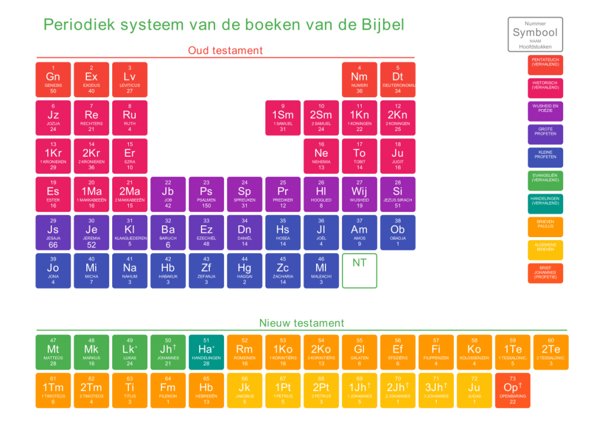

 Protestants Periodiek Systeem

Op Pinterest hou ik een [bord bij met katholieke infografieken](https://www.pinterest.com/vicmortelmans/catholic-infographics/) (Catholic Infographics). Onlangs trof ik een "[Periodiek Systeem van de Bijbel](http://www.creatov.nl/2011/11/periodiek-systeem-van-de-bijbel/)" aan: de boeken van de bijbel gerangschikt in een schema dat veel weg heeft van de tabel van Mendeljev, ook bekend als het periodiek systeem van de elementen.

Ik vermoed dat scheikundigen in de loop van de geschiedenis heel wat robbertjes hebben gevochten om de tabel te vervolledigen of ontdekte elementen aan te vechten. Met de bijbel is dat niet anders, en spijtig genoeg was de bijbel-tabel die ik vond onvolledig, want gebaseerd op de protestantse bijbel, waarin één en ander is geschrapt.

Dus dan maar zelf aan de slag! Een beetje knoeien met [HTML](https://storage.googleapis.com/geloven-leren/printerboekjes/periodiek-systeem-van-de-bijbel.html "Periodiek Systeem HTML") en CSS met [bijbel.net](http://www.willibrordbijbel.nl/index.php?b=37) als referentie levert de layout op in de vorm van een website. Printen als [PDF](https://storage.googleapis.com/geloven-leren/printerboekjes/periodiek-systeem-van-de-bijbel.pdf "Periodiek Systeem van de boeken van de Bijbel (PDF)") en hier is een poster die, opgehangen in het vaklokaal godsdienst, elke chemieleerkracht jaloers zal maken!

 Periodiek Systeem van de boeken van de Bijbel
