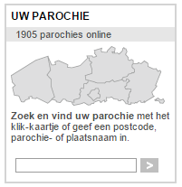
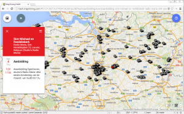

Twee weken gelden, op aswoensdag, werd de nieuwe website van Kerknet gelanceerd. Niet met veel toeters en bellen, want de website is nog niet af! Gedurende bijna een jaar zal [nieuw.kerknet.be](http://nieuw.kerknet.be) opgroeien in de schaduw van [www.kerknet.be](http://www.kerknet.be).

[![banner-kerknet-landscape[1]](images/banner-kerknet-landscape1-300x110.gif)](https://nieuw.kerknet.be/)De oude site heeft haar tijd gehad en de aankondigingen zijn veelbelovend. Mijn verwachtingen van deze website zijn dus hooggespannen! Enkele eerste indrukken en verzuchtingen op een rij, vanuit mijn eigen passie (en gebeurlijke frustratie) om van het Web een werktuig te maken voor geloofdverspreiding.

### Geografisch zoeken

 Doorn in het e-oog

Ik begin met iets dat misschien maar een detail lijkt, maar dat me altijd bijzonder geërgerd heeft op de oude Kerknet website: geografisch zoeken naar parochies. Je kan op een kaartje van Vlaanderen een bisdom aanklikken, en dan wordt je plompverloren in een online fichebak gedumpt waar je parochie per parochie (verouderde en onvolledige) informatie over de wekelijkse zondagsvieringen kan zoeken. Ronduit schandalig dat zoiets in 2015 nog bestaat.

 Eucharistische aanbidding in Vlaanderen

Nieuw Kerknet kondigt aan hiervoor een vernieuwd concept uit te werken. **Persoonlijk had ik hiervan top-prioriteit-nummer-1-met-stip gemaakt om er meteen mee uit te pakken!** Technisch vergt het slechts een kleine investering, zoals het vrijetijdsprojectje [www.maptiming.com](http://www.maptiming.com) aantoont, waarop bij wijze van _proof-of-concept_ reeds de [aanbiddingsuren](http://adoremus.maptiming.com/#51.050426,4.255035,9z,707px/all "Aanbidding in Vlaanderen") beschikbaar zijn zoals die door mevr. Vlassenbroeck verzameld worden op haar [aanbiddingswebsite](http://www.bloggen.be/aanbiddingswebsite/ "Aanbiddingswebsite"). De moeilijkheid schuilt erin de organisatie op poten te zetten om alle gegevens te verzamelen _en_ up-to-date te houden.

### Kerk en Leven > Kerknet

Het grootste deel van de kerkelijke agendainformatie is nochtans reeds kant-en-klaar beschikbaar! [_Kerk en Leven_](https://www.kerknet.be/organisatie/kerk-leven) (het 'parochieblad') heeft een netwerk van correspondenten die wekelijks parochieagenda's verzamelen en doorspelen aan de redactie voor publicatie in de lokale edities. Hoe moeilijk kan het zijn die informatiestroom te kanaliseren naar een centrale databank waaruit zowel nieuw Kerknet als de redactie van Kerk en Leven gegevens kunnen ophalen?

Benieuwd of nieuw Kerknet die informatiestroom zal kunnen aanboren, of beter nog: usurperen!

### Crowdsourcing

Crowdsourcing is een manier om gegevens te verzamelen door gewone gebruikers toe te laten rechtstreeks data toe te voegen of te wijzigen, zonder echt deel uit te maken van een redactie. **Dat kan een middel zijn om blinde vlekken in te vullen, maar dan is een _mindswitch_ noodzakelijk!** Ik heb het concept ooit eens voorgesteld aan een kerkelijk gezagsdrager, die meteen in het harnas kroop, bang dat er ongecontroleerde informatie op de website zou terechtkomen uit niet-helemaal-zo-katholieke bron. Begint het in de kerk dan toch niet "bij de basis"?

Of nieuw Kerknet op dat vlak iets zal te bieden hebben, is nog niet duidelijk, hoewel er al sprake is om parochies toe te laten een eigen 'microsite' op te zetten, da's al een eind in de richting, maar nog geen echte crowdsourcing...

### Microsites voor of tegen centralisatie?

In de praktijk is de kerk inderdaad een uiterst gedecentraliseerde organisatie. Spijtig genoeg heeft dat tot nu toe in de communicatie enkel nadelige effecten. Elke parochie bestaat vandaag op een eigen eilandje, met een eigen kramikkige websitetje en een eigen, heel klein lokaal publiekje (lees: de kennissenkring van de webmaster), want niemand weet die informatie te vinden.

Nieuw Kerknet zet in op zogenaamde 'microsites'. Dat zijn websites die inhoudelijk een eigen leven leiden met een eigen redactie, maar die technisch deel uitmaken van Kerknet met dezelfde gestroomlijnde _look-and-feel_ en ---hopelijk--- ingebed in een efficiënte navigatiestructuur. Ook federaties en parochies zullen in de toekomst een eigen microsite kunnen krijgen.

Hier zit heel veel potentieel in! **Opnieuw laat dit toe de informatiestroom die nu naar _Kerk en Leven_ vloeit gestructureerd te verwerken en aan een ruimer publiek aan te bieden.** Als de gegevens van bij de invoer semantisch getagd worden (bv. met datum, soort van activiteit, locatie, doelgroep,...), worden ze bruikbaar om ze te in de juiste context op de website te tonen. Zo kan agendainformatie op een bovenlokaal niveau geconsolideerd worden om gebruikers een overzicht tonen van wat er in naburige parochies gebeurt, zonder die een voor een te moeten aanklikken.

### Virtuele prikborden

Of beter nog: gebruikers kunnen zich in hun profiel aansluiten bij een of meerdere parochies en zo automatisch alle relevante aankondigingen ontvangen. Als een parochie een belangrijk evenement organiseert, kan dat automatisch verspreid worden via de kanalen van naburige parochies. Ben je op verplaatsing, dan zal je browser automatisch detecteren waar je bent, en informatie van de parochies in de buurt tonen. Dient er zich een bijzondere feestdag aan, dan krijgt de voorpagina een kaartje met een overzicht van de bijzondere liturgische diensten in je omgeving… bedenk het maar, en het is mogelijk!

En heeft je parochie nog zo'n ouderwets prikbord bij het portaal, waarom zou Kerknet dan niet zorgen dat je in één moeite een wekelijks programma kan afdrukken vanuit de website om daar uit te hangen? De gegevens zitten er toch al in. Maptiming heeft daarvan al een [prototype](http://adoremus.maptiming.com/qr/location/sint-jacobskerk-lange-nieuwstraat-73-2000-antwerp-belgium)!

**Als het een beetje doordacht wordt aangepakt, bouw je hiermee een droom van een communicatieplatform.** De technische know-how wordt gecentraliseerd, want je vindt niet in elke parochie een HTML-specialist die een website kan onderhouden. De verantwoordelijkheid voor de gegevens ligt bij de basis, want daar speelt de agenda zich af, maar de gegevens worden wel centraal geconsolideerd zodat iedereen ze kan gebruiken en een varieteit van presentatiemogelijkheden! Een tussenliggend netwerk van moderatoren kan zorgen voor controle, stroomlijning en vervollediging van de gegevens.

### Van professionals naar liefhebbers

Als ik op de oude website van Kerknet rondblader, valt me op dat die voornamelijk gericht is op _professionals:_ gelovigen die op een of andere manier al dan niet vrijwillig actief zijn in de kerk. Een bezoeker die de kerk niet van binnen kent zal op de oude site snel verloren lopen en zonder voorkennis geen antwoord vinden op heel concrete geloofsvragen.

De nieuwe site geeft alvast de indruk zich meer te richten op de leefwereld van een 'gewone' gelovige of bijna-gelovige. Er is nu nog maar een fractie van de inhoud beschikbaar, dus het blijft afwachten of de redactie die focus aanhoudt.

### Gelieve mij te evangeliseren!

De oude Kerknetsite presenteert zich voornamelijk als een nieuwssite. Op zich is daar niks mis mee, want als er in de mainstream media al berichten over kerk en geloof verschijnen, zijn die zelden objectief. Nieuws mag echter niet de _core business_ van de website van de Kerk zijn, laat dat maar aan de _Kerk-en-Levens_ en de _Tertio's_ over! **De Kerk heeft de evangelisering als eerste en voornaamste doelstelling.** Gelovigen faciliteren om dagelijks hun geloof te beleven en bijna-gelovigen fascinerend geloofsmateriaal aanbieden.

Nieuw Kerknet doet daarvoor beroep op de jezuieten. Die hebben al geruime tijd het internetapostolaat als focuspunt en hun projecten worden nu ingebed op Kerknet als microsites. Je vindt er al [StartDeStilte.be](http://startdestilte.be), de [40-dagenretraite Eeuwig duurt zijn trouw](http://www.ignatiaansbidden.org/) en de andere [websites en blogs van de Vlaamse en Nederlandse jezuieten](https://nieuw.kerknet.be/organisatie/jezu%C3%AFeten).

Maar dat kan natuurlijk nog beter! De belangrijkste vorm van gebed is de eucharistie. Waarom dan geen microsite met een online missaal? De vaste gebeden en de lezingen. Eventueel met doorklikmogelijkheid naar achtergrondinformatie over de liturgie. **Voor iemand die niet weet wat het woord "missaal" betekent, maar wel gefascineerd is door wat er in de mis gebeurt, zal het een geweldige _teaser_ zijn.**  Het zal misschien ook helpen om in Vlaanderen terug een liturgische standaard voorop te stellen, dus dat is mooi meegenomen.

Ik ken nog tal van websites met materiaal voor gebed, bezinning en catechese die als microsite op nieuw Kerknet niet zouden misstaan en bewaar ze in afwachting op [alledaags.gelovenleren.net](http://alledaags.gelovenleren.net) :)

### Mobiel en sociaal

Nog twee laatste puntjes, die niet onbelangrijk zijn. Nieuw Kerknet is nu ook bruikbaar op smartphone en tablet en zet in op de sociale netwerken van facebook, twitter en google+ om zichzelf bekend te maken, maar eerlijk gezegd, dat is nogal vanzelfsprekend. Een blogje is ook een stukje sociaal netwerk, dus bij deze: veel geluk voor de redactie!
