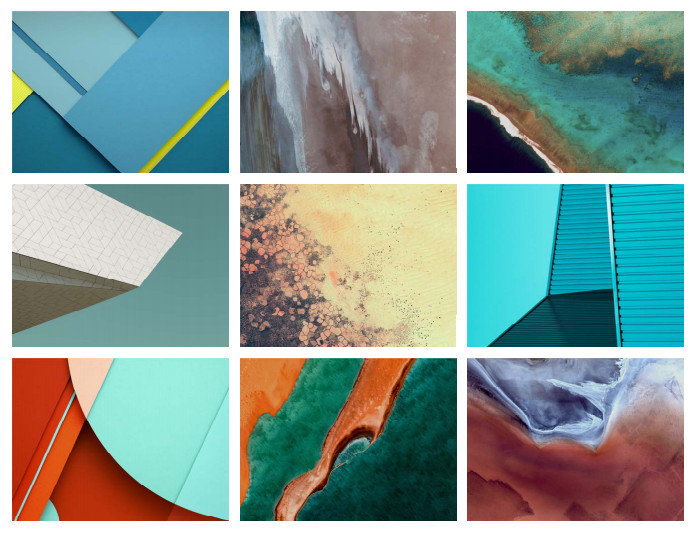
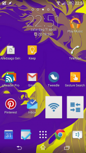
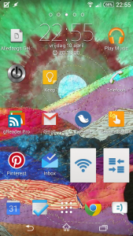
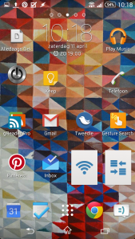
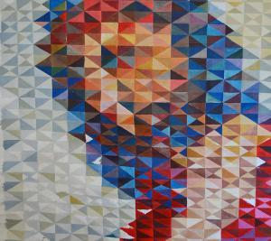
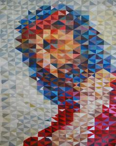

Als slaaf van het consumentisme heb ik een nieuwe telefoon gekocht, terwijl de [oude](/blog/de-navolging-van-christus-als-e-boek/ "De Navolging van Christus als e-boek") nog perfect werkt. Hij was wel traag, incompatibel met de laatste versies van sommige apps en vol: elke keer als ik een nieuwe app wil installeren, moet ik van mijn hart een steen maken en plaats maken door een paar andere apps te verwijderen. Afgewogen met de tijd die ik op mijn telefoon spendeer (en dat is nauwelijks telefonie) en de dagelijkse dosis ergernis die het oude ding teweegbrengt, is de investering wel te verantwoorden, niet?

Hoewel ik heb uitgekeken naar een model dat ondanks high-end specs toch handelbaar blijft in grootte, valt de nieuwe telefoon toch wat groter uit dan mijn eerste model. De Sony Z1 Compact heeft een scherm van 4.3 inch (mijn oude Xperia Miro was iets van een 3.5 inch, denk ik) en heeft ook een andere aspect ratio. Dat laatste maakt dat mijn [oude vertouwde wallpaper](/blog/android-wallpaper-voor-het-heilig-hart/) niet meer goed past op de nieuwe telefoon: Jezus en Maria vallen half van het scherm.

Ik zou de oude wallpaper kunnen herschalen om op het nieuwe scherm te passen, maar het probleem is dat mijn telefoon volgende week wordt ge-upgraded naar [Android Lollipop](http://www.android.com/versions/lollipop-5-0/ "Android Lollipop"). Voor leken zoals u, waarde lezer, betekent dat wellicht niets, maar deze upgrade zal Google's Material Design introduceren in het Android operating system! [Material Design](http://www.google.com/design/spec/material-design/introduction.html), dat is de grafische ontwerpstijl die Google vorig jaar [voorstelde](http://www.theverge.com/2014/6/25/5841044/material-design-new-google-interface-2014 "Material Design is Google's new visual look for Android, Chrome OS, and more") en nu stap voor stap implementeert in alle tools (en die u trouwens ook in de opmaak van dit blog herkent). En die oude wallpaper met dat diepe zwart, het grijze bloempjesmotief en daarbovenop met een gouden aura de afbeeldingen van de heilige harten van Jezus en Maria, dat is toch he-le-maal geen Material Design, kan-echt-niet!

Dit zijn enkele voorbeelden van wallpapers die geschikt bevonden worden voor een Material Design-telefoon:

 Lollipop wallpapers

De filosofie van Material Design is het ontwerp van een website of een app te modelleren op basis van papier [(of iets dat erop lijkt)](http://www.google.com/design/spec/what-is-material/material-properties.html#material-properties-physical-properties). Papier heb je in verschillende kleuren of met een foto erop, kan je verknippen, in verschillende lagen op mekaar leggen, verschuiven, draaien enz. Heel herkenbaar in Material Design zijn dan ook de strakke kleuroppervlakken, veel witruimte rond tekst, sobere vormgeving met rechte lijnen en cirkels, eigenlijk een [remake](https://medium.com/@smpetrey/the-new-bauhaus-and-material-design-ee03273c7882) van de Duitse [Bauhausstijl](http://www.bauhaus.de/de/bauhaus-archiv/) uit het interbellum.

 

Even grasduinen in de beeldenset van [missale.net](http://www.missale.net/nl), levert me drie (min-of-meer) kandidaat-afbeeldingen op, die ik meteen op mijn gsm heb getest (nu nog met Android kitkat):

 Madonna and child (Vascotto V., 2012, © Vascotto V.)

 A voice in the wilderness (Lorie McCown, 2012, © Lorie McCown)

 Ecce Homo

Van dat laatste werk is me de herkomst onbekend, maar het geometrische patroon past op wonderbaarlijke wijze precies op het rooster waarin de ikonen van de apps op het thuisscherm gerangschikt zijn! Zelfs als je naar links en rechts schuift en de achtergrond verschuift tov. de ikonen, blijft de uitlijning van het patroon perfect bewaard. Hoewel ik eigenlijk op zoek was naar een donkerder afbeelding omwille van de zichtbaarheid van de ikonen, blijkt mijn keuze van Hogerhand bepaald :)

Hier heeft u de wallpaper "Ecce Homo" voor eigen gebruik op een telefoon met een scherm van 1280 bij 720 pixels (klik op de afbeelding om te downloaden):

 Ecce Homo bijgesneden als Android wallpaper

Zo ziet het originele werk eruit:

 Ecce Homo
