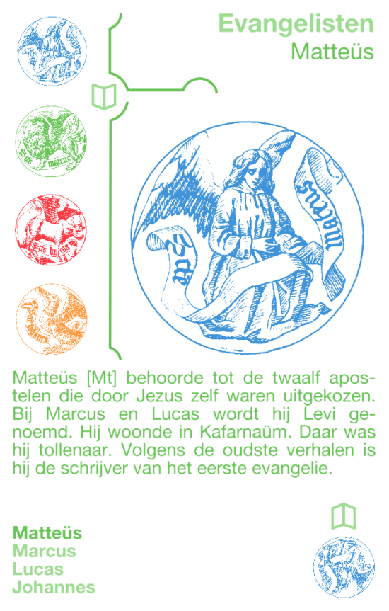
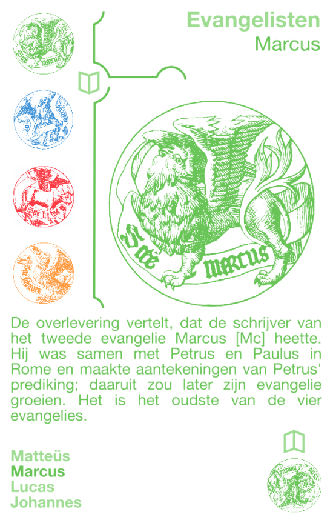
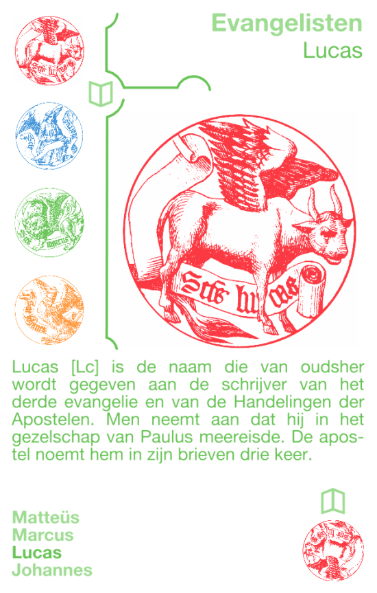
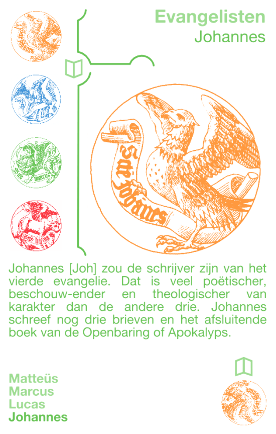

Katholiek Kwartetten is een kwartetspel met als thema het katholieke geloof. Dit artikel introduceert het derde kwartet, dat de vier evangelisten bevat.

### Katholiek Kwartetten

[KATHOLIEK KWARTETTEN - ZELF AFDRUKKEN of BESTELLEN](/katholiek-kwartetten/ "Katholiek Kwartetten") leer hoe je de kaarten zelf kan afdrukken en download alle kaarten als PDF of bestel een spel online.

[KATHOLIEK KWARTETTEN ONLINE](/blog/katholiek-kwartetten/ "Katholiek Kwartetten met online kwis") leer meer over de website die gekoppeld is aan de kwartetkaarten en over de online spelmodus met kwis, die dit kwartet wel heel bijzonder maakt!

### Evangelisten

**Matteüs**

Matteüs behoorde tot de twaalf apostelen die door Jezus zelf waren uitgekozen. Bij Markus en Lukas wordt hij Levi genoemd. Hij woonde in Kafarnaüm. Daar was hij tollenaar. Volgens de oudste verhalen is hij de schrijver van het eerste evangelie.

**Marcus**

De overlevering vertelt, dat de schrijver van het tweede evangelie Markus heette. Hij was samen met Petrus en Paulus in Rome en maakte aantekeningen van Petrus' prediking; daaruit zou later zijn evangelie groeien. Het is het oudste van de vier evangelies.

**Lucas**

Lucas is de naam die van oudsher wordt gegeven aan de schrijver van het derde evangelie en van de Handelingen der Apostelen. Men neemt aan dat hij de Lucas was die in het gezelschap van Paulus meereisde. De apostel noemt hem in zijn brieven drie keer.

**Johannes**

Johannes zou de schrijver zijn van het vierde evangelie. Dat is veel poëtischer, beschouwender en theologischer van karakter dan de andere drie. Johannes schreef nog drie brieven en het afsluitende boek van de Openbaring of Apokalyps.
