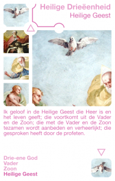

Katholiek Kwartetten is een kwartetspel met als thema het katholieke geloof. Het is een klassiek educatief kwartetspel met 52 kaarten (13 kwartetten) met elk hun eigen catechetisch onderwerp, een prent en beknopte informatie. Het is de bedoeling dat het spel later wordt uitgebreid met nieuwe katholieke thema's en onderwerpen! Ideaal om te gebruiken als tussendoortje bij catechese voor de eerste communie of het vormsel, thuis of op school.

Dit artikel introduceert de eerste twee kwartetten, die handelen over de Goddelijke Drie-eenheid en de Hemelse wezens, de Engelen.

### Katholiek Kwartetten

[KATHOLIEK KWARTETTEN - ZELF AFDRUKKEN of BESTELLEN](/katholiek-kwartetten/ "Katholiek Kwartetten") leer hoe je de kaarten zelf kan afdrukken en download alle kaarten als PDF of bestel een spel online.

[KATHOLIEK KWARTETTEN ONLINE](/blog/katholiek-kwartetten/ "Katholiek Kwartetten met online kwis") leer meer over de website die gekoppeld is aan de kwartetkaarten en over de online spelmodus met kwis, die dit kwartet wel heel bijzonder maakt!

### Heilige Drie-eenheid

**Drie-ene God**

De Drie-eenheid is één. Wij belijden geen drie goden, maar één God in drie personen. Elk van hen is geheel God: "De Vader is hetzelfde wat de Zoon is, de Zoon hetzelfde wat de Vader is, de Vader en de Zoon zijn hetzelfde wat de heilige Geest is: één God van nature".

**Vader**

Ik geloof in één God de almachtige Vader, Schepper van hemel en aarde, van al wat zichtbaar en onzichtbaar is.

**Zoon**

Ik geloof in één Heer, Jezus Christus, eniggeboren Zoon van God, vóór alle tijden geboren uit de Vader. God uit God, licht uit licht, ware God uit de ware God. Geboren, niet geschapen, één in wezen met de Vader, en door wie alles geschapen is.

**Heilige Geest**

Ik geloof in de Heilige Geest die Heer is en het leven geeft; die voortkomt uit de Vader en de Zoon; die met de Vader en de Zoon tezamen wordt aanbeden en verheerlijkt; die gesproken heeft door de profeten.

### Engelen

**Michaël**

Michaël verdedigt de zaak van de ene God tegen de pogingen van de slang om de mensen te doen geloven dat God moet verdwijnen, opdat zij groot kunnen worden; dat God onze vrijheid in de weg staat en dat wij ons daarom van Hem moeten ontdoen.

**Rafaël**

Rafaël geneest in het Boek Tobit de verstoorde gemeenschap tussen man en vrouw. Hij verjaagt de demonen die steeds weer opnieuw hun liefde verscheuren en vernietigen. Hij geeft hun het vermogen elkaar voor altijd te aanvaarden.

**Gabriël**

Gabriël is de boodschapper van de vleeswording van God. Hij klopt aan de deur van Maria aan en door zijn bemiddeling vraagt God zelf aan Maria haar "ja" op het voorstel de Moeder te worden van de Verlosser: haar menselijk vlees te geven aan de Zoon van God.

**Engelbewaarder**

Dat is wat wij aan de engelbewaarder vragen in het bekende gebed uit de katholieke volksvroomheid: “Engel van God, die mijn bewaarder zijt, aan wie de goddelijke goedheid mij heeft toevertrouwd verlicht, bewaar, geleid en bestuur mij. Amen”.
