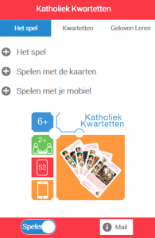
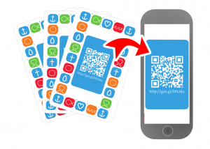

Je hebt al enkele kaartensets uit _Katholiek Kwartetten_ zien passeren op dit blog. Wist je dat dit spel ook een **online spelvariant** heeft? Die maakt het spel inhoudelijker, want of je een kwartet scoort hangt nu af van het lot _of van jouw kennis van het geloof!_ 

### Wat heb je nodig

 Screenshot van de website met de schakelaar op "Spelen"

- **het kaartspel**. Je kan de [kaarten zelf afdrukken of online bestellen](/page/katholiek-kwartetten/ "Katholiek Kwartetten"). Als je zelf je kwartetten afdrukt mag je kiezen welke kwartetten je gebruikt. Je hoeft ze niet alle 13 te gebruiken, en als er later nieuwe kwartetten worden gepubliceerd mag je die ook toevoegen. Eigenlijk zorg je best dat iedere speler 10 tot 15 kaarten heeft na het uitdelen.
- **een mobieltje** met internettoegang, een camera en een QR-scanner-app. Iedereen mag desgewenst ook zijn eigen mobieltje gebruiken. Heb je nog geen app om QR-codes te scannen, installeer dan NeoReader: [Google Play](https://play.google.com/store/apps/details?id=de.gavitec.android&hl=nl) - [iTunes](https://itunes.apple.com/us/app/neoreader-qr-mobile-barcode/id284973754?mt=8)
- **maak een mobiel of tablet speelklaar** door de [website](http://kwartet.gelovenleren.net/ "Katholiek Kwartetten") te bezoeken en de schakelaar onderaan de welkomstpagina op 'spelen' te zetten.

 

### De spelregels

Je speelt het spel volgens de gewone spelregels, maar om de laatste kaart van een kwartet te bemachtigen, grijp je je mobiel!

 Scan de rugzijde van één van jouw kaarten met je mobiel.

Leg de drie kaarten van je onvolledig kwartet gedekt op tafel. Je vertelt over welk kwartet het gaat, zodat ook de speler die de vierde kaart heeft, die gedekt op tafel kan leggen. Open de QR-scanner en scan de code op een van jouw kaarten. Leg je mobiel nu zichtbaar op tafel. Je mobiel zal je een van de kaarten uit het kwartet tonen, of een van de godsbeelden.

Als **één van jouw drie kaarten** getoond wordt, dan mag jij het kwartet afleggen, samen met de vierde kaart. Is het de **vierde kaart**, dan mag de andere speler het kwartet afleggen en is hij aan de beurt.

Als je een **godsbeeld** krijgt, dan gelden volgende regels:

**Liefdevolle God**

Beide spelers leggen twee kaarten van het kwartet af en verdienen een punt. Je blijft aan de beurt.

**Toornige God**

De gramschap van God valt over jou. De speler met de vierde kaart mag het kwartet afleggen en is aan de beurt.

**Almachtige God**

Het kwartet blijft in de pot en jij bent aan de beurt. Wie het volgende kwartet vervolledigt, wint ook de kwartetten in de pot.

**Barmhartige God**

Het oordeel wordt opgeschort. Je krijgt een tweede kans. Je mag je kaart nog eens scannen.

**Rechtvaardige God**

Op het mobiel staat een vraag die je moet beantwoorden om het kwartet te winnen. Heb je het antwoord juist, dan mag je het kwartet afleggen. Anders toon je de tweede vraag en mag de speler met de vierde kaart een juist antwoord proberen geven om het kwartet te winnen en dan is hij aan de beurt. Weet geen van beiden het juiste antwoord, blijft het kwartet in de pot en ben je opnieuw aan de beurt. Wie het volgende kwartet vervolledigt, wint ook de kwartetten in de pot.

### De kwisvragen

Tref je de rechtvaardige God, dan moet je een kwisvraag proberen te beantwoorden om te winnen. Om het spel voor iedereen uitdagend te houden, zijn er verschillende niveaus van kwisvragen. Je spreekt best op voorhand af welk niveau je gaat gebruiken en als er spelers zijn van verschillende leeftijden, kan iedereen een aangepast niveau kiezen.

1. Een vraag uit het kwartet
2. Een vraag uit de catechismus (leerjaar 1-2)
3. Een vraag uit de catechismus (leerjaar 3-4)
4. Een vraag uit de catechismus (leerjaar 5-7)

De vragen uit het kwartet zijn weetjes die ergens in het kwartetspel zijn opgenomen. De drie moeilijkere vragenreeksen komen uit de _Mechelse Catechismus_ en de aangegeven moeilijkheidsgraad zijn de leerjaren waaruit de vragen genomen worden (tip: download de [app](https://play.google.com/store/apps/details?id=net.credomobiel.mechelsecatechismus "Mechelse Catechismus") om je kennis te oefenen!).

Het is aan de spelers onderling om te bepalen wanneer een vraag juist is beantwoord. De website toont je het juiste antwoord als referentie.
