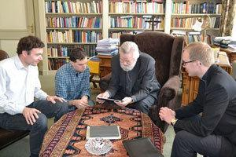
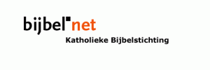
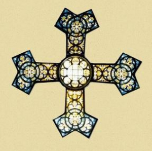

De katholieke kerk begint eindelijk schoorvoetend aan te schuiven aan de oprit naar de informatiesnelweg! Al jarenlang loopt iedereen met een smartphone op zak en hebben de meeste gezinnen thuis één of meerdere tablets op de salontafel liggen om te internetten, spelletjes te spelen, boeken te lezen en tussendoor nog wat te werken. Om van computers nog maar te zwijgen. Maar onze heilige moeder de Kerk, zij stond erbij en keek ernaar en liet heel dit mediakanaal links liggen.

### Keurmerk

U zal wel zeggen: dat is niet waar, want er zijn al jarenlang talloze katholieke websites online waar je heel wat voeding voor je geloof kan vinden. Dat is zo, maar heb je je al eens afgevraagd hoe katholiek zo'n website is? Neem [mijn eigen blog](http://gelovenleren.net/ "Geloven Leren"), waar ---mag ik het zelf zeggen?--- heel wat praktische geloofshulpmiddelen te vinden zijn... de gewaardeerde gebruiker heeft echter helemaal geen garantie dat wat hij hier vindt, strookt met de leer van de katholieke Kerk. Een ander voorbeeld: de Nederlandse website [www.katholiek.nl](http://www.katholiek.nl/neem-contact-met-ons-op/ "katholiek.nl")... wordt gerund door een of andere stichting die ---tenzij de website het verzwijgt--- niet onder de verantwoordelijkheid van de katholieke Kerk valt. De Kerk zelf, dat zijn dus in de eerste plaats de bisschoppen, hebben tot nu toe bitter weinig initiatief getoond om het geloof op de internetsnelweg te loodsen. En evangelisering is nochtans hun eerste en voornaamste taak!

\[caption id="attachment\_1162" align="alignright" width="300"\] Mgr. Punt stelt met een druk op de knop de getijdengebedapp beschikbaar\[/caption\]

Vandaag verschijnt het [Getijdengebed als app op Android](https://play.google.com/store/apps/details?id=org.tiltenberg.Getijdengebed "Getijdengebed") en [iOS](https://itunes.apple.com/us/app/getijdengebed/id979697799?mt=8&at=&ct=&ign-mpt=uo%3D6 "Getijdengebed") en brengt het dagelijks morgengebed, middaggebed, avondgebed, dagsluiting en lezingendienst van de katholieke Kerk op je telefoon. Op zich niet veel nieuws, want als [website](http://www.tiltenberg.org/getijdengebed/login.php "Getijdengebed") is het getijdenboek al jarenlang beschikbaar. Wat me wel opvalt is de expliciete bisschoppelijke goedkeuring die aan de publicatie is gehecht: _"Concordat cum originali, + Jozef M. Punt, Harlemi 02.02.09"_. Aan de datum kan je zien dat ook de website reeds dit zegel droeg, maar nu wordt er toch nog eens extra de nadruk op gelegd, door ook in de [lanceringscampagne](http://www.katholiekgezin.nl/index.php?option=com_content&task=view&id=3023 "Getijdengebed als app") de bisschop te betrekken.

U zal nu weer iets zeggen: dat is toch helemaal uit de tijd, zo'n _concordat_, _imprimatur_ of _nihil obstat_, straks moeten we terug de _index (librorum prohibitorum)_ invoeren! En weerom heeft u gelijk. Toch is voor katholieke gelovigen zo'n bisschoppelijke goedkeuring een belangrijk keurmerk. De eerder aangehaalde voorbeelden illustreren hoe eender welke onverlaat op internet met het etiket 'katholiek' op de loop kan gaan om zijn allerindividueelste mening te ventileren. Als die 'onverlaat' [toevallig een priester is](http://dagelijksevangelie.org/whoarewe/NL/ "Tweeting with God"), is dat slechts mooi meegenomen :)

### Katholieke referentiewebsites

Om het maar even bij mijn allerindividueelste mening te houden: het is hoog tijd dat de katholieke Kerk een visie uitwerkt over wat ze met haar belangrijkste geloofsdocumenten op het internet aan wil. Even op een rijtje:

**De katholieke bijbel**. Goed nieuws of slecht nieuws, de website [www.bijbel.net](http://www.bijbel.net "Bijbel") biedt de volledige katholieke Willibrordvertaling (gratis!) online aan, alsook de Nieuwe Bijbelvertaling. De website wordt echter nauwelijks onderhouden en is intussen verouderd (bijvoorbeeld: niet mobiel bruikbaar). Intussen zijn de (vernieuwde) websites met de protestantse bijbelvertalingen van het [Nederlands Bijbelgenootschap](https://www.debijbel.nl/ "Nederlands bijbelgenootschap") (deels) achter een betaalmuur gezet. Wat zal er van de katholieke bijbelvertaling geworden als die website ook ooit een facelift krijgt? De structuur van de Katholieke Bijbelstichting ontgaat me, maar ik neem aan dat de bisschoppen er wel in de pap te brokken hebben...  De [Petrus Canisiusvertaling](http://liefdeentrouwaandekerk.blogspot.be/2013/12/petrus-canisius-bijbel-via-e-sword.html "Petrus Canisius bijbelvertaling") is ook nog steeds een goeie nederlandstalige referentie en ik zou menen dat die intussen zelfs al auteursrechtenvrij is, maar de enige digitale uitgave wordt nog beschermd door de uitgever. \[2016-08 update: de [Petrus Canisiusvertaling is vanaf nu ook digitaal beschikbaar](/blog/bijbelvertaling-petrus-canisius-studiebijbel-gratis-downloaden/)!\]\[2016-09 update: de Katholieke Bijbelstichting (KBS) heeft sinds 2016 voor de Willibrordvertaling [een nieuwe website opgezet](/blog/een-nieuwe-bijbelwebsite-en-ik-wist-van-niks/) op [rkbijbel.nl](http://www.rkbijbel.nl). De oude website [bijbel.net](http://www.bijbel.net) is blijkbaar een uitdovend project\]

**Het getijdengebed**. Goed nieuws, zoals hierboven aangekondigd, wordt de website uitgebreid met een app, én met een bisschoppelijke goedkeuring van de inhoud. Merkwaardig vind ik dat zowel website als app een wachtwoord vereisen, weliswaar gratis en moeiteloos te verkrijgen. Wat is dan echter het nut daarvan? Ik kan me slechts inbeelden dat dit een amateuristische manier is om bepaalde problemen met auteursrechten te omzeilen?

**Het lectionarium**. Ook hier goed nieuws, want het [lectionarium is ook al jarenlang online als website en app](http://dagelijksevangelie.org/M/NL/ "Dagelijks Evangelie"). Dit initiatief gaat uit van een internationale organisatie, en de kerkelijke goedkeuring lijkt te komen [vanuit het vaticaan](http://dagelijksevangelie.org/whoarewe/NL/ "Dagelijks Evangelie"), dus dat zit ook wel snor.

**![logo[1]](images/logo1.png)De catechismus**. Gelukkig is de [catechismus van de katholieke kerk](http://www.rkdocumenten.nl/rkdocs/index.php?mi=600&doc=1 "Catechismus") ook integraal online beschikbaar, en wel op de onovertroffen documentatiewebsite [www.rkdocumenten.nl](http://www.rkdocumenten.nl "RKDocumenten"). De kerkelijke achtergrond van de [stichting Interkerk](http://interkerk.nl/ "Stichting Interkerk") is niet helemaal duidelijk, maar wijst in de richting van de bisschop van Rotterdam als het over de inhoudelijke kant van de publicaties gaat.

**Het missaal**. Geen spoor van enig initiatief om het missaal online te zetten. Mijn vermoeden: de bisschoppen zijn er bang van, omdat parochies die het Romeins missaal gebruiken zeldzaam zijn en ze schermen intern wellicht met het argument dat er een nieuwe vertaling in aantocht is... welnu: laten ze die dan maar meteen voluit online zetten, zodat elke gelovige kan zien dat er wel degelijk een liturgische standaard bestaat in onze Kerk!

> Laten de bisschoppen die nieuwe vertaling van het missaal dan maar meteen voluit online zetten, zodat elke gelovige kan zien dat er wel degelijk een liturgische standaard bestaat in onze Kerk!

 

 

Alles bijeen is er dus best al veel materiaal beschikbaar, maar de manier waarop geeft de indruk dat er geen coherent plan aan de basis van de publicaties ligt. Veel initiatieven zien _en stoemelings_ het licht en krijgen slechts met wat geluk ook nog een episcopale goedkeuring.

### Blinde vlek op de officiële websites

Nog een merkwaardig fenomeen. In Vlaanderen geldt [www.kerknet.be](http://www.kerknet.be "Kerknet") (of binnenkort [nieuw.kerknet.be](http://nieuw.kerknet.be "Nieuw Kerknet")) als de officiële website van de katholieke Kerk. Doe zelf de oefening, en probeer één van bovenstaande websites te bereiken vanuit de navigatiestructuur van Kerknet: onmogelijk! Zo mogelijk nog erger is het gesteld op [www.rkkerk.nl](http://www.rkkerk.nl "Katholieke Kerk"), de officiële website van de katholieke Kerk in Nederland. Als ik hoofdredacteur zou zijn van Kerknet, kregen de Bijbel, de Catechismus, het Getijdengebed en het Lectionarium een vaste banner op de welkomstpagina én een omkaderend artikel dat het belang van deze websites voor een gelovige nog eens dik in de verf zet! Nu lijkt het alsof de redactie van Kerknet van mening is dat de Bijbel of de Catechismus helemaal niet interessant is voor haar lezers...

### Vrij en gratis gebruik van kerkelijke teksten, mét keurmerk

Een eerste stap om tot en coherent plan te komen is duidelijkheid te scheppen over de auteursrechten van de teksten. Moet de Kerk strikt toezien op inbreuk van het auteursrecht en alle online publicaties vervolgen van missaal, bijbel of catechismus (voor zover de vertaling jonger is dan 70 jaar)? _Nee!_ Moet de Kerk proberen uit elke publicatie van deze teksten geld te kloppen? _Nee__!_ De beste aanpak is die teksten _open source_ te maken. In de softwarewereld bestaan er [tal van licenties](http://en.wikipedia.org/wiki/GNU_General_Public_License "GPL") die toelaten bronbestanden te herbruiken en publiceren naar believen, zolang de bron wordt vermeld en er geen nieuwe restricties op distributie van de nieuwe publicatie opgelegd worden. Dat lijkt me een schoolvoorbeeld van efficiënte verkondiging!

En ja, misschien zou het niet slecht zijn als er een nieuw soort van index komt. Niet om 'slechte' websites te verbieden, maar als een keurmerk, een katholiek ISO-certificaat, voor websites met 'goede' content. Een website die pretendeert katholieke content aan te bieden, kan aankloppen bij een diocesaan auditkantoor om het keurmerk _"imprimatur"_ te behalen, zodat ook de gebruikers weten dat ze niet worden bedot!

Voor de gebruikers, voor de auteurs van websites, officieel of officieus, en voor de Kerk zelf, zou dit een perfecte win-win-situatie zijn!
