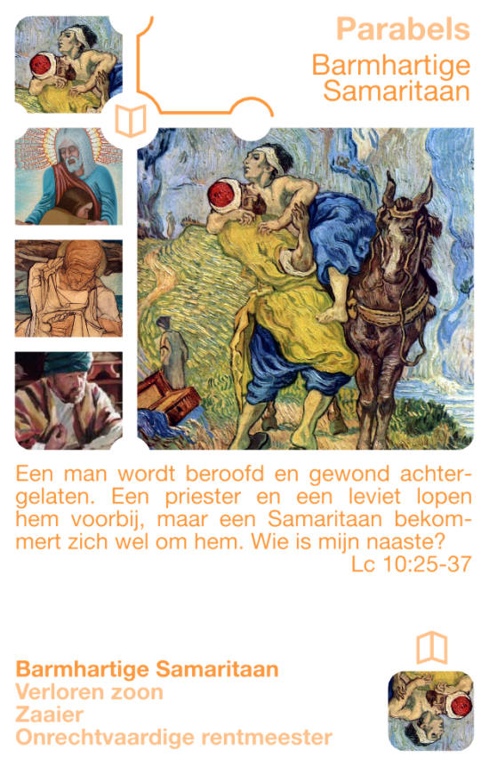
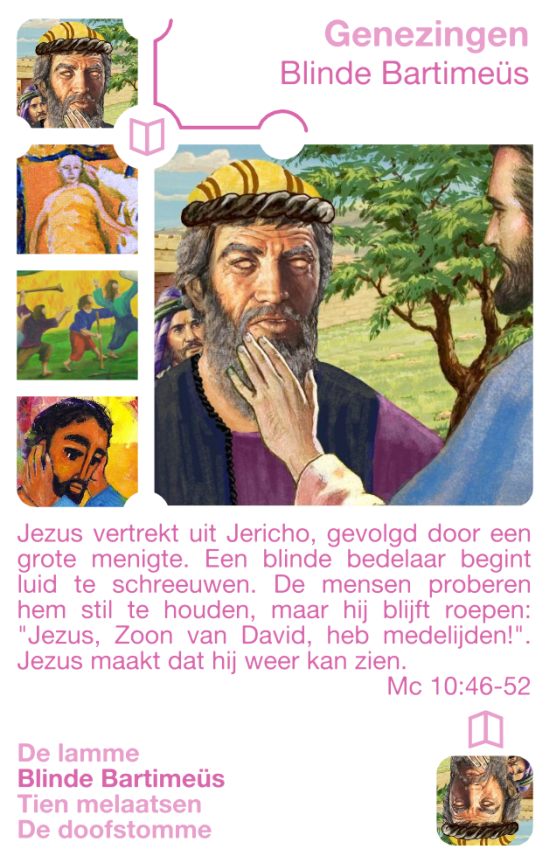
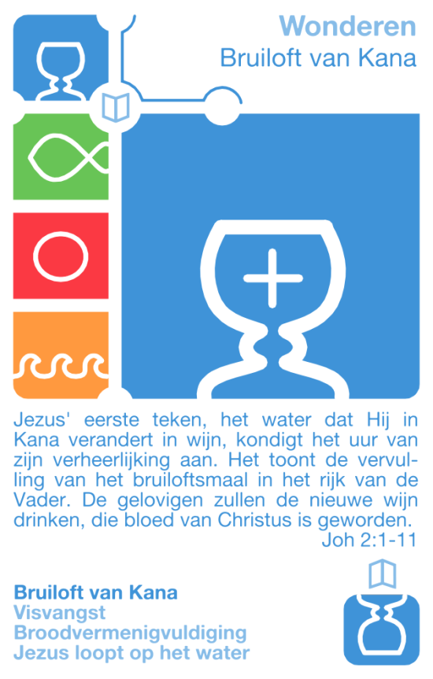

Katholiek Kwartetten is een kwartetspel met als thema het katholieke geloof. Dit artikel introduceert vier kwartetten die thema's uit het Evangelie bevatten. Parabels zijn verhalen die Jezus vertelde aan zijn leerlingen om hen te leren over het Rijk der Hemelen. Wonderen, genezingen en opwekkingen zijn de miraculeuze uitingen van Jezus' goddelijke liefde in zijn openbaar leven.

### Katholiek Kwartetten

[KATHOLIEK KWARTETTEN - ZELF AFDRUKKEN of BESTELLEN](/katholiek-kwartetten/ "Katholiek Kwartetten") leer hoe je de kaarten zelf kan afdrukken en download alle kaarten als PDF of bestel een spel online.

[KATHOLIEK KWARTETTEN ONLINE](/blog/katholiek-kwartetten/ "Katholiek Kwartetten met online kwis") leer meer over de website die gekoppeld is aan de kwartetkaarten en over de online spelmodus met kwis, die dit kwartet wel heel bijzonder maakt!

### Parabels

**Barmhartige Samaritaan**

Een man wordt beroofd en gewond achtergelaten. Een priester en een leviet lopen hem voorbij, maar een Samaritaan bekommert zich wel om hem. Wie is mijn naaste?

**De verloren zoon**

Een zoon vraagt zijn vader zijn deel van de erfenis om naar het buitenland te vertrekken. Al het geld verbrast hij en hij eindigt in bittere armoede. Hij gaat terug naar zijn vader, die al die tijd op hem was blijven wachten.

**De zaaier**

Een zaaier gaat uit om te zaaien. Een deel van het zaad valt op de weg, een deel op de rots en een deel tussen de distels. Maar een deel viel op de grond en droeg honderdvoud vrucht.

**De onrechtvaardige rentmeester**

Een spilzieke rentmeester wordt ontslagen, en hij is bang voor zijn toekomst. Wat moet hij doen om niet door de mensen buitengesloten te worden? Hij scheldt hen allemaal een deel van hun schuld kwijt, en de Heer prijst hem erom.

### Genezingen

**De lamme**

Vier mannen brengen een lamme tot bij Jezus. Omdat het zo druk is, laten ze hem door het dak naar beneden. Jezus zegt: "sta op en ga" en de lamme geneest. Maar Jezus zegt ook dat zijn zonden vergeven zijn, en dat is niet naar de zin van de farizeeën...

**Blinde Bartimeüs**

Jezus vertrekt uit Jericho, gevolgd door een grote menigte. Een blinde bedelaar begint luid te schreeuwen. De mensen proberen hem stil te houden, maar hij blijft roepen: "Jezus, Zoon van David, heb medelijden!". Jezus maakt dat hij weer kan zien.

**Tien melaatsen**

Tien melaatsen zien vanop een afstand dat Jezus voorbij komt. Ze roepen: "Jezus, Meester, heb medelijden!". Jezus stuurt hen naar de priesters, om te kijken of ze genezen zijn. Alle tien zijn ze genezen, maar slechts één komt terug om Jezus te bedanken.

**De doofstomme**

Er wordt een doofstomme bij Jezus gebracht om hem de hand op te leggen. Jezus neemt hem apart, steekt zijn vingers in zijn oren en raakt met speeksel zijn tong aan. Hij zegt "effata!", dat is "ga open". De man wis genezen en gaat het iedereen vertellen.

### Wonderen

**Bruiloft van Kana**

Jezus' eerste teken, het water dat Hij in Kana verandert in wijn, kondigt het uur van zijn verheerlijking aan. Het toont de vervulling van het bruiloftsmaal in het rijk van de Vader. De gelovigen zullen de nieuwe wijn drinken, die bloed van Christus is geworden.

**Visvangst**

De leerlingen geloven niet dat ze nog vis zullen vangen, maar Jezus zegt dat ze de netten moeten uitgooien. De vangst is enorm! Jezus zegt dat ze voortaan mensen zullen opvissen. Voor de eerste christenen staat de vis symbool voor Christus.

**Broodvermenigvuldiging**

Jezus' talrijke toehoorders krijgen honger en Hij geeft allen te eten van vijf broden en twee vissen. Dit is een beeld van het mysterie van liefde af dat elke dag wordt vernieuwd in de eucharistie: Christus geeft zijn Lichaam voor het leven van de mensheid.

**Jezus loopt op het water**

De leerlingen zijn alleen op het meer en hun schip raakt niet vooruit. Jezus komt op wonderbaarlijke manier naar hen toe en vermaant hen dat ze hun geloof nooit mogen verliezen. Zo komt Jezus ook tot ons in de eucharistie.

### Opwekkingen

**Dochtertje van Jaïrus**

Jezus wordt door Jaïrus, een voornaam man, gevraagd om bij zijn zieke dochter te komen. Ze worden opgehouden door een zieke vrouw en als ze aankomen is het kindje gestorven. Toch wil Jezus haar zien. Hij zegt: "meisje, sta op", en ze wordt weer levend!

**Zoon van de weduwe uit Naïn**

Jezus ziet hoe een weduwe haar enige zoon moet begraven. Hij krijgt zoveel medelijden met de vrouw, dat Hij haar wil troosten. Hij zegt: "huil niet meer" en gaat naar de lijkbaar. Hij brengt de zoon van de weduwe weer tot leven!

**Lazarus**

Lazarus is een goeie vriend van Jezus, maar wanneer Hij bericht krijgt dat Lazarus ziek is, reist Hij niet dadelijk af, maar wacht. Als Jezus eindelijk in Betanië komt, is Lazarus al vier dagen dood. Hij laat het graf openen en roept: "Lazarus, kom naar buiten!"

**Jezus' opstanding**

Jezus is aan het kruis gestorven, zelfs in de borst doorstoken om zeker te zijn dat Hij dood is. Na drie dagen blijkt zijn graf, hoewel het werd bewaakt, leeg te zijn. Jezus verschijnt eerst aan de vrouwen en dan aan de leerlingen. Zij getuigen dat Hij leeft voor eeuwig!
