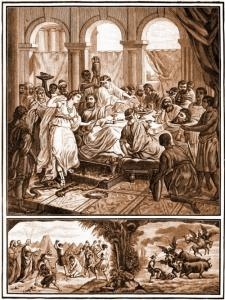

Omdat het vandaag het feest is voor de geboorte van Johannes de Doper, en we dat verhaal (eigenlijk toevallig) in het weekend al gelezen hadden, nam ik vandaag het [verhaal van Johannes' martelaarschap](http://www.willibrordbijbel.nl/index.php?p=page&i=65257,65272). Met de actualiteit van de voorbereiding van de gezinssynode in het achterhoofd, vielen enkele passages me bijzonder op!

### Huwelijk

\[caption id="attachment\_1356" align="alignright" width="225"\] Het hoofd van Johannes wordt aangebracht\[/caption\]

Hoewel het een heel kort stukje is in het evangelie, en de evangelist had kunnen volstaan met te zeggen dat Herodes het bevel heeft gegeven Johannes ter dood te brengen, schetst die echter een heel genuanceerd beeld van wat voorafging. Johannes (met de profetische stijl hem eigen) had Herodes al vaak (publiekelijk?) het verwijt gemaakt dat zijn huwelijk met de vrouw van zijn broer "irregulier" was, zoals we dat vandaag zouden noemen (of binnenkort niet meer mogen noemen?). Het effect van deze verwijten op de vrouw, Herodias, was er één van blinde haat, wat uiteindelijk zal resulteren in Johannes' terdoodbrenging.

Wat vertelt de evangelist echter over de reactie van Herodes op de bijtende verwijten:

> _Herodes had ontzag voor Johannes, in het besef dat deze een rechtvaardige en heilige man was, en hij nam hem in bescherming \[tegen Herodias\]. Als hij naar hem luisterde, raakte hij steeds in verlegenheid, en toch hoorde hij hem graag._ (Mc 6:20)

Het is pas op het bewuste feest waar Herodias' dochter Salome voor de hoge heren danst, dat Herodes zijn dure eed zweert en zij van haar stiefvader Johannes' hoofd kan eisen, omdat die zwak van karakter was en bang anders aan respect in te boeten bij zijn belangrijke gasten (waardoor dit verhaal in de [prentencatechismus gebruikt wordt als illustratie bij het tweede gebod](http://prentencatechismus.org/uncategorized/tweede-gebod-van-god-vervolg-zweer-niet-ijdel-vloek-noch-spot/): "Zweer niet ijdel").

Ik vroeg me dus af: kan deze passage ons niets leren in het debat over het gezin en het huwelijk?

Er is al (heel) veel gesproken over de houding van de Kerk tegenover gelovigen in irreguliere situaties, en dan luidt het ordewoord dat die houding er één van barmhartigheid moet zijn. In de kortere stukjes op blogs en in de media komt het er zowat op neer dat die barmhartigheid ook meteen onvoorwaardelijk hoort te zijn.

In het verhaal van Herodes schuilt misschien een aanwijzing dat we het ook gerust eens mogen hebben over de houding van de gelovigen in irreguliere situaties tegenover de Kerk. Ik weet het, de vergelijking loopt mank, want de Kerk moet zich niet spiegelen aan Johannes, maar aan Jezus, en hoewel Herodes hier 'de goeie' lijkt, is hij het wel die uiteindelijk verantwoordelijk zal zijn voor Johannes' dood. Toch past het gelovigen, niet enkel die in irreguliere huwelijkssituaties, zich blijvend een spiegel voor te houden: ben ik een Herodias, die liefst van al die vervelende profeet het zwijgen zou opleggen, of voel ik net als Herodes verlegenheid als ik mijn zonde hoor vernoemen, maar blijf ik toch graag en welwillend luisteren naar de profetische stem? Wat is trouwens barmhartigheid... in dezelfde prentencatechismus geldt Johannes' verwijt aan Herodes als [illustratie van de geestelijke werken van barmhartigheid](http://prentencatechismus.org/uncategorized/de-geestelijke-werken-van-barmhartigheid/ "De geestelijke werken van barmhartigheid")!

Het knappe aan de bijbel is dat dit soort verhalen perfect illustreren hoe we werkelijk in mekaar zitten. Er is altijd een stuk dat de goeie richting opgaat, en een ander stuk dat de foute richting opgaat en wat de uiteindelijke uitkomst is, hangt vaak louter af van toevallige omgevingsfactoren. Belangrijk is niet alleen te focussen op die uitkomst en onszelf genuanceerd te bekijken, maar zowel het goede áls het kwade van ons handelen te erkennen. En met de maatstaf waarmee we onszelf bekijken, zo moeten we ook de anderen bekijken.

Gelukkig is dat ---denk ik welwillend--- ook het [inzicht dat kard. Kasper probeert te verkopen](/blog/de-weg-van-penitentie/ "Kaspers weg van penitentie") in zijn voorstel van de 'weg van de penitentie', hoewel die steevast ongenuanceerd wordt belicht. Zijn voorstel, dat intussen ook deel uitmaakt van de voorbereidende documen van de synode, zal echter staan of vallen bij een gedegen implementatie, die niet in het ijle mag blijven zweven, en dat brengt me naadloos tot de tweede bedenking bij Johannes' wedervaren.

### Gezagsdragers

Iets anders wat me opviel is de gelijkenis van de manier waarop Johannes' dood tot stand komt, met die waarop Jezus veroordeeld wordt. Beiden krijgen te maken met een gezagsfiguur die hen eigenlijk niet vijandig gezind is, maar hen onder externe druk toch ter dood veroordeelt.

Herodes werd gechanteerd door zijn vrouw, door hem een belofte te laten doen die hem anders gezichtsverlies zou opleveren. En Pilatus (wiens vrouw hem trouwens adviseerde om Jezus niét ter dood te voordelen!) stond onder zware druk van de joden, die hem chanteerden een slechte beurt te maken bij de Keizer indien hij Jezus niet z0u veroordelen.

Ook dat is geen onbelangrijk gegeven, want we durven wel eens vergeten dat we ook vandaag nog veel moeten bidden, niet alleen voor de armen en onderdrukten, maar ook voor de 'groten der aarde', dat zij niet in de val trappen van Herodes en Pilatus en zwichten onder externe druk om beslissingen te nemen die ingaan tegen hun geweten.
