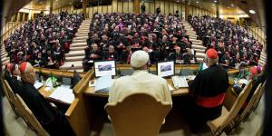

De kerk houdt in oktober haar synode over het gezin. Elk land vaardigt dan één of meer bisschoppen af en die bespreken samen het onderwerp en met die conclusies gaat de Paus dan aan de slag om de leer bij te stellen. De besprekingen beginnen niet met een blanco blad. Om te beginnen zijn er de [resultaten ('relatio') van de synode van vorig jaar](http://www.rkdocumenten.nl/rkdocs/index.php?mi=600&doc=5675), die een voorbereiding was op die van oktober dit jaar. Elke bisschop neemt voor de bisdommen die hij vertegenwoordigt het verslag mee van de antwoorden op de bevraging die werd opgesteld na de vorige synode (de 'lineamenta'). Ik ga verderop het verslag bespreken van de bevraging in de Belgische bisdommen. Tot slot is er natuurlijk ook het magisterium van de Kerk over het thema van het gezin. Daarvan heeft RKDocumenten en [mooi overzicht](http://www.rkdocumenten.nl/rkdocs/index.php?mi=650&dos=251) opgemaakt. De leer van de Kerk wordt immers gekenmerkt door haar continuïteit. Wat mgr. Bonny betreft, die de Belgische bisdommen zal vertegenwoordigen in afwachting van een nieuwe aartsbisschop, die heeft ook nog zijn brief op zak, die hij in 2014 in zes talen (!) liet publiceren.

 Gezinssynode

Het syntheserapport van de Belgische bevraging geeft een overzicht van de verschillende antwoorden, zonder echter een statistische analyse te maken. Slechts met aanduidingen als "enkele antwoorden" of "velen" kan je inschatten hoe breed een bepaalde opinie gedragen wordt.

Op basis van de [acht verwachtingen die mgr. Bonny in zijn fameuze brief van 2014 voorstelde en de drie verwachtingen die ik daar persoonlijk aan toevoegde](/blog/acht-van-de-bisschop-en-drie-van-mezelf/), ga ik nu kijken of die in de bevraging ook terugkomen. Ook zal ik een thema aanhalen dat in de bevraging nieuw naar boven komen, dat wel een waarachtige noodkreet lijkt, bondig samengevat: "we voelen ons zo eenzaam".

### Acht van de bisschop

**§1 Ik meen dat de katholieke Kerk, uitgerekend in het domein van huwelijk en gezin, dringend nood heeft aan een nieuw en steviger platform van collegiale dialoog en besluitvorming. Ik hoop dat de komende Synode daartoe zal bijdragen.**

Dit punt wordt in de bevraging niet aangehaald. Er zijn dus ook geen antwoorden.

**§2 Een monolithische collegialiteit heeft in de Kerk al even weinig toekomst als een monolithisch primaatschap. Ik hoop dat de bisschoppensynode voor deze regionale verscheidenheid de nodige aandacht zal opbrengen.**

Dit standpunt wordt ruim gedragen:

_De meerderheid vindt dat het mooi en realistisch zou zijn als de Kerk werk zou maken van pastorale richtlijnen die opgesteld zijn door de particuliere Kerken. Een westerse synode over dit thema, waarom niet? Vooral het ‘vertalen’ van de kerkelijke visie op huwelijk en gezin naar de plaatselijke situatie zou goed zijn._

**§3 Wat verwacht ik van de komende Synode? Dat zij aan het geweten zijn rechtmatige plaats in het onderricht van de Kerk zal teruggeven, in de lijn van Gaudium et Spes.**

De respondenten maken alvast dezelfde analyse:

_Ondertussen hebben mensen op basis van hun persoonlijke geweten een nieuwe ethiek en omgangsvormen ontwikkeld, waardoor ze zich niet langer gedragen voelen door de Kerk._

Welke rol het geweten dan precies moet spelen in het discours van de Kerk varieert van  _"de gewetensvrijheid van onze gesprekspartners te respecteren en geen oordeel te vellen over de verschillende situaties"_, over de uitdaging "_het onderricht van de Kerk kritisch op zijn verdiensten te onderzoeken,_ en _aanvaarden en waarderen dat mensen in eer en geweten zoeken om samen te kunnen leven en het leven door te geven"_, tot "_zich aan te passen aan de praktijk"_.

**§4** **Pastoraal heeft alles met doctrine te maken, en doctrine alles met pastoraal. Beide zullen in de Synode aan bod moeten komen, wil de Kerk nieuwe wegen openen voor de evangelisatie van huwelijk en gezin in onze samenleving.**

Dit thema komt veel ter sprake. Met dit citaat is de teneur gezet: _Voor de meerderheid van de respondenten is het essentieel te beginnen met het vestigen van de aandacht op de menselijke waarden die aanwezig zijn in elke verbintenis en met de bevestiging dat God er daadwerkelijk aanwezig is. In elke relatie is er een verlangen en een zoeken naar verbondenheid. Gods genade laat zich niet tegenhouden door een gezinsvorm. We mogen die relaties niet beschouwen als ‘een tussenstap’._

Toch klinkt ook een andere stem: _Anderen wijzen erop dat pastoraal en ethiek nauw samenhangen. De verkondiging moet weliswaar vertrekken vanuit de situatie van gelovigen zelf, maar ze moet wel duidelijk zijn en een einddoel in het vooruitzicht stellen. Gelovigen moeten gewezen worden op hun mogelijkheden, plichten en beperkingen. Ze dienen steun te zoeken in gebed en sacramenten. Van belang is de waarheid in liefde aanbieden, zonder die waarheid te loochenen._

**§5 Naar mijn mening zal de komende bisschoppensynode weinig kunnen bijdragen tot de evangelisatie van huwelijk en gezin, indien zij niet eerst de dialoog herstelt met de brede moraaltheologische traditie van de Kerk.  Altijd hebben in de Kerk verschillende moraaltheologische modellen gefunctioneerd. Alleen in hun complementariteit kunnen deze modellen recht doen aan de veelzijdige zoektocht van het menselijke denken naar waarheid en goedheid.**

Diepgaande moraaltheologische tractaten heeft de bevragen niet opgeleverd, maar duidelijk is dat de meningen eerder neigen naar tegenstelling dan complementariteit: _Bepaalde respondenten wijzen op het belang van de encycliek Humanae Vitae, terwijl anderen liever zouden hebben dat men er niet meer zou naar verwijzen._

**§6 Wat hoop ik dan van de Synode? Dat het geen platonische synode wordt. Dat zij zich niet terugtrekt op het veilige eiland van doctrinele discussies of algemene normen, maar oog heeft voor de concrete en complexe werkelijkheid van het leven.**

Ook hier ruime expliciete support, waarvan twee voorbeelden:

_Vele Belgische respondenten vinden het onderricht achterhaald. Het zou meer moeten uitgaan van de hedendaagse mens om de boodschap van Christus uit te dragen in plaats van achterhaalde regels._

_Veel respondenten wijzen op een gebrek aan nederigheid van de Kerk. Ze voelen zich geërgerd en vragen wat we eigenlijk weten over Gods oorspronkelijke plan. Ze onderstrepen dat de christenen niet de enige bezitters van de volle waarheid zijn. Zij houden een pleidooi voor een opener, realistische, modernere visie van de Kerk op het gezin._

**§7 Om met de beeldtaal van Jezus zelf te spreken: soms was Hij als een zaaier, soms als een herder, soms als een gastheer. Telkens stonden of zaten mensen in een wisselende kring om Hem heen. Die concentrische opbouw behoort tot de architectuur van de kerkgemeenschap zoals Jezus haar in stelling heeft gezet. Ik hoop dat de Synode deze architectuur tot haar recht zal laten komen. In het kerkelijke discours rond huwelijk en gezin mogen woorden als ‘tochtgenoot’ en ‘broederlijkheid’ duidelijker klinken.**

De respondenten zijn het opnieuw eens:

_Iemand begeleiden op zijn levensweg houdt overigens in dat men geen veroordelende houding aanneemt, maar zich weet open te stellen voor ontvankelijkheid, luisterbereidheid, dialoog en respect. De Kerk kan alleen maar uitnodigen om een verdere stap te zetten en mensen bemoedigen in de keuze voor ongehuwd samenwonen of voor een burgerlijk huwelijk die ze al gemaakt hebben: het onderweg zijn is hier opnieuw het sleutelwoord._

**§8 Hoe paradoxaal het ook moge klinken, maar betere normen voor de omgang met onregelmatige situaties kunnen de uitoefening van het leiderschap in de Kerk alleen ten goede komen. Ook daarvoor kijk ik hoopvol uit naar de komende Synode.**

Nu komt kat op de koord! Pastoraal kan je veel kanten uit, maar gaan we ook de regels aanpassen? Hier hebben de respondenten zich even volledig _out of the box_ laten gaan; een bloemlezing:

_De grote meerderheid van de respondenten wil dat hertrouwde echtgescheidenen toegang zouden hebben tot de sacramenten, meer bepaald tot het sacrament van de verzoening en de eucharistie._

_Vanuit de basis komt er de vraag naar een zegening van nieuwe koppels, die hun verlangen en gehechtheid aan Christus in hun relatie en gezinsleven willen beleven én ook de vraag om een tweede al dan niet kerkelijk/sacramenteel huwelijk toe te laten._

_Een tweede huwelijk na een scheiding zou meer aansluiten bij de realiteit. Velen scheiden uit noodzaak, soms na heel veel pogingen om toch bij elkaar te blijven._

_Bepaalde respondenten zouden graag hebben dat de procedure voor nietigverklaring van een huwelijk vergemakkelijkt en goedkoper zou worden gemaakt._

_Nog anderen zijn voorstander van de afschaffing van de hele procedure en stellen voor te aanvaarden dat als de burgerlijke echtscheiding uitgesproken wordt, het kerkelijke huwelijk dan ook beëindigd is._

_Sommige respondenten stellen dat, vermits de partners elkaar zelf het sacrament toedienen, de beslissing om een einde te maken aan de verbintenis dan ook (alleen) henzelf toekomt._

_Sommigen vragen dat het huwelijkssacrament eenvoudigweg wordt geschrapt van de lijst van sacramenten en eventueel vervangen zou worden door een zegen._

Tot zover de acht verwachtingen van mgr. Bonny. Alle verwachtingen lijken door meerderheden van de respondenten te zijn beaamd. Hij mag op de synode dus voluit gaan voor de regionalisering van het kerkelijk leergezag, de rehabilitering van controversiële moraaltheologische stromingen en hij kan putten uit een doos vol verrassende herdefiniëringen van het sacramentele leven.

### Drie van mezelf

Nu eens kijken of mijn persoonlijke verwachtingen ook uit de verf komen. Het zal niet aan mezelf te danken zijn, want ik heb geen antwoord ingestuurd omdat dat ik me niet door de vraagstelling kon worstelen, die "eerder bedoeld is voor priesters en kerkmensen die gezinnen begeleiden en qua woordkeuze ook bepaalde vraagstellingen ideologisch kan omzeilen", zoals het rapport ook aanhaalt.

**§1 Ik verwacht dat de synode een duidelijk onderscheid maakt tussen analyse en beschouwing enerzijds en concrete besluiten anderzijds, of anders gezegd: liever erkent geen antwoord te kunnen geven op verwachtingen die gesteld worden, dan een vage ruimte te creëren voor experimenten.**

Uit de antwoorden:

_Enkele gelovige gezinnen voelen zich uit hun evenwicht gebracht door deze synode en wachten met ongeduld op de besluiten. Ze vragen om een sterkere en meer publieke ondersteuning en verlangen dat het Leergezag zijn standpunten en zijn eisen bevestigt en vastberaden blijft onderrichten_

_Sommige respondenten vinden namelijk dat de Kerk nog te veel geneigd is om feitelijke situaties te aanvaarden of zelfs goed te keuren. Ook bepaalde katholieke publicaties stichten volgens hen veel verwarring._

_Enkelen vinden dat er integendeel meer nood is aan een eenvormiger beleid, want nu al zijn er verschillen tussen de bisschoppen op lokaal vlak. Mensen zoeken structuur en zij vinden dat de Kerk niet altijd een fraai beeld biedt door haar interne tegenstellingen. De leer moet universeel gelden._

_Een procentueel kleine groep ten slotte antwoordt op deze vraag dat de personalistische visie op seksualiteit leidt tot ethisch relativisme en tot het ondersteunen van vele samenlevingsvormen en niet van het kerkelijke huwelijk. Volgens hen is het de opdracht van de Kerk de objectieve waarheid te verkondigen die men vindt in de catechismus, de kerkelijke leer, o.m. in visie op de theologie van het lichaam van paus Joannes Paulus II en in de encycliek_ Humanae Vitae_._

_Bepaalde respondenten zouden voor hun kinderen en voor zichzelf graag een steviger catechismus willen. Nogal wat van hen geven aan dat ze zich regelmatig beroepen op de Catechismus van de Katholieke Kerk. Ze zouden willen dat de Kerk, in het bijzonder in België, het onderricht sterker bevestigt en openlijk publieke acties ondersteunt. De gezinspastoraal zou volgens hen vooral bezig moeten zijn met de verspreiding van het evangelie van het leven, de theologie van het lichaam… in plaats van onregelmatige samenlevingsvormen te bevestigen. Er is nood aan niet-angstige, gevormde mensen, die de kerkelijke leer kunnen uitleggen in plaats van die te relativeren._

**§2 Ik verwacht dat de synode het gezin erkent als de belangrijkste bron van geloofsopvoeding, in een wereld waarin geseculariseerde scholen die taak niet langer mogen vervullen en waarin de krimpende geloofsgemeenschappen de kracht niet hebben om volwaardige catechese aan te bieden.**

Uit de antwoorden:

_De respondenten vinden dat, vertrekkend van de Relatio Synodi en de bevraging, Rome onvoldoende rekening houdt met de ontkerstening, de christofobie, de afwezigheid van religieuze kennis en het huidige gebrek aan oriëntatiepunten voor de jongeren in Europa._

_Voor de overgrote meerderheid van de ouders is de godsdienstige vorming geen prioriteit in de schoolkeuze voor hun kind. De godsdienstles verwordt soms tot een vergelijkende en relativerende les, zo neutraal mogelijk._

_Voor christenen komt het erop aan een levend evangelie van het gezin te zijn, het gezicht van Christus en van de Kerk.  Door hun voorbeeld en de authentieke beleving van hun geloof kunnen christenen in hun omgeving belangstelling wekken en aansporen tot een christelijke levenshouding. Alleen al niet meegaan in de tijdsgeest kan al een krachtig getuigenis zijn._

_Het missionaire engagement wordt bevorderd door de zondagspraktijk, de betrokkenheid in het parochieleven, het lidmaatschap van verschillende organisaties en reflectiegroepen._

_Belgische respondenten onderstrepen het belang van verschillende vormen van gebed: als gezin, koppel en persoonlijk ter ondersteuning van het gezin. De betrokkenheid van ouders en grootouders in de catechese van de kinderen is iets dat gestimuleerd moet worden._

_De aanwezigheid van priesters in een gezinsomgeving is aan te bevelen: hetzij door een priester regelmatig uit te nodigen op een maaltijd, hetzij voor een spirituele follow-up, al of niet individueel._

_Gezinnen betrekken in de vorming van priesters is vereist. Respondenten suggereren om priesters en seminaristen te onthalen in gezinnen, van welke samenstelling dan ook, en om een systeem van stage of peterschap op te zetten. Alle priesters zouden ook een gezinsgroep moeten hebben waarmee zij uitwisselen._

_Het merendeel van de antwoorden laat aanvoelen dat er weinig steun is voor de opvoedkundige opdracht van de ouders. Wel ervaren sommigen steun, vooral op spiritueel en sacramenteel vlak, van de nieuwe bewegingen en gemeenschappen. Men merkt ook op dat de tijdsgeest veranderd is. Het is op parochiaal niveau een heel moeizame zoektocht om gezinnen en jongeren te bereiken._

_Sommigen pleiten voor de uitbouw van structuren die kunnen helpen bij de opvoeding. Ze willen dat het niveau van de catechese voor kinderen wordt opgetrokken, meer bepaald als het gaat over de Schrift en de opvoeding in evangelische waarden._

**§3 Ik verwacht dat de synode het doopsel en de biecht aan het gezin aanreikt als wegen naar ontmoeting met Christus en als voortdurende opdracht voor de ouders (of opvoeders) om kinderen op te voeden in het geloof en niet de eucharistie in te vullen als een soort van initiatie- of verzoeningssacrament.**

Uit de antwoorden:

_Het zou interessant zijn om van de aanvragen voor een huwelijk of een doopsel gebruik te maken om de koppels te benaderen vanuit het perspectief van het aanbieden van het geloof._

_Het onderricht zou moeten gericht zijn op de zin voor engagement, het sacrament, de huwelijksliefde, de Schrift, de evangelische eisen, het spirituele leven, het gebed, de zondagsmis, de sacramenten… en op de opmaak van een levensproject. Het belang van het kerkelijke leven dient te worden onderstreept._

_Het is belangrijk dat de verloofden het sacrament van het vormsel hebben ontvangen. Sommigen vragen ook het sacrament van de verzoening ter gelegenheid van de verloving._

_Veel kinderen die hun eerste communie doen, komen ook uit nieuw samengestelde gezinnen. Als sacrament, doopsel, eucharistie en kerkelijk huwelijk elk apart zo weinig vertrouwd zijn, hoe kunnen ze dan op elkaar betrokken worden? En het grootste probleem is dat er heel weinig vitale geloofsgemeenschappen zijn waar jonge gezinnen komen._

_Andere respondenten onderstrepen ook dat om bij jongeren het verlangen om opnieuw bij de Kerk aan te sluiten te laten groeien, het noodzakelijk is openlijk te getuigen van het geluk te kunnen leven in de aanwezigheid van God. Het komt erop aan om doorheen deze getuigenissen de evangelische waarden en de coherentie van het huwelijk te laten zien en te herinneren aan het vitale belang van het sacrament._

Ook mijn persoonlijk verwachtingen mag mgr. Bonny dus meenemen naar Rome, zij het met iets minder _back-up_ dan zijn eigen verwachtingen, want de antwoorden kwamen van 'enkelen' of 'sommigen'.

Maar er is nog één ander aandachtspunt dat de lezer van het syntheserapport niet mag ontgaan: het katholieke gezin lijdt onder isolement en eenzaamheid... Lees daarover meer in [het volgende bericht](/blog/en-zijn-eenzame-kudde/ "...en zijn eenzame kudde").
