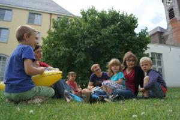

Bij het doornemen van het syntheserapport van de bevraging in de Belgische bisdommen als voorbereiding op de synode eind dit jaar, komt er [naast de te verwachten discussiepunten](/blog/de-synodevader/ "De synodevader") één extra puntje puntje naar boven dat mgr. Bonny kan oppikken om mee te nemen naar Rome: het isolement dat drukt op katholieke gezinnen.

Dit probleem wordt verwoord in talloze antwoorden, waarin de respondenten gelovige gezinnen met mekaar in contact willen doen komen, om mekaar te ondersteunen:

_Men suggereert de oprichting van plaatsen en gelegenheden, intergenerationeel of intercultureel, of meer specifiek (weduwen- en gehandicaptenwerking…) voor ontmoeting, vriendschap, vorming, geloofsverdieping e.a., waar mensen een vriendschappelijke, sociale, morele of spirituele steun kunnen vinden._

_Bijbelgroepen, intergenerationeel of niet, lectio divina of elke andere activiteit die gericht is op de Schrift, moeten bevorderd en ondersteund worden._

_Het gezin als huiskerk heeft voedsel van elders nodig: verbondenheid met de kerkgemeenschap, spreken over geloof, christelijke symbolen, aandacht voor het kerkelijke jaar, samen bidden, de regelmatige praktijk van de sacramenten, het lezen van het Woord, onderricht en deelname aan parochiale activiteiten. In dat licht is het belangrijk dat gezinnen die een huiskerk willen zijn, andere gezinnen met hetzelfde verlangen kunnen ontmoeten. De Kerk kan die ontmoetingen organiseren. Tochtgenoten zijn essentieel._

_De respondenten waarderen de verschillende vormen van begeleiding, de gezinsgroepen, de intergenerationele ontmoetingen, de ‘sterke’ homilieën, de vormingsmogelijkheden, de sterke momenten in gemeenschap, het vrijwilligerswerk en de solidariteit in de parochies._

_Om een weg van vrijheid aan hun kinderen te kunnen voorstellen, proberen respondenten hen in een relatie te brengen met Christus en de heilige Geest en hun geloof te voeden door de zondagsmis. Ze wijzen hier dan ook op de noodzaak van een goed verzorgde liturgie. Zij willen ook kunnen steunen op gespreksgroepen, jeugdbewegingen, parochiale of diocesane activiteiten of op de hulp van nieuwe bewegingen._ 

_Een aantal respondenten wijst hier opnieuw op het belang van stichtende getuigenissen. Het evangelie lezen, de studie van het kerkelijke onderricht en het gebed maken het mogelijk de onverbrekelijkheid van het huwelijk te beleven met vertrouwen en vreugde doorheen de moeilijkheden die elk koppel tegenkomt, in dialoog en het delen met elkaar. Deze steun is in het bijzonder van belang in de confrontatie met de ‘gevaren’ van de moderne samenleving._

_Een ander voorstel is een systeem van peterschap voor de koppels. De echtgenoten zouden zich bovendien moeten engageren een leven in geloof te leiden en zich regelmatig te herbronnen._

_Voor tieners is het van belang dat ze een christelijke levensvisie met enkele leeftijdsgenoten kunnen delen. Als gemeenschap moeten we daarom ontmoetingen met leeftijdsgenoten met dezelfde geest bevorderen en zelfs erin investeren._

_Echt spreken over de roeping en de zending van het huwelijk gebeurt zelden. Voor de authentieke kerkelijke ervaring ontbreekt al te vaak de levendige geloofsgemeenschap._

_De broosheid van vele parochies die zichzelf overleven, vormt daarbij evenwel een groot probleem. Zonder een ondersteunende geloofsgemeenschap kan men nauwelijks denken aan het ontwikkelen van een gezinsspiritualiteit._

_Het gebruik van katholieke sociale netwerken zou het mogelijk kunnen maken meer jongeren te bereiken en op die manier een vruchtbare bodem te creëren._

### Ga voor gemeenschappen!

 Gezinspastoraal

Als de kerkelijke leer niet aanvaard wordt in het gezin, is dat ---blijkens de steeds weerkerende antwoorden--- minstens gedeeltelijk te wijten aan het ontbreken van een klankbord. Als gelovigen geen _peers_ vinden om aan te relateren, is het veel moeilijker om de leer van het geloof te handhaven, hoe 'aanvaardbaar' die ook geformuleerd wordt. De verkondiging van de leer gaat samen met de vorming van een gemeenschap. De bisschop is herder en leraar. De herder moet zijn schapen bijeen brengen en binnenleiden in de waarheid.

Deze discussie gaat dus eigenlijk helemaal niet meer over sacramenten of kerkelijke leer, maar wel over de praktische draagkracht van de katholieke Kerk als gemeenschap. Waar brengt de herder zijn schapen bijeen? Dit raakt de discussie van de parochies. Katholieke gezinnen moeten de kans krijgen (en voor zichzelf de verantwoordelijk opnemen) om op geregelde tijdstippen te vertoeven in een katholieke vrijhaven, waar de kinderen samen kunnen spelen (en samen leren bidden) en de ouders met mekaar kunnen spreken over het geloof en de geloofsopvoeding van hun kinderen. Zo'n vrijhaven is natuurlijk ook de gelegenheid voor gezinnen om met priesters in gesprek te gaan en vorming te genieten.  Parochies, en zelfs federaties, zijn te klein geworden om gezinnen zo'n vrijhaven te bieden. De parochiehervorming dreigt door de realiteit voorbijgestoken te worden als ze niet radikaal en _out of the box_ wordt herdacht! Het model van de personele parochie kan daarbij van dienst zijn, minstens als complement van het territoriale parochiemodel.

Misschien is de synode niet de plaats waar het parochielandschap in Vlaanderen wordt uitgetekend, maar alleszins is het noodzakelijk dat in het debat over het gezin het gebrek aan geloofsgemeenschap erkend wordt als één van de voornaamste, zoniet dé voornaamste oorzaak van de crisis van het christelijke gezin. Al het pastorale gesleutel aan de definiëring van sacramenten zal van geen tel zijn, als de Westerse bisdommen niet de volslagen incompatibiliteit erkennen van het terrotoriale parochiemodel met de noden van een gedecimeerde geloofsgemeenschap.

Voorstellen voor de bisschop, misschien eerder voor zijn concreet diocesaan bestuur dan als agendapunt op de synode:

1. Identificeer bij de hervorming van het parochielandschap vrijhavens voor gezinnen, jong of oud, waar men (minstens) maandelijks kan bijeenkomen voor een volledige dag sacramenteel leven, ontspanning, vorming, gebed,... Dat kunnen bestaande parochies zijn, maar ook andere gemeenschappen, een klooster of abdij, een gebedsgroep,... Probeer bestaande gemeenschappen die parallel dezelfde doelgroep aanspreken te centraliseren. Bied de kleine eilandjes die er nu reeds bestaan een zending en kader aan om in te werken. Aarzel niet om ook de bijzondere sacramentele vieringen, doopsel, eerste communie, vormsel, huwelijk en -waarom niet- uitvaart, in deze gemeenschappen te organiseren. Kies bevoorrechte centra uit waar het sacramentele en familiale leven mekaar raken, zoals dat vóór onze tijd in de parochies mogelijk was.
2. Koester daarbij de verscheidenheid van mensen en de manier waarop ze geloven. Geef gelovigen de kans om te kiezen voor een gemeenschap die qua stijl en belevingswijze bij hen past. Met een tiental centra per bisdom moet je al toekomen om een verscheiden aanbod te bieden.
3. Communiceer open over het aanbod en profileer de gemeenschappen duidelijk. Met de moderne media is het een kleine moeite om alle centra onderdak te bieden op een centrale website en facebookpagina. Het micrositeconcept van nieuw.kerknet.be heeft hier zeker potentieel. Zet de gemeenschappen aan om het  materiaal waarmee ze werken online te zetten, gebedenboekjes, liturgische teksten, activiteiten,... en ondersteun de redactie van een eigen online 'parochieblad' waar (beeld)verslag wordt gemaakt van wat er reilt en zeilt in de gemeeschap, ook de kleine en menselijke faits divers, vreugde en verdriet.
4. Spreek gezinnen aan op hun engagement en verantwoordelijkheid in de Kerk. Reik voorbeelden aan en motiveer gezinnen om hun geloofsleven ook thuis en buiten de maandelijkse bijeenkomsten te ontplooien. Stuur de gezinnen tijdens de drie andere zondagen per maand op zending naar hun eigen (territoriale) parochie.

Het is nogal vanzelfsprekend dat dit allemaal geen zoden aan de dijk zal zetten als ook de gezinnen zich niet engageren, daarom nog een trits voorstellen, naar gelovige gezinnen toe:

1. Ruim in je kalender plaats om minstens één zondag per maand met het ganse gezin in jouw vrijhaven door te brengen. Stel  je gewoon open voor de ontmoeting, zonder al te kritisch te zijn of de aangeboden activiteit je op dat moment wel speciaal interesseert. Probeer de andere zondagen op de eigen parochie aanwezig te zijn. Kortom: maak van de zondag opnieuw een dag des Heren, voor de Heer en bij de genade van de Heer.
2. Engageer je binnen het gezin om het geestelijk leven te ontplooien en tracht met mensen uit je gemeenschap ook buitenaf ontmoetingen te organiseren in een familiale sfeer. Zoek uitdagingen die je samen kan opnemen. Offer daarvoor desnoods wat _quality time_ op die je had voorbehouden voor je eigen gezinnetje, want je zal _time of grace_ in de plaats krijgen.
3. Oefen je in nederheid en eenvoud, want wat een kleine katholieke gemeenschap aan evenementen te bieden heeft, zal nooit het professionele spektakelgehalte benaderen van een piekfijn georganiseerde city-trip met je beste vrienden. Toch kan het een ontmoeting zijn die je leven veel meer betekenis zal geven.

De beweging van katholieke gezinnen wég van hun 'eigen' parochie is al lang bezig. Sommige gezinnen gaan hun eigen weg en [beantwoorden het appèl](http://www.gezinspastoraal.be/337/ "Gezinspastoraal") dat uitgaat van een kloostergemeenschap of een of andere nieuwe gemeenschap, maar veel gezinnen, en zeker niet uitsluitend de 'onregelmatige' gezinnen, verdwijnen van de radar. Niet omdat het er in de parochies te doctrinair en te weinig pastoraal aan toe gaat, misschien zelfs integendeel, maar omdat parochies geen volwaardige gemeenschappen meer zijn. De analyse dat de leer van de sacramenten niet aangepast zou zijn aan de realiteit, is oppervlakkig. De echte _root cause_ is veel praktischer van aard en kan door een bisschop zonder enige doctrinaire discussie in zijn eigen bisdom worden aangepakt.
