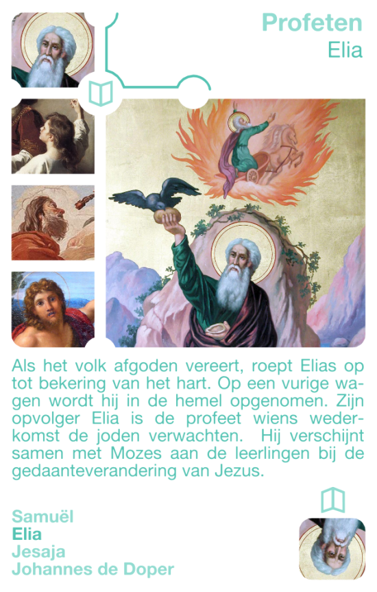

Katholiek Kwartetten is een kwartetspel met als thema het katholieke geloof. Dit artikel introduceert één kwartet dat vier profeten uit het Oude Testament bevat. Profeten waren meestal niet zo populair bij de mensen (en de wereldse machten) omdat ze de boodschap van God ongezouten verkondigden.

### Katholiek Kwartetten

[KATHOLIEK KWARTETTEN - ZELF AFDRUKKEN of BESTELLEN](/katholiek-kwartetten/ "Katholiek Kwartetten") leer hoe je de kaarten zelf kan afdrukken en download alle kaarten als PDF of bestel een spel online.

[KATHOLIEK KWARTETTEN ONLINE](/blog/katholiek-kwartetten/ "Katholiek Kwartetten met online kwis") leer meer over de website die gekoppeld is aan de kwartetkaarten en over de online spelmodus met kwis, die dit kwartet wel heel bijzonder maakt!

### Profeten

**Samuël**

Samuël wordt als kind aan de priester Eli toevertrouwd en 's nachts door God geroepen. Hij zalft Saul en nadien David als koning van hun volk.

**Elia**

Wanneer het volk opnieuw afgoden vereert, roept Elias op tot bekering van het hart. Op een vurige wagen wordt hij in de hemel opgenomen. Elia is de profeet wiens wederkomst de joden verwachtten. Hij verschijnt samen met Mozes aan de leerlingen bij de gedaanteverandering van Jezus.

**Jesaja**

Jesaja stond in een visioen voor de troon van God en een engel raakte zijn mond aan met een gloeiende kool. Hij voorspelt een lijdende dienaar die de zonden van de mensen op zich neemt en die verheven wordt.

**Johannes de doper**

Johannes, zoon van de priester Zacharias, trekt zich terug in de woestijn en wordt daar door God geroepen. Hij is als laatste van de profeten de voorloper van Jezus Christus. Hij doopt Jezus in de Jordaan en noemt Hem het Lam van God.
