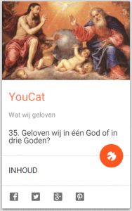
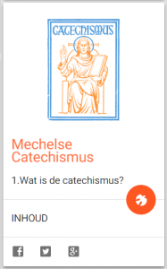
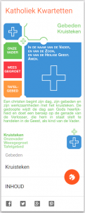

[Alledaags Geloven](http://alledaags.gelovenleren.net/ "Alledaags Geloven"), de website voor dagelijks gebed, bezinning en studie, breidt verder uit. Drie nieuwe kaarten zorgen voor meer inspiratie: YouCat, Mechelse Catechismus en Katholiek Kwartetten.

 YouCat

**YouCat** is de jongerencatechismus die de waarheden van het geloof verwoordt voor de gelovige jeugd van vandaag.

 Mechelse Catechismus

**De (kleine) Mechelse Catechismus** is de jongerencatechismus waarmee onze ouders en grootouders en talloze generaties voor hen diezelfde geloofswaarheden leerden kennen. Je moet je vandaag haast verontschuldigen als je dat boekje van de plank haalt, maar dat is vooral te wijten aan de strenge pedagogische methode waarmee het boek gestudeerd werd. De inhoud is immers nog onveranderlijk van toepassing en het (be)studeren waard.

Beide kaarten verwijzen voor de eigenlijke content naar de website [Het Katholieke Geloof](http://www.hetkatholiekegeloof.nl/ "Het Katholieke Geloof").

 Katholiek Kwartetten

De derde kaart is iets luchtiger van aard. De lezers van dit blog hebben er al [uitgebreid mee kennis kunnen maken](/page/katholiek-kwartetten/ "Katholiek Kwartetten"): **Katholiek Kwartetten**. Dag per dag kan je de 52 kaarten van het kwartet doorlopen. Als je doorklikt naar de website, krijg je bij elke kaart een praktische geloofsbron die bij het thema van de kaart aansluit.

Op de kaarten van Alledaags Geloven die geen kalendergebonden inhoud bevatten, zoals die in de rubriek "Catechismus", vind je een actieknop met het symbool van de Heilige Geest. Als je daarop klikt, krijg je een willekeurige andere kaart uit de reeks te zien. Dat kan nuttig zijn als de inspiratie even zoek is.

Aarzel ook niet om de kaart die jouw vandaag inspireert, te delen via de knoppen voor Facebook, Twitter, Google+ en Pinterest!

Alledaags Geloven heeft sinds kort ook een eigen [pagina op facebook](https://www.facebook.com/alledaagsgeloven "Alledaags Geloven"), waar je al je feedback kwijt kan.
