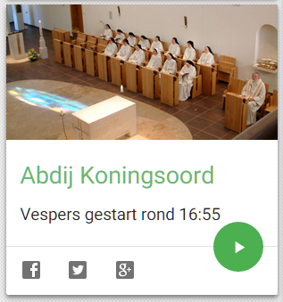

\[caption id="attachment\_1461" align="alignleft" width="317"\] Abdij Koningsoord\[/caption\]

[Alledaags Geloven](http://alledaags.gelovenleren.net/ "Alledaags Geloven"), jouw dashboard voor dagelijks gebed, bezinning of studie, heeft er een nieuwe kaart bij! Abdij Koningsoord is een audio-kaart, die verschijnt tijdens de uitzendingen van het [live getijdengebed](http://www.koningsoord.org/getijden/). Veel luistergenot!
