Katholiek Kwartetten is een kwartetspel met als thema het katholieke geloof. Dit artikel introduceert drie kwartetten met katholieke basisgebeden.

### Katholiek Kwartetten

[KATHOLIEK KWARTETTEN - ZELF AFDRUKKEN of BESTELLEN](/katholiek-kwartetten/ "Katholiek Kwartetten") leer hoe je de kaarten zelf kan afdrukken en download alle kaarten als PDF of bestel een spel online.

[KATHOLIEK KWARTETTEN ONLINE](/blog/katholiek-kwartetten/ "Katholiek Kwartetten met online kwis") leer meer over de website die gekoppeld is aan de kwartetkaarten en over de online spelmodus met kwis, die dit kwartet wel heel bijzonder maakt!

> TIP! Gebruik deze kaarten ook los van het kwartet als gebedskaarten of als geheugensteuntje bij het bidden van de mysteries van de rozenkrans!

### Gebeden

[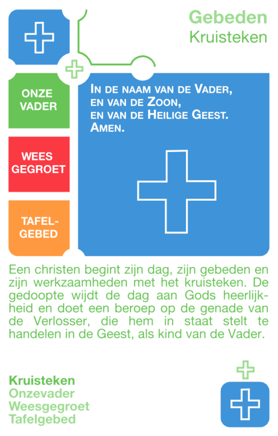](http://kwartet.gelovenleren.net/gebeden/kruisteken)

**Kruisteken**

Een christen begint zijn dag, zijn gebeden en zijn werkzaamheden met het kruisteken. De gedoopte wijdt de dag aan Gods heerlijkheid en doet een beroep op de genade van de Verlosser, die hem in staat stelt te handelen in de Geest, als kind van de Vader.

[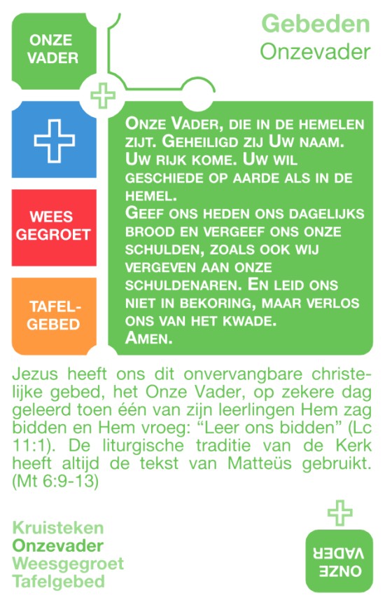](http://kwartet.gelovenleren.net/gebeden/onze-vader)

**Onze Vader**

Jezus heeft ons dit onvervangbare christelijke gebed, het Onze Vader, op zekere dag geleerd toen een van zijn leerlingen Hem zag bidden en Hem vroeg: “Leer ons bidden” (Lc. 11, 1). De liturgische traditie van de Kerk heeft altijd de tekst van Matteüs gebruikt. (Mt. 6, 9-13)

[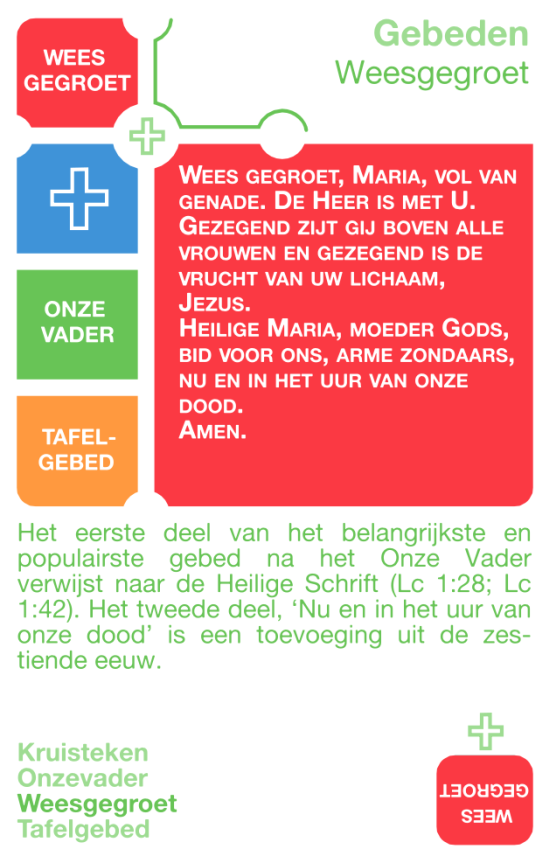](http://kwartet.gelovenleren.net/gebeden/wees-gegroet)

**Wees Gegroet**

Het eerste deel van het belangrijkste en populairste gebed na het onzevader verwijst naar de Bijbel (Lc. 1, 28; Lc. 1, 42). Het tweede deel, ‘Nu en in het uur van onze dood’ is een toevoeging uit de 16de eeuw.

[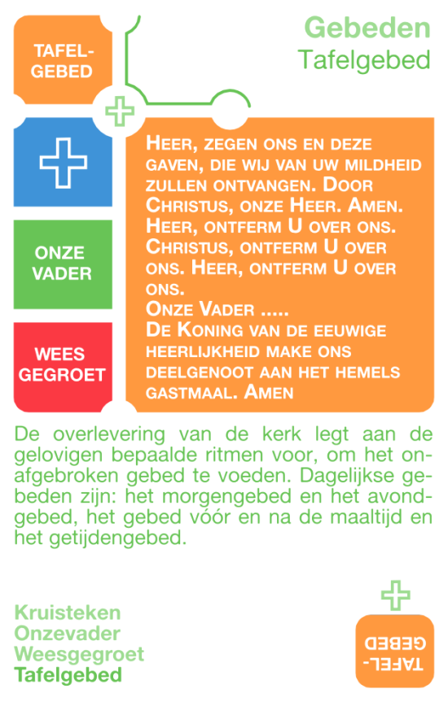](http://kwartet.gelovenleren.net/gebeden/tafelgebed)

**Tafelgebed**

De overlevering van de kerk legt aan de gelovigen bepaalde ritmen voor om het onafgebroken gebed te voeden. Dagelijkse gebeden zijn: het morgengebed en het avondgebed, het gebed vóór en na de maaltijd en het getijdengebed.

### Oefeningen

[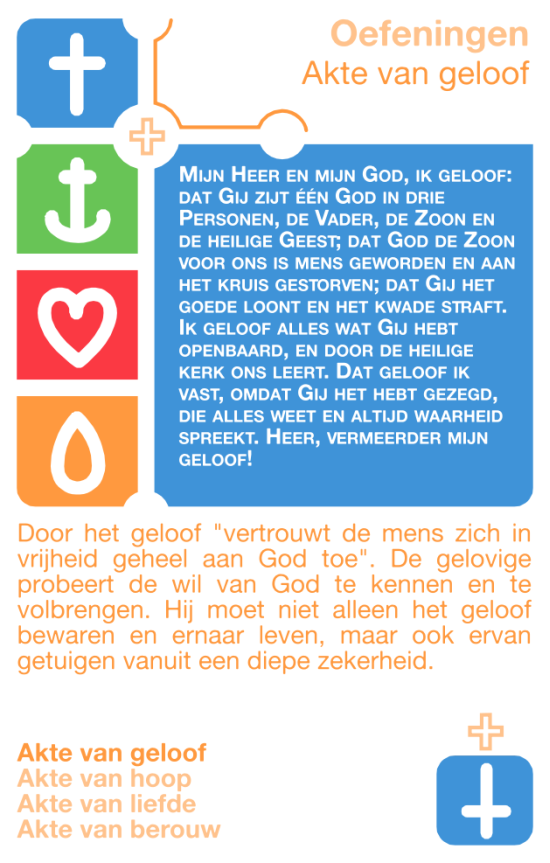](http://kwartet.gelovenleren.net/akten/akte-van-geloof)

**Akte van geloof**

Mijn Heer en mijn God, ik geloof: dat Gij zijt één God in drie Personen, de Vader, de Zoon en de heilige Geest; dat God de Zoon voor ons is mens geworden en aan het kruis gestorven; dat Gij het goede loont en het kwade straft. Ik geloof alles wat Gij hebt openbaard, en door de heilige kerk ons leert. Dat geloof ik vast, omdat Gij het hebt gezegd, die alles weet en altijd waarheid spreekt. Heer, vermeerder mijn geloof!

Door het geloof "vertrouwt de mens zich in vrijheid geheel aan God toe". De gelovige probeert de wil van God te kennen en te volbrengen. Hij moet niet alleen het geloof bewaren en ernaar leven, maar ook ervan getuigen vanuit een diepe zekerheid.

[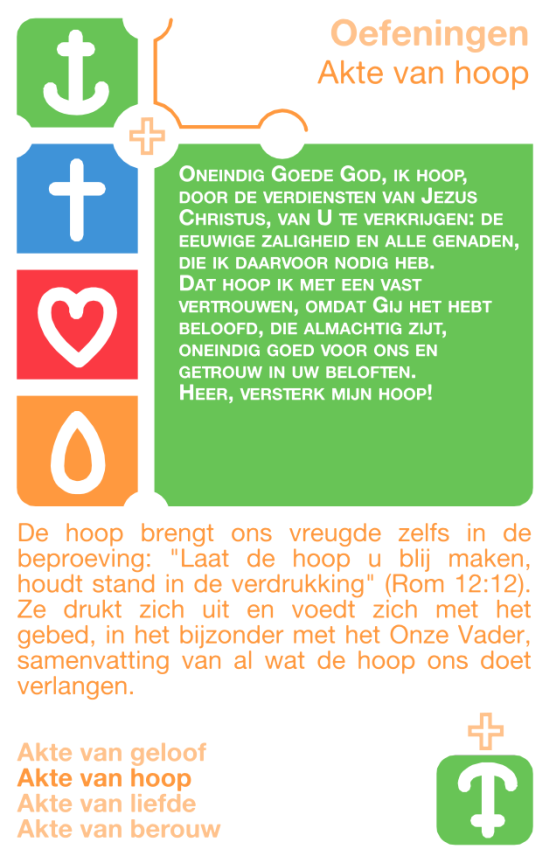](http://kwartet.gelovenleren.net/akten/akte-van-hoop)

**Akte van hoop**

Oneindig Goede God, ik hoop, door de verdiensten van Jezus Christus, van U te verkrijgen: de eeuwige zaligheid en alle genaden, die ik daarvoor nodig heb. Dat hoop ik met een vast vertrouwen, omdat Gij het hebt beloofd, die almachtig zijt, oneindig goed voor ons en getrouw in uw beloften. Heer, versterk mijn hoop!

De hoop brengt ons vreugde zelfs in de beproeving: "Laat de hoop u blij maken, houdt stand in de verdrukking" (Rom 12:12). Ze drukt zich uit en voedt zich met het gebed, in het bijzonder met het Onze Vader, samenvatting van al wat de hoop ons doet verlangen.

[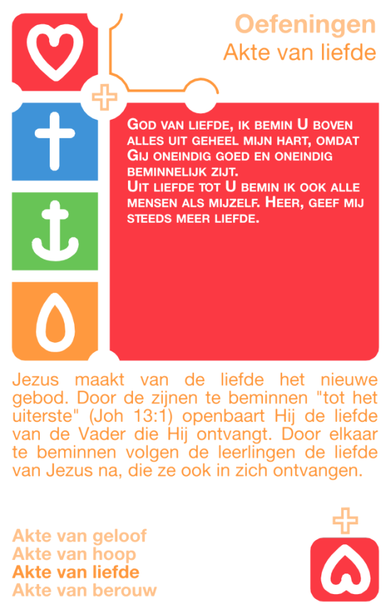](http://kwartet.gelovenleren.net/akten/akte-van-liefde)

**Akte van liefde**

God van liefde, ik bemin U boven alles uit geheel mijn hart, omdat Gij oneindig goed en oneindig beminnelijk zijt. Uit liefde tot U bemin ik ook alle mensen als mijzelf. Heer, geef mij steeds meer liefde.

Jezus maakt van de liefde het nieuwe gebod. Door de zijnen te beminnen "tot het uiterste" (Joh 13:1) openbaart Hij de liefde van de Vader die Hij ontvangt. Door elkaar te beminnen volgen de leerlingen de liefde van Jezus na, die ze ook in zich ontvangen.

[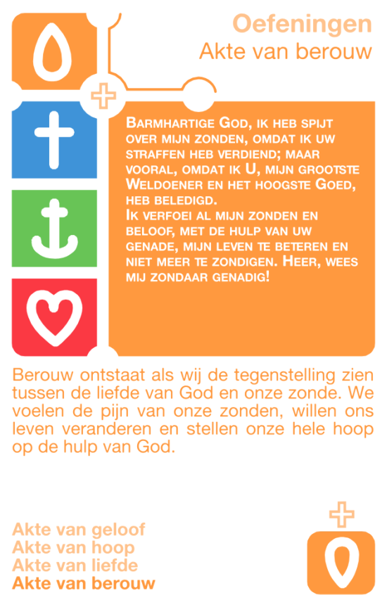](http://kwartet.gelovenleren.net/akten/akte-van-berouw)

**Akte van berouw**

Barmhartige God, ik heb spijt over mijn zonden, omdat ik uw straffen heb verdiend; maar vooral, omdat ik U, mijn grootste Weldoener en het hoogste Goed, heb beledigd. Ik verfoei al mijn zonden en beloof, met de hulp van uw genade, mijn leven te beteren en niet meer te zondigen. Heer, wees mij zondaar genadig!

Berouw ontstaat als wij de tegenstelling zien tussen de liefde van God en onze zonde. We voelen de pijn van onze zonden, willen ons leven veranderen en stellen onze hele hoop op de hulp van God.

### Rozenkrans

[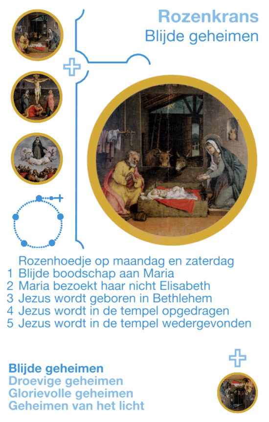](http://kwartet.gelovenleren.net/rozenkrans/blijde-geheimen)

**Blijde geheimen**

Rozenhoedje op maandag en zaterdag 1. De engel Gabriël brengt de blijde boodschap aan Maria 2. Maria bezoekt haar nicht Elisabeth 3. Jezus wordt geboren in een stal van Bethlehem 4. Jezus wordt in de tempel opgedragen 5. Jezus wordt in de tempel wedergevonden

[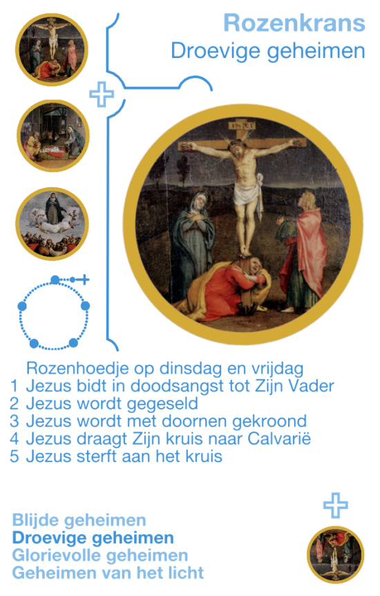](http://kwartet.gelovenleren.net/rozenkrans/droevige-geheimen)

**Droevige geheimen**

Rozenhoedje op dinsdag en vrijdag 1. Jezus bidt in doodsangst tot Zijn hemelse Vader 2. Jezus wordt gegeseld 3. Jezus wordt met doornen gekroond 4. Jezus draagt Zijn kruis naar de berg van Calvarië 5. Jezus sterft aan het kruis

[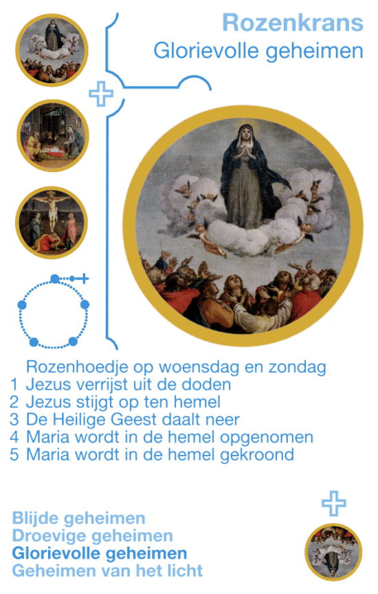](http://kwartet.gelovenleren.net/rozenkrans/glorievolle-geheimen)

**Glorievolle geheimen**

Rozenhoedje op woensdag en zondag 1. Jezus verrijst uit de doden 2. Jezus stijgt op ten hemel 3. De heilige Geest daalt neer over de apostelen 4. Maria wordt in de hemel opgenomen 5. Maria wordt in de hemel gekroond

[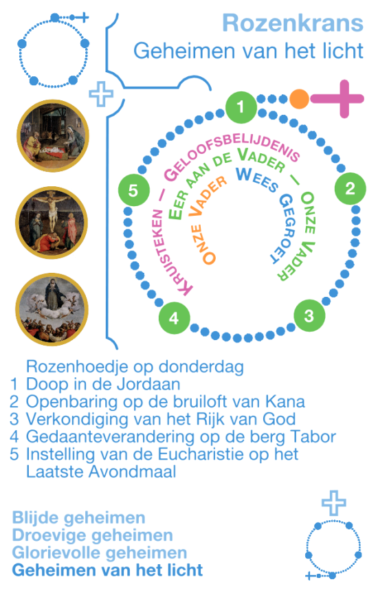](http://kwartet.gelovenleren.net/rozenkrans/geheimen-van-het-licht)

**Geheimen van het Licht**

Rozenhoedje op donderdag 1. Jezus' doop in de Jordaan 2. Jezus' openbaring op de bruiloft van Kana 3. Jezus verkondigt het Rijk van God en roept op tot bekering 4. Jezus wonderbaarlijke gedaanteverandering op de berg Tabor 5. Jezus stelt de Eucharistie in tijdens het Laatste Avondmaal
