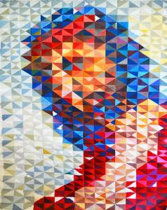
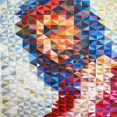
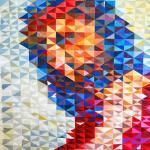
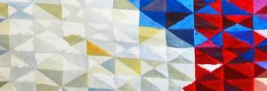
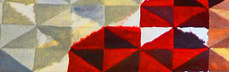
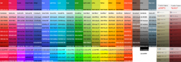
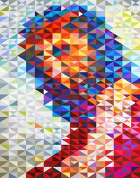

 Ecce Homo, origineel werk

In de avondlijke uurtjes van onze zomervakantie aan zee heb ik me onledig gehouden met het overtekenen van een kunstwerk. Het origineel vond ik enige tijd geleden ergens op internet. Het is een abstract werk getiteld "Ecce Homo" en stelt dus Christus voor, met doornenkroon en rode mantel, zoals die door Pilatus aan het volk getoond wordt op het bordes van het paleis na de geseling en bespotting door de Romeinse soldaten.

Nergens kan ik terugvinden wie het werk maakte, het is niet gesigneerd en de afbeelding waarop ik stootte is van lage kwaliteit, niet geschikt voor reproductie. Het werk is opgemaakt uit een rooster van driehoekjes, elk ingevuld met een egale kleur. Vier driehoekjes vormen telkens een rechthoek, en die vormen een rooster van 16 op 32 vlakken. Is de schilder daartoe gekomen omdat het gewoon gemakkelijk is een canvas te roosteren door breedte en hoogte telkens in twee te verdelen, of schuilt er een binaire code achter? Hoe dan ook: het overtekenen was dus duidelijk een werkje voor de computer!

In Inkscape, mijn favoriete SVG-editor, heb ik dus een identiek rooster aangemaakt, en de driehoekjes heb ik één voor één opgevuld met een kleur overeenkomstig aan die van het schilderij. Om het geheel homogeen te houden en omdat het origineel ook een beperkt kleurenpalet gebruikt, heb ik de kleuren ontleend aan het [kleurenschema van Google Material Design](http://www.google.com/design/spec/style/color.html# "Google Material Design") (dat ook wordt gebruikt op mijn blog, overigens).

Hoewel het overtekenen heel eenvoudig lijkt, ben ik toch op enkele problemen gestoten:

- de originele afbeelding was nogal arm aan contrast, waardoor de lichtste kleuren niet echt wit waren, maar een soort van grijs. Dat is waarschijnlijk een gevolg van de fototechniek en niet zozeer een kenmerk van het oorspronkelijke werk. Om dat te verhelpen heb ik de afbeelding in GIMP van een arbitraire gamma-correctie voorzien.  
     voor gammacorrectie
     na gammacorrectie
- voor de keuze van de kleuren was ik geheel afhankelijk van de ene afbeelding die ik tot mijn beschikking had. Als die foto in een slechte belichting is genomen of werd nabewerkt, wijken mijn kleuren af van die van het originele werk. In elk geval is mijn resultaat op het zicht globaal redelijk equivalent met de afbeelding, op enkele kleuren na waarvoor ik in het Material-Designschema op een iets verzadigder variant moest terugvallen.
- het raster van de originele afbeelding is onregelmatig: niet alle vlakken zijn exact even groot. Was dat een (opzettelijke?) slordigheid van de schilder, of een effect gegenereerd door het nemen van de foto, dat weet ik niet. In mijn versie is het raster exact.  
     detail met onregelmatig rooster
- de schilder is niet altijd even nauwkeurig tewerk gegaan. Soms heeft hij (opzettelijk?) 'buiten de lijntjes' gekleurd en lopen kleuren een beetje over in een naburig vlak. Ook dit effect heb ik niet gereproduceerd. Mijn versie mag dus 'perfecter' lijken, maar de schilder kan daarover een andere mening hebben!  
     buiten de lijntjes gekleurd
- enkele kleuren vonden helemaal geen goeie match in het Material-Designschema. Daarom heb ik twee kleuren toegevoegd, dankzij deze website. Het rood van het originele werk is veel dieper rood dan het rood van Material Design. Hoewel het rood een belangrijke kleur is in dit werk, heb ik toch gekozen voor de Material-Designversie. Dit is het kleurenschema van Material Design, met rechts de twee kolommen met de toegevoegde kleuren:  
     kleurschema
- het selecteren van een juiste kleur leert veel over het verschijnsel van [simultaancontrast](https://nl.wikipedia.org/wiki/Kleurcontrast#Simultaancontrast). Eenzelfde kleur ziet er op de ene plaats uit als bruin, op een andere plaats als grijs en elders als groen, afhankelijk van de omgevende kleurvlakken. Wellicht een techniek die de schilder bewust heeft gebruikt!
- om alle roosterpunten exact uit te lijnen, heb ik de SVG naverwerkt met een eigen gebrouwen XSLT-scriptje (het genoegen dat te bekijken gun ik de lezer niet, want het interesseert hem toch niet, en was bovendien programmatorisch broddelwerk).
- inkScape heeft een vervelende [bug](https://bugs.launchpad.net/inkscape/+bug/180612) die witte lijntjes genereert tussen vormen als gevolg van anti-aliasing. Om dat te [verhelpen](http://graphicdesign.stackexchange.com/a/50850) moet ik anti-aliasing uitzetten in InkScape, opslaan en vervolgens importeren in GIMP en opslaan als bitmap. Een goeie vectoriële PDF-versie kan ik dus spijtig genoeg niet aanmaken.

Al bij al was het dus op technisch vlak weer een leerrijke bezigheid. Ik hoop nu een goeie drukker te vinden die me een reproductie kan bezorgen op groot formaat, dan kan ik het werk ook ergens ophangen.

Naar goeie gewoonte kan de lezer de hele boel hier downloaden. Ik denk zelfs dat ik hiermee niet eens het copyright van de oorspronkelijke auteur schend, vermits het toch gaat om een eigen creatieve toevoeging aan een oorspronkelijk werk, afgaande op de moeite die ik mezelf getroost heb, zoals hierboven uiteengezet :)

 Ecco Homo, gedigitaliseerde versie

 Ecce Homo, originele versie

JPG-afbeelding op A1-formaat: [ecce-homo-A1.jpg](images/ecce-homo-A1.jpg)

SVG-afbeelding: [ecce-homo.svg](ecce-homo-A1.svg)

