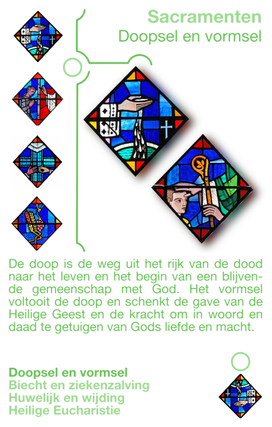
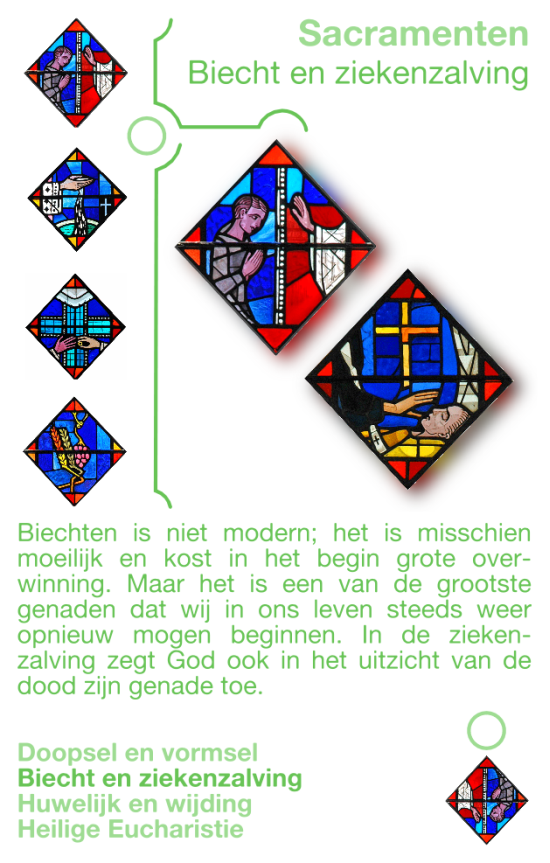
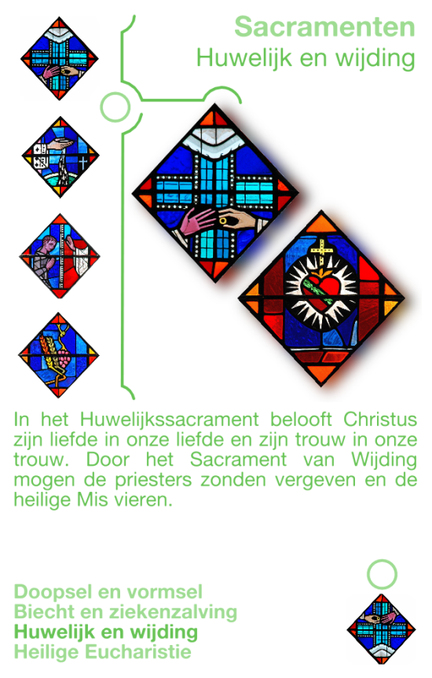
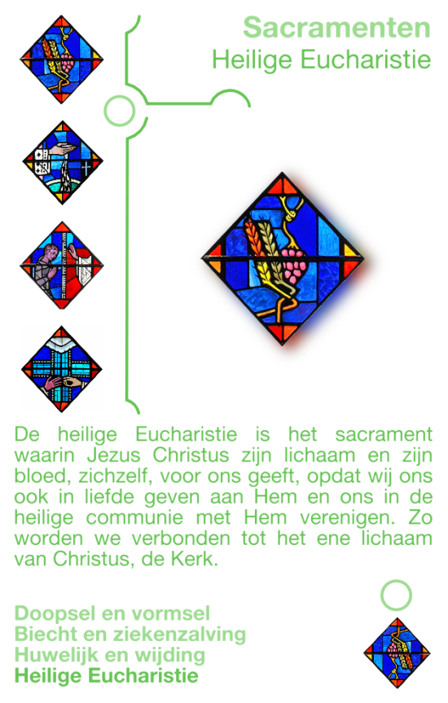
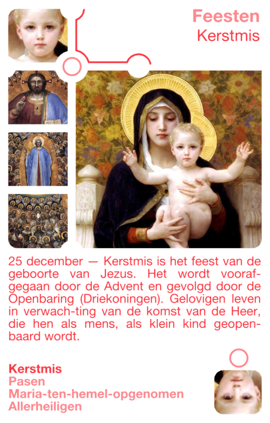
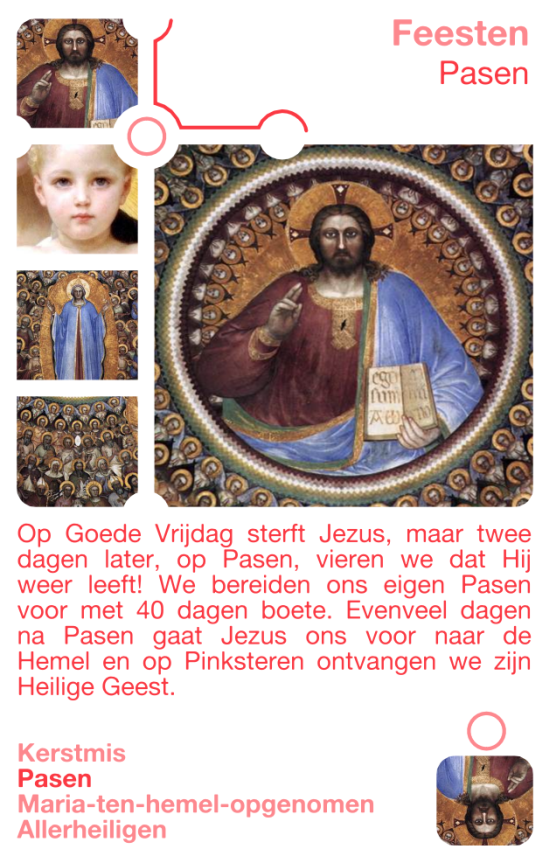
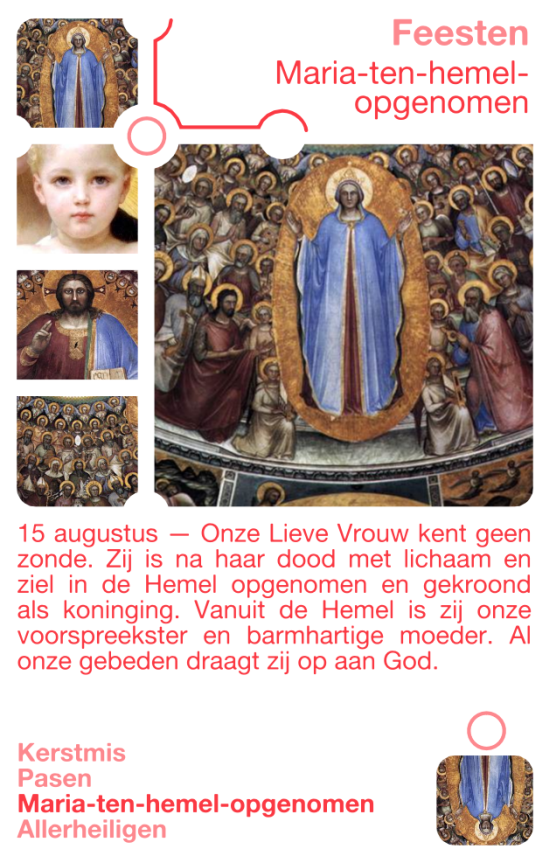
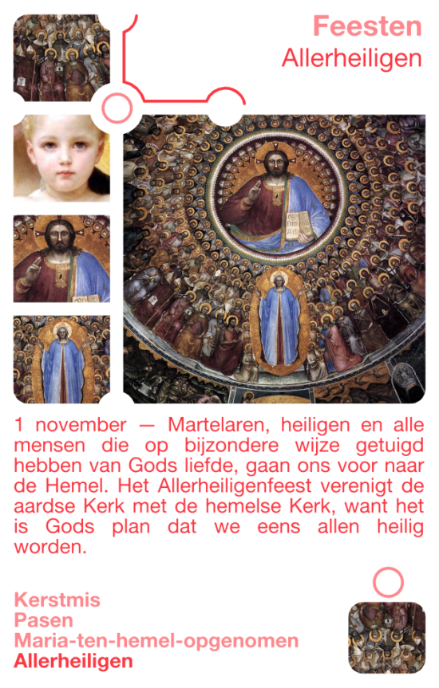

Katholiek Kwartetten is een kwartetspel met als thema het katholieke geloof. Dit artikel introduceert de laatste twee kwartetten: sacramenten en feesten.

Nu is het tijd om enkele nieuwe kwartetten toe te voegen! Er is alvast inspiratie voor kwartetten met heiligen, aartsvaderen, religieuze voorwerpen, beroemde kerken, pausen, encyclieken, concilies, apostelen, liturgische kleuren, religieuze ordes, mariale antifonen, kerkelijke ambten, delen van de liturgie, paastriduum, dimensies van het christelijk leven, vormen van de ritus, de uitersten, manieren om de bijbel te lezen en de belangrijkste geloofswaarheden. _Stay tuned!_

### Katholiek Kwartetten

[KATHOLIEK KWARTETTEN - ZELF AFDRUKKEN of BESTELLEN](/katholiek-kwartetten/ "Katholiek Kwartetten") leer hoe je de kaarten zelf kan afdrukken en download alle kaarten als PDF of bestel een spel online.

[KATHOLIEK KWARTETTEN ONLINE](/blog/katholiek-kwartetten/ "Katholiek Kwartetten met online kwis") leer meer over de website die gekoppeld is aan de kwartetkaarten en over de online spelmodus met kwis, die dit kwartet wel heel bijzonder maakt!

### Sacramenten

**Doop en Vormsel**

De doop is de weg uit het rijk van de dood naar het leven en het begin van een blijvende gemeenschap met God. Het vormsel voltooit de doop en schenkt de gave van de Heilige Geest en de kracht om in word en daad te getuigen van Gods liefde en macht.

**Biecht en Ziekenzalving**

Biechten is niet modern; het is misschien moeilijk en kost in het begin grote overwinning. Maar het is een van de grootste genaden dat wij in ons leven steeds weer opnieuw mogen beginnen. Wie gebiecht heeft, slaat een nieuwe, blanco bladzijde in het boek van zijn leven op.

**Huwelijk en Wijding**

In het Huwelijkssacrament belooft Christus zijn liefde in onze liefde en zijn trouw in onze trouw. Door het Sacrament van Wijding mogen de priesters zonden vergeven en de heilige Mis vieren.

**Heilige Eucharistie**

De heilige Eucharistie is het sacrament waarin Jezus Christus zijn lichaam en zijn bloed, zichzelf, voor ons geeft, opdat wij ons ook in liefde geven aan Hem en ons in de heilige communie met Hem verenigen. Zo worden we verbonden tot het ene lichaam van Christus, de kerk.

### Feesten

**Kerstmis**

Kerstmis is het feest van de geboorte van Jezus. Het wordt voorafgegaan door de Advent en gevolgd door de Openbaring (Driekoningen). Gelovigen leven in verwachting van de komst van de Heer, die hen als mens, als klein kind geopenbaard wordt.

**Pasen**

Op Goede Vrijdag sterft Jezus, maar twee dagen later, op Pasen, vieren we dat Hij weer leeft! We bereiden ons eigen Pasen voor met 40 dagen boete. 40 dagen na Pasen gaat Jezus ons voor naar de Hemel en op Pinksteren ontvangen we zijn Heilige Geest.

**Maria-ten-hemel-opgenomen**

Onze Lieve Vrouw kent geen zonde. Zij is na haar dood met lichaam en ziel in de Hemel opgenomen en gekroond als koninging. Vanuit de Hemel is zij onze voorspreekster en barmhartige moeder. Al onze gebeden draagt zij op aan God.

**Allerheiligen**

Martelaren, heiligen en alle mensen die op bijzondere wijze getuigd hebben van Gods liefde, gaan ons voor naar de Hemel. Het Allerheiligenfeest verenigt de aardse Kerk met de hemelse Kerk, want het is Gods plan dat we eens allen heilig worden.
