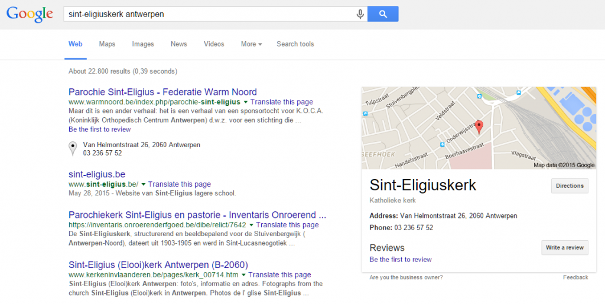

In een [vorig artikel](/blog/voeg-je-kerk-toe-aan-google-maps/) zette ik uiteen hoe eenvoudig het is om een publieke locatie, dus ook een kerk, toe te voegen aan Google Maps zodat gebruikers die gemakkelijk kunnen vinden. Het heeft me enkele uurtjes gekost, maar sinds publicatie van het artikel is het Antwerpse kerklandschap op Google Maps zowat volledig. Aan jou om ook de kerken in jouw buurt vindbaar te maken!

Niet enkel de gebruikers van Google Maps vinden zo je kerk, ook via de gewone Google zoekopdrachten krijg je meteen een kaartje met de locatie van je zoekresultaat:

 Resultaat van een zoekopdracht naar een kerk die op Google Maps bekend is

Dit zijn de nieuwe Antwerpse kerken op Google Maps:

<table dir="ltr" border="1" cellspacing="0" cellpadding="0"><colgroup><col width="116"></colgroup><tbody><tr><td data-sheets-value="[null,2,&quot;https://www.google.com/maps/place/Sint-Walburgiskerk&quot;]"><a class="in-cell-link" href="https://www.google.com/maps/place/Sint-Walburgiskerk" target="_blank">https://www.google.com/maps/place/Sint-Walburgiskerk</a></td></tr><tr><td data-sheets-value="[null,2,&quot;https://www.google.com/maps/place/Parochie+Sint-Antonius&quot;]"><a class="in-cell-link" href="https://www.google.com/maps/place/Parochie+Sint-Antonius" target="_blank">https://www.google.com/maps/place/Parochie+Sint-Antonius</a></td></tr><tr><td data-sheets-value="[null,2,&quot;https://www.google.com/maps/place/Heilige-Geestkerk&quot;]"><a class="in-cell-link" href="https://www.google.com/maps/place/Heilige-Geestkerk" target="_blank">https://www.google.com/maps/place/Heilige-Geestkerk</a></td></tr><tr><td data-sheets-value="[null,2,&quot;https://www.google.com/maps/place/Sint-Jan-De-Doperkerk&quot;]"><a class="in-cell-link" href="https://www.google.com/maps/place/Sint-Jan-De-Doperkerk" target="_blank">https://www.google.com/maps/place/Sint-Jan-De-Doperkerk</a></td></tr><tr><td data-sheets-value="[null,2,&quot;https://www.google.com/maps/place/Sint-Bernarduskerk&quot;]"><a class="in-cell-link" href="https://www.google.com/maps/place/Sint-Bernarduskerk" target="_blank">https://www.google.com/maps/place/Sint-Bernarduskerk</a></td></tr><tr><td data-sheets-value="[null,2,&quot;https://www.google.com/maps/place/Sint-Benedictuskerk&quot;]"><a class="in-cell-link" href="https://www.google.com/maps/place/Sint-Benedictuskerk" target="_blank">https://www.google.com/maps/place/Sint-Benedictuskerk</a></td></tr><tr><td data-sheets-value="[null,2,&quot;https://www.google.com/maps/place/Onze-Lieve-Vrouw-Boodschapkerk&quot;]"><a class="in-cell-link" href="https://www.google.com/maps/place/Onze-Lieve-Vrouw-Boodschapkerk" target="_blank">https://www.google.com/maps/place/Onze-Lieve-Vrouw-Boodschapkerk</a></td></tr><tr><td data-sheets-value="[null,2,&quot;https://www.google.com/maps/place/Sint-Jan-Baptistkerk&quot;]"><a class="in-cell-link" href="https://www.google.com/maps/place/Sint-Jan-Baptistkerk" target="_blank">https://www.google.com/maps/place/Sint-Jan-Baptistkerk</a></td></tr><tr><td data-sheets-value="[null,2,&quot;https://www.google.com/maps/place/Sint-Gertrudiskerk&quot;]"><a class="in-cell-link" href="https://www.google.com/maps/place/Sint-Gertrudiskerk" target="_blank">https://www.google.com/maps/place/Sint-Gertrudiskerk</a></td></tr><tr><td data-sheets-value="[null,2,&quot;https://www.google.com/maps/place/Sint-Eligiuskerk&quot;]"><a class="in-cell-link" href="https://www.google.com/maps/place/Sint-Eligiuskerk" target="_blank">https://www.google.com/maps/place/Sint-Eligiuskerk</a></td></tr><tr><td data-sheets-value="[null,2,&quot;https://www.google.com/maps/place/Sint-Lambertuskerk&quot;]"><a class="in-cell-link" href="https://www.google.com/maps/place/Sint-Lambertuskerk" target="_blank">https://www.google.com/maps/place/Sint-Lambertuskerk</a></td></tr><tr><td data-sheets-value="[null,2,&quot;https://www.google.com/maps/place/Heilig-Kruiskerk&quot;]"><a class="in-cell-link" href="https://www.google.com/maps/place/Heilig-Kruiskerk" target="_blank">https://www.google.com/maps/place/Heilig-Kruiskerk</a></td></tr><tr><td data-sheets-value="[null,2,&quot;https://www.google.com/maps/place/Sint-Martinuskerk&quot;]"><a class="in-cell-link" href="https://www.google.com/maps/place/Sint-Martinuskerk" target="_blank">https://www.google.com/maps/place/Sint-Martinuskerk</a></td></tr><tr><td data-sheets-value="[null,2,&quot;https://www.google.com/maps/place/Sint-Rumolduskerk&quot;]"><a class="in-cell-link" href="https://www.google.com/maps/place/Sint-Rumolduskerk" target="_blank">https://www.google.com/maps/place/Sint-Rumolduskerk</a></td></tr><tr><td data-sheets-value="[null,2,&quot;https://www.google.be/maps/place/Sint-Rochusstraat+79,+2100+Antwerpen/@51.2050892,4.4643883,19z/data=!3m1!4b1!4m7!1m4!3m3!1s0x47c3f7621c136af9:0x7bbb351f46ce8926!2sSint-Rochusstraat+79,+2100+Antwerpen!3b1!3m1!1s0x47c3f7621c136af9:0x7bbb351f46ce8926!10m1!1e1&quot;]"></td></tr><tr><td data-sheets-value="[null,2,&quot;https://www.google.com/maps/place/Blijde-Boodschapkerk&quot;]"><a class="in-cell-link" href="https://www.google.com/maps/place/Blijde-Boodschapkerk" target="_blank">https://www.google.com/maps/place/Blijde-Boodschapkerk</a></td></tr><tr><td data-sheets-value="[null,2,&quot;https://www.google.com/maps/place/Heilige-Familiekerk&quot;]"><a class="in-cell-link" href="https://www.google.com/maps/place/Heilige-Familiekerk" target="_blank">https://www.google.com/maps/place/Heilige-Familiekerk</a></td></tr><tr><td data-sheets-value="[null,2,&quot;https://www.google.com/maps/place/Onze-Lieve-Vrouw-Van-Altijddurende-Bijstandkerk&quot;]"><a class="in-cell-link" href="https://www.google.com/maps/place/Onze-Lieve-Vrouw-Van-Altijddurende-Bijstandkerk" target="_blank">https://www.google.com/maps/place/Onze-Lieve-Vrouw-Van-Altijddurende-Bijstandkerk</a></td></tr><tr><td data-sheets-value="[null,2,&quot;https://www.google.com/maps/place/Heilige-Bernadettekerk&quot;]"><a class="in-cell-link" href="https://www.google.com/maps/place/Heilige-Bernadettekerk" target="_blank">https://www.google.com/maps/place/Heilige-Bernadettekerk</a></td></tr><tr><td data-sheets-value="[null,2,&quot;https://www.google.com/maps/place/Onze-Lieve-Vrouw-Van-De-Bloeiende-Wijngaardkerk/&quot;]"><a class="in-cell-link" href="https://www.google.com/maps/place/Onze-Lieve-Vrouw-Van-De-Bloeiende-Wijngaardkerk/" target="_blank">https://www.google.com/maps/place/Onze-Lieve-Vrouw-Van-De-Bloeiende-Wijngaardkerk/</a></td></tr><tr><td data-sheets-value="[null,2,&quot;https://www.google.com/maps/place/Sint-Annakerk&quot;]"><a class="in-cell-link" href="https://www.google.com/maps/place/Sint-Annakerk" target="_blank">https://www.google.com/maps/place/Sint-Annakerk</a></td></tr><tr><td data-sheets-value="[null,2,&quot;https://www.google.com/maps/place/Onze-Lieve-Vrouw-van-het-Heilig-Hartkerk&quot;]"><a class="in-cell-link" href="https://www.google.com/maps/place/Onze-Lieve-Vrouw-van-het-Heilig-Hartkerk" target="_blank">https://www.google.com/maps/place/Onze-Lieve-Vrouw-van-het-Heilig-Hartkerk</a></td></tr><tr><td data-sheets-value="[null,2,&quot;https://www.google.com/maps/place/Onze-Lieve-Vrouw-ter-Sneeuwkerk&quot;]"><a class="in-cell-link" href="https://www.google.com/maps/place/Onze-Lieve-Vrouw-ter-Sneeuwkerk" target="_blank">https://www.google.com/maps/place/Onze-Lieve-Vrouw-ter-Sneeuwkerk</a></td></tr><tr><td data-sheets-value="[null,2,&quot;https://www.google.com/maps/place/Sint-Franciscus-Xaveriuskerk&quot;]"><a class="in-cell-link" href="https://www.google.com/maps/place/Sint-Franciscus-Xaveriuskerk" target="_blank">https://www.google.com/maps/place/Sint-Franciscus-Xaveriuskerk</a></td></tr><tr><td data-sheets-value="[null,2,&quot;https://www.google.com/maps/place/Sint-Pauluskerk&quot;]"><a class="in-cell-link" href="https://www.google.com/maps/place/Sint-Pauluskerk" target="_blank">https://www.google.com/maps/place/Sint-Pauluskerk</a></td></tr><tr><td data-sheets-value="[null,2,&quot;https://www.google.com/maps/place/Heilige-Familie-en-Sint-Corneelkerk&quot;]"><a class="in-cell-link" href="https://www.google.com/maps/place/Heilige-Familie-en-Sint-Corneelkerk" target="_blank">https://www.google.com/maps/place/Heilige-Familie-en-Sint-Corneelkerk</a></td></tr><tr><td data-sheets-value="[null,2,&quot;https://www.google.com/maps/place/Sint-Jan-Evangelistkerk&quot;]"><a class="in-cell-link" href="https://www.google.com/maps/place/Sint-Jan-Evangelistkerk" target="_blank">https://www.google.com/maps/place/Sint-Jan-Evangelistkerk</a></td></tr><tr><td data-sheets-value="[null,2,&quot;https://www.google.com/maps/place/Onze-Lieve-Vrouw-Boodschapkerk&quot;]"><a class="in-cell-link" href="https://www.google.com/maps/place/Onze-Lieve-Vrouw-Boodschapkerk" target="_blank">https://www.google.com/maps/place/Onze-Lieve-Vrouw-Boodschapkerk</a></td></tr></tbody></table>
