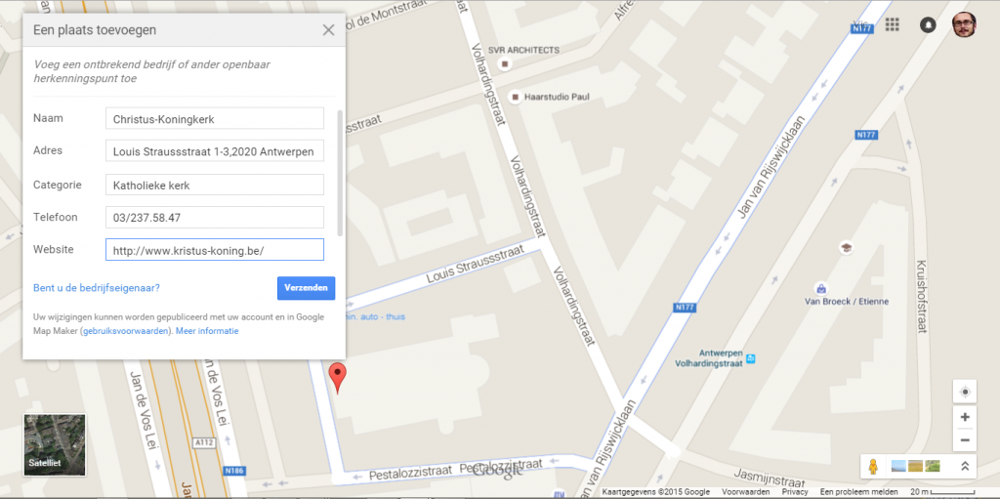

Twee jaar geleden had ik al eens een bericht gepubliceerd met instructies hoe je met [Google Map Maker](http://google.com/mapmaker) een kerk kan toevoegen aan Google Maps. Spijtig genoeg werd deze tool [niet uitsluitend voor eerbare doelen](http://www.independent.co.uk/life-style/gadgets-and-tech/news/google-map-maker-suspended-after-it-was-used-to-draw-androids-urinating-on-apple-logo-10244031.html) gebruikt en is hij al geruime tijd ontoegankelijk. Google werkt aan een nieuwe versie met betere beveiliging, maar tot op heden is die nog niet beschikbaar in ons land.

Wie toch graag zijn parochiekerk op de kaart wil zetten hoeft echter niet bij de pakken te blijven zitten, **want je kan dit nu ook rechtstreeks doen via** **[Google Maps](http://maps.google.be)****!** Nog eenvoudiger en dus is er geen enkele reden waarom jouw parochiekerk niet op de kaart zou staan.

Dit zijn stap voor stap de instructies die je kan volgen om je eigen kerk of kapel op Google maps 'vindbaar' te maken. Bij wijze van voorbeeld zal ik de [Antwerpse Christus-Koningkerk](https://www.topa.be/nl/antwerp/kerken-in-antwerpen/christus-koning/) toevoegen, de monumentale kerk aan de Jan de Voslei, gebouwd in Art Deco-stijl voor de wereldtentoonstelling van 1930:

\[caption id="attachment\_1564" align="aligncenter" width="250"\] Christus-Koningkerk\[/caption\]

**Stap 1:** controleer of je kerk inderdaad nog niet geregistreerd is. Lanceer enkele zoekopdrachten op google maps om dat uit te vinden. Zoek bijvoorbeeld op de naam van de kerk, of op het adres, en kijk na of er op de plaats van de kerk een ikoontje verschijnt dat er typisch zo uitziet:

Let wel op, want Google hanteert ingewikkelde algoritmes om te bepalen wanneer ikoontjes zichtbaar worden! Soms moet je in-zoomen, of juist uit-zoomen. Soms verschijnt het ikoontje slechts als je expliciet op de naam van de kerk zoekt. Veel hangt af van hoe 'bekend' Google vindt dat het gebouw is.

**Stap 2:** zorg dat je een google-account hebt en dat je ingelogd bent. Je ziet dan rechtsbovenaan op de kaart je eigen foto :)

**Stap 3:** gebruik de kaart om de locatie te zoeken die je wil toevoegen. Je kan een adres ingeven en je kan de sattelietweergave gebruiken om het feitelijke gebouw te lokaliseren.

\[caption id="attachment\_1566" align="aligncenter" width="640"\] Niet geïdentificeerde locatie\[/caption\]

**Stap 4:** klik nu op de locatie die je wil toevoegen. Er verschijnt een klein ikoontje op de plaats waar je hebt geklikt, en het bijhorende adres zie je linksboven op je scherm. Als een kerk is ingesloten tussen straten probeer je best goed te mikken, zodat het adres van de officiële ingang verschijnt, of als dat niet lukt kan je dat adres ook gewoon in het zoekveld ingeven.

\[caption id="attachment\_1560" align="aligncenter" width="640"\] Lange muisklik op de locatie\[/caption\]

**Stap 5:** klik op het adres dat links bovenaan is verschenen. Je krijgt er een rode marker en een nieuw schermpje voor in de plaats.

\[caption id="attachment\_1558" align="aligncenter" width="640"\] Rode adresmarker\[/caption\]

**Stap 6:** in het kleine schermpje links bovenaan vind je een link "Een ontbrekend bedrijf toevoegen", daar klik je nu op.

\[caption id="attachment\_1567" align="aligncenter" width="640"\] Invoerscherm\[/caption\]

**Stap 7:** je marker vraagt je nu om hem te verslepen naar de juiste locatie. In dit geval zet je hem best op of bij het kerkgebouw, maar hou het adres in de gaten! Bovendien is er een nieuw schermpje verschenen waar je de gegevens over de kerk kan invullen:

- **Naam.** "Christus-Koningkerk". Vermijd alternatieve namen zoals Christus-Koningparochie of Christus-Koning zonder meer.
- **Adres.** Kijk na of dit nog steeds het officiële adres van de kerk is.
- Categorie. "Katholieke kerk". Er zijn ook kerken die als categorie "Kerk" of "Christelijke kerk" hebben, maar hoe specifieker, hoe beter!
- **Telefoon.** Zoek desnoods even het nummer op, het is zeker nuttig dit ook toe te voegen!
- **Website.** Als de parochie een eigen website heeft, voeg die dan zeker toe! Je zichtbaarheid op de kaart zal mede afhankelijk zijn van de beschikbaarheid van een goeie website. Heeft de parochie dat niet, geef dan het adres is van de parochiefiche op [kerknet](http://www.kerknet.be).
- **Openingsuren.** Eventueel kan je hier de uren ingeven wanneer er liturgische diensten zijn of wanneer de kerk open is voor gebed.

\[caption id="attachment\_1562" align="aligncenter" width="640"\] Invoerscherm ingevuld\[/caption\]

**Stap 8:** klik op "Verzenden". Google bedankt je voor je bijdrage.

\[caption id="attachment\_1561" align="aligncenter" width="640"\] Dankuwel!\[/caption\]

Enige tijd later krijg je dan per mail een bevestiging als je ingave online is, dan varieert van enkele dagen tot ogenblikkelijk. Vraag me niet hoe dat precies werkt; ik heb de indruk dat je eerste ingave grondig wordt nagekeken, maar nadien gaat het veel vlotter. Het loont dus om ook meteen de kerken uit de buurt onder handen te nemen :). Ik had de voorbije dagen al enkele tests gedaan en kreeg nog binnen de tien minuten na ingave dit bericht in mijn mailbox:

\[caption id="attachment\_1556" align="aligncenter" width="505"\] Inbox\[/caption\]

En inderdaad, de Christus-Koningkerk is nu opgenomen in Google Maps:

[https://www.google.com/maps/place/Christus-Koningkerk](https://www.google.com/maps/place/Christus-Koningkerk)

\[caption id="attachment\_1559" align="aligncenter" width="640"\] Een nieuwe kerk op Google Maps\[/caption\]

Je kan nu ook een afbeelding toevoegen of een review schrijven met beknopte informatie over wat er in de kerk allemaal te beleven is. Ook dat zal zeker de zichtbaarheid ten goede komen.

Dit is het beeld dat je krijgt als je zoekt op "[Katholieke kerk in Antwerpen](https://www.google.be/maps/search/katholieke+kerk+in+antwerpen/@51.215886,4.4314392,13z)". Onderaan vind je de Christus-Koningkerk en de foto die ik zoëven toevoegde is nu ook al zichtbaar in de omschrijving.

\[caption id="attachment\_1557" align="aligncenter" width="640"\] Katholieke kerk in Antwerpen\[/caption\]

(voor de opmerkzame lezer: de Humanistisch-Vrijzinnige Vereniging duikt nadrukkelijk op in de zoekresultaten naar "Katholieke Kerk"! Zou het kunnen dat Google's zoekindex misleid is omdat het bij de HVV gonst van commentaar op onze kerk?)

Mocht je je trouwens afvragen waarom ik aanraad alle katholieke kerken op Google Maps de categorie "Katholieke kerk" te geven, en niet "Kerk" of "Christelijke kerk" of "Gebedshuis": hier is het zoekresultaat voor [kerk in antwerpen](https://www.google.be/maps/search/kerk+in+antwerpen/@51.2124168,4.390292,13z). Je vindt naast de katholieke kerken een allegaartje van protestantse kerken, synagogen, tempels etc. Geef Google dus gerust maar de meest specifieke informatie!

\[caption id="attachment\_1563" align="aligncenter" width="640"\] Kerk in Antwerpen\[/caption\]

Aan de slag!
