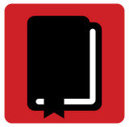
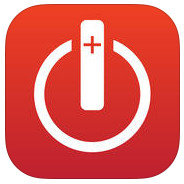

De pagina met [Katholiek Apps](/page/apps-voor-android-en-ios/) is aangevuld met twee uitgaven van een Willibrordbijbel, één voor Android en één voor iPhone/iPad. De uitgaven zijn niet gratis en trouwens ook niet echt nieuw, maar ontsnapten aan de aandacht van uw dienaar.

<table class="widget"><tbody><tr><td colspan="2"><h2>BIJBEL</h2></td></tr><tr><td></td><td><a href="https://play.google.com/store/apps/details?id=org.neotech.app.ugb.willibrordbijbel">Bijbel (Android)</a> Willibrordvertaling</td></tr><tr><td></td><td><a href="https://itunes.apple.com/nl/app/bible-pomegranate/id442673238?mt=8">BibleOn (iOS)</a> Willibrordvertaling</td></tr></tbody></table>

.

Ter informatie: de Nieuwe Bijbelvertaling is ook mobiel te verkrijgen, maar dan als [e-boek](/page/e-boeken/).

De mobiele lezer zal opmerken dat er nog andere bijbeluitgaven in de _stores_ liggen, maar dit blog neemt de vrijheid zich te beperken tot de katholieke uitgaven, een verschil waar soms nogal snel overheen wordt gegaan.
