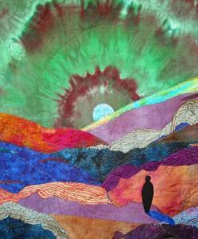
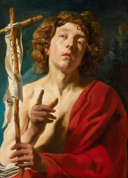
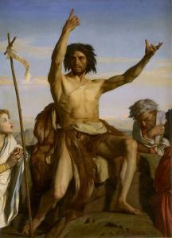
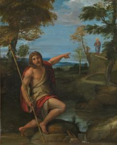
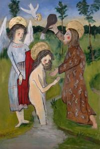
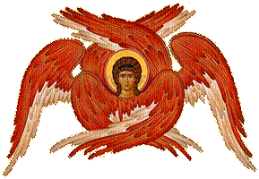

# Synopsis van het Doopsel van Jezus

<table class="MsoNormalTable" style="width: 470.0pt; border-collapse: collapse;" border="0" width="627" cellspacing="0" cellpadding="0"><tbody><tr><td style="width: 100.0pt; padding: 0cm 5.4pt 12.0pt 5.4pt;" valign="top" width="133">
4 tot 10 &nbsp;rollen met tekst
</td><td style="width: 270.0pt; padding: 0cm 5.4pt 12.0pt 5.4pt;" valign="top" width="360">
Verteller (Jesaja, Stem uit de Hemel), Johannes, Volk (Priesters en Levieten, Farizeeën en sadduceeën, Dopelingen, Tollenaars, Soldaten), Jezus
</td><td style="width: 100.0pt; padding: 0cm 5.4pt 12.0pt 5.4pt;" valign="bottom" width="133">
&nbsp;
</td></tr><tr><td style="width: 100.0pt; padding: 0cm 5.4pt 12.0pt 5.4pt;" valign="top" width="133">
&nbsp;locatie
</td><td style="width: 270.0pt; padding: 0cm 5.4pt 12.0pt 5.4pt;" valign="top" width="360">
Bij de rivier de Jordaan
</td><td style="width: 100.0pt; padding: 0cm 5.4pt 12.0pt 5.4pt;" valign="bottom" width="133">
&nbsp;
</td></tr><tr><td style="width: 100.0pt; padding: 0cm 5.4pt 12.0pt 5.4pt;" valign="top" width="133">
Jesaja
</td><td style="width: 270.0pt; padding: 0cm 5.4pt 12.0pt 5.4pt;" valign="top" width="360">
Luister, iemand roept:

‘Bereid de HEER een weg in de woestijn, in het dorre land, een rechte baan voor onze God.&nbsp; Elk dal moet worden opgehoogd, en elke berg en heuvel moet worden afgegraven; oneffen plekken moeten vlak gemaakt worden en ruige gronden worden een vlakte. De heerlijkheid van de HEER zal zich openbaren, en alle mensen zullen haar zien, want de mond van de HEER heeft gesproken.’
</td><td style="width: 100.0pt; padding: 0cm 5.4pt 12.0pt 5.4pt;" valign="bottom" width="133">
Js 40:3-5
</td></tr><tr><td style="width: 370.0pt; padding: 0cm 5.4pt 12.0pt 5.4pt;" colspan="2" valign="top" width="493">

</td><td style="width: 100.0pt; padding: 0cm 5.4pt 12.0pt 5.4pt;" valign="bottom" width="133">
A voice in the wilderness (Lorie McCown, 2012, © Lorie McCown)
</td></tr><tr><td style="width: 100.0pt; padding: 0cm 5.4pt 12.0pt 5.4pt;" valign="top" width="133">
Verteller
</td><td style="width: 270.0pt; padding: 0cm 5.4pt 12.0pt 5.4pt;" valign="top" width="360">
In het vijftiende regeringsjaar van keizer Tiberius, wanneer Pontius&nbsp; Pilatus gouverneur is van Judea, Herodes tetrarch van Galilea, zijn broer Filippus tetrarch van de landstreek Iturea en Trachonitis, Lysanias tetrarch van Abilene,&nbsp; en Annas en Kajafas hogepriester, komt het woord van God tot Johannes, de zoon van Zacharias, in de woestijn. En hij gaat overal in de Jordaanstreek een doop van bekering verkondigen tot vergeving van zonden,

Deze Johannes heeft een kleed aan van kameelhaar en draagt een leren gordel om zijn middel. Zijn voedsel bestaat uit sprinkhanen en wilde honing.

De Joden hebben uit Jeruzalem priesters en Levieten op hem afgestuurd om hem uit te horen.
</td><td style="width: 100.0pt; padding: 0cm 5.4pt 12.0pt 5.4pt;" valign="bottom" width="133">
Lc 3:1-3

Mt 3:4

Joh 1:19
</td></tr><tr><td style="width: 370.0pt; padding: 0cm 5.4pt 12.0pt 5.4pt;" colspan="2" valign="top" width="493">

</td><td style="width: 100.0pt; padding: 0cm 5.4pt 12.0pt 5.4pt;" valign="bottom" width="133">
John the Baptist (Jacob Jordaens, Rubenshuis, Antwerpen)
</td></tr><tr><td style="width: 100.0pt; padding: 0cm 5.4pt 12.0pt 5.4pt;" valign="top" width="133">
Priesters en Levieten
</td><td style="width: 270.0pt; padding: 0cm 5.4pt 12.0pt 5.4pt;" valign="top" width="360">
Wie bent u? Bent U de Messias?
</td><td style="width: 100.0pt; padding: 0cm 5.4pt 12.0pt 5.4pt;" valign="bottom" width="133">
Joh 1:19

Lc 3:15
</td></tr><tr><td style="width: 100.0pt; padding: 0cm 5.4pt 12.0pt 5.4pt;" valign="top" width="133">
Johannes
</td><td style="width: 270.0pt; padding: 0cm 5.4pt 12.0pt 5.4pt;" valign="top" width="360">
Ik ben de Messias niet.
</td><td style="width: 100.0pt; padding: 0cm 5.4pt 12.0pt 5.4pt;" valign="bottom" width="133">
Joh 1:20
</td></tr><tr><td style="width: 100.0pt; padding: 0cm 5.4pt 12.0pt 5.4pt;" valign="top" width="133">
Priesters en Levieten
</td><td style="width: 270.0pt; padding: 0cm 5.4pt 12.0pt 5.4pt;" valign="top" width="360">
Wie dan wel? Bent u Elia?
</td><td style="width: 100.0pt; padding: 0cm 5.4pt 12.0pt 5.4pt;" valign="bottom" width="133">
Joh 1:21
</td></tr><tr><td style="width: 100.0pt; padding: 0cm 5.4pt 12.0pt 5.4pt;" valign="top" width="133">
Johannes
</td><td style="width: 270.0pt; padding: 0cm 5.4pt 12.0pt 5.4pt;" valign="top" width="360">
Die ben ik ook niet
</td><td style="width: 100.0pt; padding: 0cm 5.4pt 12.0pt 5.4pt;" valign="bottom" width="133">
Joh 1:21
</td></tr><tr><td style="width: 100.0pt; padding: 0cm 5.4pt 12.0pt 5.4pt;" valign="top" width="133">
Priesters en Levieten
</td><td style="width: 270.0pt; padding: 0cm 5.4pt 12.0pt 5.4pt;" valign="top" width="360">
Bent u soms de profeet?
</td><td style="width: 100.0pt; padding: 0cm 5.4pt 12.0pt 5.4pt;" valign="bottom" width="133">
Joh 1:21
</td></tr><tr><td style="width: 100.0pt; padding: 0cm 5.4pt 12.0pt 5.4pt;" valign="top" width="133">
Johannes
</td><td style="width: 270.0pt; padding: 0cm 5.4pt 12.0pt 5.4pt;" valign="top" width="360">
Nee.
</td><td style="width: 100.0pt; padding: 0cm 5.4pt 12.0pt 5.4pt;" valign="bottom" width="133">
Joh 1:21
</td></tr><tr><td style="width: 100.0pt; padding: 0cm 5.4pt 12.0pt 5.4pt;" valign="top" width="133">
Priesters en Levieten
</td><td style="width: 270.0pt; padding: 0cm 5.4pt 12.0pt 5.4pt;" valign="top" width="360">
Wie bent u dan? We willen een antwoord geven aan degenen die ons gestuurd hebben. Wat zegt u over uzelf?
</td><td style="width: 100.0pt; padding: 0cm 5.4pt 12.0pt 5.4pt;" valign="bottom" width="133">
Joh 1:22
</td></tr><tr><td style="width: 100.0pt; padding: 0cm 5.4pt 12.0pt 5.4pt;" valign="top" width="133">
Johannes
</td><td style="width: 270.0pt; padding: 0cm 5.4pt 12.0pt 5.4pt;" valign="top" width="360">
Ik ben een stem die roept in de woestijn: “Maak recht de weg van de Heer”, zoals de profeet Jesaja gezegd heeft.
</td><td style="width: 100.0pt; padding: 0cm 5.4pt 12.0pt 5.4pt;" valign="bottom" width="133">
Joh 1:23
</td></tr><tr><td style="width: 100.0pt; padding: 0cm 5.4pt 12.0pt 5.4pt;" valign="top" width="133">
Priesters en Levieten
</td><td style="width: 270.0pt; padding: 0cm 5.4pt 12.0pt 5.4pt;" valign="top" width="360">
Maar als u de Messias niet bent en ook Elia niet of de profeet, waarom doopt u dan?
</td><td style="width: 100.0pt; padding: 0cm 5.4pt 12.0pt 5.4pt;" valign="bottom" width="133">
Joh 1:25
</td></tr><tr><td style="width: 100.0pt; padding: 0cm 5.4pt 12.0pt 5.4pt;" valign="top" width="133">
Johannes
</td><td style="width: 270.0pt; padding: 0cm 5.4pt 12.0pt 5.4pt;" valign="top" width="360">
Ik doop u in water met het oog op bekering. Maar Hij die na mij komt, is krachtiger dan ik. Ik ben te min om Hem zijn sandalen te brengen. Hij zal u dopen in heilige Geest en vuur.’

Bekeer u, want het koninkrijk der hemelen is ophanden.
</td><td style="width: 100.0pt; padding: 0cm 5.4pt 12.0pt 5.4pt;" valign="bottom" width="133">
Mt 3:11,2
</td></tr><tr><td style="width: 370.0pt; padding: 0cm 5.4pt 12.0pt 5.4pt;" colspan="2" valign="top" width="493">

</td><td style="width: 100.0pt; padding: 0cm 5.4pt 12.0pt 5.4pt;" valign="bottom" width="133">
Holy Spirit in Fire
</td></tr><tr><td style="width: 100.0pt; padding: 0cm 5.4pt 12.0pt 5.4pt;" valign="top" width="133">
Verteller
</td><td style="width: 270.0pt; padding: 0cm 5.4pt 12.0pt 5.4pt;" valign="top" width="360">
Heel Judea en alle inwoners van Jeruzalem lopen naar hem uit. Ze laten zich door hem dopen in de rivier de Jordaan, en belijden hun zonden.

Hij ziet dat velen uit de kringen van farizeeën en sadduceeën op zijn doop afkomen.
</td><td style="width: 100.0pt; padding: 0cm 5.4pt 12.0pt 5.4pt;" valign="bottom" width="133">
Mc 1:5

Mt 3:7
</td></tr><tr><td style="width: 100.0pt; padding: 0cm 5.4pt 12.0pt 5.4pt;" valign="top" width="133">
Johannes
</td><td style="width: 270.0pt; padding: 0cm 5.4pt 12.0pt 5.4pt;" valign="top" width="360">
Addergebroed, wie heeft u voorgespiegeld dat u de komende toorn kunt ontlopen? Breng liever vrucht voort waaruit bekering blijkt.
</td><td style="width: 100.0pt; padding: 0cm 5.4pt 12.0pt 5.4pt;" valign="bottom" width="133">
Mt 3:7-8
</td></tr><tr><td style="width: 100.0pt; padding: 0cm 5.4pt 12.0pt 5.4pt;" valign="top" width="133">
Farizeeën en sadduceeën
</td><td style="width: 270.0pt; padding: 0cm 5.4pt 12.0pt 5.4pt;" valign="top" width="360">
Wij hebben Abraham als vader!
</td><td style="width: 100.0pt; padding: 0cm 5.4pt 12.0pt 5.4pt;" valign="bottom" width="133">
Mt 3:9
</td></tr><tr><td style="width: 100.0pt; padding: 0cm 5.4pt 12.0pt 5.4pt;" valign="top" width="133">
Johannes
</td><td style="width: 270.0pt; padding: 0cm 5.4pt 12.0pt 5.4pt;" valign="top" width="360">
God kan van deze stenen kinderen maken voor Abraham. De bijl ligt al aan de wortel van de bomen. Iedere boom die geen goede vrucht voortbrengt, wordt omgehakt en in het vuur gegooid. De wan heeft Hij al in zijn hand, en Hij zal zijn dorsvloer opruimen; zijn graan zal Hij verzamelen in zijn schuur, maar het kaf verbranden in onblusbaar vuur
</td><td style="width: 100.0pt; padding: 0cm 5.4pt 12.0pt 5.4pt;" valign="bottom" width="133">
Mt 3:10,12
</td></tr><tr><td style="width: 370.0pt; padding: 0cm 5.4pt 12.0pt 5.4pt;" colspan="2" valign="top" width="493">

</td><td style="width: 100.0pt; padding: 0cm 5.4pt 12.0pt 5.4pt;" valign="bottom" width="133">
Saint John the Baptist (Alexandre Cabanel, 1849, Musée Fabre, Montpellier)
</td></tr><tr><td style="width: 100.0pt; padding: 0cm 5.4pt 12.0pt 5.4pt;" valign="top" width="133">
Dopelingen
</td><td style="width: 270.0pt; padding: 0cm 5.4pt 12.0pt 5.4pt;" valign="top" width="360">
Wat moeten wij dan doen?
</td><td style="width: 100.0pt; padding: 0cm 5.4pt 12.0pt 5.4pt;" valign="bottom" width="133">
Lc 3:10
</td></tr><tr><td style="width: 100.0pt; padding: 0cm 5.4pt 12.0pt 5.4pt;" valign="top" width="133">
Johannes
</td><td style="width: 270.0pt; padding: 0cm 5.4pt 12.0pt 5.4pt;" valign="top" width="360">
Wie twee stel kleren heeft, moet delen met iemand die niets heeft, en wie te eten heeft, moet hetzelfde doen.
</td><td style="width: 100.0pt; padding: 0cm 5.4pt 12.0pt 5.4pt;" valign="bottom" width="133">
Lc 3:11
</td></tr><tr><td style="width: 100.0pt; padding: 0cm 5.4pt 12.0pt 5.4pt;" valign="top" width="133">
Tollenaars
</td><td style="width: 270.0pt; padding: 0cm 5.4pt 12.0pt 5.4pt;" valign="top" width="360">
Meester, wat moeten wij doen?
</td><td style="width: 100.0pt; padding: 0cm 5.4pt 12.0pt 5.4pt;" valign="bottom" width="133">
Lc 3:12
</td></tr><tr><td style="width: 100.0pt; padding: 0cm 5.4pt 12.0pt 5.4pt;" valign="top" width="133">
Johannes
</td><td style="width: 270.0pt; padding: 0cm 5.4pt 12.0pt 5.4pt;" valign="top" width="360">
Vorder niet meer dan u is voorgeschreven.
</td><td style="width: 100.0pt; padding: 0cm 5.4pt 12.0pt 5.4pt;" valign="bottom" width="133">
Lc 3:13
</td></tr><tr><td style="width: 100.0pt; padding: 0cm 5.4pt 12.0pt 5.4pt;" valign="top" width="133">
Soldaten
</td><td style="width: 270.0pt; padding: 0cm 5.4pt 12.0pt 5.4pt;" valign="top" width="360">
En wij, wat moeten wij doen?
</td><td style="width: 100.0pt; padding: 0cm 5.4pt 12.0pt 5.4pt;" valign="bottom" width="133">
Lc 3:14
</td></tr><tr><td style="width: 100.0pt; padding: 0cm 5.4pt 12.0pt 5.4pt;" valign="top" width="133">
Johannes
</td><td style="width: 270.0pt; padding: 0cm 5.4pt 12.0pt 5.4pt;" valign="top" width="360">
Pers niemand geld af, ook niet onder valse voorwendsels, maar wees tevreden met uw soldij.

Bekeer u en laat u dopen tot vergeving van zonden!
</td><td style="width: 100.0pt; padding: 0cm 5.4pt 12.0pt 5.4pt;" valign="bottom" width="133">
Lc 3:14

Mc 1:4
</td></tr><tr><td style="width: 370.0pt; padding: 0cm 5.4pt 12.0pt 5.4pt;" colspan="2" valign="top" width="493">

</td><td style="width: 100.0pt; padding: 0cm 5.4pt 12.0pt 5.4pt;" valign="bottom" width="133">
Saint John the Baptist bearing witness (Annibale Carracci, ca. 1600-1602, The Metropolitan Museum of Art, New York)
</td></tr><tr><td style="width: 100.0pt; padding: 0cm 5.4pt 12.0pt 5.4pt;" valign="top" width="133">
Verteller
</td><td style="width: 270.0pt; padding: 0cm 5.4pt 12.0pt 5.4pt;" valign="top" width="360">
Jezus komt uit Galilea naar Johannes bij de Jordaan om zich door hem te laten dopen. Johannes probeert Hem tegen te houden.
</td><td style="width: 100.0pt; padding: 0cm 5.4pt 12.0pt 5.4pt;" valign="bottom" width="133">
Mt 3:13-14
</td></tr><tr><td style="width: 100.0pt; padding: 0cm 5.4pt 12.0pt 5.4pt;" valign="top" width="133">
Johannes
</td><td style="width: 270.0pt; padding: 0cm 5.4pt 12.0pt 5.4pt;" valign="top" width="360">
Ik zou door U gedoopt moeten worden, en U komt naar mij?
</td><td style="width: 100.0pt; padding: 0cm 5.4pt 12.0pt 5.4pt;" valign="bottom" width="133">
Mt 3:14
</td></tr><tr><td style="width: 100.0pt; padding: 0cm 5.4pt 12.0pt 5.4pt;" valign="top" width="133">
Jezus
</td><td style="width: 270.0pt; padding: 0cm 5.4pt 12.0pt 5.4pt;" valign="top" width="360">
Laat nu maar, want zo behoren wij de gerechtigheid volledig te vervullen.
</td><td style="width: 100.0pt; padding: 0cm 5.4pt 12.0pt 5.4pt;" valign="bottom" width="133">
Mt 3:15
</td></tr><tr><td style="width: 100.0pt; padding: 0cm 5.4pt 12.0pt 5.4pt;" valign="top" width="133">
Johannes
</td><td style="width: 270.0pt; padding: 0cm 5.4pt 12.0pt 5.4pt;" valign="top" width="360">
‘Daar is het lam van God, degene die de zonde van de wereld wegneemt. Hij is het van wie ik zei: “Na mij komt iemand die mijn meerdere is, want vóór mij was Hij er al.” Ikzelf wist niet wie het zou zijn, maar omdat Hij aan Israël moest worden geopenbaard, daarom ben ik komen dopen in water.’
</td><td style="width: 100.0pt; padding: 0cm 5.4pt 12.0pt 5.4pt;" valign="bottom" width="133">
Joh 1:29-31
</td></tr><tr><td style="width: 370.0pt; padding: 0cm 5.4pt 12.0pt 5.4pt;" colspan="2" valign="top" width="493">

</td><td style="width: 100.0pt; padding: 0cm 5.4pt 12.0pt 5.4pt;" valign="bottom" width="133">
Baptism (Vincent Decourt, © Vincent Decourt)
</td></tr><tr style="page-break-inside: avoid;"><td style="width: 100.0pt; padding: 0cm 5.4pt 12.0pt 5.4pt;" valign="top" width="133">
&nbsp;
</td><td style="width: 270.0pt; padding: 0cm 5.4pt 12.0pt 5.4pt;" valign="top" width="360">
<em>Het gehele volk laat zich dopen, en zo ook Jezus.</em>
</td><td style="width: 100.0pt; padding: 0cm 5.4pt 12.0pt 5.4pt;" valign="bottom" width="133">
Lc 3:21
</td></tr><tr><td style="width: 100.0pt; padding: 0cm 5.4pt 12.0pt 5.4pt;" valign="top" width="133">
Verteller
</td><td style="width: 270.0pt; padding: 0cm 5.4pt 12.0pt 5.4pt;" valign="top" width="360">
Als Jezus gedoopt is, komt Hij meteen uit het water. En zie, daar opent zich de hemel voor Hem en Hij ziet de Geest van God als een duif neerdalen en op Hem neerkomen. Er komt een stem uit de hemel.
</td><td style="width: 100.0pt; padding: 0cm 5.4pt 12.0pt 5.4pt;" valign="bottom" width="133">
Mt 3:16-17
</td></tr><tr><td style="width: 100.0pt; padding: 0cm 5.4pt 12.0pt 5.4pt;" valign="top" width="133">
Stem uit de Hemel
</td><td style="width: 270.0pt; padding: 0cm 5.4pt 12.0pt 5.4pt;" valign="top" width="360">
Jij bent mijn geliefde Zoon, in wie Ik vreugde vind.’
</td><td style="width: 100.0pt; padding: 0cm 5.4pt 12.0pt 5.4pt;" valign="bottom" width="133">
Lc 3:22
</td></tr><tr><td style="width: 100.0pt; padding: 0cm 5.4pt 12.0pt 5.4pt;" valign="top" width="133">
Johannes
</td><td style="width: 270.0pt; padding: 0cm 5.4pt 12.0pt 5.4pt;" valign="top" width="360">
‘Ik heb gezien hoe de Geest als een duif uit de hemel neerdaalde en op Hem bleef rusten. Ikzelf wist niet wie het zou zijn, maar Hij die mij gezonden had om te dopen in water, had mij gezegd: “Als je ziet dat de Geest op iemand neerdaalt en op Hem blijft rusten, dan weet je: Hij is degene die doopt in heilige Geest.” Ik heb het gezien, en mijn getuigenis luidt: dit is de Zoon van God.’
</td><td style="width: 100.0pt; padding: 0cm 5.4pt 12.0pt 5.4pt;" valign="bottom" width="133">
Joh 1:32-34
</td></tr></tbody></table>

# [MEER BIJBELTONEEL](/bijbeltoneel/ "Bijbeltoneel")

A.M.D.G.
