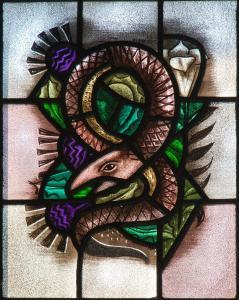
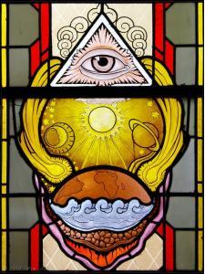
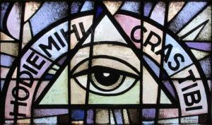
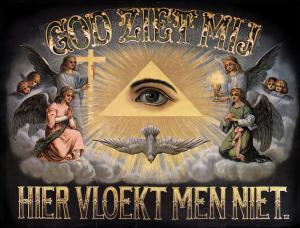

Dit artikeltje gaat over twee begrippen: _voorzichtigheid_ en _voorzienigheid_. Vooraleer we God erbij gaan betrekken, moet je eens naar de woorden zelf kijken. Eigenlijk staat er tweemaal hetzelfde, want 'zicht' en 'zien' is hetzelfde. Woordelijk gaat het over "vooruit kijken", naar wat komt. In het Latijn is dat trouwens net zo: voorzienigheid vertaalt zich als _providentia_ (van _pro-videre_: voor-zien) en voorzichtigheid als _prudentia_, wat gewoon een samentrekking is van het woord _providentia_. Hoewel de betekenis van beide woorden verschillend is, is in beider betekenis de kern het vooruit-kijken.

 De deugd van de voorzichtigheid, allegorisch voorgesteld als een slang, een ontlening aan [Mt 10:16](http://www.willibrordbijbel.nl/index.php?p=page&i=45847,45873), St. Lambertuskerk, Maren Kessel (NL)

In godsdienstige context lopen de betekenissen duidelijk uiteen. [_Voorzichtigheid_](http://www.brascamp.com/prudentia.htm) is een kwaliteit van de mens (één van de vier "[kardinale deugden](http://tongerlo.org/~tongerlo/2016/06/04/de-kardinale-deugden/)") en [_voorzienigheid_](/blog/gods-voorzienigheid/) is een kwaliteit van God. Beiden kunnen vooruit-kijken, zij het de Ene wat verder dan de andere. Eerst even twee uittreksels uit de Mechelse catechismus:

[Draagt God zorg voor al zijn schepselen?](http://www.hetkatholiekegeloof.nl/sub/39-draagt-god-zorg-voor-al-zi/)

_Ja, God draagt zorg voor al zijn schepselen, door ze in stand te houden en te besturen: deze zorg noemt men de «goddelijke Voorzienigheid »._

[Wat is de voorzichtigheid?](http://www.hetkatholiekegeloof.nl/sub/188-wat-is-de-voorzichtigheid/)

_De voorzichtigheid is de deugd die ons de beste middelen doet aanwenden om christelijk te leven en in de hemel te komen._

Hoewel deze begrippen dus in de grond gelijk zijn, leiden ze eigenaardig genoeg tot één van de grootste dilemma's van het geloof, ook in onze tijd. Drijf je de definities op de spits, dan spreken ze mekaar tegen, en dat merk je in de loop van de kerkelijke geschiedenis genoeg. Hoeveel ketterijen zijn er niet gebaseerd op de verabsolutering van de _voorzienigheid_ tot predeterminatie of tegenovergesteld de verheerlijking van de _voorzichtigheid_ als een louter menselijke verdienste die rechtvaardiging is om in de Hemel te komen. Het dilemma raakt ook aan onze vraag naar vrijheid. Hoe vrij ben ik om mijn eigen weg te bepalen, als God alles voorziet?

 Het alziende oog van de goddelijke voorzienigheid, glasraam in missiehuis St. Michaël, Steyl (NL)

Als je de concepten iets behoedzamer benadert, vallen ze evenwel te verzoenen. Meer nog: ze worden complementair. Gods voorzienigheid baat niets, als ik geen voorzichtigheid aan de dag leg. En mocht ik nog zo voorzichtig zijn, mijn menselijk falen zou toch alles doen mislukken als God niet voorzienig was. Dus ook andersom, als ik een keuze zou maken, in eer en geweten, die door anderen (zelfs indien zij een 'meerderheid' vormen) wordt afgeraden, dan nog kan ik genieten van Gods voorzienigheid. Gods voorzienigheid (die per definitie volmaakt is) en mijn voorzichtigheid (die per definitie onvolmaakt is) vullen mekaar perfect aan.

 Alziend oog met opschrift "Hodie mihi, cras tibi" (heden ik, morgen gij), Begraafplaats Rijnsburg (NL)

Dat is goed nieuws voor [bangeriken en controlefreaks](https://catholic-link.org/7-tips-perfectionists-dont-want-to-hear/), die geruster en meer ontspannen mogen zijn en niet voortdurend in angst moeten leven dat er wel eens iets mis zou kunnen gaan, in hun eigen levensgang of in die van wie zij menen te bevoogden. Dat is eveneens goed nieuws voor [avonturiers en ondernemers](http://biddenonderweg.org/gebed/?uid=3993), die zonder schroom tegen de stroom in mogen roeien. Zolang hun onconventionele of onzekere keuzes oprecht het christelijk leven betrachten, mogen ze erop rekenen dat God erin voorziet alles ten goede te keren, zelfs doorheen mislukkingen, tegenslag of weerwerk.

> De voorzichtigheid betekent dat het geweten noodzakelijk is om een goed leven te leiden, maar de voorzienigheid betekent dat mijn geweten ook zijn grenzen heeft. De onvolmaaktheid van mijn voorzichtigheid, wordt aangevuld met Gods voorzienigheid.

De voorzienigheid van God zorgt ervoor dat goede intenties worden beloond, meteen of in het hiernamaals. Godsvruchtige keuzes die in de ogen van de mensen tot mislukken gedoemd lijken, worden ten goede gekeerd. Op voorwaarde althans dat ze gegrondvest zijn op een zuiver en gevormd geweten. Wie tegen beter weten in te werk gaat, dreigt evenwel in de kou te blijven staan.

 Traditionele huiskamerprent "God ziet mij, hier vloekt men niet", teken van voorzienigheid, of aanmaning tot voorzichtigheid?

Dat is ook slecht nieuws voor moraalridders, die aan goede bedoelingen voorbijgaan en menen het Laatste Oordeel een stapje voor te kunnen zijn. Zij lopen immers het risico Gods voorzienigheid tegen te werken, en dat kan toch niet de bedoeling zijn?

Voorzichtigheid en voorzienigheid bakenen de grenzen af van ons persoonlijk geweten. De voorzichtigheid betekent dat het geweten noodzakelijk is om een goed leven te leiden, maar de voorzienigheid betekent dat mijn geweten ook zijn grenzen heeft. De onvolmaaktheid van mijn voorzichtigheid, wordt aangevuld met Gods voorzienigheid. In die zin is dit ook een vorm van nederigheid, te beseffen dat mijn geweten geen absoluut oordeel kan vellen, niet over mijn eigen keuzes, en zeker niet over die van een ander: het heeft de aanvulling van de voorzienigheid nodig. Overdreven voorzichtigheid is zelfs een vorm van hoogmoed in het licht van Gods voorzienigheid. Maar de voorzienigheid kan ook geen aanleiding tot morele luiheid zijn, want voorzichtigheid blijft geboden!

In elk geval: wie wil genieten van Gods voorzienigheid, mag een ander diezelfde voorzienigheid niet ontzeggen. En dat is wat gebeurt als we over een ander kwaadspreken louter en alleen omdat hij of zij keuzes maakt die niet de onze zijn, zonder ons af te vragen of ze ook vanuit het oogpunt van de ander in eer en geweten gegrond zijn. Dan neemt onze eigen voorzichtigheid de plaats in van Gods voorzienigheid en betonen we respect noch aan God, noch aan onze medemens en diens relatie tot God.

Toch gebeurt dit in onze Kerk nog veel te vaak.

[Download dit artikel als PDF](/portfolio/voorzichtigheid-en-voorzienigheid/)

* * *

### Uit de Mechelse Catechismus

[**§ 301 Hoe word je voorzichtig?**](http://www.hetkatholiekegeloof.nl//pages/sub/3/34768/301_Hoe_word_je_voorzichtig_.html)

_Men wordt voorzichtig door te leren het essentiële te onderscheiden van het niet-essentiële, de juiste doelen voor ogen te houden en de beste middelen te kiezen om ze te bereiken._ _De deugd van de voorzichtigheid stuurt alle andere deugden._ _Want voorzichtigheid is het vermogen te onderscheiden wat juist is._ _Wie een goed leven wil leiden, moet immers weten wat het 'goede' is en er de waarde van inzien._ _Als de koopman in het evangelie: 'Toen hij een uitzonderlijk waardevolle parel vond, besloot hij alles te verkopen wat hij had en die te kopen' (Mat. 13:46)._ _Pas iemand die voorzichtig is, kan gerechtigheid, dapperheid en de juiste maat inzetten om het goede te doen._
