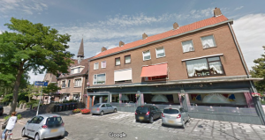

 China City Wok te Dordrecht, met in de achtergrond een protestantse kerk

Enkele weken geleden brachten we een aangenaam weekendje door in Dordrecht. Zaterdagavond aten we bij de Chinees net om de hoek van onze B&B. Naast ons zat aan een lange tafel een gezelschap van wel een vijftigtal mensen. Blijkbaar katholieken, want onder hen bevond zich een priester (herkenbaar aan zijn boord, zoals dat hoort) en die voerde met iedereen gesprekken. Al snel bleek dat de aanwezigen leden waren van parochies die net een fusie achter de rug hadden en afscheid hadden moeten nemen van hun eigen parochie en/of kerk.

Mijn echtgenote sprak de priester even aan, en die vertelde dat in hun nieuwe parochie gelovigen tot wel veertig km moesten reizen om naar de mis te komen. In een straal van een kilometer kan ik (nu nog) kiezen tussen een vijftal kerken.

Zondag vernam ik op de kerkraad van onze eigen parochie dat het "kerkenplan" stilaan vorm begint te krijgen. Slecht nieuws echter: uit een inventaris en analyse van de materiële toestand van de kerken blijkt dat onze kerk in de ganse stad aan het staartje bengelt wat betreft haar financiële draagkracht. Is het nog langer verantwoord om de [belastingbetaler elk jaar onze factuur te sturen](/blog/de-kostprijs-van-een-parochie/)?

Nu is het woord aan de parochiebesturen en vervolgens aan de bisschop om de toekomst van onze kerk te bepalen. Of meer concreet: wie mag er binnen enkele jaren mee gaan chinezen-in-mineur?

In onze parochie is het op zondagvoormiddag, tijdens de Vlaamse mis, huilen met de pet op. Haast geen volk, een kranige organist van 90 jaar, een Poolse priester met een zwaar accent, de helft van de gezongen gebeden vallen half weg bij gebrek aan koor of voorzanger, kortom: op het eerste zicht een rommelige boel die je beter meteen zou opdoeken. Toch verkies ik die vertrouwde veilige plek nog ver boven een mooi verzorgde, [druk bezochte mis](/blog/misbegrepen/) waar de [teksten van het missaal](/blog/pinksterwonder-in-onze-eigen-kerk/) opgeleukt worden en de heilige betekenissen in gezelligheid verdoezelen. Kom je trouwens een paar uur later langs, dan zit de kerk vol en is de atmosfeer vurig en luidruchtig, want zo brengt onze anglo-afrikaanse gemeenschap God lof.

Zonder gedachten te kunnen lezen, weet ik dat veel van onze gelovigen onze kerk met tegenzin zouden zien sluiten.

Zo is er de priester van de Witrussische gemeenschap, die zich jaren geleden op een vergadering waar een prematuur sluitingsplan voor enkele kerken in de buurt werd voorgesteld, verontwaardigd liet ontvallen dat het in zijn land enkel de communisten waren die ooit kerken hebben gesloten. Hij liet in onze kerk voor het hoofdaltaar een heuse ikonostase installeren, op maat gemaakt, maar ---zo legde hij me eens uit--- zodanig geconstrueerd dat ze kan ontmanteld en verhuisd worden.

Of de bejaarde dame die enkele jaren geleden moest verhuizen, weg van de parochie, maar zo verknocht is met onze kerk en vooral met de mensen die er komen, dat ze de kerk tegenover haar deur na al die jaren nog maar een paar keer heeft bezocht en elke zondag trouw afreist naar haar oude parochie, voor de vriendschap.

En de Afrikaanse man die pas toetrad tot de kerkraad en nu een appartement betrekt in het huis naast de kerk. Zijn gemeenschap gebruikt onze kerk al meer dan tien jaar en met veel vallen en opstaan zijn onze gemeenschappen aan mekaar gewend geraakt en mekaar beginnen waarderen. De Afrikaanse gemeenschap is in wezen het zwaartepunt van onze parochie, qua aantal geloven en qua activiteitsgraad. Hun leden komen echter van de wijde omgeving en daarom vinden ze het best wel spijtig dat we niet over een parochiezaal beschikken waar ze hun sociale activiteiten kunnen ontplooien.

Mocht onze kerk komen te vervallen, zullen ze allemaal wel een nieuwe plaats vinden, hoewel het met moeite en verdriet gepaard zal gaan.

Daarmee moet een bisschop natuurlijk rekening houden,  en dat is heel moeilijk, maar het ware toch mooi, mochten we een glimp ontwaren van een strategisch toekomstplan over parochiegrenzen heen. Dat perspectief zou een toekomstplan makkelijker verteerbaar maken. Een herder die aan elk schaapje gaat vragen 'en waar wil jij heen?' zonder zelf een duidelijke richting voorop te stellen, kan geen leiding geven aan zijn kudde.

Een radicale richtingsverandering zou bijvoorbeeld kunnen zijn inderdaad enkele kerken op te geven, en te investeren in een gloednieuw project. In navolging van [Stuttgart](/blog/huis-van-de-katholieke-kerk/) en [Parijs](https://fr.wikipedia.org/wiki/Cath%C3%A9drale_Notre-Dame_de_Cr%C3%A9teil), zou de site van onze kerk, op vijf minuten wandelen van het Centraal Station, ideaal zijn om een nieuw gebouw neer te poten, dat voorziet in een ruime kerk, aangepast aan de liturgische noden van verschillende katholieke gemeenschappen en met daarbij ruimte voor feesten en andere bijeenkomsten.

Maar wat een vergissing zou het evenwel zijn, een nieuwe kerk neer te zetten die gemodelleerd is naar de [liturgische 'normen'](https://churchpop.com/2016/06/02/10-myths-sacred-architecture/) (tussen aanhalingstekens, want eigenlijk bestaan die niet) van de tweede helft van vorige eeuw. In een multiculturele context is dat een tang op een varken. Neem bijvoorbeeld de Witrussische gemeenschap met haar orthodoxe ritus, die zich perfect heeft kunnen installeren in het koorgedeelte van onze kerk, wat in een 'moderne' kerk niet mogelijk zou zijn zonder afbreuk te doen aan de liturgie. Als ik [foto's](https://www.google.be/search?q=La+cath%C3%A9drale+de+Cr%C3%A9teil+interier&espv=2&source=lnms&tbm=isch&sa=X&ved=0CAcQ_AUoAWoVChMIyrb24d2qyAIVizcUCh1rFQ9V&biw=1920&bih=1019) bekijk van die nieuwe kathedraal in Parijs, rijzen de haren me ten berge! Wat is er mis met het tabernakel dat het ergens in een verdomhoekje terechtkomt? Wat is er mis met enkele zijkapelletjes waar je in alle rust een kaarsje kan branden? Wat is er mis met een gestoelte dat toelaat de [liturgische voorschriften te volgen rond gebedshoudingen](/blog/de-zittende-kudde/) tijdens de mis? Wat is er mis met een fraaie communiebank die gebruikt kan worden tijdens een occasionele viering volgens de buitengewone vorm? Wat is er mis met een koorinrichting die de priester toelaat zich bij de gebedsrichting van het volk aan te sluiten? Wat is er mis met een doopvont op zijn symbolische plaats bij de ingang van de kerk? Wat is er mis met een (liefst figuratief) schilderij, heiligenbeeld of kruisbeeld? Wat is er mis met de katholieke liturgie dat je een kerk bouwt die zich uitsluitend leent tot de viering van een aberrante vorm van die liturgie?

Een [handige liturgische interieurrichtlijn](https://docplayer.nl/29452555-Beleidsnotitie-kerkinrichting.html) kan rampen voorkomen en hoeft geen belemmering te zijn om _out of the box_ te denken, ook in de veiliger context van bestaande gebouwen en locaties. Er is er zoveel mogelijk, zonder geloof en traditie met voeten te treden, maar het vereist moed en overtuigingskracht, want mensen van slechte wil zouden het 'een stap terug' durven noemen. Het zijn dezelfden die het priestertekort willen oplossen door te beweren dat we geen priesters nodig hebben. Er zal nog heel wat water door de Schelde vloeien voor zo'n strategie is uitgerijpt, maar het denken verandert stilaan. Neem bijvoorbeeld de discussie over het engageren van buitenlandse priesters. Een jaar of vijf geleden in ons bisdom nog taboe, maar intussen lopen er al tientallen vreemde priesters rond, en niet enkel voor bediening van hun eigen gemeenschappen en zeker niet zonder succes.

Eén ding is alvast duidelijk: de echte discussie en het bijhorende vuurwerk moet nog van start gaan. Voorlopig zitten we nog niet bij de Chinees. En mochten we daar terechtkomen, zal dat hopelijk geen einde zijn, maar een nieuw begin.
