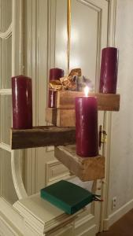
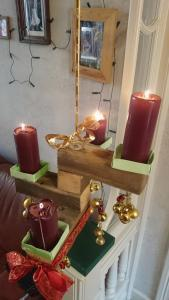

Met het begin van het nieuwe kerkelijk jaar, is de artikelenreeks Innerlijk Leven, overgenomen uit het gelijknamig boek van Willem Grossouw, tot een einde gekomen. Het boek blijft beschikbaar als e-book ([link naar EPUB](https://storage.googleapis.com/geloven-leren/books/Innerlijk-Leven-Willem-Grossouw.epub), [link naar Amazon](http://www.amazon.com/dp/B00F58L6AU)).

Geen nood echter voor uw spiritueel leven: de [adventsretraite Naar U Gaat Mijn Verlangen](http://www.ignatiaansbidden.org/), van Ignatiaans Aanbidden, pikt naadloos in!

Ook op [Alledaags Geloven](http://alledaags.gelovenleren.net/) is de ignatiaanse retraite opnieuw actief. Innerlijk leven is voorlopig verdwenen, maar ik hoop het in de toekomst opnieuw beschikbaar te maken als doorlopende bezinning.

Intussen kan u alvast het prentenmissaaltje voor de kersttijd [downloaden en afdrukken](/page/katholieke-printerboekjes/).

En om mijn eigen blog te vullen… zal ik zelf weer wat meer moeten schrijven :) Misschien lukt dat wel, verlicht door onze adventskrans die overigens, bij gebrek aan onbenutte tafeloppervlakte, een hangend model is.

 Hangende adventskrans

Na enkele weken ziet de adventskrans al een pak minder troosteloos uit, dankzij wat extra versiering, en drie extra lichtjes :)

