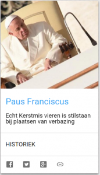
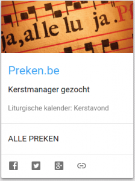

Twee nieuwe kaarten verschijnen vanaf heden op [alledaags.gelovenleren.net](http://alledaags.gelovenleren.net):

\[caption id="attachment\_2022" align="alignnone" width="172"\] Paus Franciscus blogt\[/caption\]

Op [nieuw.kerknet.be](http://nieuw.kerknet.be) doen ze [alsof paus Franciscus op hun website blogt](https://nieuw.kerknet.be/auteur/paus-franciscus). Zijn laatste artikel komt op de kaart, als inspiratiebron voor jouw dagelijks moment van bezinning.

\[caption id="attachment\_2023" align="alignnone" width="172"\] Preken.be\[/caption\]

[Preken.be](http://www.preken.be) is een website die al jaren meedraait en via crowdsourcing een databank opbouwt van homilieteksten. De meest recente toevoeging voor de eerstvolgende liturgische viering krijg je op de kaart.
