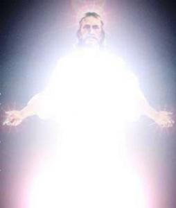

De retoriek dat er [geen verband](http://www.standaard.be/cnt/dmf20140821_01227173) is tussen de islam en de recente golf van terrorisme begint aan geloofwaardigheid in te boeten. Het inzicht dat nu opgang maakt, is te pleiten voor een islam die de Koran niet langer letterlijk gaat lezen, maar door middel van interpretatie. Dat betoogt ook Peter Schmidt in Tertio. Als lichtend voorbeeld haalt hij het christendom aan, dat "aanstuurt op vrede en gerechtigheid  omdat wij in het westen een grondige herinterpretatie van gewelddadige stukken uit de Bijbel – het zijn er veel meer dan in de Koran – achter de rug hebben".

 Is de Bijbel woord van vrede dankzij de Verlichting of dankzij Christus?

Op wat Schmidt zegt over de islam kom ik straks terug, maar over wat hij zegt over het christendom, heb ik alvast een mening: _het is onzin_. Ik ben geen bijbelexegeet en ietwat naief en heb dus misschien geen recht van spreken, maar als de christelijke Bijbel aanstuurt op vrede en gerechtigheid, is dat geen verwezenlijking van de Verlichting en ook niet van historisch-kritische exegese, maar van onze Lieve Heer Jezus Christus zelf! Christus is het vleesgeworden Woord van God, een nieuw verbond tussen God en de mens, en de Bijbel is het relaas van zijn menswording en vredesoffer, voor alle tijden. Nergens, maar dan ook nergens in dat nieuwe verbond, wordt zelfs maar gesuggereerd dat geweld nodig zou zijn om de vrede met God af te dwingen, precies integendeel! Dat zou een befaamd exegeet toch ook mogen weten?

Het kan best zijn dat men zich in de loop van de [christelijke geschiedenis](http://www.doorbraak.be/nl/nieuws/de-interne-vijand) beroepen heeft op de Bijbel om op oud-testamentelijke leest geweld te plegen dat de toetssteen van het Evangelie niet kan doorstaan. Daarvan zal Schmidt beter op de hoogte zijn dan ik. Dat verandert evenwel niks aan de absolute geweldloosheid van de leer van Christus en de handelingen van zijn volgelingen. Die geweldloosheid is niet zomaar een van de mogelijke lezingen of interpretaties van het Evangelie, nee, het is de _letterlijkst mogelijke_ lezing ervan!

Een uitdagend gedachtenexperiment: als alle christenen het Evangelie _letterlijk_ zouden gehoorzamen, ben ik overtuigd dat de wereld beter zou worden; als alle moslims de Koran _letterlijk_ zouden gehoorzamen, ben ik niet overtuigd van eenzelfde effect...

Waarom is het dan weer nodig een artikel over de Islam met [christelijke](http://www.doorbraak.be/nl/nieuws/dromen-van-een-louter-culturele-islam) [zelfhaat](http://www.nieuwwij.nl/interview/karen-armstrong-niets-in-islam-gewelddadiger-christendom/) in te kleden?

Ik krijg weinig hoogte van mensen als Schmidt. Ze moeten toch weten dat de Islam een [gewelddadig](http://www.doorbraak.be/nl/nieuws/pleidooi-voor-een-nieuwe-koran) fundament heeft, ook al noemen ze het de [politieke Islam](http://www.frankfuredi.com/site/article/charlie_hebdo_is_islam_to_blame#When:09:07:00Z) of de [culturele Islam](https://nieuw.kerknet.be/kerknet-redactie/artikel/zelfkritiek-leidt-tot-boeiende-inzichten-bij-moslims) of wat dan meer? Ze moeten toch ook in staat zijn het verschil te zien tussen een Christus en een Mohammed als hoeksteen van een religie? Zijn ze dan zo weinig overtuigd van hun eigen geloof dat ze de leer van Christus moeten minimaliseren en welhaast vergoelijken met eigengereide bijbelinterpretaties? Of zijn ze gewoon te bang om rechtuit te zeggen dat ze vinden dat de Islam eigenlijk een inferieur geloof is? Halen ze het christelijke geloof door het slijk, om juist dat te kunnen zeggen? Maar zijn ze dan niet vies van elke vorm van geloof? Wat verwachten ze eigenlijk van hun recept om de Koran historisch-kritisch af te koken tot al het geweld is opgelost? Wat voor geloof moet daaruit voortvloeien? Een even flauw afkooksel als het mainstream christendom, dat moeilijk te onderscheiden valt van wat de moderne cultuur ons opdringt?

Mensen als Schmidt zouden er beter aan doen om het christendom wat positiever voor te stellen, en daarvoor hoef je je niet te beperken tot de jaren na het concilie. Het heil dat het christendom de wereld te bieden heeft, is geen verdienste van enkele historisch-kritische exegeten, het is de verdienste van Jezus Chistus, die zichzelf voor mensen van alle tijden aan het kruis heeft geofferd!  Zelfs in de tijd van Mohammed was dat al bekend.

Het Evangelie leert, bijvoorbeeld in het verhaal van de rijke jongeling, dat de verdienste om hetzelfde te bereiken, voor de een groter is dan voor een ander, naargelang de uitdaging groter is. Als christenen moeten we daarom veel ontzag hebben voor geloofsgetrouwe moslims die hun moeilijke godsdienst op een vredevolle manier beleven, want juist door die buitengewone verdienste verdienen ze meer goddelijke genade dan menig lauw christen. Dat mag een beetje ironisch klinken, maar ik meen het, en wens het hen zelfs van ganserharte toe, meer dan een opgedrongen historisch-kritische Koranlezing.
