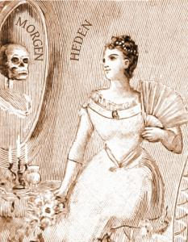
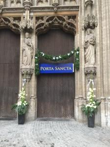

 Heden... morgen...

In de [prentencatechismus](http://prentencatechismus.org/uncategorized/de-vier-uitersten-in-het-algemeen-de-dood/) wordt geleerd de 'uitersten' te gedenken. Het is niet voldoende aan de dag van morgen te denken, een mens moet ook in gedachten houden dat hij eens zal sterven en rekening houden met wat er daarna met hem te gebeuren staat.

Om dat te illustreren worden een man en een vrouw getoond, die zich ijdel in de spiegel staan te bewonderen ("heden"), maar daarin slechts een geraamte ontwaren ("morgen"). Een nogal luguber pedagogisch element.

Het beeld van de spiegel is nochtans heel treffend. De uitersten gedenken, doe je immers ook door in de spiegel te kijken. Geen gewone spiegel, maar een spiegel van de ziel. Daarmee kijk je in je hart naar jezelf, zoals God naar je kijkt.

Een [dagelijks moment van bezinning of gebed](http://alledaags.gelovenleren.net/), een kort [gewetensonderzoek](http://www.jezuieten.org/nl/in-de-reeks-ignatiaanse-pedagogie-het-gewetensonderzoek), is voor de ziel evenveel waard als de tijd die je 's morgens doorbrengt in de badkamer, je het waard is om er fris en mooi uit te zien.

 Porta Sancta van de Antwerpse kathedraal, open elke dag van 2 tot 4u.

En er is meer te doen. Is je lichaam ziek, dan moet je naar de dokter of naar het ziekenhuis en heb je misschien een operatie nodig. Ben je nog gezond, dan kan je lichaam veel deugd hebben van een bezoek aan de wellness of de schoonheidsspecialist. Zo'n behandeling kan je ook je ziel geven. In het jaar van de barmhartigheid staan de [heilige poorten](http://www.katholieknieuwsblad.nl/nieuws/overzicht-heilige-deuren-nederlandse-en-vlaamse-bisdommen) open om iedereen te ontvangen die zijn ziel een grote beurt wil geven. Elke ziel, jong of oud, zuiver of met zonde beladen, kan er door het bad van gebed, berouw, [biecht](/blog/biecht/), [aanbidding](http://www.veniteadoremus.be/) en eucharistie om nadien weer fier in de spiegel te kunnen kijken.

Vind je dit een leuke vergelijking, bedenk dan wel dat je lichaam ---in het licht van de eeuwigheid--- nog maar even mee moet gaan, maar je ziel die heb je voor altijd.
