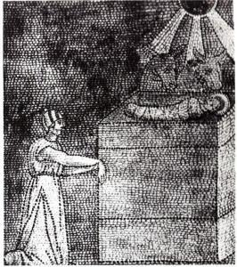

Fascinerende lezingen waren het vanmorgen, op de [vierde zondag van de advent in het B-jaar](http://www.bijbelcitaat.be/lezing/lezingen-van-de-dag-zondag-20-dec-2015/).

Eerst kregen we het fragment uit het Oude Testament, waarin door Micha geprofeteerd wordt dat de nieuwe koning van de joden in Bethlehem geboren zal worden. Hij voorspelt een heerser met een oorsprong in "lang vervlogen tijden" (ja, vanaf de schepping!), die zijn aan hun lot overgelaten broeders wijdt "als een herder" (een beeld dat Jezus zelf graag gebruikt), die "bekleed is met de macht van de Heer, zijn God" (de vele wonderen die Hij deed), en "met de majesteit van diens verheven naam" (de Zoon van God), die "heerst tot aan het einde van de aarde" (Jezus verlost alle mensen), die "vrede brengt" (maar verrassend genoeg niet met de wapens!).

Dit is het bijbelfragment waarmee de schriftgeleerden de drie koningen op verzoek van Herodes op weg kunnen zetten naar Bethlehem. Zonder de hulp van het Oude Testament hadden die het kindje dat ze wilden vereren nooit gevonden!

Op de derde zondag van de maand hebben we de mis samen met de Afrikaanse gemeenschap, die anders 's namiddags viert. Daarom kregen we vanmorgen beide lezingen (een in het Engels en een in het Nederlands). Dat zouden we trouwens beter elke zondag doen. Vandaag was het dan ook nog best interessant. In zijn brief aan de Hebreeuwen probeert Paulus aan te tonen hoe Jezus zichzelf in de plaats heeft gesteld, voor eens en voor altijd, van de joodse offercultus. Dat deed me denken aan dit prentje dat ik enkele dagen geleden nog op [heiligen.net](http://heiligen.net) aantrof op de pagina met [Kerstafbeeldingen voor het jaar duizend](http://www.heiligen.net/kerstafb/a.php).

 Vroedvrouw Salome met verdorde hand wendt zich tot Kind

Het is een amalgaam van verschillende verhalen: de geboorte van Jezus (uit Lucas), met de os en de ezel (uit het oude testament), de vroedvrouw Salome met de verdorde hand (uit apocriefe evangelien), en dan is er nog het merkwaardige element: het altaar waarop het kindje Jezus ligt. Toen Jezus werd geboren, in het jaar nul, wist niemand beter dan dat er slechts één altaar was in de Tempel van Jeruzalem, waarop de priesters het bloed plengden van de offerdieren die gelovigen aanbrachten. Als Jezus drie-en-dertig jaar later aan het kruis sterft, is dat nog steeds zo. Toch kan Paulus aan joodse gelovigen verkocht krijgen dat dit altaar door Jezus' offer 'buiten gebruik' gesteld is… je moet het maar doen!

Beseffen wij intussen nog wel voldoende dat het altaar dat in elk van onze kerken staat, en vaak zelfs meer dan één, hetzelfde is als het altaar dat eens in de Tempel van Jeruzalem stond? Alleen het offer is veranderd. En onze deelname erin.
