De website "[Katholieke Radio](http://radio.gelovenleren.net/)" en de gelijkname [Android app](https://play.google.com/store/apps/details?id=net.credomobiel.katholiekeradio) zijn in een nieuw kleedje gestoken.

Het zenderaanbod is verruimd en bevat alles wat op internet te beluisteren valt en van ver of nabij iets te maken heeft met het katholieke geloof. De meeste programma's zijn Nederlandstalig, maar er zijn ook enkele anderstalige zenders of programma's opgenomen die voor een Nederlandstalig publiek relevant kunnen zijn.

Weet u een programma of een zender die online te beluisteren is en die nog niet is opgenomen, hoor ik dat graag!

Klik hier om de website te bezoeken of de app te installeren:

[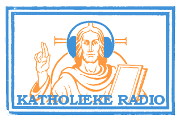](http://radio.gelovenleren.net) radio.gelovenleren.net

 GOOGLE PLAY STORE

Een overzicht van de aangeboden zenders, zoals ze zichzelf beschrijven op hun websites:

[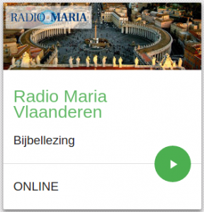Radio Maria Vlaanderen](http://www.radiomaria.be/) Radio Maria is een jonge radio zender die heel Vlaanderen wil bereiken om het Woord van God te laten weerklinken. Op onze frequenties heeft u een zeer gevarieerd programma. Een eerste plaats wordt gegeven aan het gebed. Om Jezus te leren kennen moet men een relatie met Hem opbouwen. Dit gebeurt door het gebed. Ten tweede maken we plaats vrij om de missie van Jezus te verduidelijken door informatieve programma's. Hierbij geven we de stem aan de Katholieke Kerk. Ten derde proberen we ook een programmering te verzorgen die ingaat op wat de mensen bezighoudt in het alledaagse leven.

 

 

[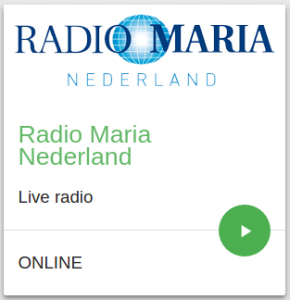Radio Maria Nederland](http://www.radiomaria.nl/) De missie van Radio Maria is evangeliseren en luisteraars te ondersteunen en te stimuleren in hun geloof. De radio is hiervoor een ideaal medium omdat het katholieke geluid overal te beluisteren is: op het werk, thuis of onderweg. Radio Maria staat in het hart van de Rooms-katholieke Kerk. Daarom is het op de eerste plaats een gebedsradio. De dagelijkse Eucharistieviering, het bidden van de getijden en het rozenkransgebed met intenties van luisteraars nemen een centrale plaats in. Daarnaast wil Radio Maria op elk niveau informeren over de geloofsschatten van de Kerk met zoals in het Evangelie speciale aandacht voor de zwakkere in de samenleving: zieken, ouderen en eenzame mensen. Radio Maria wil troost brengen en verbondenheid en kracht in moeilijke tijden. Het liefst in direct contact met de luisteraars. Deze worden dan ook nadrukkelijk uitgenodigd om mee te bidden, mee te praten en mee te denken. Zo vormen de luisteraars en de programmamakers een hechte geloofsgemeenschap als aanvulling op het parochieleven.

 

 

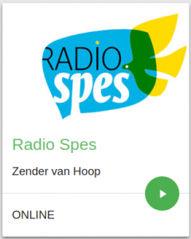Radio Spes Het is de zending - en de uitdaging - van elke katholieke radio, om het Woord van God verder te laten weerklinken, liefst zonder al te veel franjes: de radio is een dienst van het evangelie zoals het er staat. Radio Spes is als katholieke radio is geroepen om een onzichtbare familie mogelijk te maken: een familie van mensen die zich op een of andere manier verbonden weten met Jezus Christus en Zijn Boodschap. Een katholieke radio heeft, naast zijn aandacht voor de spirituele weg van mensen in hun relatie tot God, ook een belangrijke taak op het vlak van berichtgeving. Het is daarbij belangrijk om te focussen op het positieve dat mensen vanuit hun geloof beleven en waarmaken, om zo een tegengewicht te vormen voor de overvloedig aanwezige negatieve en sensatiegerichte berichtgeving in andere media; alleen zo kan radio Spes een teken van waarachtige hoop zijn.

 

[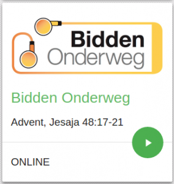Bidden Onderweg](http://www.biddenonderweg.org/home/) Bidden Onderweg biedt elke dag een nieuwe gebedspodcast aan. Een combinatie van muziek, enkele verzen uit de Bijbelteksten van de dag en vraagjes om de link te maken met je gewone leven. Het geheel is geïnspireerd door de [ignatiaanse spiritualiteit](http://www.jezuieten.org/nl/ignatiaanse-spiritualiteit). Bidden Onderweg is een initiatief van de [jezuïeten](https://www.jezuieten.org). Het richt zich tot christenen van verschillende denominaties. De bijbellezingen zijn afkomstig uit de NBV (Nieuwe BijbelVertaling).

 

 

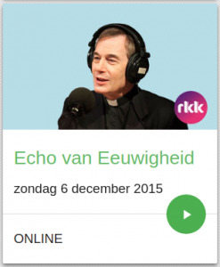Echo van Eeuwigheid Echo van Eeuwigheid is een programma voor iedereen die geïnteresseerd is in klassieke muziek. De dag en het tijdstip van de uitzending nodigen uit om de luisteraar te laten genieten van religieuze muziek. Hoeveel prachtige, ingetogen of juist uitbundige muziek is er niet geschreven met de (christelijke) traditie als inspiratiebron? De makers van iedere uitzending pogen een welluidend en inspirerend muzikaal uur te maken. In de keuze speelt de liturgische kalender een rol op de achtergrond. Zo krijgt iedere uitzending een eigen kleur, soms letterlijk door de introïtus van de zondag ten gehore te brengen. De kerkelijke kalender, met zijn feesten en hoogtijdagen en de gedankdagen van heiligen, biedt voldoende aanknopingspunten om muziek ten gehore te brengen die past bij de thematiek van de zondag en die recht doet aan de rijkdom van de schatkamer van de klassieke muziek. De presentatie is in handen van Antoine Bodar, kunsthistoricus en priester. Hij zal, met lichtheid en humor, de muziekkeuze toelichten en duiden, waarbij hij ook zal ingaan op de religieuze betekenis of de spirituele zeggingskracht van de muziek.

 

 

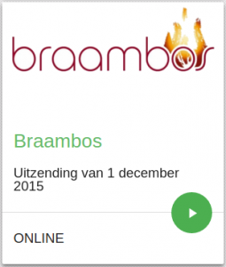Braambos De Katholieke Televisie- en Radio-Omroep (KTRO vzw) produceert de radio- en tv-programma's "Braambos" in de openbare omroep VRT. "Braambos" is te beluisteren op Radio 1, elke dinsdagavond en op de kerkelijke feestdagen na het nieuws van 20 uur.  Tweewekelijks is "Braambos" te bekijken op zondag op één omstreeks 09.00 uur en diezelfde avond op Canvas rond 23.00 uur.

 

 

 

[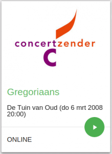Concertzender](http://www.concertzender.nl/) De Concertzender is een in Utrecht gehuisveste vrijwilligersorganisatie die zich inzet voor het maken van muziekprogramma’s via radio en internet. De Concertzender richt zich daarbij op muziek die niet al wordt uitgezonden door bestaande publieke of commerciële muziekzenders en omroepen. De Concertzender staat sinds 1982 garant voor een opmerkelijke en eigenwijze programmering.

 

 

 

[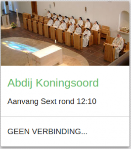Abdij Koningsoord](http://www.koningsoord.org/) Graag laten wij u hier iets proeven van ons gemeenschappelijk leven en werken. Stilte en gebed vormen het hart van ons bestaan. Wij nodigen u van harte uit deze stilte en dit gebed met ons te delen. Onze abdij ligt aan de Veluwezoom, in een gebied rijk aan natuur en geschiedenis. Zevenmaal daags worden onze gebedsdiensten (getijden) live uitgezonden en kunt u met ons meebidden en vieren.

 

[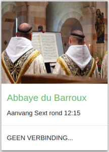Abbaye du Barroux](http://www.barroux.org/) "Je demeure frappée de la grandeur des cérémonies de l'Église", disait sainte Thérèse d'Avila. Si nous nous interrogeons sur le secret de cette grandeur, nous nous apercevons qu'elle vient beaucoup moins du relief et de l'ampleur que lui donnent nos industries humaines que de l'essence même de la Liturgie et de sa relation avec deux ordres de grandeur très différents : la grandeur cosmique de notre univers créé et la grandeur surnaturelle du Royaume des cieux.

 

 

 

[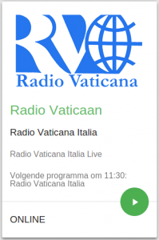Radio Vaticaan](http://www.radiovaticana.va/) By virtue of its Statute, Vatican Radio is the broadcasting station of the Holy See, legally based in the Vatican City State. It is a mean of communication and evangelization created to serve the Pope’s Ministry. The main task of Vatican Radio is to proclaim the Christian message freely, faithfully and efficiently and keeping the centre of Catholicism in contact with the different countries of the world by diffusing the voice and the teachings of the Roman Pontiff; informing about the activities of the Holy See; giving information about the life and the activities of the Catholic Church in the world; helping the faithful to evaluate today’s problems in the light of the Teachings of the Church. Vatican Radio has also the institutional task to record, amplify, and distribute the sound of all the official Vatican activities of the Holy Father and to exercise and protect, in an exclusive way, the copyright and intellectual property rights over the voice recordings of the Roman Pontiffs

 

 

[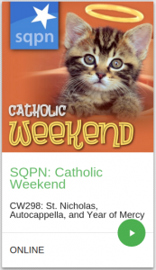SQPN Catholic Weekend](http://sqpn.com/category/podcasts/cw/) SQPN (Star Quest Production Network) is a multimedia organization specializing in the production of audio and video programs faithful to the teachings of the Roman Catholic Church. Its mission is to respond to the Church’s call to use the media for religious information, for evangelization and catechesis and for formation and education. These audio and video productions focus on building bridges between the dominant popular culture of the Western world and the religious culture and tradition of the Catholic Church in order to reach an audience that has little or no relationship with that Church. Just as the star of Bethlehem emerged within the foreign culture of the three magi, and invited them to start an adventurous journey to the newborn Savior, the programs of SQPN tap into popular culture to invite people on a journey of discovery towards an encounter with Christ.
